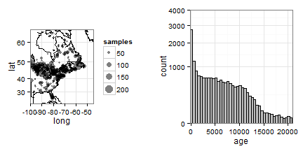

No-Analogues in North American Pollen Space
========================================================

Abstract
------------------------

Introduction
------------------------
Our investigation of non-analogues, both in the past and in the future is tied to differences from modern pollen data.  THe concern with a future of no-analogues is tied to our lack of understanding, both in how the process of change will unfold, and in how ecosystem services are provided by these vegetation communities for which we have no analogue.
To assist in this endevour, we examine pollen records from the Neotoma Database, searching through the past, from the late-glacial to the modern to examine in which cases pollen assemblages appear to be non-analogue from the previous time period.

Methods
------------------------
We compile records of pollen from depositional records in the Neotoma Database.  To assess whether pollen assemblages are 'non-analogue' we estimate squared-chord distance from pollen samples to a reference set that includes (1) all samples in the Neotoma Database that are between 250 and 750 calibrated years older than the sample, and (2) includes samples from the reference site.


```
## 1 
## 2 
## 3 
## 4 
## 5 
## 6 
## 7 
## 8 
## 9 
## 10 
## 11 
## 12 
## 13 
## 14 
## 15 
## 16 
## 17 
## 18 
## 19 
## 20 
## 21 
## 22 
## 23 
## 24 
## 25 
## 26 
## 27 
## 28 
## 29 
## 30 
## 31 
## 32 
## 33 
## 34 
## 35 
## 36 
## 37 
## 38 
## 39 
## 40 
## 41 
## 42 
## 43 
## 44 
## 45 
## 46 
## 47 
## 48 
## 49 
## 50 
## 51 
## 52 
## 53 
## 54 
## 55 
## 56 
## 57 
## 58 
## 59 
## 60 
## 61 
## 62 
## 63 
## 64 
## 65 
## 66 
## 67 
## 68 
## 69 
## 70 
## 71 
## 72 
## 73 
## 74 
## 75 
## 76 
## 77 
## 78 
## 79 
## 80 
## 81 
## 82 
## 83 
## 84 
## 85 
## 86 
## 87 
## 88 
## 89 
## 90 
## 91 
## 92 
## 93 
## 94 
## 95 
## 96 
## 97 
## 98 
## 99 
## 100 
## 101 
## 102 
## 103 
## 104 
## 105 
## 106 
## 107 
## 108 
## 109 
## 110 
## 111 
## 112 
## 113 
## 114 
## 115 
## 116 
## 117 
## 118 
## 119 
## 120 
## 121 
## 122 
## 123 
## 124 
## 125 
## 126 
## 127 
## 128 
## 129 
## 130 
## 131 
## 132 
## 133 
## 134 
## 135 
## 136 
## 137 
## 138 
## 139 
## 140 
## 141 
## 142 
## 143 
## 144 
## 145 
## 146 
## 147 
## 148 
## 149 
## 150 
## 151 
## 152 
## 153 
## 154 
## 155 
## 156 
## 157 
## 158 
## 159 
## 160 
## 161 
## 162 
## 163 
## 164 
## 165 
## 166 
## 167 
## 168 
## 169 
## 170 
## 171 
## 172 
## 173 
## 174 
## 175 
## 176 
## 177 
## 178 
## 179 
## 180 
## 181 
## 182 
## 183 
## 184 
## 185 
## 186 
## 187 
## 188 
## 189 
## 190 
## 191 
## 192 
## 193 
## 194 
## 195 
## 196 
## 197 
## 198 
## 199 
## 200 
## 201 
## 202 
## 203 
## 204 
## 205 
## 206 
## 207 
## 208 
## 209 
## 210 
## 211 
## 212 
## 213 
## 214 
## 215 
## 216 
## 217 
## 218 
## 219 
## 220 
## 221 
## 222 
## 223 
## 224 
## 225 
## 226 
## 227 
## 228 
## 229 
## 230 
## 231 
## 232 
## 233 
## 234 
## 235 
## 236 
## 237 
## 238 
## 239 
## 240 
## 241 
## 242 
## 243 
## 244 
## 245 
## 246 
## 247 
## 248 
## 249 
## 250 
## 251 
## 252 
## 253 
## 254 
## 255 
## 256 
## 257 
## 258 
## 259 
## 260 
## 261 
## 262 
## 263 
## 264 
## 265 
## 266 
## 267 
## 268 
## 269 
## 270 
## 271 
## 272 
## 273 
## 274 
## 275 
## 276 
## 277 
## 278 
## 279 
## 280 
## 281 
## 282 
## 283 
## 284 
## 285 
## 286 
## 287 
## 288 
## 289 
## 290 
## 291 
## 292 
## 293 
## 294 
## 295 
## 296 
## 297 
## 298 
## 299 
## 300 
## 301 
## 302 
## 303 
## 304 
## 305 
## 306 
## 307 
## 308 
## 309 
## 310 
## 311 
## 312 
## 313 
## 314 
## 315 
## 316 
## 317 
## 318 
## 319 
## 320 
## 321 
## 322 
## 323 
## 324 
## 325 
## 326 
## 327 
## 328 
## 329 
## 330 
## 331 
## 332 
## 333 
## 334 
## 335 
## 336 
## 337 
## 338 
## 339 
## 340 
## 341 
## 342 
## 343 
## 344 
## 345 
## 346 
## 347 
## 348 
## 349 
## 350 
## 351 
## 352 
## 353 
## 354 
## 355 
## 356 
## 357 
## 358 
## 359 
## 360 
## 361 
## 362 
## 363 
## 364 
## 365 
## 366 
## 367 
## 368 
## 369 
## 370 
## 371 
## 372 
## 373 
## 374 
## 375 
## 376 
## 377 
## 378 
## 379 
## 380 
## 381 
## 382 
## 383 
## 384 
## 385 
## 386 
## 387 
## 388 
## 389 
## 390 
## 391 
## 392 
## 393 
## 394 
## 395 
## 396 
## 397 
## 398 
## 399 
## 400 
## 401 
## 402 
## 403 
## 404 
## 405 
## 406 
## 407 
## 408 
## 409 
## 410 
## 411 
## 412 
## 413 
## 414 
## 415 
## 416 
## 417 
## 418 
## 419 
## 420 
## 421 
## 422 
## 423 
## 424 
## 425 
## 426 
## 427 
## 428 
## 429 
## 430 
## 431 
## 432 
## 433 
## 434 
## 435 
## 436 
## 437 
## 438 
## 439 
## 440 
## 441 
## 442 
## 443 
## 444 
## 445 
## 446 
## 447 
## 448 
## 449 
## 450 
## 451 
## 452 
## 453 
## 454 
## 455 
## 456 
## 457 
## 458 
## 459 
## 460 
## 461 
## 462 
## 463 
## 464 
## 465 
## 466 
## 467 
## 468 
## 469 
## 470 
## 471 
## 472 
## 473 
## 474 
## 475 
## 476 
## 477 
## 478 
## 479 
## 480 
## 481 
## 482 
## 483 
## 484 
## 485 
## 486 
## 487 
## 488 
## 489 
## 490 
## 491 
## 492 
## 493 
## 494 
## 495 
## 496 
## 497 
## 498 
## 499 
## 500 
## 501 
## 502 
## 503 
## 504 
## 505 
## 506 
## 507 
## 508 
## 509 
## 510 
## 511 
## 512 
## 513 
## 514 
## 515 
## 516 
## 517 
## 518 
## 519 
## 520 
## 521 
## 522 
## 523 
## 524 
## 525 
## 526 
## 527 
## 528 
## 529 
## 530 
## 531 
## 532 
## 533 
## 534 
## 535 
## 536 
## 537 
## 538 
## 539 
## 540 
## 541 
## 542 
## 543 
## 544 
## 545 
## 546 
## 547 
## 548 
## 549 
## 550 
## 551 
## 552 
## 553 
## 554 
## 555 
## 556 
## 557 
## 558 
## 559 
## 560 
## 561 
## 562 
## 563 
## 564 
## 565 
## 566 
## 567 
## 568 
## 569 
## 570 
## 571 
## 572 
## 573 
## 574 
## 575 
## 576 
## 577 
## 578 
## 579 
## 580 
## 581 
## 582 
## 583 
## 584 
## 585 
## 586 
## 587 
## 588 
## 589 
## 590 
## 591 
## 592 
## 593 
## 594 
## 595 
## 596 
## 597 
## 598 
## 599 
## 600 
## 601 
## 602 
## 603 
## 604 
## 605 
## 606 
## 607 
## 608 
## 609 
## 610 
## 611 
## 612 
## 613 
## 614 
## 615 
## 616 
## 617 
## 618 
## 619 
## 620 
## 621 
## 622 
## 623 
## 624 
## 625 
## 626 
## 627 
## 628 
## 629 
## 630 
## 631 
## 632 
## 633 
## 634 
## 635 
## 636 
## 637 
## 638 
## 639 
## 640 
## 641 
## 642 
## 643 
## 644 
## 645 
## 646 
## 647 
## 648 
## 649 
## 650 
## 651 
## 652 
## 653 
## 654 
## 655 
## 656 
## 657 
## 658 
## 659 
## 660 
## 661 
## 662 
## 663 
## 664 
## 665 
## 666 
## 667 
## 668 
## 669 
## 670 
## 671 
## 672 
## 673 
## 674 
## 675 
## 676 
## 677 
## 678 
## 679 
## 680 
## 681 
## 682 
## 683 
## 684 
## 685 
## 686 
## 687 
## 688 
## 689 
## 690 
## 691 
## 692 
## 693 
## 694 
## 695 
## 696 
## 697 
## 698 
## 699 
## 700 
## 701 
## 702 
## 703 
## 704 
## 705 
## 706 
## 707 
## 708 
## 709 
## 710 
## 711 
## 712 
## 713 
## 714 
## 715 
## 716 
## 717 
## 718 
## 719 
## 720 
## 721 
## 722 
## 723 
## 724 
## 725 
## 726 
## 727 
## 728 
## 729 
## 730 
## 731 
## 732 
## 733 
## 734 
## 735 
## 736 
## 737 
## 738 
## 739 
## 740 
## 741 
## 742 
## 743 
## 744 
## 745 
## 746 
## 747 
## 748 
## 749 
## 750 
## 751 
## 752 
## 753 
## 754 
## 755 
## 756 
## 757 
## 758 
## 759 
## 760 
## 761 
## 762 
## 763 
## 764 
## 765 
## 766 
## 767 
## 768 
## 769 
## 770 
## 771 
## 772 
## 773 
## 774 
## 775 
## 776 
## 777 
## 778 
## 779 
## 780 
## 781 
## 782 
## 783 
## 784 
## 785 
## 786 
## 787 
## 788 
## 789 
## 790 
## 791 
## 792 
## 793 
## 794 
## 795 
## 796 
## 797 
## 798 
## 799 
## 800 
## 801 
## 802 
## 803 
## 804 
## 805 
## 806 
## 807 
## 808 
## 809 
## 810 
## 811 
## 812 
## 813 
## 814 
## 815 
## 816 
## 817 
## 818 
## 819 
## 820 
## 821 
## 822 
## 823 
## 824 
## 825 
## 826 
## 827 
## 828 
## 829 
## 830 
## 831 
## 832 
## 833 
## 834 
## 835 
## 836 
## 837 
## 838 
## 839 
## 840 
## 841 
## 842 
## 843 
## 844 
## 845 
## 846 
## 847 
## 848 
## 849 
## 850 
## 851 
## 852 
## 853 
## 854 
## 855 
## 856 
## 857 
## 858 
## 859 
## 860 
## 861 
## 862 
## 863 
## 864 
## 865 
## 866 
## 867 
## 868 
## 869 
## 870 
## 871 
## 872 
## 873 
## 874 
## 875 
## 876 
## 877 
## 878 
## 879 
## 880 
## 881 
## 882 
## 883 
## 884 
## 885 
## 886 
## 887 
## 888 
## 889 
## 890 
## 891 
## 892 
## 893 
## 894 
## 895 
## 896 
## 897 
## 898 
## 899 
## 900 
## 901 
## 902 
## 903 
## 904 
## 905 
## 906 
## 907 
## 908 
## 909 
## 910 
## 911 
## 912 
## 913 
## 914 
## 915 
## 916 
## 917 
## 918 
## 919 
## 920 
## 921 
## 922 
## 923 
## 924 
## 925 
## 926 
## 927 
## 928 
## 929 
## 930 
## 931 
## 932 
## 933 
## 934 
## 935 
## 936 
## 937 
## 938 
## 939 
## 940 
## 941 
## 942 
## 943 
## 944 
## 945 
## 946 
## 947 
## 948 
## 949 
## 950 
## 951 
## 952 
## 953 
## 954 
## 955 
## 956 
## 957 
## 958 
## 959 
## 960 
## 961 
## 962 
## 963 
## 964 
## 965 
## 966 
## 967 
## 968 
## 969 
## 970 
## 971 
## 972 
## 973 
## 974 
## 975 
## 976 
## 977 
## 978 
## 979 
## 980 
## 981 
## 982 
## 983 
## 984 
## 985 
## 986 
## 987 
## 988 
## 989 
## 990 
## 991 
## 992 
## 993 
## 994 
## 995 
## 996 
## 997 
## 998 
## 999 
## 1000 
## 1001 
## 1002 
## 1003 
## 1004 
## 1005 
## 1006 
## 1007 
## 1008 
## 1009 
## 1010 
## 1011 
## 1012 
## 1013 
## 1014 
## 1015 
## 1016 
## 1017 
## 1018 
## 1019 
## 1020 
## 1021 
## 1022 
## 1023 
## 1024 
## 1025 
## 1026 
## 1027 
## 1028 
## 1029 
## 1030 
## 1031 
## 1032 
## 1033 
## 1034 
## 1035 
## 1036 
## 1037 
## 1038 
## 1039 
## 1040 
## 1041 
## 1042 
## 1043 
## 1044 
## 1045 
## 1046 
## 1047 
## 1048 
## 1049 
## 1050 
## 1051 
## 1052 
## 1053 
## 1054 
## 1055 
## 1056 
## 1057 
## 1058 
## 1059 
## 1060 
## 1061 
## 1062 
## 1063 
## 1064 
## 1065 
## 1066 
## 1067 
## 1068 
## 1069 
## 1070 
## 1071 
## 1072 
## 1073 
## 1074 
## 1075 
## 1076 
## 1077 
## 1078 
## 1079 
## 1080 
## 1081 
## 1082 
## 1083 
## 1084 
## 1085 
## 1086 
## 1087 
## 1088 
## 1089 
## 1090 
## 1091 
## 1092 
## 1093 
## 1094 
## 1095 
## 1096 
## 1097 
## 1098 
## 1099 
## 1100 
## 1101 
## 1102 
## 1103 
## 1104 
## 1105 
## 1106 
## 1107 
## 1108 
## 1109 
## 1110 
## 1111 
## 1112 
## 1113 
## 1114 
## 1115 
## 1116 
## 1117 
## 1118 
## 1119 
## 1120 
## 1121 
## 1122 
## 1123 
## 1124 
## 1125 
## 1126 
## 1127 
## 1128 
## 1129 
## 1130 
## 1131 
## 1132 
## 1133 
## 1134 
## 1135 
## 1136 
## 1137 
## 1138 
## 1139 
## 1140 
## 1141 
## 1142 
## 1143 
## 1144 
## 1145 
## 1146 
## 1147 
## 1148 
## 1149 
## 1150 
## 1151 
## 1152 
## 1153 
## 1154 
## 1155 
## 1156 
## 1157 
## 1158 
## 1159 
## 1160 
## 1161 
## 1162 
## 1163 
## 1164 
## 1165 
## 1166 
## 1167 
## 1168 
## 1169 
## 1170 
## 1171 
## 1172 
## 1173 
## 1174 
## 1175 
## 1176 
## 1177 
## 1178 
## 1179 
## 1180 
## 1181 
## 1182 
## 1183 
## 1184 
## 1185 
## 1186 
## 1187 
## 1188 
## 1189 
## 1190 
## 1191 
## 1192 
## 1193 
## 1194 
## 1195 
## 1196 
## 1197 
## 1198 
## 1199 
## 1200 
## 1201 
## 1202 
## 1203 
## 1204 
## 1205 
## 1206 
## 1207 
## 1208 
## 1209 
## 1210 
## 1211 
## 1212 
## 1213 
## 1214 
## 1215 
## 1216 
## 1217 
## 1218 
## 1219 
## 1220 
## 1221 
## 1222 
## 1223 
## 1224 
## 1225 
## 1226 
## 1227 
## 1228 
## 1229 
## 1230 
## 1231 
## 1232 
## 1233 
## 1234 
## 1235 
## 1236 
## 1237 
## 1238 
## 1239 
## 1240 
## 1241 
## 1242 
## 1243 
## 1244 
## 1245 
## 1246 
## 1247 
## 1248 
## 1249 
## 1250 
## 1251 
## 1252 
## 1253 
## 1254 
## 1255 
## 1256 
## 1257 
## 1258 
## 1259 
## 1260 
## 1261 
## 1262 
## 1263 
## 1264 
## 1265 
## 1266 
## 1267 
## 1268 
## 1269 
## 1270 
## 1271 
## 1272 
## 1273 
## 1274 
## 1275 
## 1276 
## 1277 
## 1278 
## 1279 
## 1280 
## 1281 
## 1282 
## 1283 
## 1284 
## 1285 
## 1286 
## 1287 
## 1288 
## 1289 
## 1290 
## 1291 
## 1292 
## 1293 
## 1294 
## 1295 
## 1296 
## 1297 
## 1298 
## 1299 
## 1300 
## 1301 
## 1302 
## 1303 
## 1304 
## 1305 
## 1306 
## 1307 
## 1308 
## 1309 
## 1310 
## 1311 
## 1312 
## 1313 
## 1314 
## 1315 
## 1316 
## 1317 
## 1318 
## 1319 
## 1320 
## 1321 
## 1322 
## 1323 
## 1324 
## 1325 
## 1326 
## 1327 
## 1328 
## 1329 
## 1330 
## 1331 
## 1332 
## 1333 
## 1334 
## 1335 
## 1336 
## 1337 
## 1338 
## 1339 
## 1340 
## 1341 
## 1342 
## 1343 
## 1344 
## 1345 
## 1346 
## 1347 
## 1348 
## 1349 
## 1350 
## 1351 
## 1352 
## 1353 
## 1354 
## 1355 
## 1356 
## 1357 
## 1358 
## 1359 
## 1360 
## 1361 
## 1362 
## 1363 
## 1364 
## 1365 
## 1366 
## 1367 
## 1368 
## 1369 
## 1370 
## 1371 
## 1372 
## 1373 
## 1374 
## 1375 
## 1376 
## 1377 
## 1378 
## 1379 
## 1380 
## 1381 
## 1382 
## 1383 
## 1384 
## 1385 
## 1386 
## 1387 
## 1388 
## 1389 
## 1390 
## 1391 
## 1392 
## 1393 
## 1394 
## 1395 
## 1396 
## 1397 
## 1398 
## 1399 
## 1400 
## 1401 
## 1402 
## 1403 
## 1404 
## 1405 
## 1406 
## 1407 
## 1408 
## 1409 
## 1410 
## 1411 
## 1412 
## 1413 
## 1414 
## 1415 
## 1416 
## 1417 
## 1418 
## 1419 
## 1420 
## 1421 
## 1422 
## 1423 
## 1424 
## 1425 
## 1426 
## 1427 
## 1428 
## 1429 
## 1430 
## 1431 
## 1432 
## 1433 
## 1434 
## 1435 
## 1436 
## 1437 
## 1438 
## 1439 
## 1440 
## 1441 
## 1442 
## 1443 
## 1444 
## 1445 
## 1446 
## 1447 
## 1448 
## 1449 
## 1450 
## 1451 
## 1452 
## 1453 
## 1454 
## 1455 
## 1456 
## 1457 
## 1458 
## 1459 
## 1460 
## 1461 
## 1462 
## 1463 
## 1464 
## 1465 
## 1466 
## 1467 
## 1468 
## 1469 
## 1470 
## 1471 
## 1472 
## 1473 
## 1474 
## 1475 
## 1476 
## 1477 
## 1478 
## 1479 
## 1480 
## 1481 
## 1482 
## 1483 
## 1484 
## 1485 
## 1486 
## 1487 
## 1488 
## 1489 
## 1490 
## 1491 
## 1492 
## 1493 
## 1494 
## 1495 
## 1496 
## 1497 
## 1498 
## 1499 
## 1500 
## 1501 
## 1502 
## 1503 
## 1504 
## 1505 
## 1506 
## 1507 
## 1508 
## 1509 
## 1510 
## 1511 
## 1512 
## 1513 
## 1514 
## 1515 
## 1516 
## 1517 
## 1518 
## 1519 
## 1520 
## 1521 
## 1522 
## 1523 
## 1524 
## 1525 
## 1526 
## 1527 
## 1528 
## 1529 
## 1530 
## 1531 
## 1532 
## 1533 
## 1534 
## 1535 
## 1536 
## 1537 
## 1538 
## 1539 
## 1540 
## 1541 
## 1542 
## 1543 
## 1544 
## 1545 
## 1546 
## 1547 
## 1548 
## 1549 
## 1550 
## 1551 
## 1552 
## 1553 
## 1554 
## 1555 
## 1556 
## 1557 
## 1558 
## 1559 
## 1560 
## 1561 
## 1562 
## 1563 
## 1564 
## 1565 
## 1566 
## 1567 
## 1568 
## 1569 
## 1570 
## 1571 
## 1572 
## 1573 
## 1574 
## 1575 
## 1576 
## 1577 
## 1578 
## 1579 
## 1580 
## 1581 
## 1582 
## 1583 
## 1584 
## 1585 
## 1586 
## 1587 
## 1588 
## 1589 
## 1590 
## 1591 
## 1592 
## 1593 
## 1594 
## 1595 
## 1596 
## 1597 
## 1598 
## 1599 
## 1600 
## 1601 
## 1602 
## 1603 
## 1604 
## 1605 
## 1606 
## 1607 
## 1608 
## 1609 
## 1610 
## 1611 
## 1612 
## 1613 
## 1614 
## 1615 
## 1616 
## 1617 
## 1618 
## 1619 
## 1620 
## 1621 
## 1622 
## 1623 
## 1624 
## 1625 
## 1626 
## 1627 
## 1628 
## 1629 
## 1630 
## 1631 
## 1632 
## 1633 
## 1634 
## 1635 
## 1636 
## 1637 
## 1638 
## 1639 
## 1640 
## 1641 
## 1642 
## 1643 
## 1644 
## 1645 
## 1646 
## 1647 
## 1648 
## 1649 
## 1650 
## 1651 
## 1652 
## 1653 
## 1654 
## 1655 
## 1656 
## 1657 
## 1658 
## 1659 
## 1660 
## 1661 
## 1662 
## 1663 
## 1664 
## 1665 
## 1666 
## 1667 
## 1668 
## 1669 
## 1670 
## 1671 
## 1672 
## 1673 
## 1674 
## 1675 
## 1676 
## 1677 
## 1678 
## 1679 
## 1680 
## 1681 
## 1682 
## 1683 
## 1684 
## 1685 
## 1686 
## 1687 
## 1688 
## 1689 
## 1690 
## 1691 
## 1692 
## 1693 
## 1694 
## 1695 
## 1696 
## 1697 
## 1698 
## 1699 
## 1700 
## 1701 
## 1702 
## 1703 
## 1704 
## 1705 
## 1706 
## 1707 
## 1708 
## 1709 
## 1710 
## 1711 
## 1712 
## 1713 
## 1714 
## 1715 
## 1716 
## 1717 
## 1718 
## 1719 
## 1720 
## 1721 
## 1722 
## 1723 
## 1724 
## 1725 
## 1726 
## 1727 
## 1728 
## 1729 
## 1730 
## 1731 
## 1732 
## 1733 
## 1734 
## 1735 
## 1736 
## 1737 
## 1738 
## 1739 
## 1740 
## 1741 
## 1742 
## 1743 
## 1744 
## 1745 
## 1746 
## 1747 
## 1748 
## 1749 
## 1750 
## 1751 
## 1752 
## 1753 
## 1754 
## 1755 
## 1756 
## 1757 
## 1758 
## 1759 
## 1760 
## 1761 
## 1762 
## 1763 
## 1764 
## 1765 
## 1766 
## 1767 
## 1768 
## 1769 
## 1770 
## 1771 
## 1772 
## 1773 
## 1774 
## 1775 
## 1776 
## 1777 
## 1778 
## 1779 
## 1780 
## 1781 
## 1782 
## 1783 
## 1784 
## 1785 
## 1786 
## 1787 
## 1788 
## 1789 
## 1790 
## 1791 
## 1792 
## 1793 
## 1794 
## 1795 
## 1796 
## 1797 
## 1798 
## 1799 
## 1800 
## 1801 
## 1802 
## 1803 
## 1804 
## 1805 
## 1806 
## 1807 
## 1808 
## 1809 
## 1810 
## 1811 
## 1812 
## 1813 
## 1814 
## 1815 
## 1816 
## 1817 
## 1818 
## 1819 
## 1820 
## 1821 
## 1822 
## 1823 
## 1824 
## 1825 
## 1826 
## 1827 
## 1828 
## 1829 
## 1830 
## 1831 
## 1832 
## 1833 
## 1834 
## 1835 
## 1836
```


Pollen data from Neotoma was accessed on Oct 22, 2013 using the `neotoma` pacakge for R (Goring, 2013; `http://www.github.com/ropensci/neotoma`).  The dataset includes 560 sites from across eastern North America (east of 100^o W; Figure 1a), with 21397 samples younger than 21kyr cal. BP (Figure 1b).

 

**Figure 1**. *Sample plot locations and bin sizes for each age class*.

Because sample size may affect our ability to calculate the 95% CI we also use the squared-chord dissimilarity estimate reported in Gill et al. (2009) of XXX as a secondary check.  This allows us to detect no-analogues using multiple methods.

To determine dissimilarity ofver time we estimate dissimilarity from the data using a bootstrap approach for which a sample is compared against a 'landscape' of sites that are between 250 and 750 years older than the sample in question.  For any sample we first test whether a sample fom the site exists between 250 - 750 prior to the sample of interest.  This will prevent anomalously high analogue distances for sites that have never previously been sampled, particularly when they represent new ecoregions.  For each acceptable site we sample one assemblage from each site with samples in the previous 250 - 750 years.  This produces a single sample from each site in the previous time window from which we estimate the minimum suqared chord dissimilarity.  Since some sites have multiple samples in each 500 year time window we re-sample (with replacement) 100 times for each focal site, producing a sample of 100 minimum (squared-chord) dissimilarity values for each pollen assemblage at each site, for which there is a prior sample.


```
## R Version:  R version 3.0.1 (2013-05-16) 
## 
## Three Pines Bog, 7, 0.01 
## Three Pines Bog, 7, 0.01 
## Three Pines Bog, 7, 0.02 
## Three Pines Bog, 7, 0.03 
## Three Pines Bog, 7, 0.03 
## Three Pines Bog, 7, 0.04 
## Three Pines Bog, 7, 0.04 
## Three Pines Bog, 7, 0.05 
## Three Pines Bog, 7, 0.06 
## Three Pines Bog, 7, 0.06 
## Three Pines Bog, 7, 0.07 
## Three Pines Bog, 7, 0.08 
## Three Pines Bog, 7, 0.08 
## Three Pines Bog, 7, 0.09 
## Three Pines Bog, 7, 0.09 
## Three Pines Bog, 7, 0.1 
## Three Pines Bog, 7, 0.11 
## Three Pines Bog, 7, 0.11 
## Three Pines Bog, 7, 0.12 
## Three Pines Bog, 7, 0.13 
## Three Pines Bog, 7, 0.13 
## Three Pines Bog, 7, 0.14 
## Three Pines Bog, 7, 0.14 
## Three Pines Bog, 7, 0.15 
## Three Pines Bog, 7, 0.16 
## Three Pines Bog, 7, 0.16 
## Three Pines Bog, 7, 0.17 
## Three Pines Bog, 7, 0.18 
## Three Pines Bog, 7, 0.18 
## Three Pines Bog, 7, 0.19 
## Three Pines Bog, 7, 0.19 
## Three Pines Bog, 7, 0.2 
## Three Pines Bog, 7, 0.21 
## Three Pines Bog, 7, 0.21 
## Three Pines Bog, 7, 0.22 
## Three Pines Bog, 7, 0.23 
## Three Pines Bog, 7, 0.23 
## Three Pines Bog, 7, 0.24 
## Alexander Lake, 24, 0.26 
## Alexander Lake, 24, 0.27 
## Alexander Lake, 24, 0.28 
## Alexander Lake, 24, 0.28 
## Alexander Lake, 24, 0.29 
## Alexander Lake, 24, 0.29 
## Alexander Lake, 24, 0.3 
## Alexander Lake, 24, 0.31 
## Alexander Lake, 24, 0.31 
## Alexander Lake, 24, 0.32 
## Alexander Lake, 24, 0.33 
## Alexander Lake, 24, 0.33 
## Alexander Lake, 24, 0.34 
## Alexander Lake, 24, 0.35 
## Lake Allie, 29, 0.43 
## Lake Allie, 29, 0.44 
## Lake Allie, 29, 0.45 
## Lake Allie, 29, 0.45 
## Lake Allie, 29, 0.46 
## Lake Allie, 29, 0.46 
## Lake Allie, 29, 0.47 
## Lake Allie, 29, 0.48 
## Almora Lake, 30, 0.53 
## Almora Lake, 30, 0.54 
## Almora Lake, 30, 0.55 
## Almora Lake, 30, 0.55 
## Almora Lake, 30, 0.56 
## Almora Lake, 30, 0.56 
## Almora Lake, 30, 0.58 
## Almora Lake, 30, 0.58 
## Almora Lake, 30, 0.59 
## Almora Lake, 30, 0.6 
## Almora Lake, 30, 0.6 
## Almora Lake, 30, 0.61 
## Anderson Lake, 202, 0.62 
## Anderson Lake, 202, 0.63 
## Anderson Lake, 202, 0.63 
## Anderson Lake, 202, 0.64 
## Anderson Lake, 202, 0.65 
## Anderson Lake, 202, 0.65 
## Anderson Lake, 202, 0.66 
## Anderson Lake, 202, 0.66 
## Anderson Lake, 202, 0.67 
## Anderson Pond, 203, 0.74 
## Anderson Pond, 203, 0.75 
## Anderson Pond, 203, 0.76 
## Anderson Pond, 203, 0.77 
## Anderson Pond, 203, 0.77 
## Anderson Pond, 203, 0.78 
## Anderson Pond, 203, 0.78 
## Anderson Pond, 203, 0.79 
## Anderson Pond, 203, 0.8 
## Anderson Pond, 203, 0.8 
## Anderson Pond, 203, 0.81 
## Anderson Pond, 203, 0.82 
## Anderson Pond, 203, 0.82 
## Anderson Pond, 203, 0.83 
## Anderson Pond, 203, 0.83 
## Anderson Pond, 203, 0.84 
## Anderson Pond, 203, 0.85 
## Anderson Pond, 203, 0.85 
## Anderson Pond, 203, 0.86 
## Andree Bog, 204, 0.88 
## Andree Bog, 204, 0.89 
## Andree Bog, 204, 0.9 
## Andree Bog, 204, 0.9 
## Andree Bog, 204, 0.91 
## Andree Bog, 204, 0.92 
## Lac à l'Ange, 209, 1.06 
## Lac à l'Ange, 209, 1.07 
## Lac à l'Ange, 209, 1.09 
## Lac à l'Ange, 209, 1.1 
## Lac à l'Ange, 209, 1.1 
## Lac à l'Ange, 209, 1.11 
## Lac à l'Ange, 209, 1.12 
## Lac à l'Ange, 209, 1.12 
## Lac à l'Ange, 209, 1.13 
## Lac à l'Ange, 209, 1.14 
## Lac à l'Ange, 209, 1.14 
## Lac à l'Ange, 209, 1.15 
## Lac à l'Ange, 209, 1.15 
## Lac à l'Ange, 209, 1.16 
## Lac à l'Ange, 209, 1.17 
## Arrington Marsh, 214, 1.18 
## Arrington Marsh, 214, 1.19 
## Arrington Marsh, 214, 1.19 
## Arrington Marsh, 214, 1.2 
## Arrington Marsh, 214, 1.2 
## Arrington Marsh, 214, 1.21 
## Arrington Marsh, 214, 1.22 
## Arrington Marsh, 214, 1.22 
## Arrington Marsh, 214, 1.23 
## Arrington Marsh, 214, 1.24 
## Arrington Marsh, 214, 1.24 
## Arrington Marsh, 214, 1.25 
## Arrington Marsh, 214, 1.25 
## Arrington Marsh, 214, 1.26 
## Arrington Marsh, 214, 1.27 
## Lac des Atocas, 219, 1.28 
## Lac des Atocas, 219, 1.29 
## Lac des Atocas, 219, 1.29 
## Lac des Atocas, 219, 1.3 
## Lac des Atocas, 219, 1.3 
## Lac des Atocas, 219, 1.31 
## Lac des Atocas, 219, 1.32 
## Lac des Atocas, 219, 1.32 
## Lac des Atocas, 219, 1.33 
## Lac des Atocas, 219, 1.34 
## Lac des Atocas, 219, 1.34 
## Lac des Atocas, 219, 1.35 
## Lac des Atocas, 219, 1.36 
## Lac des Atocas, 219, 1.36 
## Lac des Atocas, 219, 1.37 
## Lac des Atocas, 219, 1.37 
## Lac des Atocas, 219, 1.38 
## Lac des Atocas, 219, 1.39 
## Lac des Atocas, 219, 1.39 
## Lac des Atocas, 219, 1.4 
## Lac des Atocas, 219, 1.41 
## Lac des Atocas, 219, 1.41 
## Lac des Atocas, 219, 1.42 
## Lac des Atocas, 219, 1.42 
## Lac des Atocas, 219, 1.43 
## Lac des Atocas, 219, 1.44 
## Lac des Atocas, 219, 1.44 
## Lac des Atocas, 219, 1.45 
## Lac des Atocas, 219, 1.46 
## Lac des Atocas, 219, 1.46 
## Lac des Atocas, 219, 1.47 
## Lac des Atocas, 219, 1.47 
## Lac des Atocas, 219, 1.48 
## Lac des Atocas, 219, 1.49 
## Lac des Atocas, 219, 1.49 
## Lac des Atocas, 219, 1.5 
## Lac des Atocas, 219, 1.51 
## Lac des Atocas, 219, 1.52 
## Lac des Atocas, 219, 1.53 
## Axe Lake, 221, 1.54 
## Axe Lake, 221, 1.55 
## Axe Lake, 221, 1.56 
## Axe Lake, 221, 1.56 
## Axe Lake, 221, 1.57 
## Axe Lake, 221, 1.57 
## Axe Lake, 221, 1.58 
## Axe Lake, 221, 1.59 
## Axe Lake, 221, 1.59 
## Axe Lake, 221, 1.6 
## Axe Lake, 221, 1.61 
## Axe Lake, 221, 1.61 
## Axe Lake, 221, 1.62 
## Axe Lake, 221, 1.62 
## Axe Lake, 221, 1.63 
## Axe Lake, 221, 1.64 
## Axe Lake, 221, 1.64 
## Axe Lake, 221, 1.65 
## Axe Lake, 221, 1.66 
## Axe Lake, 221, 1.66 
## Axe Lake, 221, 1.67 
## Axe Lake, 221, 1.68 
## Axe Lake, 221, 1.68 
## Axe Lake, 221, 1.69 
## Axe Lake, 221, 1.69 
## Axe Lake, 221, 1.7 
## Axe Lake, 221, 1.71 
## Axe Lake, 221, 1.71 
## Axe Lake, 221, 1.72 
## Axe Lake, 221, 1.73 
## Axe Lake, 221, 1.73 
## Axe Lake, 221, 1.74 
## Axe Lake, 221, 1.74 
## Axe Lake, 221, 1.75 
## Axe Lake, 221, 1.76 
## Axe Lake, 221, 1.76 
## Barchampe Lake, 232, 1.81 
## Barchampe Lake, 232, 1.81 
## Barchampe Lake, 232, 1.82 
## Barchampe Lake, 232, 1.83 
## Barchampe Lake, 232, 1.83 
## Barchampe Lake, 232, 1.84 
## Barchampe Lake, 232, 1.84 
## Barchampe Lake, 232, 1.85 
## Barchampe Lake, 232, 1.86 
## Barchampe Lake, 232, 1.86 
## Barchampe Lake, 232, 1.87 
## Barchampe Lake, 232, 1.88 
## Barchampe Lake, 232, 1.88 
## Barchampe Lake, 232, 1.89 
## Barchampe Lake, 232, 1.89 
## Barchampe Lake, 232, 1.9 
## Barchampe Lake, 232, 1.91 
## Barchampe Lake, 232, 1.91 
## Barchampe Lake, 232, 1.92 
## Barchampe Lake, 232, 1.93 
## Barchampe Lake, 232, 1.93 
## Barchampe Lake, 232, 1.94 
## Barchampe Lake, 232, 1.94 
## Barchampe Lake, 232, 1.95 
## Barchampe Lake, 232, 1.96 
## Barchampe Lake, 232, 1.96 
## Barchampe Lake, 232, 1.97 
## Barchampe Lake, 232, 1.98 
## Barchampe Lake, 232, 1.98 
## Barchampe Lake, 232, 1.99 
## Barchampe Lake, 232, 1.99 
## Barchampe Lake, 232, 2 
## Barchampe Lake, 232, 2.01 
## Barchampe Lake, 232, 2.01 
## Barchampe Lake, 232, 2.02 
## Barchampe Lake, 232, 2.03 
## Barchampe Lake, 232, 2.03 
## Barchampe Lake, 232, 2.04 
## Barchampe Lake, 232, 2.05 
## Barchampe Lake, 232, 2.05 
## Barchampe Lake, 232, 2.06 
## Barchampe Lake, 232, 2.06 
## Barchampe Lake, 232, 2.07 
## Barchampe Lake, 232, 2.08 
## Barchampe Lake, 232, 2.08 
## Barchampe Lake, 232, 2.09 
## Barchampe Lake, 232, 2.1 
## Barchampe Lake, 232, 2.1 
## Barchampe Lake, 232, 2.11 
## Barchampe Lake, 232, 2.11 
## Barchampe Lake, 232, 2.12 
## Barchampe Lake, 232, 2.13 
## Barchampe Lake, 232, 2.13 
## Barchampe Lake, 232, 2.14 
## Barchampe Lake, 232, 2.15 
## Barchampe Lake, 232, 2.15 
## Barchampe Lake, 232, 2.16 
## Barchampe Lake, 232, 2.16 
## Barchampe Lake, 232, 2.17 
## Barchampe Lake, 232, 2.18 
## Barchampe Lake, 232, 2.18 
## Barchampe Lake, 232, 2.19 
## Barry Lake, 235, 2.2 
## Barry Lake, 235, 2.21 
## Barry Lake, 235, 2.21 
## Barry Lake, 235, 2.22 
## Barry Lake, 235, 2.23 
## Barry Lake, 235, 2.23 
## Barry Lake, 235, 2.24 
## Barry Lake, 235, 2.25 
## Barry Lake, 235, 2.25 
## Barry Lake, 235, 2.26 
## Barry Lake, 235, 2.26 
## Barry Lake, 235, 2.27 
## Barry Lake, 235, 2.28 
## Barry Lake, 235, 2.28 
## Barry Lake, 235, 2.29 
## Barry Lake, 235, 2.3 
## Barry Lake, 235, 2.3 
## Barry Lake, 235, 2.31 
## Barry Lake, 235, 2.31 
## Barry Lake, 235, 2.32 
## Barry Lake, 235, 2.33 
## Barry Lake, 235, 2.33 
## Barry Lake, 235, 2.34 
## Barry Lake, 235, 2.35 
## Barry Lake, 235, 2.35 
## Barry Lake, 235, 2.36 
## Barry Lake, 235, 2.37 
## Barry Lake, 235, 2.37 
## Barry Lake, 235, 2.38 
## Barry Lake, 235, 2.38 
## Barry Lake, 235, 2.39 
## Barry Lake, 235, 2.4 
## Barry Lake, 235, 2.4 
## Barry Lake, 235, 2.41 
## Barry Lake, 235, 2.42 
## Barry Lake, 235, 2.42 
## Barry Lake, 235, 2.43 
## Barry Lake, 235, 2.43 
## Barry Lake, 235, 2.44 
## Barry Lake, 235, 2.45 
## Barry Lake, 235, 2.45 
## Barry Lake, 235, 2.46 
## Barry Lake, 235, 2.47 
## Barry Lake, 235, 2.47 
## Barry Lake, 235, 2.48 
## Barry Lake, 235, 2.48 
## Barry Lake, 235, 2.49 
## Barry Lake, 235, 2.5 
## Barry Lake, 235, 2.5 
## Baseball Bog, 236, 2.52 
## Baseball Bog, 236, 2.53 
## Baseball Bog, 236, 2.53 
## Baseball Bog, 236, 2.54 
## Baseball Bog, 236, 2.55 
## Baseball Bog, 236, 2.55 
## Baseball Bog, 236, 2.56 
## Baseball Bog, 236, 2.57 
## Baseball Bog, 236, 2.57 
## Baseball Bog, 236, 2.58 
## Baseball Bog, 236, 2.58 
## Baseball Bog, 236, 2.59 
## Baseball Bog, 236, 2.6 
## Baseball Bog, 236, 2.6 
## Baseball Bog, 236, 2.61 
## Baseball Bog, 236, 2.62 
## Baseball Bog, 236, 2.62 
## Baseball Bog, 236, 2.63 
## Baseball Bog, 236, 2.63 
## Baseball Bog, 236, 2.64 
## Baseball Bog, 236, 2.65 
## Baseball Bog, 236, 2.65 
## Baseball Bog, 236, 2.66 
## Baseball Bog, 236, 2.67 
## Baseball Bog, 236, 2.67 
## Baseball Bog, 236, 2.68 
## Baseball Bog, 236, 2.69 
## Baseball Bog, 236, 2.69 
## Baseball Bog, 236, 2.7 
## Baseball Bog, 236, 2.7 
## Baseball Bog, 236, 2.71 
## Baseball Bog, 236, 2.72 
## Baseball Bog, 236, 2.72 
## Baseball Bog, 236, 2.73 
## Baseball Bog, 236, 2.74 
## Basin Pond, 237, 2.76 
## Basin Pond, 237, 2.77 
## Basin Pond, 237, 2.77 
## Basin Pond, 237, 2.78 
## Basin Pond, 237, 2.79 
## Basin Pond, 237, 2.79 
## Basin Pond, 237, 2.8 
## Basin Pond, 237, 2.8 
## Basin Pond, 237, 2.81 
## Basin Pond, 237, 2.82 
## Basin Pond, 237, 2.82 
## Basin Pond, 237, 2.83 
## Basin Pond, 237, 2.84 
## Basin Pond, 237, 2.84 
## Basin Pond, 237, 2.85 
## Basin Pond, 237, 2.85 
## Basin Pond, 237, 2.86 
## Basin Pond, 237, 2.87 
## Basin Pond, 237, 2.87 
## Basin Pond, 237, 2.88 
## Basin Pond, 237, 2.89 
## Basin Pond, 237, 2.89 
## Basin Pond, 237, 2.9 
## Basin Pond, 237, 2.9 
## Basin Pond, 237, 2.91 
## Basin Pond, 237, 2.92 
## Basin Pond, 237, 2.92 
## Basin Pond, 237, 2.93 
## Basin Pond, 237, 2.94 
## Basin Pond, 237, 2.94 
## Basin Pond, 237, 2.95 
## Basin Pond, 237, 2.95 
## Basin Pond, 237, 2.96 
## Basin Pond, 237, 2.97 
## Basin Pond, 237, 2.97 
## Basin Pond, 237, 2.98 
## Basin Pond, 237, 2.99 
## Basin Pond, 237, 2.99 
## Basin Pond, 237, 3 
## Basin Pond, 237, 3.01 
## Basin Pond, 237, 3.01 
## Basin Pond, 237, 3.02 
## Basin Pond, 237, 3.02 
## Basin Pond, 237, 3.03 
## Basin Pond, 237, 3.04 
## Basin Pond, 237, 3.04 
## Basin Pond, 237, 3.05 
## Basin Pond, 237, 3.06 
## Basin Pond, 237, 3.06 
## Lac Bastien, 238, 3.11 
## Lac Bastien, 238, 3.12 
## Lac Bastien, 238, 3.12 
## Lac Bastien, 238, 3.13 
## Lac Bastien, 238, 3.14 
## Lac Bastien, 238, 3.14 
## Lac Bastien, 238, 3.15 
## Lac Bastien, 238, 3.16 
## Lac Bastien, 238, 3.16 
## Lac Bastien, 238, 3.17 
## Lac Bastien, 238, 3.17 
## Lac Bastien, 238, 3.18 
## Lac Bastien, 238, 3.19 
## Lac Bastien, 238, 3.19 
## Lac Bastien, 238, 3.2 
## Lac Bastien, 238, 3.21 
## Lac Bastien, 238, 3.21 
## Lac Bastien, 238, 3.22 
## Lac Bastien, 238, 3.22 
## Lac Bastien, 238, 3.23 
## Lac Bastien, 238, 3.24 
## Lac Bastien, 238, 3.24 
## Lac Bastien, 238, 3.25 
## Lac Bastien, 238, 3.26 
## Lac Bastien, 238, 3.26 
## Lac Bastien, 238, 3.27 
## Lac Bastien, 238, 3.27 
## Lac Bastien, 238, 3.28 
## Lac Bastien, 238, 3.29 
## Lac Bastien, 238, 3.29 
## Lac Bastien, 238, 3.3 
## Lac Bastien, 238, 3.31 
## Lac Bastien, 238, 3.31 
## Lac Bastien, 238, 3.32 
## Lac Bastien, 238, 3.32 
## Lac Bastien, 238, 3.33 
## Lac Bastien, 238, 3.34 
## Lac Bastien, 238, 3.34 
## Lac Bastien, 238, 3.35 
## Lac Bastien, 238, 3.36 
## Lac Bastien, 238, 3.36 
## Lac Bastien, 238, 3.37 
## Lac Bastien, 238, 3.38 
## Lac Bastien, 238, 3.38 
## Lac Bastien, 238, 3.39 
## Lac Bastien, 238, 3.39 
## Lac Bastien, 238, 3.4 
## Lac Bastien, 238, 3.41 
## Lac Bastien, 238, 3.41 
## Lac Bastien, 238, 3.42 
## Lac Bastien, 238, 3.43 
## Lac Bastien, 238, 3.43 
## Lac Bastien, 238, 3.44 
## Lac Bastien, 238, 3.44 
## Lac Bastien, 238, 3.45 
## Lac Bastien, 238, 3.46 
## Lac Bastien, 238, 3.46 
## Lac Bastien, 238, 3.47 
## Lac Bastien, 238, 3.48 
## Lac Bastien, 238, 3.48 
## Lac Bastien, 238, 3.49 
## Lac Bastien, 238, 3.49 
## Lac Bastien, 238, 3.5 
## Lac Bastien, 238, 3.51 
## Lac Bastien, 238, 3.51 
## Lac Bastien, 238, 3.52 
## Battaglia Bog, 240, 3.53 
## Black Bass Lake, 241, 3.55 
## Black Bass Lake, 241, 3.56 
## Black Bass Lake, 241, 3.56 
## Black Bass Lake, 241, 3.57 
## Black Bass Lake, 241, 3.58 
## Black Bass Lake, 241, 3.58 
## Bear Bog, 245, 3.6 
## Bear Bog, 245, 3.61 
## Bear Bog, 245, 3.61 
## Bear Bog, 245, 3.62 
## Bear Bog, 245, 3.63 
## Bear Bog, 245, 3.63 
## Bear Bog, 245, 3.64 
## Bear Bog, 245, 3.64 
## Bear Bog, 245, 3.65 
## Bear Bog, 245, 3.66 
## Bear Bog, 245, 3.66 
## Bear Bog, 245, 3.67 
## Bear Bog, 245, 3.68 
## Bear Bog, 245, 3.68 
## Bear Bog, 245, 3.69 
## Bear Bog, 245, 3.7 
## Bear Bog, 245, 3.7 
## Bear Bog, 245, 3.71 
## Bear Bog, 245, 3.71 
## Bear Bog, 245, 3.72 
## Bear Bog, 245, 3.73 
## Bear Bog, 245, 3.73 
## Bear Bog, 245, 3.74 
## Bear Bog, 245, 3.75 
## Bear Bog, 245, 3.75 
## Bear Bog, 245, 3.76 
## Beckman Lake, 249, 3.88 
## Belmont Bog, 254, 3.89 
## Belmont Bog, 254, 3.91 
## Belmont Bog, 254, 3.92 
## Belmont Bog, 254, 3.93 
## Belmont Bog, 254, 3.93 
## Bereziuk, 258, 3.95 
## Bereziuk, 258, 3.95 
## Bereziuk, 258, 3.96 
## Bereziuk, 258, 3.96 
## Bereziuk, 258, 3.97 
## Bereziuk, 258, 3.98 
## Bereziuk, 258, 3.98 
## Bereziuk, 258, 3.99 
## Bereziuk, 258, 4 
## Bereziuk, 258, 4 
## Bereziuk, 258, 4.01 
## Bereziuk, 258, 4.02 
## Bereziuk, 258, 4.02 
## Bereziuk, 258, 4.03 
## Bereziuk, 258, 4.03 
## Bereziuk, 258, 4.04 
## Bereziuk, 258, 4.05 
## Bereziuk, 258, 4.06 
## Bereziuk, 258, 4.07 
## Bereziuk, 258, 4.07 
## Berry Pond, 260, 4.08 
## Berry Pond, 260, 4.09 
## Berry Pond, 260, 4.1 
## Berry Pond, 260, 4.1 
## Berry Pond, 260, 4.11 
## Berry Pond, 260, 4.12 
## Berry Pond, 260, 4.12 
## Berry Pond, 260, 4.13 
## Berry Pond, 260, 4.13 
## Berry Pond, 260, 4.14 
## Berry Pond, 260, 4.15 
## Berry Pond, 260, 4.15 
## Berry Pond, 260, 4.16 
## Berry Pond, 260, 4.17 
## Berry Pond, 260, 4.17 
## Berry Pond, 260, 4.18 
## Berry Pond, 260, 4.18 
## Berry Pond, 260, 4.19 
## Berry Pond, 260, 4.2 
## Berry Pond, 260, 4.2 
## Berry Pond, 260, 4.21 
## Berry Pond, 260, 4.22 
## Berry Pond, 260, 4.23 
## Berry Pond, 260, 4.23 
## Berry Pond, 260, 4.24 
## Berry Pond, 260, 4.25 
## Berry Pond, 260, 4.26 
## Berry Pond, 260, 4.27 
## Berry Pond, 260, 4.27 
## Berry Pond, 260, 4.28 
## Berry Pond, 260, 4.28 
## Berry Pond, 260, 4.29 
## Berry Pond, 260, 4.3 
## Berry Pond, 260, 4.31 
## Berry Pond, 260, 4.32 
## Berry Pond, 260, 4.32 
## Big John Pond, 272, 4.34 
## Big John Pond, 272, 4.34 
## Big John Pond, 272, 4.35 
## Big John Pond, 272, 4.35 
## Big John Pond, 272, 4.36 
## Big John Pond, 272, 4.37 
## Big John Pond, 272, 4.37 
## Big John Pond, 272, 4.38 
## Big John Pond, 272, 4.39 
## Big Pond, 274, 4.4 
## Big Pond, 274, 4.41 
## Big Pond, 274, 4.42 
## Big Pond, 274, 4.45 
## Big Pond, 274, 4.46 
## Big Pond, 274, 4.47 
## Big Pond, 274, 4.47 
## Big Pond, 274, 4.48 
## Big Pond, 274, 4.49 
## Big Pond, 274, 4.49 
## Billy's Lake, 275, 4.52 
## Billy's Lake, 275, 4.52 
## Billy's Lake, 275, 4.53 
## Billy's Lake, 275, 4.54 
## Billy's Lake, 275, 4.54 
## Billy's Lake, 275, 4.55 
## Billy's Lake, 275, 4.55 
## Billy's Lake, 275, 4.56 
## Billy's Lake, 275, 4.57 
## Billy's Lake, 275, 4.57 
## Billy's Lake, 275, 4.58 
## Billy's Lake, 275, 4.59 
## Billy's Lake, 275, 4.59 
## Billy's Lake, 275, 4.6 
## Billy's Lake, 275, 4.6 
## Billy's Lake, 275, 4.61 
## Billy's Lake, 275, 4.62 
## Billy's Lake, 275, 4.62 
## Billy's Lake, 275, 4.63 
## Billy's Lake, 275, 4.64 
## Billy's Lake, 275, 4.64 
## Billy's Lake, 275, 4.65 
## Billy's Lake, 275, 4.65 
## Billy's Lake, 275, 4.66 
## Billy's Lake, 275, 4.67 
## Billy's Lake, 275, 4.67 
## Billy's Lake, 275, 4.68 
## Billy's Lake, 275, 4.69 
## Billy's Lake, 275, 4.7 
## Billy's Lake, 275, 4.71 
## Billy's Lake, 275, 4.74 
## Billy's Lake, 275, 4.75 
## Billy's Lake, 275, 4.76 
## Billy's Lake, 275, 4.76 
## Billy's Lake, 275, 4.77 
## Bishops Falls, 276, 4.78 
## Bishops Falls, 276, 4.79 
## Bishops Falls, 276, 4.79 
## Bishops Falls, 276, 4.8 
## Bishops Falls, 276, 4.81 
## Bishops Falls, 276, 4.81 
## Bishops Falls, 276, 4.82 
## Bishops Falls, 276, 4.82 
## Bishops Falls, 276, 4.83 
## Bishops Falls, 276, 4.84 
## Bishops Falls, 276, 4.84 
## Bishops Falls, 276, 4.85 
## Bishops Falls, 276, 4.86 
## Bishops Falls, 276, 4.86 
## Bishops Falls, 276, 4.87 
## Black Pond, 278, 4.9 
## Black Pond, 278, 4.91 
## Black Pond, 278, 4.91 
## Black Pond, 278, 4.92 
## Black Pond, 278, 4.92 
## Black Pond, 278, 4.93 
## Black Pond, 278, 4.94 
## Black Pond, 278, 4.94 
## Black Pond, 278, 4.95 
## Black Pond, 278, 4.96 
## Black Pond, 278, 4.96 
## Black Pond, 278, 4.97 
## Black Pond, 278, 4.97 
## Black Pond, 278, 4.98 
## Black Pond, 278, 4.99 
## Black Pond, 278, 4.99 
## Black Pond, 278, 5 
## Black Pond, 278, 5.01 
## Black Pond, 278, 5.01 
## Black Pond, 278, 5.02 
## Black Pond, 278, 5.03 
## Black Pond, 278, 5.03 
## Black Pond, 278, 5.04 
## Black Pond, 278, 5.04 
## Black Pond, 278, 5.05 
## Black Pond, 278, 5.06 
## Black Pond, 278, 5.06 
## Black Pond, 278, 5.07 
## Black Pond, 278, 5.08 
## Black Pond, 278, 5.08 
## Black Pond, 278, 5.09 
## Black Pond, 278, 5.09 
## Black Pond, 278, 5.1 
## Black Pond, 278, 5.11 
## Black Pond, 278, 5.11 
## Black Pond, 278, 5.12 
## Black Pond, 278, 5.13 
## Black Pond, 278, 5.13 
## Black Pond, 278, 5.14 
## Blandin Pond, 280, 5.16 
## Blandin Pond, 280, 5.17 
## Blandin Pond, 280, 5.18 
## Blandin Pond, 280, 5.18 
## Blandin Pond, 280, 5.19 
## Blandin Pond, 280, 5.19 
## BL-Tombigbee, 281, 5.23 
## BL-Tombigbee, 281, 5.23 
## BL-Tombigbee, 281, 5.25 
## BL-Tombigbee, 281, 5.26 
## BL-Tombigbee, 281, 5.31 
## BL-Tombigbee, 281, 5.31 
## BL-Tombigbee, 281, 5.32 
## BL-Tombigbee, 281, 5.33 
## BL-Tombigbee, 281, 5.33 
## BL-Tombigbee, 281, 5.34 
## Blackhoof Site, 282, 5.36 
## Blackhoof Site, 282, 5.37 
## Blackhoof Site, 282, 5.38 
## Blackhoof Site, 282, 5.38 
## Blackhoof Site, 282, 5.39 
## Blackhoof Site, 282, 5.4 
## Blackhoof Site, 282, 5.4 
## Blackhoof Site, 282, 5.41 
## Blackhoof Site, 282, 5.41 
## Blue Mounds Creek, 287, 5.46 
## Blue Mounds Creek, 287, 5.47 
## Blue Mounds Creek, 287, 5.48 
## Blue Mounds Creek, 287, 5.48 
## Blue Mounds Creek, 287, 5.49 
## Blue Mounds Creek, 287, 5.5 
## Blue Mounds Creek, 287, 5.5 
## Blue Mounds Creek, 287, 5.51 
## Blue Mounds Creek, 287, 5.52 
## Blue Mounds Creek, 287, 5.53 
## Blue Mounds Creek, 287, 5.54 
## Blue Mounds Creek, 287, 5.55 
## Blue Mounds Creek, 287, 5.55 
## Blue Mounds Creek, 287, 5.56 
## Bob Black Pond, 295, 5.59 
## Bob Black Pond, 295, 5.6 
## Bob Black Pond, 295, 5.6 
## Bob Black Pond, 295, 5.61 
## Bob Black Pond, 295, 5.62 
## Bob Black Pond, 295, 5.63 
## Bob Black Pond, 295, 5.64 
## Bob Black Pond, 295, 5.65 
## Bob Black Pond, 295, 5.65 
## Bob Black Pond, 295, 5.66 
## Bob Black Pond, 295, 5.67 
## Bob Lake, 296, 5.7 
## Bob Lake, 296, 5.7 
## Bob Lake, 296, 5.71 
## Bob Lake, 296, 5.72 
## Bob Lake, 296, 5.72 
## Bog D, 298, 5.76 
## Bog D, 298, 5.77 
## Bog D, 298, 5.77 
## Bog D, 298, 5.78 
## Bog D, 298, 5.78 
## Bog D, 298, 5.79 
## Bog D, 298, 5.8 
## Bog D, 298, 5.8 
## Bog D, 298, 5.81 
## Bog D, 298, 5.82 
## Bog D, 298, 5.82 
## Bog D, 298, 5.83 
## Bog D, 298, 5.83 
## Bog D, 298, 5.84 
## Bog D, 298, 5.85 
## Bog D, 298, 5.85 
## Bog D, 298, 5.86 
## Bog D, 298, 5.87 
## Bog D, 298, 5.87 
## Bog D, 298, 5.88 
## Bog D, 298, 5.88 
## Bog D, 298, 5.89 
## Bog D, 298, 5.9 
## Bog D, 298, 5.9 
## Bog D, 298, 5.91 
## Bog D, 298, 5.92 
## Bog D, 298, 5.92 
## Bog D, 298, 5.93 
## Bog D, 298, 5.93 
## Bog D, 298, 5.94 
## Bog D, 298, 5.95 
## Bog D, 298, 5.95 
## Bog D, 298, 5.96 
## Bog D, 298, 5.97 
## Bog D, 298, 5.98 
## Bog D, 298, 5.98 
## Bog D, 298, 5.99 
## Bog D, 298, 6 
## Bog D, 298, 6 
## Bog D, 298, 6.01 
## Bog D, 298, 6.02 
## Bog D, 298, 6.02 
## Bog D, 298, 6.03 
## Bog D, 298, 6.04 
## Border Beacon, 303, 6.05 
## Border Beacon, 303, 6.05 
## Border Beacon, 303, 6.06 
## Border Beacon, 303, 6.07 
## Border Beacon, 303, 6.07 
## Border Beacon, 303, 6.08 
## Border Beacon, 303, 6.09 
## Border Beacon, 303, 6.09 
## Border Beacon, 303, 6.1 
## Border Beacon, 303, 6.1 
## Border Beacon, 303, 6.11 
## Border Beacon, 303, 6.12 
## Border Beacon, 303, 6.12 
## Border Beacon, 303, 6.13 
## Border Beacon, 303, 6.14 
## Border Beacon, 303, 6.14 
## Border Beacon, 303, 6.15 
## Border Beacon, 303, 6.15 
## Border Beacon, 303, 6.16 
## Border Beacon, 303, 6.17 
## Border Beacon, 303, 6.17 
## Border Beacon, 303, 6.18 
## Border Beacon, 303, 6.19 
## Border Beacon, 303, 6.19 
## Border Beacon, 303, 6.2 
## Border Beacon, 303, 6.2 
## Boriack Bog, 304, 6.24 
## Boriack Bog, 304, 6.24 
## Boriack Bog, 304, 6.25 
## Boriack Bog, 304, 6.25 
## Boriack Bog, 304, 6.26 
## Boriack Bog, 304, 6.28 
## Boriack Bog, 304, 6.29 
## Boriack Bog, 304, 6.29 
## Boriack Bog, 304, 6.3 
## Boriack Bog, 304, 6.3 
## Boriack Bog, 304, 6.31 
## Boriack Bog, 304, 6.32 
## Boriack Bog, 304, 6.33 
## Boriack Bog, 304, 6.35 
## Boriack Bog, 304, 6.36 
## Boriack Bog, 304, 6.36 
## Boriack Bog, 304, 6.37 
## Boriack Bog, 304, 6.37 
## Boriack Bog, 304, 6.38 
## Boriack Bog, 304, 6.39 
## Boriack Bog, 304, 6.39 
## Bossuot Lake, 305, 6.41 
## Bossuot Lake, 305, 6.42 
## Bossuot Lake, 305, 6.42 
## Bossuot Lake, 305, 6.43 
## Bossuot Lake, 305, 6.44 
## Bossuot Lake, 305, 6.44 
## Bossuot Lake, 305, 6.45 
## Lac Boucané, 306, 6.49 
## Lac Boucané, 306, 6.51 
## Lac Boucané, 306, 6.52 
## Lac Boucané, 306, 6.52 
## Lac Boucané, 306, 6.53 
## Lac Boucané, 306, 6.54 
## Lac Boucané, 306, 6.54 
## Lac Boucané, 306, 6.55 
## Lac Boucané, 306, 6.56 
## Lac Boucané, 306, 6.57 
## Lac Boucané, 306, 6.57 
## Lac Boucané, 306, 6.58 
## Lac Boucané, 306, 6.59 
## Boundary Lake, 307, 6.59 
## Boundary Lake, 307, 6.6 
## Boundary Lake, 307, 6.61 
## Boundary Lake, 307, 6.61 
## Boundary Lake, 307, 6.62 
## Boundary Lake, 307, 6.62 
## Boundary Lake, 307, 6.63 
## Boundary Lake, 307, 6.64 
## Boundary Lake, 307, 6.64 
## Boundary Lake, 307, 6.65 
## Boundary Lake, 307, 6.66 
## Boundary Lake, 307, 6.66 
## Boundary Lake, 307, 6.67 
## Boundary Lake, 307, 6.68 
## Boundary Lake, 307, 6.68 
## Boundary Lake, 307, 6.69 
## Boundary Lake, 307, 6.69 
## Boundary Lake, 307, 6.7 
## Boundary Lake, 307, 6.71 
## Boundary Lake, 307, 6.71 
## Boundary Lake, 307, 6.72 
## Boundary Lake, 307, 6.73 
## Boundary Lake, 307, 6.73 
## Boundary Lake, 307, 6.74 
## Boundary Lake, 307, 6.74 
## Boundary Lake, 307, 6.75 
## Boundary Lake, 307, 6.76 
## Boundary Lake, 307, 6.76 
## Boundary Lake, 307, 6.77 
## Boundary Lake, 307, 6.78 
## Boundary Lake, 307, 6.78 
## Boundary Lake, 307, 6.79 
## Boundary Lake, 307, 6.79 
## Boundary Lake, 307, 6.8 
## Boundary Lake, 307, 6.81 
## Boundary Lake, 307, 6.81 
## Boundary Lake, 307, 6.82 
## Boundary Lake, 307, 6.83 
## Boundary Lake, 307, 6.83 
## Boundary Lake, 307, 6.84 
## Boundary Lake, 307, 6.84 
## Boundary Lake, 307, 6.85 
## Boundary Lake, 307, 6.86 
## Boundary Lake, 307, 6.86 
## Boundary Lake, 307, 6.87 
## Boundary Lake, 307, 6.88 
## Boundary Lake, 307, 6.89 
## Boundary Lake, 307, 6.89 
## Boundary Lake, 307, 6.9 
## Boundary Pond, 308, 6.92 
## Boundary Pond, 308, 6.93 
## Boundary Pond, 308, 6.93 
## Boundary Pond, 308, 6.94 
## Boundary Pond, 308, 6.94 
## Boundary Pond, 308, 6.95 
## Boundary Pond, 308, 6.96 
## Boundary Pond, 308, 6.96 
## Boundary Pond, 308, 6.97 
## Boundary Pond, 308, 6.98 
## Boundary Pond, 308, 6.98 
## Boundary Pond, 308, 6.99 
## Boundary Pond, 308, 6.99 
## Boundary Pond, 308, 7 
## Boundary Pond, 308, 7.01 
## Boundary Pond, 308, 7.01 
## Boundary Pond, 308, 7.02 
## Boundary Pond, 308, 7.03 
## Boundary Pond, 308, 7.03 
## Boundary Pond, 308, 7.04 
## Boundary Pond, 308, 7.05 
## Boundary Pond, 308, 7.05 
## Boundary Pond, 308, 7.06 
## Boundary Pond, 308, 7.06 
## Boundary Pond, 308, 7.07 
## Boundary Pond, 308, 7.08 
## Boundary Pond, 308, 7.08 
## Boundary Pond, 308, 7.09 
## Boundary Pond, 308, 7.1 
## Boundary Pond, 308, 7.1 
## Boundary Pond, 308, 7.11 
## Boundary Pond, 308, 7.11 
## Boundary Pond, 308, 7.12 
## Boundary Pond, 308, 7.13 
## Boundary Pond, 308, 7.13 
## Boundary Pond, 308, 7.14 
## Boundary Pond, 308, 7.15 
## Boundary Pond, 308, 7.15 
## Boundary Pond, 308, 7.16 
## Boundary Pond, 308, 7.16 
## Boundary Pond, 308, 7.17 
## Boundary Pond, 308, 7.18 
## Boundary Pond, 308, 7.18 
## Boundary Pond, 308, 7.19 
## Boundary Pond, 308, 7.2 
## Boundary Pond, 308, 7.2 
## Boundary Pond, 308, 7.21 
## Boundary Pond, 308, 7.21 
## Boundary Pond, 308, 7.22 
## Boundary Pond, 308, 7.23 
## Boundary Pond, 308, 7.23 
## Boundary Pond, 308, 7.24 
## Boundary Pond, 308, 7.25 
## Boundary Pond, 308, 7.25 
## Brandreth Bog, 309, 7.27 
## Brandreth Bog, 309, 7.28 
## Brandreth Bog, 309, 7.28 
## Brandreth Bog, 309, 7.29 
## Brandreth Bog, 309, 7.3 
## Brandreth Bog, 309, 7.3 
## Brandreth Bog, 309, 7.31 
## Brandreth Bog, 309, 7.31 
## Brandreth Bog, 309, 7.32 
## Brandreth Bog, 309, 7.33 
## Brandreth Bog, 309, 7.33 
## Brandreth Bog, 309, 7.34 
## Brandreth Bog, 309, 7.35 
## Brandreth Bog, 309, 7.35 
## Brandreth Bog, 309, 7.36 
## Brandreth Bog, 309, 7.37 
## Brandreth Bog, 309, 7.37 
## Brandreth Bog, 309, 7.38 
## Brandreth Bog, 309, 7.38 
## Brandreth Bog, 309, 7.39 
## Brandreth Bog, 309, 7.4 
## Brandreth Bog, 309, 7.4 
## Brandreth Bog, 309, 7.41 
## Brandreth Bog, 309, 7.42 
## Brandreth Bog, 309, 7.42 
## Brandreth Bog, 309, 7.43 
## Brandreth Bog, 309, 7.43 
## Brandreth Bog, 309, 7.44 
## Brandreth Bog, 309, 7.45 
## Brandreth Bog, 309, 7.45 
## Brandreth Bog, 309, 7.46 
## Brandreth Bog, 309, 7.47 
## Brandreth Bog, 309, 7.47 
## Brandreth Bog, 309, 7.48 
## Brandreth Bog, 309, 7.48 
## Brandreth Bog, 309, 7.49 
## Brandreth Bog, 309, 7.5 
## Brandreth Bog, 309, 7.5 
## Brandreth Bog, 309, 7.51 
## Brandreth Bog, 309, 7.52 
## Brandreth Bog, 309, 7.52 
## Brandreth Bog, 309, 7.53 
## Brandreth Bog, 309, 7.53 
## Brandreth Bog, 309, 7.54 
## Brandreth Bog, 309, 7.55 
## Brandreth Bog, 309, 7.55 
## Brandreth Bog, 309, 7.56 
## Brandreth Bog, 309, 7.57 
## Brandreth Bog, 309, 7.57 
## Brisay 2, 311, 7.59 
## Brisay 2, 311, 7.6 
## Brisay 2, 311, 7.6 
## Brisay 2, 311, 7.61 
## Brisay 2, 311, 7.62 
## Brisay 2, 311, 7.63 
## Brisay 2, 311, 7.63 
## Brisay 2, 311, 7.64 
## Brisay 2, 311, 7.65 
## Brisay 2, 311, 7.65 
## Brisay 2, 311, 7.66 
## Brisay 2, 311, 7.67 
## Brisay 2, 311, 7.67 
## Brisay 2, 311, 7.68 
## Brisay 2, 311, 7.69 
## Brophy Ditch, 312, 7.7 
## Brophy Ditch, 312, 7.73 
## Brophy Ditch, 312, 7.74 
## Brophy Ditch, 312, 7.74 
## Brophy Ditch, 312, 7.75 
## Brown Lake (US:Ohio), 315, 7.87 
## Brown Lake (US:Ohio), 315, 7.88 
## Brown Lake (US:Ohio), 315, 7.89 
## Brown Lake (US:Ohio), 315, 7.89 
## Brown Lake (US:Ohio), 315, 7.9 
## Brown Lake (US:Ohio), 315, 7.9 
## Brown Lake (US:Ohio), 315, 7.91 
## Brown Lake (US:Ohio), 315, 7.92 
## Browns Pond, 316, 7.95 
## Browns Pond, 316, 7.95 
## Browns Pond, 316, 7.96 
## Browns Pond, 316, 7.97 
## Browns Pond, 316, 7.97 
## Browns Pond, 316, 7.98 
## Browns Pond, 316, 7.99 
## Browns Pond, 316, 7.99 
## Browns Pond, 316, 8 
## Browns Pond, 316, 8.01 
## Browns Pond, 316, 8.01 
## Browns Pond, 316, 8.02 
## Browns Pond, 316, 8.02 
## Browns Pond, 316, 8.03 
## Browns Pond, 316, 8.04 
## Browns Pond, 316, 8.04 
## Browns Pond, 316, 8.05 
## Browns Pond, 316, 8.06 
## Buck Lake, 319, 8.08 
## Buck Lake, 319, 8.11 
## Buck Lake, 319, 8.11 
## Buck Lake, 319, 8.12 
## Buck Lake, 319, 8.12 
## Buck Lake, 319, 8.13 
## Buck Lake, 319, 8.14 
## Buck Lake, 319, 8.14 
## Bucyrus Bog, 321, 8.16 
## Bucyrus Bog, 321, 8.17 
## Bucyrus Bog, 321, 8.17 
## Bucyrus Bog, 321, 8.18 
## Bucyrus Bog, 321, 8.19 
## Bucyrus Bog, 321, 8.19 
## Bucyrus Bog, 321, 8.2 
## Burden Lake, 324, 8.23 
## Burden Lake, 324, 8.24 
## Burden Lake, 324, 8.24 
## Burden Lake, 324, 8.25 
## Burden Lake, 324, 8.26 
## Burden Lake, 324, 8.26 
## Burden Lake, 324, 8.27 
## Burden Lake, 324, 8.27 
## Burden Lake, 324, 8.28 
## Burden Lake, 324, 8.29 
## Burden Lake, 324, 8.29 
## Burden Lake, 324, 8.3 
## Burden Lake, 324, 8.31 
## Burden Lake, 324, 8.31 
## Burden Lake, 324, 8.32 
## Burden Lake, 324, 8.32 
## Burden Lake, 324, 8.33 
## Burden Lake, 324, 8.34 
## Burden Lake, 324, 8.34 
## Burden Lake, 324, 8.35 
## Burden Lake, 324, 8.36 
## Burden Lake, 324, 8.36 
## Burden Lake, 324, 8.37 
## Burden Lake, 324, 8.38 
## Burden Lake, 324, 8.38 
## Burden Lake, 324, 8.39 
## Burden Lake, 324, 8.39 
## Burden Lake, 324, 8.4 
## Burden Lake, 324, 8.41 
## Burden Lake, 324, 8.41 
## Burden Lake, 324, 8.42 
## Burden Lake, 324, 8.43 
## Burntside Lake, 325, 8.44 
## Burntside Lake, 325, 8.45 
## Burntside Lake, 325, 8.46 
## Burntside Lake, 325, 8.46 
## Burntside Lake, 325, 8.47 
## Burntside Lake, 325, 8.48 
## Burntside Lake, 325, 8.48 
## Burntside Lake, 325, 8.49 
## Burntside Lake, 325, 8.49 
## Burntside Lake, 325, 8.5 
## Burntside Lake, 325, 8.51 
## Burntside Lake, 325, 8.51 
## Burntside Lake, 325, 8.52 
## Burntside Lake, 325, 8.53 
## Burntside Lake, 325, 8.53 
## Burntside Lake, 325, 8.54 
## Lac à la Busque, 326, 8.58 
## Lac à la Busque, 326, 8.58 
## Lac à la Busque, 326, 8.59 
## Lac à la Busque, 326, 8.59 
## Lac à la Busque, 326, 8.6 
## Lac à la Busque, 326, 8.61 
## Lac à la Busque, 326, 8.61 
## Lac à la Busque, 326, 8.62 
## Lac à la Busque, 326, 8.63 
## Lac à la Busque, 326, 8.63 
## Lac à la Busque, 326, 8.64 
## Lac à la Busque, 326, 8.64 
## Lac à la Busque, 326, 8.65 
## Lac à la Busque, 326, 8.66 
## Lac à la Busque, 326, 8.66 
## Lac à la Busque, 326, 8.67 
## Lac à la Busque, 326, 8.68 
## Lac à la Busque, 326, 8.68 
## Lac à la Busque, 326, 8.69 
## Lac à la Busque, 326, 8.7 
## Lac à la Busque, 326, 8.71 
## Cahaba Pond, 328, 8.72 
## Cahaba Pond, 328, 8.73 
## Cahaba Pond, 328, 8.73 
## Cahaba Pond, 328, 8.74 
## Cahaba Pond, 328, 8.75 
## Cahaba Pond, 328, 8.75 
## Cahaba Pond, 328, 8.76 
## Cahaba Pond, 328, 8.76 
## Cahaba Pond, 328, 8.78 
## Cahaba Pond, 328, 8.8 
## Cahaba Pond, 328, 8.8 
## Cahaba Pond, 328, 8.81 
## Cahaba Pond, 328, 8.81 
## Cahaba Pond, 328, 8.82 
## Cahaba Pond, 328, 8.83 
## Cahaba Pond, 328, 8.83 
## Cahaba Pond, 328, 8.84 
## Cahaba Pond, 328, 8.85 
## Cahaba Pond, 328, 8.85 
## Cahaba Pond, 328, 8.86 
## Cahaba Pond, 328, 8.86 
## Cahaba Pond, 328, 8.87 
## Cahaba Pond, 328, 8.88 
## Cahaba Pond, 328, 8.88 
## Cahaba Pond, 328, 8.89 
## Cahaba Pond, 328, 8.9 
## Cahaba Pond, 328, 8.9 
## Cahaba Pond, 328, 8.95 
## Cahaba Pond, 328, 8.96 
## Cahaba Pond, 328, 8.96 
## Cahaba Pond, 328, 8.97 
## Cahaba Pond, 328, 8.98 
## Cahaba Pond, 328, 8.98 
## Cahaba Pond, 328, 8.99 
## Cahaba Pond, 328, 9 
## Cahaba Pond, 328, 9 
## Cahaba Pond, 328, 9.01 
## Cahaba Pond, 328, 9.02 
## Cahaba Pond, 328, 9.02 
## Cahaba Pond, 328, 9.03 
## Cahaba Pond, 328, 9.03 
## Cahaba Pond, 328, 9.04 
## Saint-Calixte, 329, 9.08 
## Saint-Calixte, 329, 9.08 
## Saint-Calixte, 329, 9.09 
## Saint-Calixte, 329, 9.1 
## Saint-Calixte, 329, 9.1 
## Saint-Calixte, 329, 9.11 
## Saint-Calixte, 329, 9.12 
## Saint-Calixte, 329, 9.12 
## Saint-Calixte, 329, 9.13 
## Saint-Calixte, 329, 9.13 
## Saint-Calixte, 329, 9.14 
## Saint-Calixte, 329, 9.15 
## Saint-Calixte, 329, 9.15 
## Saint-Calixte, 329, 9.16 
## Saint-Calixte, 329, 9.17 
## Saint-Calixte, 329, 9.17 
## Saint-Calixte, 329, 9.18 
## Saint-Calixte, 329, 9.18 
## Saint-Calixte, 329, 9.19 
## Saint-Calixte, 329, 9.2 
## Saint-Calixte, 329, 9.2 
## Saint-Calixte, 329, 9.21 
## Camel Lake, 331, 9.25 
## Camel Lake, 331, 9.25 
## Camel Lake, 331, 9.26 
## Camel Lake, 331, 9.27 
## Camel Lake, 331, 9.27 
## Camel Lake, 331, 9.28 
## Camel Lake, 331, 9.28 
## Camel Lake, 331, 9.29 
## Camel Lake, 331, 9.3 
## Camel Lake, 331, 9.3 
## Camel Lake, 331, 9.32 
## Camel Lake, 331, 9.32 
## Camel Lake, 331, 9.33 
## Camel Lake, 331, 9.34 
## Camel Lake, 331, 9.34 
## Camel Lake, 331, 9.35 
## Camel Lake, 331, 9.35 
## Camel Lake, 331, 9.37 
## Camel Lake, 331, 9.38 
## Camel Lake, 331, 9.39 
## Camel Lake, 331, 9.39 
## Camel Lake, 331, 9.4 
## Camel Lake, 331, 9.4 
## Camel Lake, 331, 9.41 
## Camel Lake, 331, 9.42 
## Camel Lake, 331, 9.42 
## Camel Lake, 331, 9.43 
## Camel Lake, 331, 9.44 
## Camel Lake, 331, 9.44 
## Camel Lake, 331, 9.45 
## Camel Lake, 331, 9.45 
## Camel Lake, 331, 9.46 
## Camel Lake, 331, 9.47 
## Camel Lake, 331, 9.47 
## Camel Lake, 331, 9.48 
## Camel Lake, 331, 9.49 
## Camel Lake, 331, 9.49 
## Camel Lake, 331, 9.5 
## Camel Lake, 331, 9.5 
## Camel Lake, 331, 9.51 
## Camel Lake, 331, 9.52 
## Camp 11 Lake, 332, 9.54 
## Camp 11 Lake, 332, 9.55 
## Camp 11 Lake, 332, 9.55 
## Camp 11 Lake, 332, 9.56 
## Camp 11 Lake, 332, 9.57 
## Camp 11 Lake, 332, 9.57 
## Camp 11 Lake, 332, 9.58 
## Camp 11 Lake, 332, 9.59 
## Camp 11 Lake, 332, 9.59 
## Camp 11 Lake, 332, 9.6 
## Camp 11 Lake, 332, 9.6 
## Camp 11 Lake, 332, 9.61 
## Camp 11 Lake, 332, 9.62 
## Camp 11 Lake, 332, 9.62 
## Camp 11 Lake, 332, 9.63 
## Camp 11 Lake, 332, 9.64 
## Camp 11 Lake, 332, 9.64 
## Camp 11 Lake, 332, 9.65 
## Camp 11 Lake, 332, 9.65 
## Camp 11 Lake, 332, 9.66 
## Camp 11 Lake, 332, 9.67 
## Camp 11 Lake, 332, 9.67 
## Camp 11 Lake, 332, 9.68 
## Camp 11 Lake, 332, 9.69 
## Camp 11 Lake, 332, 9.69 
## Camp 11 Lake, 332, 9.7 
## Camp 11 Lake, 332, 9.71 
## Camp 11 Lake, 332, 9.71 
## Camp 11 Lake, 332, 9.72 
## Camp 11 Lake, 332, 9.72 
## Camp 11 Lake, 332, 9.73 
## Camp 11 Lake, 332, 9.74 
## Camp 11 Lake, 332, 9.74 
## Camp 11 Lake, 332, 9.75 
## Camp 11 Lake, 332, 9.76 
## Campbell Lake, 334, 9.87 
## Campbell Lake, 334, 9.88 
## Campbell Lake, 334, 9.89 
## Tourbière Caribou, 337, 9.95 
## Tourbière Caribou, 337, 9.96 
## Tourbière Caribou, 337, 9.96 
## Tourbière Caribou, 337, 9.97 
## Tourbière Caribou, 337, 9.97 
## Tourbière Caribou, 337, 9.98 
## Tourbière Caribou, 337, 9.99 
## Tourbière Caribou, 337, 10 
## Tourbière Caribou, 337, 10.01 
## Carbuncle Pond, 338, 10.03 
## Carbuncle Pond, 338, 10.03 
## Carbuncle Pond, 338, 10.04 
## Carbuncle Pond, 338, 10.04 
## Carbuncle Pond, 338, 10.05 
## Carbuncle Pond, 338, 10.06 
## Carbuncle Pond, 338, 10.06 
## Carbuncle Pond, 338, 10.07 
## Carbuncle Pond, 338, 10.08 
## Carbuncle Pond, 338, 10.08 
## Carbuncle Pond, 338, 10.09 
## Carbuncle Pond, 338, 10.09 
## Carbuncle Pond, 338, 10.1 
## Lac Caribou, 339, 10.13 
## Lac Caribou, 339, 10.14 
## Lac Caribou, 339, 10.14 
## Lac Caribou, 339, 10.15 
## Lac Caribou, 339, 10.16 
## Lac Caribou, 339, 10.17 
## Lac Caribou, 339, 10.19 
## Lac Caribou, 339, 10.19 
## Lac Caribou, 339, 10.2 
## Lac Caribou, 339, 10.21 
## Lac Caribou, 339, 10.21 
## Lac Caribou, 339, 10.22 
## Caribou Bog, 340, 10.23 
## Caribou Bog, 340, 10.24 
## Caribou Bog, 340, 10.26 
## Caribou Bog, 340, 10.28 
## Caribou Hill, 341, 10.29 
## Caribou Hill, 341, 10.29 
## Caribou Hill, 341, 10.3 
## Caribou Hill, 341, 10.31 
## Caribou Hill, 341, 10.31 
## Caribou Hill, 341, 10.32 
## Caribou Hill, 341, 10.33 
## Caribou Hill, 341, 10.33 
## Caribou Hill, 341, 10.34 
## Caribou Hill, 341, 10.35 
## Caribou Hill, 341, 10.35 
## Caribou Hill, 341, 10.36 
## Caribou Hill, 341, 10.36 
## Caribou Hill, 341, 10.37 
## Caribou Hill, 341, 10.38 
## Caribou Hill, 341, 10.38 
## Caribou Hill, 341, 10.39 
## Caribou Hill, 341, 10.4 
## Caribou Hill, 341, 10.4 
## Caribou Hill, 341, 10.41 
## Caribou Hill, 341, 10.41 
## Caribou Hill, 341, 10.42 
## Caribou Hill, 341, 10.43 
## Caribou Hill, 341, 10.43 
## Caribou Hill, 341, 10.44 
## Caribou Hill, 341, 10.45 
## Caribou Hill, 341, 10.45 
## Caribou Hill, 341, 10.46 
## Caribou Hill, 341, 10.46 
## Caribou Hill, 341, 10.47 
## Caribou Hill, 341, 10.48 
## Caribou Hill, 341, 10.48 
## Caribou Hill, 341, 10.49 
## Caribou Hill, 341, 10.5 
## Caribou Hill, 341, 10.5 
## Carter Site, 345, 10.52 
## Lac Castor, 346, 10.54 
## Lac Castor, 346, 10.55 
## Lac Castor, 346, 10.55 
## Lac Castor, 346, 10.56 
## Lac Castor, 346, 10.56 
## Lac Castor, 346, 10.57 
## Lac Castor, 346, 10.58 
## Lac Castor, 346, 10.58 
## Lac Castor, 346, 10.59 
## Lac Castor, 346, 10.6 
## Lac Castor, 346, 10.6 
## Lac Castor, 346, 10.61 
## Lac Castor, 346, 10.61 
## Lac Castor, 346, 10.62 
## Lac Castor, 346, 10.63 
## Lac Castor, 346, 10.63 
## Lac Castor, 346, 10.64 
## Lac Castor, 346, 10.65 
## Lac Castor, 346, 10.65 
## Lac Castor, 346, 10.66 
## Lac Castor, 346, 10.66 
## Lac Castor, 346, 10.67 
## Lac Castor, 346, 10.68 
## Lac Castor, 346, 10.68 
## Lac Castor, 346, 10.69 
## Lac Castor, 346, 10.7 
## Lac Castor, 346, 10.7 
## Lac Castor, 346, 10.71 
## Lac Castor, 346, 10.72 
## Lac Castor, 346, 10.72 
## Lac Castor, 346, 10.73 
## Lac Castor, 346, 10.73 
## Lac Castor, 346, 10.74 
## Lac Castor, 346, 10.75 
## Cedar Bog Lake, 352, 10.77 
## Cedar Bog Lake, 352, 10.78 
## Cedar Bog Lake, 352, 10.78 
## Cedar Bog Lake, 352, 10.79 
## Cedar Bog Lake, 352, 10.8 
## Cedar Bog Lake, 352, 10.8 
## Cedar Bog Lake, 352, 10.82 
## Cedar Bog Lake, 352, 10.82 
## Cedar Bog Lake, 352, 10.83 
## Cedar Bog Lake, 352, 10.83 
## Cedar Bog Lake, 352, 10.84 
## Cedar Bog Lake, 352, 10.85 
## Cedar Bog Lake, 352, 10.86 
## Cedar Bog Lake, 352, 10.87 
## Cedar Bog Lake, 352, 10.87 
## Cedar Bog Lake, 352, 10.88 
## Cedar Bog Lake, 352, 10.88 
## Cedar Bog Lake, 352, 10.89 
## Cedar Bog Lake, 352, 10.9 
## Cedar Bog Lake, 352, 10.9 
## Cedar Bog Lake, 352, 10.91 
## Cedar Bog Lake, 352, 10.92 
## Cedar Bog Lake, 352, 10.92 
## Cedar Bog Lake, 352, 10.93 
## Cedar Bog Lake, 352, 10.93 
## Cedar Bog Lake, 352, 10.94 
## Cedar Bog Lake, 352, 10.95 
## Cedar Bog Lake, 352, 10.95 
## Chase Pond, 361, 10.98 
## Chase Pond, 361, 10.99 
## Chase Pond, 361, 11 
## Chase Pond, 361, 11 
## Chase Pond, 361, 11.01 
## Chase Pond, 361, 11.02 
## Chase Pond, 361, 11.02 
## Chase Pond, 361, 11.03 
## Chase Pond, 361, 11.04 
## Chase Pond, 361, 11.04 
## Chase Pond, 361, 11.05 
## Chase Pond, 361, 11.05 
## Chase Pond, 361, 11.06 
## Chase Pond, 361, 11.07 
## Chase Pond, 361, 11.07 
## Chase Pond, 361, 11.08 
## Chase Pond, 361, 11.09 
## Chase Pond, 361, 11.09 
## Chase Pond, 361, 11.1 
## Chase Pond, 361, 11.1 
## Chase Pond, 361, 11.11 
## Chase Pond, 361, 11.12 
## Chase Pond, 361, 11.12 
## Chase Pond, 361, 11.13 
## Chase Pond, 361, 11.14 
## Chase Pond, 361, 11.14 
## Chase Pond, 361, 11.15 
## Chase Pond, 361, 11.15 
## Chase Pond, 361, 11.16 
## Chase Pond, 361, 11.17 
## Chase Pond, 361, 11.17 
## Chase Pond, 361, 11.18 
## Chippewa Bog, 369, 11.21 
## Chippewa Bog, 369, 11.22 
## Chippewa Bog, 369, 11.22 
## Chippewa Bog, 369, 11.23 
## Chippewa Bog, 369, 11.24 
## Chippewa Bog, 369, 11.24 
## Chippewa Bog, 369, 11.25 
## Chippewa Bog, 369, 11.25 
## Chippewa Bog, 369, 11.26 
## Chippewa Bog, 369, 11.27 
## Chippewa Bog, 369, 11.27 
## Chippewa Bog, 369, 11.28 
## Chippewa Bog, 369, 11.29 
## Chippewa Bog, 369, 11.29 
## Chippewa Bog, 369, 11.3 
## Chippewa Bog, 369, 11.3 
## Chippewa Bog, 369, 11.31 
## Chippewa Bog, 369, 11.32 
## Chippewa Bog, 369, 11.32 
## Chippewa Bog, 369, 11.33 
## Chippewa Bog, 369, 11.34 
## Chippewa Bog, 369, 11.34 
## Chippewa Bog, 369, 11.35 
## Chippewa Bog, 369, 11.36 
## Chippewa Bog, 369, 11.36 
## Chippewa Bog, 369, 11.37 
## Chippewa Bog, 369, 11.37 
## Chippewa Bog, 369, 11.38 
## Chippewa Bog, 369, 11.39 
## Chippewa Bog, 369, 11.39 
## Chippewa Bog, 369, 11.4 
## Chippewa Bog, 369, 11.41 
## Chippewa Bog, 369, 11.41 
## Chippewa Bog, 369, 11.42 
## Chippewa Bog, 369, 11.42 
## Chippewa Bog, 369, 11.43 
## Chippewa Bog, 369, 11.44 
## Chippewa Bog, 369, 11.44 
## Chippewa Bog, 369, 11.45 
## Chippewa Bog, 369, 11.46 
## Chippewa Bog, 369, 11.46 
## Chippewa Bog, 369, 11.47 
## Chippewa Bog, 369, 11.47 
## Chippewa Bog, 369, 11.48 
## Chippewa Bog, 369, 11.49 
## Chippewa Bog, 369, 11.49 
## Chippewa Bog, 369, 11.5 
## Chippewa Bog, 369, 11.51 
## Chippewa Bog, 369, 11.51 
## Chippewa Bog, 369, 11.52 
## Chippewa Bog, 369, 11.52 
## Chippewa Bog, 369, 11.53 
## Chippewa Bog, 369, 11.54 
## Chippewa Bog, 369, 11.54 
## Chippewa Bog, 369, 11.55 
## Chippewa Bog, 369, 11.56 
## Chippewa Bog, 369, 11.56 
## Chippewa Bog, 369, 11.57 
## Chippewa Bog, 369, 11.57 
## Chippewa Bog, 369, 11.58 
## Chippewa Bog, 369, 11.59 
## Chippewa Bog, 369, 11.59 
## Chippewa Bog, 369, 11.6 
## Chippewa Bog, 369, 11.61 
## Chippewa Bog, 369, 11.61 
## Chippewa Bog, 369, 11.62 
## Chippewa Bog, 369, 11.62 
## Chippewa Bog, 369, 11.63 
## Chippewa Bog, 369, 11.64 
## Chippewa Bog, 369, 11.64 
## Chippewa Bog, 369, 11.65 
## Chippewa Bog, 369, 11.66 
## Chism 1, 371, 11.68 
## Chism 1, 371, 11.69 
## Chism 1, 371, 11.69 
## Chism 1, 371, 11.7 
## Chism 1, 371, 11.71 
## Chism 1, 371, 11.71 
## Chism 1, 371, 11.72 
## Chism 1, 371, 11.73 
## Chism 1, 371, 11.73 
## Chism 1, 371, 11.74 
## Chism 1, 371, 11.74 
## Chism 1, 371, 11.75 
## Chism 1, 371, 11.76 
## Chism 1, 371, 11.76 
## Chism 1, 371, 11.77 
## Chism 2, 373, 11.78 
## Chism 2, 373, 11.79 
## Chism 2, 373, 11.79 
## Chism 2, 373, 11.8 
## Chism 2, 373, 11.81 
## Chism 2, 373, 11.81 
## Chism 2, 373, 11.82 
## Chism 2, 373, 11.83 
## Chism 2, 373, 11.83 
## Chism 2, 373, 11.84 
## Chism 2, 373, 11.84 
## Chism 2, 373, 11.85 
## Chism 2, 373, 11.86 
## Chism 2, 373, 11.86 
## Chism 2, 373, 11.87 
## Chism 2, 373, 11.88 
## Chism 2, 373, 11.88 
## Chism 2, 373, 11.89 
## Chism 2, 373, 11.89 
## Chism 2, 373, 11.9 
## Chism 2, 373, 11.91 
## Chism 2, 373, 11.91 
## Chism 2, 373, 11.92 
## Chatsworth Bog, 375, 11.94 
## Chatsworth Bog, 375, 11.95 
## Chatsworth Bog, 375, 11.96 
## Chatsworth Bog, 375, 11.96 
## Chatsworth Bog, 375, 11.98 
## Chatsworth Bog, 375, 11.99 
## Chatsworth Bog, 375, 11.99 
## Chatsworth Bog, 375, 12 
## Chatsworth Bog, 375, 12.01 
## Chatsworth Bog, 375, 12.01 
## Chatsworth Bog, 375, 12.02 
## Chatsworth Bog, 375, 12.03 
## Chatsworth Bog, 375, 12.03 
## Chatsworth Bog, 375, 12.04 
## Chatsworth Bog, 375, 12.05 
## Chatsworth Bog, 375, 12.06 
## Cindy Pond, 382, 12.07 
## Cindy Pond, 382, 12.08 
## Cindy Pond, 382, 12.08 
## Cindy Pond, 382, 12.09 
## Cindy Pond, 382, 12.1 
## Clear Lake (US:Iowa), 489, 12.13 
## Clear Lake (US:Iowa), 489, 12.14 
## Clear Lake (US:Iowa), 489, 12.15 
## Clear Lake (US:Iowa), 489, 12.15 
## Clear Lake (US:Iowa), 489, 12.16 
## Clear Lake (US:Iowa), 489, 12.16 
## Clear Lake (US:Iowa), 489, 12.17 
## Clear Lake (US:Iowa), 489, 12.18 
## Clear Lake (US:Iowa), 489, 12.18 
## Clear Lake (US:Iowa), 489, 12.19 
## Clear Lake (US:Iowa), 489, 12.2 
## Clear Lake (US:Iowa), 489, 12.2 
## Clear Lake (US:Iowa), 489, 12.21 
## Clear Lake (US:Iowa), 489, 12.21 
## Clear Lake (US:Iowa), 489, 12.22 
## Clear Lake (US:Iowa), 489, 12.23 
## Clear Lake (US:Iowa), 489, 12.23 
## Clear Lake (US:Iowa), 489, 12.24 
## Clear Lake (US:Iowa), 489, 12.25 
## Clear Lake (US:Iowa), 489, 12.25 
## Clear Lake (US:Iowa), 489, 12.26 
## Clear Lake (US:Iowa), 489, 12.26 
## Clear Lake (US:Iowa), 489, 12.27 
## Clear Lake (US:Iowa), 489, 12.28 
## Clear Lake (US:Iowa), 489, 12.28 
## Clear Lake (US:Iowa), 489, 12.29 
## Clear Lake (US:Iowa), 489, 12.3 
## Clear Lake (US:Iowa), 489, 12.3 
## Clear Lake (US:Iowa), 489, 12.31 
## Clear Lake (US:Iowa), 489, 12.31 
## Clear Lake (US:Iowa), 489, 12.32 
## Clear Lake (US:Iowa), 489, 12.33 
## Clear Lake (US:Iowa), 489, 12.33 
## Clear Lake (US:Iowa), 489, 12.34 
## Clear Lake (US:Iowa), 489, 12.35 
## Clear Lake (US:Iowa), 489, 12.35 
## Clear Lake (US:Iowa), 489, 12.36 
## Clear Lake (US:Iowa), 489, 12.37 
## Clear Lake (US:Iowa), 489, 12.37 
## Clear Lake (US:Iowa), 489, 12.38 
## Clear Lake (US:Iowa), 489, 12.38 
## Clear Lake (US:Iowa), 489, 12.39 
## Clear Lake (US:Iowa), 489, 12.4 
## Clear Lake (US:Iowa), 489, 12.41 
## Clear Lake (US:Iowa), 489, 12.42 
## Clear Lake (US:Iowa), 489, 12.42 
## Clear Lake (US:Iowa), 489, 12.43 
## Clear Lake (US:Iowa), 489, 12.43 
## Clear Lake (US:Iowa), 489, 12.44 
## Clear Lake (US:Iowa), 489, 12.45 
## Clear Lake (US:Iowa), 489, 12.45 
## Clear Lake, 490, 12.47 
## Clear Lake, 490, 12.47 
## Clear Lake, 490, 12.48 
## Clear Lake, 490, 12.48 
## Clear Lake, 490, 12.49 
## Clear Lake, 490, 12.5 
## Clear Lake, 490, 12.5 
## Clear Lake, 490, 12.51 
## Clear Lake, 490, 12.52 
## Clear Lake, 490, 12.52 
## Clear Lake, 490, 12.53 
## Clear Lake, 490, 12.53 
## Clear Lake, 490, 12.54 
## Clear Lake, 490, 12.55 
## Clear Lake, 490, 12.55 
## Clear Lake, 490, 12.56 
## Clear Lake, 490, 12.57 
## Clear Lake, 490, 12.57 
## Clear Lake, 490, 12.58 
## Clear Lake, 490, 12.58 
## Clear Lake, 490, 12.59 
## Clear Lake, 490, 12.6 
## Clear Lake, 490, 12.6 
## Clear Lake, 490, 12.61 
## Clear Lake, 490, 12.62 
## Clear Lake, 490, 12.62 
## Clear Lake, 490, 12.63 
## Clear Lake, 490, 12.63 
## Clear Lake, 490, 12.64 
## Clear Lake, 490, 12.65 
## Clear Lake, 490, 12.65 
## Clear Lake, 490, 12.66 
## Clear Lake, 490, 12.67 
## Clear Lake, 490, 12.67 
## Clear Lake, 490, 12.68 
## Clear Lake, 490, 12.69 
## Clear Lake, 490, 12.69 
## Clear Lake, 490, 12.7 
## Clear Lake, 490, 12.7 
## Clear Lake, 490, 12.71 
## Clear Lake, 490, 12.72 
## Clear Lake, 490, 12.72 
## Clear Lake, 490, 12.73 
## Clear Lake, 490, 12.74 
## Clear Lake, 490, 12.74 
## Clear Lake, 490, 12.75 
## Clear Lake, 490, 12.75 
## Clear Lake, 490, 12.76 
## Clear Lake, 490, 12.77 
## Clear Lake, 490, 12.77 
## Clear Lake, 490, 12.78 
## Clear Lake, 490, 12.79 
## Clear Lake, 490, 12.79 
## Clear Lake, 490, 12.8 
## Clear Lake, 490, 12.8 
## Clear Pond (US:South Carolina), 492, 12.82 
## Clear Pond (US:South Carolina), 492, 12.82 
## Clear Pond (US:South Carolina), 492, 12.83 
## Clear Pond (US:South Carolina), 492, 12.84 
## Clear Pond (US:South Carolina), 492, 12.84 
## Clear Pond (US:South Carolina), 492, 12.85 
## Clear Pond (US:South Carolina), 492, 12.85 
## Clear Pond (US:South Carolina), 492, 12.86 
## Clear Pond (US:South Carolina), 492, 12.87 
## Clear Pond (US:South Carolina), 492, 12.87 
## Clear Pond (US:South Carolina), 492, 12.88 
## Clear Pond (US:South Carolina), 492, 12.89 
## Clear Pond (US:South Carolina), 492, 12.89 
## Clear Pond (US:South Carolina), 492, 12.9 
## Clear Pond (US:South Carolina), 492, 12.9 
## Clear Pond (US:South Carolina), 492, 12.91 
## Clear Pond (US:South Carolina), 492, 12.92 
## Clear Pond (US:South Carolina), 492, 12.92 
## Clear Pond (US:South Carolina), 492, 12.93 
## Clear Pond (US:South Carolina), 492, 12.94 
## Clear Pond (US:South Carolina), 492, 12.94 
## Clear Pond (US:South Carolina), 492, 12.95 
## Clear Pond (US:South Carolina), 492, 12.95 
## Clear Pond (US:South Carolina), 492, 12.96 
## Clear Pond (US:South Carolina), 492, 12.97 
## Clear Pond (US:South Carolina), 492, 12.97 
## Clear Pond (US:South Carolina), 492, 12.98 
## Clear Pond (US:South Carolina), 492, 12.99 
## Clear Pond (US:South Carolina), 492, 12.99 
## Clear Pond (US:South Carolina), 492, 13 
## Clear Pond (US:South Carolina), 492, 13.01 
## Clear Pond (US:South Carolina), 492, 13.01 
## Clear Pond (US:South Carolina), 492, 13.02 
## Clear Pond (US:South Carolina), 492, 13.02 
## Clear Pond (US:South Carolina), 492, 13.03 
## Clear Pond (US:South Carolina), 492, 13.04 
## Clear Pond (US:South Carolina), 492, 13.04 
## Clear Pond (US:South Carolina), 492, 13.05 
## Clear Pond (US:South Carolina), 492, 13.06 
## Clear Pond (US:South Carolina), 492, 13.06 
## Clear Pond (US:South Carolina), 492, 13.07 
## Clear Pond (US:South Carolina), 492, 13.07 
## Clear Pond (US:South Carolina), 492, 13.08 
## Clear Pond (US:South Carolina), 492, 13.09 
## Clear Pond (US:South Carolina), 492, 13.09 
## Clear Pond (US:South Carolina), 492, 13.1 
## Clear Pond (US:South Carolina), 492, 13.11 
## Clear Pond (US:South Carolina), 492, 13.11 
## Clear Pond (US:South Carolina), 492, 13.12 
## Clear Pond (US:South Carolina), 492, 13.12 
## Clear Pond (US:South Carolina), 492, 13.13 
## Clear Pond (US:South Carolina), 492, 13.14 
## Clear Pond (US:South Carolina), 492, 13.14 
## Clear Pond (US:South Carolina), 492, 13.15 
## Clear Pond (US:South Carolina), 492, 13.16 
## Clear Pond (US:South Carolina), 492, 13.16 
## Clear Pond (US:South Carolina), 492, 13.17 
## Clear Pond (US:South Carolina), 492, 13.17 
## Clear Pond (US:South Carolina), 492, 13.18 
## Clear Pond (US:South Carolina), 492, 13.19 
## Clear Pond (US:South Carolina), 492, 13.19 
## Clear Pond (US:New York), 494, 13.21 
## Clear Pond (US:New York), 494, 13.21 
## Clear Pond (US:New York), 494, 13.22 
## Clear Pond (US:New York), 494, 13.22 
## Clear Pond (US:New York), 494, 13.23 
## Clear Pond (US:New York), 494, 13.24 
## Clear Pond (US:New York), 494, 13.24 
## Clear Pond (US:New York), 494, 13.25 
## Clear Pond (US:New York), 494, 13.26 
## Clear Pond (US:New York), 494, 13.26 
## Clear Pond (US:New York), 494, 13.27 
## Clear Pond (US:New York), 494, 13.27 
## Clear Pond (US:New York), 494, 13.28 
## Clear Pond (US:New York), 494, 13.29 
## Clear Pond (US:New York), 494, 13.29 
## Clear Pond (US:New York), 494, 13.3 
## Clear Pond (US:New York), 494, 13.31 
## Clear Pond (US:New York), 494, 13.31 
## Clear Pond (US:New York), 494, 13.32 
## Clear Pond (US:New York), 494, 13.32 
## Clear Pond (US:New York), 494, 13.33 
## Clear Pond (US:New York), 494, 13.34 
## Clear Pond (US:New York), 494, 13.34 
## Clear Pond (US:New York), 494, 13.35 
## Clear Pond (US:New York), 494, 13.36 
## Clear Pond (US:New York), 494, 13.36 
## Clear Pond (US:New York), 494, 13.37 
## Clear Pond (US:New York), 494, 13.38 
## Clear Pond (US:New York), 494, 13.38 
## Clear Pond (US:New York), 494, 13.39 
## Clear Pond (US:New York), 494, 13.39 
## Clear Pond (US:New York), 494, 13.4 
## Clear Pond (US:New York), 494, 13.41 
## Clear Pond (US:New York), 494, 13.41 
## Clear Pond (US:New York), 494, 13.42 
## Clear Pond (US:New York), 494, 13.43 
## Clear Pond (US:New York), 494, 13.43 
## Clear Pond (US:New York), 494, 13.44 
## Clear Pond (US:New York), 494, 13.44 
## Clear Pond (US:New York), 494, 13.45 
## Colo Marsh, 497, 13.52 
## Comb Lake, 500, 13.54 
## Comb Lake, 500, 13.55 
## Compass Pond, 501, 13.63 
## Compass Pond, 501, 13.63 
## Compass Pond, 501, 13.64 
## Compass Pond, 501, 13.64 
## Compass Pond, 501, 13.65 
## Compass Pond, 501, 13.66 
## Compass Pond, 501, 13.66 
## Compass Pond, 501, 13.67 
## Compass Pond, 501, 13.68 
## Compass Pond, 501, 13.68 
## Compass Pond, 501, 13.69 
## Compass Pond, 501, 13.7 
## Compass Pond, 501, 13.7 
## Compass Pond, 501, 13.71 
## Compass Pond, 501, 13.71 
## Compass Pond, 501, 13.72 
## Compass Pond, 501, 13.73 
## Compass Pond, 501, 13.73 
## Compass Pond, 501, 13.74 
## Compass Pond, 501, 13.75 
## Compass Pond, 501, 13.75 
## Compass Pond, 501, 13.76 
## Compass Pond, 501, 13.76 
## Compass Pond, 501, 13.77 
## Compass Pond, 501, 13.78 
## Compass Pond, 501, 13.78 
## Compass Pond, 501, 13.79 
## Compass Pond, 501, 13.8 
## Compass Pond, 501, 13.8 
## Compass Pond, 501, 13.81 
## Compass Pond, 501, 13.81 
## Compass Pond, 501, 13.82 
## Compass Pond, 501, 13.83 
## Compass Pond, 501, 13.83 
## Compass Pond, 501, 13.84 
## Compass Pond, 501, 13.85 
## Compass Pond, 501, 13.85 
## Compass Pond, 501, 13.86 
## Compass Pond, 501, 13.86 
## Compass Pond, 501, 13.87 
## Compass Pond, 501, 13.88 
## Compass Pond, 501, 13.88 
## Compass Pond, 501, 13.89 
## Compass Pond, 501, 13.9 
## Compass Pond, 501, 13.9 
## Compass Pond, 501, 13.91 
## Compass Pond, 501, 13.92 
## Compass Pond, 501, 13.93 
## Compass Pond, 501, 13.93 
## Compass Pond, 501, 13.94 
## Compass Pond, 501, 13.95 
## Compass Pond, 501, 13.95 
## Compass Pond, 501, 13.96 
## Conroy Lake, 503, 13.98 
## Conroy Lake, 503, 13.99 
## Conroy Lake, 503, 14 
## Conroy Lake, 503, 14 
## Conroy Lake, 503, 14.01 
## Conroy Lake, 503, 14.02 
## Conroy Lake, 503, 14.02 
## Conroy Lake, 503, 14.03 
## Conroy Lake, 503, 14.03 
## Conroy Lake, 503, 14.04 
## Conroy Lake, 503, 14.05 
## Conroy Lake, 503, 14.05 
## Conroy Lake, 503, 14.06 
## Conroy Lake, 503, 14.07 
## Conroy Lake, 503, 14.07 
## Conroy Lake, 503, 14.08 
## Conroy Lake, 503, 14.08 
## Conroy Lake, 503, 14.09 
## Conroy Lake, 503, 14.1 
## Conroy Lake, 503, 14.1 
## Conroy Lake, 503, 14.11 
## Conroy Lake, 503, 14.12 
## Conroy Lake, 503, 14.12 
## Conroy Lake, 503, 14.13 
## Conroy Lake, 503, 14.13 
## Conroy Lake, 503, 14.14 
## Conroy Lake, 503, 14.15 
## Conroy Lake, 503, 14.15 
## Conroy Lake, 503, 14.16 
## Conroy Lake, 503, 14.17 
## Conroy Lake, 503, 14.17 
## Conroy Lake, 503, 14.18 
## Conroy Lake, 503, 14.18 
## Conroy Lake, 503, 14.19 
## Conroy Lake, 503, 14.2 
## Conroy Lake, 503, 14.2 
## Conroy Lake, 503, 14.21 
## Conroy Lake, 503, 14.22 
## Conroy Lake, 503, 14.22 
## Conroy Lake, 503, 14.23 
## Conroy Lake, 503, 14.23 
## Conroy Lake, 503, 14.24 
## Conroy Lake, 503, 14.25 
## Conroy Lake, 503, 14.25 
## Conroy Lake, 503, 14.26 
## Conroy Lake, 503, 14.27 
## Conroy Lake, 503, 14.27 
## Conroy Lake, 503, 14.28 
## Conroy Lake, 503, 14.28 
## Conroy Lake, 503, 14.29 
## Conroy Lake, 503, 14.3 
## Conroy Lake, 503, 14.3 
## Conroy Lake, 503, 14.31 
## Conroy Lake, 503, 14.32 
## Conroy Lake, 503, 14.32 
## Conroy Lake, 503, 14.33 
## Conroy Lake, 503, 14.34 
## Conroy Lake, 503, 14.34 
## Conroy Lake, 503, 14.35 
## Conroy Lake, 503, 14.35 
## Lac Côté, 508, 14.4 
## Lac Côté, 508, 14.41 
## Lac Côté, 508, 14.42 
## Lac Côté, 508, 14.42 
## Lac Côté, 508, 14.43 
## Lac Côté, 508, 14.44 
## Tourbière de Lanoraie COTEAU JAUNE, 510, 14.47 
## Tourbière de Lanoraie COTEAU JAUNE, 510, 14.47 
## Tourbière de Lanoraie COTEAU JAUNE, 510, 14.48 
## Tourbière de Lanoraie COTEAU JAUNE, 510, 14.49 
## Tourbière de Lanoraie COTEAU JAUNE, 510, 14.5 
## Tourbière de Lanoraie COTEAU JAUNE, 510, 14.51 
## Cranberry Lake, 516, 14.59 
## Cranberry Lake, 516, 14.59 
## Cranberry Lake, 516, 14.6 
## Cranberry Lake, 516, 14.6 
## Cranberry Lake, 516, 14.61 
## Cranberry Lake, 516, 14.62 
## Cranberry Lake, 516, 14.62 
## Cranberry Lake, 516, 14.63 
## Cranberry Lake, 516, 14.64 
## Cranberry Lake, 516, 14.64 
## Cranberry Lake, 516, 14.65 
## Cranberry Lake, 516, 14.65 
## Cranberry Lake, 516, 14.66 
## Cranberry Lake, 516, 14.67 
## Cranberry Lake, 516, 14.67 
## Cranberry Lake, 516, 14.68 
## Cranberry Lake, 516, 14.69 
## Cranberry Lake, 516, 14.69 
## Cranberry Lake, 516, 14.7 
## Cranberry Lake, 516, 14.71 
## Cranberry Lake, 516, 14.71 
## Cranberry Lake, 516, 14.72 
## Cranberry Lake, 516, 14.72 
## Cranberry Lake, 516, 14.73 
## Cranberry Lake, 516, 14.74 
## Cranberry Lake, 516, 14.74 
## Cranberry Lake, 516, 14.75 
## Cranberry Lake, 516, 14.76 
## Cranberry Lake, 516, 14.76 
## Cranberry Lake, 516, 14.77 
## Cranberry Lake, 516, 14.77 
## Cranberry Lake, 516, 14.78 
## Cranberry Lake, 516, 14.79 
## Cranberry Lake, 516, 14.79 
## Cranberry Lake, 516, 14.8 
## Cranberry Lake, 516, 14.81 
## Cranberry Lake, 516, 14.81 
## Cranberry Lake, 516, 14.82 
## Cranberry Lake, 516, 14.82 
## Cranberry Lake, 516, 14.83 
## Cranberry Lake, 516, 14.84 
## Cranberry Lake, 516, 14.84 
## Cranberry Lake, 516, 14.85 
## Cranberry Lake, 516, 14.86 
## Cranberry Lake, 516, 14.86 
## Cranberry Lake, 516, 14.87 
## Cranberry Lake, 516, 14.87 
## Cranberry Lake, 516, 14.88 
## Cranberry Lake, 516, 14.89 
## Cranberry Lake, 516, 14.89 
## Cranberry Lake, 516, 14.9 
## Cranberry Lake, 516, 14.91 
## Cranberry Lake, 516, 14.91 
## Cranberry Lake, 516, 14.92 
## Cranberry Lake, 516, 14.92 
## Cranberry Lake, 516, 14.93 
## Cranberry Lake, 516, 14.94 
## Cranberry Lake, 516, 14.94 
## Cranberry Lake, 516, 14.95 
## Cranberry Lake, 516, 14.96 
## Cranberry Lake, 516, 14.96 
## Cranberry Lake, 516, 14.97 
## Cranberry Lake, 516, 14.97 
## Cranberry Lake, 516, 14.98 
## Cranberry Lake, 516, 14.99 
## Cranberry Lake, 516, 14.99 
## Cranberry Lake, 516, 15 
## Cranberry Lake, 516, 15.01 
## Cranberry Lake, 516, 15.01 
## Cranberry Lake, 516, 15.02 
## Cranberry Lake, 516, 15.03 
## Cranberry Lake, 516, 15.03 
## Cranberry Lake, 516, 15.04 
## Cranberry Lake, 516, 15.04 
## Cranberry Lake, 516, 15.05 
## Cranberry Lake, 516, 15.06 
## Cranberry Lake, 516, 15.06 
## Cranberry Lake, 516, 15.07 
## Cranberry Lake, 516, 15.08 
## Cranberry Lake, 516, 15.08 
## Cranberry Lake, 516, 15.09 
## Cranberry Lake, 516, 15.09 
## Cranberry Lake, 516, 15.1 
## Cranberry Lake, 516, 15.11 
## Cranberry Lake, 516, 15.13 
## Cranberry Lake, 516, 15.14 
## Cranberry Lake, 516, 15.14 
## Cranberry Lake, 516, 15.15 
## Cranberry Lake, 516, 15.16 
## Cranberry Lake, 516, 15.16 
## Cranberry Lake, 516, 15.17 
## Cranberry Lake, 516, 15.18 
## Cranberry Lake, 516, 15.18 
## Cranberry Lake, 516, 15.19 
## Cranberry Lake, 516, 15.19 
## Cranberry Glades, 518, 15.23 
## Cranberry Glades, 518, 15.24 
## Cranberry Glades, 518, 15.24 
## Cranberry Glades, 518, 15.25 
## Cranberry Glades, 518, 15.26 
## Cranberry Glades, 518, 15.26 
## Cranberry Glades, 518, 15.27 
## Cranberry Glades, 518, 15.28 
## Cranberry Glades, 518, 15.28 
## Cranberry Glades, 518, 15.29 
## Cranberry Glades, 518, 15.29 
## Cranberry Glades, 518, 15.3 
## Cranberry Glades, 518, 15.31 
## Cranberry Glades, 518, 15.31 
## Cranberry Glades, 518, 15.32 
## Cranberry Glades, 518, 15.33 
## Cranberry Glades, 518, 15.33 
## Cranberry Glades, 518, 15.34 
## Cranberry Glades, 518, 15.35 
## Cranberry Glades, 518, 15.35 
## Cranberry Glades, 518, 15.36 
## Cranberry Glades, 518, 15.37 
## Cranberry Glades, 518, 15.38 
## Cranberry Glades, 518, 15.38 
## Cranberry Glades, 518, 15.4 
## Cranberry Glades, 518, 15.4 
## Cranberry Glades, 518, 15.41 
## Cranberry Glades, 518, 15.41 
## Crates Lake, 519, 15.45 
## Crates Lake, 519, 15.46 
## Crates Lake, 519, 15.46 
## Crates Lake, 519, 15.47 
## Crates Lake, 519, 15.48 
## Crates Lake, 519, 15.48 
## Crates Lake, 519, 15.49 
## Crates Lake, 519, 15.5 
## Crates Lake, 519, 15.5 
## Crates Lake, 519, 15.51 
## Crates Lake, 519, 15.51 
## Crates Lake, 519, 15.52 
## Crates Lake, 519, 15.53 
## Crates Lake, 519, 15.53 
## Crates Lake, 519, 15.54 
## Crates Lake, 519, 15.55 
## Crates Lake, 519, 15.55 
## Crates Lake, 519, 15.56 
## Crates Lake, 519, 15.56 
## Crates Lake, 519, 15.57 
## Crates Lake, 519, 15.58 
## Crates Lake, 519, 15.58 
## Crates Lake, 519, 15.59 
## Crates Lake, 519, 15.6 
## Crates Lake, 519, 15.6 
## Crates Lake, 519, 15.61 
## Crates Lake, 519, 15.61 
## Crates Lake, 519, 15.62 
## Crates Lake, 519, 15.63 
## Crates Lake, 519, 15.63 
## Crates Lake, 519, 15.64 
## Crates Lake, 519, 15.65 
## Crates Lake, 519, 15.65 
## Crates Lake, 519, 15.66 
## Crates Lake, 519, 15.66 
## Crates Lake, 519, 15.67 
## Crates Lake, 519, 15.68 
## Crates Lake, 519, 15.68 
## Crates Lake, 519, 15.69 
## Crates Lake, 519, 15.7 
## Crates Lake, 519, 15.7 
## Crates Lake, 519, 15.71 
## Crates Lake, 519, 15.72 
## Crates Lake, 519, 15.72 
## Crates Lake, 519, 15.73 
## Crates Lake, 519, 15.73 
## Crates Lake, 519, 15.74 
## Crates Lake, 519, 15.75 
## Crates Lake, 519, 15.75 
## Crates Lake, 519, 15.76 
## Crates Lake, 519, 15.77 
## Crates Lake, 519, 15.77 
## Crates Lake, 519, 15.78 
## Crates Lake, 519, 15.79 
## Crates Lake, 519, 15.8 
## Crawford Lake, 520, 15.82 
## Crawford Lake, 520, 15.82 
## Crawford Lake, 520, 15.83 
## Crawford Lake, 520, 15.83 
## Crawford Lake, 520, 15.84 
## Crawford Lake, 520, 15.85 
## Crawford Lake, 520, 15.85 
## Crawford Lake, 520, 15.86 
## Crawford Lake, 520, 15.87 
## Crawford Lake, 520, 15.87 
## Crawford Lake, 520, 15.88 
## Crawford Lake, 520, 15.88 
## Crawford Lake, 520, 15.89 
## Crawford Lake, 520, 15.9 
## Crawford Lake, 520, 15.9 
## Crawford Lake, 520, 15.91 
## Crawford Lake, 520, 15.92 
## Crawford Lake, 520, 15.92 
## Crawford Lake, 520, 15.93 
## Crawford Lake, 520, 15.93 
## Crawford Lake, 520, 15.94 
## Crawford Lake, 520, 15.95 
## Crawford Lake, 520, 15.95 
## Crawford Lake, 520, 15.96 
## Crawford Lake, 520, 15.97 
## Crawford Lake, 520, 15.97 
## Crawford Lake, 520, 15.98 
## Crawford Lake, 520, 15.98 
## Crawford Lake, 520, 15.99 
## Crawford Lake, 520, 16 
## Crawford Lake, 520, 16 
## Crawford Lake, 520, 16.01 
## Crawford Lake, 520, 16.02 
## Crawford Lake, 520, 16.02 
## Crawford Lake, 520, 16.03 
## Crawford Lake, 520, 16.04 
## Crawford Lake, 520, 16.04 
## Crawford Lake, 520, 16.05 
## Crawford Lake, 520, 16.05 
## Crawford Lake, 520, 16.06 
## Crawford Lake, 520, 16.07 
## Crawford Lake, 520, 16.07 
## Crawford Lake, 520, 16.08 
## Crawford Lake, 520, 16.09 
## Crawford Lake, 520, 16.09 
## Crawford Lake, 520, 16.1 
## Crawford Lake, 520, 16.1 
## Crawford Lake, 520, 16.11 
## Crawford Lake, 520, 16.12 
## Crawford Lake, 520, 16.12 
## Crawford Lake, 520, 16.13 
## Crawford Lake, 520, 16.14 
## Crawford Lake, 520, 16.14 
## Crawford Lake, 520, 16.15 
## Crawford Lake, 520, 16.15 
## Crawford Lake, 520, 16.16 
## Crawford Lake, 520, 16.17 
## Crawford Lake, 520, 16.17 
## Crawford Lake, 520, 16.18 
## Crawford Lake, 520, 16.19 
## Crawford Lake, 520, 16.19 
## Crawford Lake, 520, 16.2 
## Crawford Lake, 520, 16.2 
## Crawford Lake, 520, 16.21 
## Crawford Lake, 520, 16.22 
## Crawford Lake, 520, 16.22 
## Crawford Lake, 520, 16.23 
## Crawford Lake, 520, 16.24 
## Crawford Lake, 520, 16.24 
## Crawford Lake, 520, 16.25 
## Crawford Lake, 520, 16.25 
## Crawford Lake, 520, 16.26 
## Crawford Lake, 520, 16.27 
## Crawford Lake, 520, 16.27 
## Crawford Lake, 520, 16.28 
## Crawford Lake, 520, 16.29 
## Crawford Lake, 520, 16.29 
## Crawford Lake, 520, 16.3 
## Crawford Lake, 520, 16.3 
## Crawford Lake, 520, 16.31 
## Crawford Lake, 520, 16.32 
## Crawford Lake, 520, 16.32 
## Crawford Lake, 520, 16.33 
## Crawford Lake, 520, 16.34 
## Crawford Lake, 520, 16.34 
## Crawford Lake, 520, 16.35 
## Crawford Lake, 520, 16.36 
## Crawford Lake, 520, 16.36 
## Crawford Lake, 520, 16.37 
## Crawford Lake, 520, 16.37 
## Crawford Lake, 520, 16.38 
## Crawford Lake, 520, 16.39 
## Crawford Lake, 520, 16.39 
## Crazy Pond, 521, 16.47 
## Crazy Pond, 521, 16.47 
## Crazy Pond, 521, 16.48 
## Crazy Pond, 521, 16.49 
## Crazy Pond, 521, 16.49 
## Crazy Pond, 521, 16.5 
## Creditview Wetland, 522, 16.54 
## Creditview Wetland, 522, 16.54 
## Creditview Wetland, 522, 16.55 
## Creditview Wetland, 522, 16.56 
## Creditview Wetland, 522, 16.56 
## Creditview Wetland, 522, 16.57 
## Creditview Wetland, 522, 16.57 
## Creditview Wetland, 522, 16.58 
## Creditview Wetland, 522, 16.59 
## Creditview Wetland, 522, 16.59 
## Creditview Wetland, 522, 16.6 
## Creditview Wetland, 522, 16.61 
## Creditview Wetland, 522, 16.61 
## Creditview Wetland, 522, 16.62 
## Creditview Wetland, 522, 16.62 
## Creditview Wetland, 522, 16.63 
## Creditview Wetland, 522, 16.64 
## Creditview Wetland, 522, 16.64 
## Creditview Wetland, 522, 16.65 
## Creditview Wetland, 522, 16.66 
## Creditview Wetland, 522, 16.66 
## Crider's Pond, 523, 16.68 
## Crider's Pond, 523, 16.71 
## Crider's Pond, 523, 16.71 
## Crider's Pond, 523, 16.73 
## Crider's Pond, 523, 16.74 
## Crider's Pond, 523, 16.74 
## Crider's Pond, 523, 16.75 
## Crider's Pond, 523, 16.76 
## Crider's Pond, 523, 16.76 
## Crider's Pond, 523, 16.77 
## Crider's Pond, 523, 16.78 
## Crider's Pond, 523, 16.78 
## Crider's Pond, 523, 16.79 
## Crider's Pond, 523, 16.8 
## Crider's Pond, 523, 16.81 
## Crider's Pond, 523, 16.81 
## Crider's Pond, 523, 16.82 
## Crider's Pond, 523, 16.83 
## Crider's Pond, 523, 16.83 
## Crider's Pond, 523, 16.84 
## Crider's Pond, 523, 16.84 
## Crider's Pond, 523, 16.85 
## Crider's Pond, 523, 16.86 
## Crider's Pond, 523, 16.86 
## Crider's Pond, 523, 16.87 
## Crider's Pond, 523, 16.88 
## Crider's Pond, 523, 16.89 
## Crider's Pond, 523, 16.9 
## Crider's Pond, 523, 16.91 
## Crider's Pond, 523, 16.91 
## Crider's Pond, 523, 16.92 
## Cristal Lake, 524, 16.94 
## Cristal Lake, 524, 16.95 
## Cristal Lake, 524, 16.96 
## Cristal Lake, 524, 16.96 
## Cristal Lake, 524, 16.97 
## Cub Lake, 532, 17.01 
## Cub Lake, 532, 17.01 
## Cub Lake, 532, 17.02 
## Cub Lake, 532, 17.03 
## Cub Lake, 532, 17.03 
## Cub Lake, 532, 17.04 
## Cub Lake, 532, 17.05 
## Cub Lake, 532, 17.05 
## Cub Lake, 532, 17.06 
## Cub Lake, 532, 17.06 
## Cub Lake, 532, 17.07 
## Cub Lake, 532, 17.08 
## Cub Lake, 532, 17.08 
## Cub Lake, 532, 17.09 
## Cub Lake, 532, 17.1 
## Cub Lake, 532, 17.1 
## Cub Lake, 532, 17.11 
## Cub Lake, 532, 17.11 
## Cub Lake, 532, 17.12 
## Cub Lake, 532, 17.13 
## Cub Lake, 532, 17.13 
## Cub Lake, 532, 17.14 
## Cub Lake, 532, 17.15 
## Cub Lake, 532, 17.15 
## Cub Lake, 532, 17.16 
## Cub Lake, 532, 17.16 
## Cub Lake, 532, 17.17 
## Cub Lake, 532, 17.18 
## Cub Lake, 532, 17.18 
## Cub Lake, 532, 17.19 
## Cub Lake, 532, 17.2 
## Cub Lake, 532, 17.2 
## Cub Lake, 532, 17.21 
## Cub Lake, 532, 17.21 
## Cub Lake, 532, 17.22 
## Cub Lake, 532, 17.23 
## Cub Lake, 532, 17.23 
## Cub Lake, 532, 17.24 
## Cub Lake, 532, 17.25 
## Cub Lake, 532, 17.25 
## Cub Lake, 532, 17.26 
## Cub Lake, 532, 17.26 
## Cub Lake, 532, 17.27 
## Cub Lake, 532, 17.28 
## Cub Lake, 532, 17.28 
## Cub Lake, 532, 17.29 
## Cub Lake, 532, 17.3 
## Cub Lake, 532, 17.3 
## Cub Lake, 532, 17.31 
## Cub Lake, 532, 17.31 
## Cub Lake, 532, 17.32 
## Cub Lake, 532, 17.33 
## Cub Lake, 532, 17.33 
## Cub Lake, 532, 17.34 
## Cub Lake, 532, 17.35 
## Cub Lake, 532, 17.35 
## Cub Lake, 532, 17.36 
## Cub Lake, 532, 17.37 
## Cub Lake, 532, 17.37 
## Cub Lake, 532, 17.38 
## Cummins Pond, 538, 17.4 
## Cummins Pond, 538, 17.4 
## Cummins Pond, 538, 17.41 
## Cummins Pond, 538, 17.42 
## Cummins Pond, 538, 17.42 
## Cummins Pond, 538, 17.43 
## Cummins Pond, 538, 17.43 
## Cummins Pond, 538, 17.44 
## Cummins Pond, 538, 17.45 
## Cummins Pond, 538, 17.45 
## Cummins Pond, 538, 17.46 
## Cummins Pond, 538, 17.47 
## Cummins Pond, 538, 17.47 
## Cummins Pond, 538, 17.48 
## Cummins Pond, 538, 17.48 
## Cummins Pond, 538, 17.49 
## Cummins Pond, 538, 17.5 
## Cummins Pond, 538, 17.5 
## Cummins Pond, 538, 17.51 
## Cummins Pond, 538, 17.52 
## Cummins Pond, 538, 17.52 
## Cummins Pond, 538, 17.53 
## Cummins Pond, 538, 17.53 
## Cummins Pond, 538, 17.54 
## Cummins Pond, 538, 17.55 
## Cummins Pond, 538, 17.55 
## Cummins Pond, 538, 17.56 
## Cummins Pond, 538, 17.57 
## Cummins Pond, 538, 17.57 
## Cummins Pond, 538, 17.58 
## Cummins Pond, 538, 17.58 
## Cummins Pond, 538, 17.59 
## Cummins Pond, 538, 17.6 
## Cummins Pond, 538, 17.6 
## Cummins Pond, 538, 17.61 
## Cummins Pond, 538, 17.62 
## Cummins Pond, 538, 17.62 
## Cupola Pond, 539, 17.65 
## Cupola Pond, 539, 17.65 
## Cupola Pond, 539, 17.66 
## Cupola Pond, 539, 17.67 
## Cupola Pond, 539, 17.67 
## Cupola Pond, 539, 17.68 
## Cupola Pond, 539, 17.69 
## Cupola Pond, 539, 17.7 
## Cupola Pond, 539, 17.71 
## Cupola Pond, 539, 17.72 
## Cupola Pond, 539, 17.73 
## Cupola Pond, 539, 17.74 
## Cupola Pond, 539, 17.74 
## Cupola Pond, 539, 17.75 
## Cupola Pond, 539, 17.75 
## Cupola Pond, 539, 17.76 
## Cupola Pond, 539, 17.77 
## Cupola Pond, 539, 17.77 
## Cupola Pond, 539, 17.78 
## Cupola Pond, 539, 17.79 
## Cupola Pond, 539, 17.79 
## Cupola Pond, 539, 17.8 
## Cupola Pond, 539, 17.8 
## Cupola Pond, 539, 17.81 
## Cupola Pond, 539, 17.82 
## Cupola Pond, 539, 17.82 
## Cupola Pond, 539, 17.83 
## Cupola Pond, 539, 17.84 
## Cupola Pond, 539, 17.84 
## Cupola Pond, 539, 17.85 
## Cupola Pond, 539, 17.85 
## Cupola Pond, 539, 17.86 
## Cupola Pond, 539, 17.87 
## Dalton Lake, 545, 17.89 
## Dark Lake, 546, 17.95 
## Dark Lake, 546, 17.96 
## Dark Lake, 546, 17.97 
## Dark Lake, 546, 17.97 
## Dark Lake, 546, 17.98 
## Dark Lake, 546, 17.99 
## Dark Lake, 546, 17.99 
## Dark Lake, 546, 18 
## Dark Lake, 546, 18.01 
## Dark Lake, 546, 18.01 
## Dark Lake, 546, 18.02 
## Dark Lake, 546, 18.02 
## Dark Lake, 546, 18.03 
## Daumont, 549, 18.08 
## Daumont, 549, 18.09 
## Daumont, 549, 18.09 
## Daumont, 549, 18.1 
## Daumont, 549, 18.11 
## Daumont, 549, 18.11 
## Daumont, 549, 18.12 
## Daumont, 549, 18.12 
## Daumont, 549, 18.13 
## Daumont, 549, 18.14 
## Daumont, 549, 18.14 
## Daumont, 549, 18.15 
## Daumont, 549, 18.16 
## Daumont, 549, 18.16 
## Daumont, 549, 18.17 
## Daumont, 549, 18.17 
## Daumont, 549, 18.18 
## Daumont, 549, 18.19 
## Daumont, 549, 18.19 
## Daumont, 549, 18.2 
## Daumont, 549, 18.21 
## Daumont, 549, 18.21 
## Decoy Lake, 672, 18.23 
## Decoy Lake, 672, 18.24 
## Decoy Lake, 672, 18.24 
## Decoy Lake, 672, 18.25 
## Decoy Lake, 672, 18.26 
## Decoy Lake, 672, 18.26 
## Decoy Lake, 672, 18.27 
## Decoy Lake, 672, 18.27 
## Decoy Lake, 672, 18.28 
## Decoy Lake, 672, 18.29 
## Decoy Lake, 672, 18.29 
## Decoy Lake, 672, 18.3 
## Decoy Lake, 672, 18.31 
## Decoy Lake, 672, 18.31 
## Decoy Lake, 672, 18.32 
## Decoy Lake, 672, 18.32 
## Decoy Lake, 672, 18.33 
## Decoy Lake, 672, 18.34 
## Decoy Lake, 672, 18.34 
## Decoy Lake, 672, 18.35 
## Decoy Lake, 672, 18.36 
## Decoy Lake, 672, 18.36 
## Decoy Lake, 672, 18.37 
## Decoy Lake, 672, 18.38 
## Decoy Lake, 672, 18.38 
## Decoy Lake, 672, 18.39 
## Decoy Lake, 672, 18.39 
## Decoy Lake, 672, 18.4 
## Decoy Lake, 672, 18.41 
## Decoy Lake, 672, 18.41 
## Decoy Lake, 672, 18.42 
## Decoy Lake, 672, 18.43 
## Decoy Lake, 672, 18.43 
## Decoy Lake, 672, 18.44 
## Decoy Lake, 672, 18.44 
## Decoy Lake, 672, 18.45 
## Decoy Lake, 672, 18.46 
## Decoy Lake, 672, 18.46 
## Decoy Lake, 672, 18.47 
## Decoy Lake, 672, 18.48 
## Decoy Lake, 672, 18.48 
## Decoy Lake, 672, 18.49 
## Decoy Lake, 672, 18.49 
## Decoy Lake, 672, 18.5 
## Decoy Lake, 672, 18.51 
## Decoy Lake, 672, 18.51 
## Decoy Lake, 672, 18.52 
## Decoy Lake, 672, 18.53 
## Decoy Lake, 672, 18.53 
## Decoy Lake, 672, 18.54 
## Decoy Lake, 672, 18.54 
## Decoy Lake, 672, 18.55 
## Decoy Lake, 672, 18.56 
## Decoy Lake, 672, 18.56 
## Decoy Lake, 672, 18.57 
## Decoy Lake, 672, 18.58 
## Decoy Lake, 672, 18.58 
## Decoy Lake, 672, 18.59 
## Decoy Lake, 672, 18.59 
## Decoy Lake, 672, 18.6 
## Decoy Lake, 672, 18.61 
## Decoy Lake, 672, 18.61 
## Decoy Lake, 672, 18.62 
## Decoy Lake, 672, 18.63 
## Decoy Lake, 672, 18.63 
## Decoy Lake, 672, 18.64 
## Decoy Lake, 672, 18.64 
## Decoy Lake, 672, 18.65 
## Decoy Lake, 672, 18.66 
## Decoy Lake, 672, 18.66 
## Decoy Lake, 672, 18.67 
## Decoy Lake, 672, 18.68 
## Decoy Lake, 672, 18.68 
## Decoy Lake, 672, 18.69 
## Decoy Lake, 672, 18.7 
## Decoy Lake, 672, 18.7 
## Decoy Lake, 672, 18.71 
## Decoy Lake, 672, 18.71 
## Decoy Lake, 672, 18.72 
## Decoy Lake, 672, 18.73 
## Decoy Lake, 672, 18.73 
## Decoy Lake, 672, 18.74 
## Decoy Lake, 672, 18.75 
## Decoy Lake, 672, 18.75 
## Decoy Lake, 672, 18.76 
## Decoy Lake, 672, 18.76 
## Decoy Lake, 672, 18.77 
## Decoy Lake, 672, 18.78 
## Decoy Lake, 672, 18.78 
## Decoy Lake, 672, 18.79 
## Decoy Lake, 672, 18.8 
## Decoy Lake, 672, 18.8 
## Deer Lake Bog, 673, 18.83 
## Deer Lake Bog, 673, 18.83 
## Deer Lake Bog, 673, 18.84 
## Deer Lake Bog, 673, 18.85 
## Deer Lake Bog, 673, 18.85 
## Deer Lake Bog, 673, 18.86 
## Deer Lake Bog, 673, 18.87 
## Deer Lake Bog, 673, 18.88 
## Deer Lake Bog, 673, 18.88 
## Deer Lake Bog, 673, 18.89 
## Delorme 1, 675, 18.92 
## Delorme 1, 675, 18.93 
## Delorme 2, 677, 18.94 
## Delorme 2, 677, 18.95 
## Delorme 2, 677, 18.95 
## Delorme 2, 677, 18.96 
## Delorme 2, 677, 18.97 
## Delorme 2, 677, 18.98 
## Delorme 2, 677, 18.99 
## Delorme 2, 677, 19 
## Delorme 2, 677, 19 
## Delorme 2, 677, 19.01 
## Delorme 2, 677, 19.02 
## Delorme 2, 677, 19.02 
## Delorme 2, 677, 19.03 
## Delorme 2, 677, 19.03 
## Delorme 2, 677, 19.04 
## Delorme 2, 677, 19.05 
## Delorme 2, 677, 19.06 
## Delorme 2, 677, 19.07 
## Demont Lake, 679, 19.08 
## Demont Lake, 679, 19.08 
## Demont Lake, 679, 19.09 
## Demont Lake, 679, 19.1 
## Demont Lake, 679, 19.1 
## Demont Lake, 679, 19.11 
## Demont Lake, 679, 19.12 
## Demont Lake, 679, 19.12 
## Demont Lake, 679, 19.13 
## Demont Lake, 679, 19.13 
## Demont Lake, 679, 19.14 
## Demont Lake, 679, 19.15 
## Demont Lake, 679, 19.15 
## Demont Lake, 679, 19.16 
## Demont Lake, 679, 19.17 
## Demont Lake, 679, 19.17 
## Demont Lake, 679, 19.18 
## Demont Lake, 679, 19.18 
## Demont Lake, 679, 19.19 
## Demont Lake, 679, 19.2 
## Demont Lake, 679, 19.2 
## Demont Lake, 679, 19.21 
## Demont Lake, 679, 19.22 
## Demont Lake, 679, 19.22 
## Demont Lake, 679, 19.23 
## Demont Lake, 679, 19.23 
## Demont Lake, 679, 19.24 
## Demont Lake, 679, 19.25 
## Demont Lake, 679, 19.25 
## Demont Lake, 679, 19.26 
## Demont Lake, 679, 19.27 
## Demont Lake, 679, 19.27 
## Demont Lake, 679, 19.28 
## Demont Lake, 679, 19.28 
## Demont Lake, 679, 19.29 
## Demont Lake, 679, 19.3 
## Demont Lake, 679, 19.3 
## Demont Lake, 679, 19.31 
## Demont Lake, 679, 19.32 
## Demont Lake, 679, 19.32 
## Demont Lake, 679, 19.33 
## Demont Lake, 679, 19.34 
## Demont Lake, 679, 19.34 
## Demont Lake, 679, 19.35 
## Demont Lake, 679, 19.35 
## Demont Lake, 679, 19.36 
## Demont Lake, 679, 19.37 
## Demont Lake, 679, 19.37 
## Demont Lake, 679, 19.38 
## Demont Lake, 679, 19.39 
## Demont Lake, 679, 19.39 
## Demont Lake, 679, 19.4 
## Demont Lake, 679, 19.4 
## Demont Lake, 679, 19.41 
## Demont Lake, 679, 19.42 
## Demont Lake, 679, 19.42 
## Demont Lake, 679, 19.43 
## Demont Lake, 679, 19.44 
## Demont Lake, 679, 19.44 
## Demont Lake, 679, 19.45 
## Demont Lake, 679, 19.45 
## Demont Lake, 679, 19.46 
## Demont Lake, 679, 19.47 
## Demont Lake, 679, 19.47 
## Demont Lake, 679, 19.48 
## Demont Lake, 679, 19.49 
## Demont Lake, 679, 19.49 
## Devils Lake (US:North Dakota), 683, 19.64 
## Devils Lake (US:North Dakota), 683, 19.64 
## Devils Lake (US:North Dakota), 683, 19.65 
## Devils Lake (US:North Dakota), 683, 19.65 
## Devils Lake (US:North Dakota), 683, 19.66 
## Devils Lake (US:North Dakota), 683, 19.67 
## Devils Lake (US:North Dakota), 683, 19.67 
## Devils Lake (US:North Dakota), 683, 19.68 
## Devils Lake (US:North Dakota), 683, 19.69 
## Devils Lake (US:North Dakota), 683, 19.69 
## Devils Lake (US:North Dakota), 683, 19.7 
## Devils Lake (US:North Dakota), 683, 19.71 
## Devils Lake (US:North Dakota), 683, 19.71 
## Devils Lake (US:North Dakota), 683, 19.72 
## Devils Lake (US:North Dakota), 683, 19.73 
## Devils Lake (US:North Dakota), 683, 19.74 
## Devils Lake (US:North Dakota), 683, 19.75 
## Devils Lake (US:Wisconsin), 684, 19.76 
## Devils Lake (US:Wisconsin), 684, 19.77 
## Devils Lake (US:Wisconsin), 684, 19.77 
## Devils Lake (US:Wisconsin), 684, 19.78 
## Devils Lake (US:Wisconsin), 684, 19.79 
## Devils Lake (US:Wisconsin), 684, 19.79 
## Devils Lake (US:Wisconsin), 684, 19.8 
## Devils Lake (US:Wisconsin), 684, 19.81 
## Devils Lake (US:Wisconsin), 684, 19.81 
## Devils Lake (US:Wisconsin), 684, 19.82 
## Devils Lake (US:Wisconsin), 684, 19.84 
## Lac du Diable, 691, 19.88 
## Lac du Diable, 691, 19.89 
## Lac du Diable, 691, 19.9 
## Lac du Diable, 691, 19.91 
## Lac du Diable, 691, 19.91 
## Lac du Diable, 691, 19.92 
## Lac du Diable, 691, 19.92 
## Lac du Diable, 691, 19.93 
## Lac du Diable, 691, 19.94 
## Dismal Swamp (91), 699, 19.95 
## Dismal Swamp (91), 699, 19.96 
## Dismal Swamp (91), 699, 19.96 
## Dismal Swamp (91), 699, 19.97 
## Dismal Swamp (91), 699, 19.97 
## Dismal Swamp (91), 699, 19.98 
## Dismal Swamp (91), 699, 19.99 
## Dismal Swamp (91), 699, 19.99 
## Dismal Swamp (91), 699, 20.01 
## Dismal Swamp (91), 699, 20.01 
## Dismal Swamp (91), 699, 20.03 
## Dismal Swamp (91), 699, 20.03 
## Dismal Swamp (91), 699, 20.04 
## Dismal Swamp (91), 699, 20.04 
## Disterhaft Farm Bog, 700, 20.06 
## Disterhaft Farm Bog, 700, 20.07 
## Disterhaft Farm Bog, 3081, 20.08 
## Disterhaft Farm Bog, 3081, 20.08 
## Disterhaft Farm Bog, 3081, 20.09 
## Disterhaft Farm Bog, 3081, 20.09 
## Disterhaft Farm Bog, 3081, 20.1 
## Disterhaft Farm Bog, 3081, 20.11 
## Disterhaft Farm Bog, 3081, 20.11 
## Disterhaft Farm Bog, 700, 20.12 
## Disterhaft Farm Bog, 3081, 20.13 
## Disterhaft Farm Bog, 3081, 20.13 
## Disterhaft Farm Bog, 700, 20.14 
## Disterhaft Farm Bog, 3081, 20.14 
## Disterhaft Farm Bog, 3081, 20.15 
## Disterhaft Farm Bog, 3081, 20.16 
## Disterhaft Farm Bog, 700, 20.16 
## Disterhaft Farm Bog, 700, 20.17 
## Disterhaft Farm Bog, 3081, 20.18 
## Disterhaft Farm Bog, 3081, 20.18 
## Disterhaft Farm Bog, 700, 20.19 
## Disterhaft Farm Bog, 3081, 20.19 
## Disterhaft Farm Bog, 3081, 20.2 
## Disterhaft Farm Bog, 3081, 20.21 
## Disterhaft Farm Bog, 700, 20.21 
## Disterhaft Farm Bog, 700, 20.22 
## Disterhaft Farm Bog, 700, 20.23 
## Disterhaft Farm Bog, 3081, 20.23 
## Disterhaft Farm Bog, 700, 20.24 
## Disterhaft Farm Bog, 3081, 20.24 
## Disterhaft Farm Bog, 700, 20.25 
## Disterhaft Farm Bog, 700, 20.26 
## Disterhaft Farm Bog, 3081, 20.26 
## Disterhaft Farm Bog, 700, 20.27 
## Disterhaft Farm Bog, 3081, 20.28 
## Disterhaft Farm Bog, 700, 20.28 
## Disterhaft Farm Bog, 3081, 20.29 
## Disterhaft Farm Bog, 700, 20.29 
## Disterhaft Farm Bog, 3081, 20.3 
## Disterhaft Farm Bog, 700, 20.31 
## Disterhaft Farm Bog, 3081, 20.31 
## Disterhaft Farm Bog, 700, 20.32 
## Disterhaft Farm Bog, 3081, 20.33 
## Disterhaft Farm Bog, 700, 20.33 
## Disterhaft Farm Bog, 3081, 20.34 
## Disterhaft Farm Bog, 700, 20.35 
## Disterhaft Farm Bog, 3081, 20.35 
## Disterhaft Farm Bog, 700, 20.36 
## Disterhaft Farm Bog, 3081, 20.36 
## Disterhaft Farm Bog, 700, 20.37 
## Disterhaft Farm Bog, 700, 20.38 
## Disterhaft Farm Bog, 3081, 20.38 
## Disterhaft Farm Bog, 700, 20.39 
## Disterhaft Farm Bog, 3081, 20.4 
## Disterhaft Farm Bog, 700, 20.4 
## Disterhaft Farm Bog, 700, 20.41 
## Disterhaft Farm Bog, 3081, 20.41 
## Disterhaft Farm Bog, 700, 20.42 
## Disterhaft Farm Bog, 3081, 20.43 
## Disterhaft Farm Bog, 700, 20.43 
## Disterhaft Farm Bog, 700, 20.44 
## Disterhaft Farm Bog, 3081, 20.45 
## Disterhaft Farm Bog, 700, 20.45 
## Disterhaft Farm Bog, 3081, 20.46 
## Disterhaft Farm Bog, 700, 20.46 
## Disterhaft Farm Bog, 700, 20.47 
## Disterhaft Farm Bog, 3081, 20.48 
## Disterhaft Farm Bog, 700, 20.48 
## Disterhaft Farm Bog, 700, 20.49 
## Disterhaft Farm Bog, 3081, 20.5 
## Disterhaft Farm Bog, 700, 20.5 
## Disterhaft Farm Bog, 3081, 20.51 
## Disterhaft Farm Bog, 700, 20.51 
## Disterhaft Farm Bog, 3081, 20.52 
## Disterhaft Farm Bog, 700, 20.53 
## Disterhaft Farm Bog, 3081, 20.53 
## Disterhaft Farm Bog, 700, 20.54 
## Disterhaft Farm Bog, 700, 20.55 
## Disterhaft Farm Bog, 3081, 20.55 
## Disterhaft Farm Bog, 700, 20.56 
## Disterhaft Farm Bog, 700, 20.56 
## Disterhaft Farm Bog, 700, 20.57 
## Disterhaft Farm Bog, 700, 20.58 
## Disterhaft Farm Bog, 3081, 20.58 
## Disterhaft Farm Bog, 700, 20.59 
## Disterhaft Farm Bog, 700, 20.6 
## Disterhaft Farm Bog, 700, 20.6 
## Disterhaft Farm Bog, 3081, 20.61 
## Disterhaft Farm Bog, 700, 20.61 
## Disterhaft Farm Bog, 700, 20.62 
## Disterhaft Farm Bog, 700, 20.63 
## Disterhaft Farm Bog, 700, 20.63 
## Disterhaft Farm Bog, 700, 20.64 
## Disterhaft Farm Bog, 3081, 20.65 
## Disterhaft Farm Bog, 700, 20.65 
## Disterhaft Farm Bog, 700, 20.66 
## Disterhaft Farm Bog, 700, 20.66 
## Disterhaft Farm Bog, 700, 20.67 
## Disterhaft Farm Bog, 700, 20.68 
## Disterhaft Farm Bog, 3081, 20.68 
## Disterhaft Farm Bog, 700, 20.69 
## Disterhaft Farm Bog, 700, 20.7 
## Disterhaft Farm Bog, 700, 20.7 
## Disterhaft Farm Bog, 700, 20.71 
## Disterhaft Farm Bog, 700, 20.72 
## Disterhaft Farm Bog, 700, 20.72 
## Disterhaft Farm Bog, 3081, 20.73 
## Disterhaft Farm Bog, 700, 20.73 
## Disterhaft Farm Bog, 3081, 20.74 
## Disterhaft Farm Bog, 3081, 20.75 
## Disterhaft Farm Bog, 3081, 20.77 
## Disterhaft Farm Bog, 3081, 20.77 
## Donut Pond Bog, 721, 20.92 
## Donut Pond Bog, 721, 20.92 
## Donut Pond Bog, 721, 20.93 
## Donut Pond Bog, 721, 20.93 
## Donut Pond Bog, 721, 20.94 
## Donut Pond Bog, 721, 20.95 
## Donut Pond Bog, 721, 20.95 
## Donut Pond Bog, 721, 20.96 
## Donut Pond Bog, 721, 20.97 
## Dosquet, 722, 21.04 
## Dosquet, 722, 21.05 
## Dosquet, 722, 21.05 
## Dosquet, 722, 21.06 
## Dosquet, 722, 21.07 
## Dosquet, 722, 21.07 
## Dosquet, 722, 21.08 
## Dosquet, 722, 21.09 
## Duck Pond, 772, 21.11 
## Duck Pond, 772, 21.12 
## Duck Pond, 772, 21.12 
## Duck Pond, 772, 21.14 
## Duck Pond, 772, 21.14 
## Duck Pond, 772, 21.15 
## Duck Pond, 772, 21.15 
## Duck Pond, 772, 21.16 
## Duck Pond, 772, 21.17 
## Duck Pond, 772, 21.17 
## Duck Pond, 772, 21.18 
## Duck Pond, 772, 21.19 
## Duck Pond, 772, 21.2 
## Duck Pond, 772, 21.2 
## Duck Pond, 772, 21.21 
## Duck Pond, 772, 21.22 
## Duck Pond, 772, 21.22 
## Duck Pond, 772, 21.23 
## Lac Dufresne, 773, 21.25 
## Lac Dufresne, 773, 21.25 
## Lac Dufresne, 773, 21.26 
## Lac Dufresne, 773, 21.27 
## Lac Dufresne, 773, 21.27 
## Lac Dufresne, 773, 21.28 
## Lac Dufresne, 773, 21.29 
## Lac Dufresne, 773, 21.29 
## Lac Dufresne, 773, 21.3 
## Lac Dufresne, 773, 21.3 
## Lac Dufresne, 773, 21.33 
## Lac Dufresne, 773, 21.34 
## Lac Dufresne, 773, 21.34 
## Lac Dufresne, 773, 21.35 
## Lac Dufresne, 773, 21.36 
## Lac Dufresne, 773, 21.36 
## Lac Dufresne, 773, 21.37 
## Lac Dufresne, 773, 21.37 
## Lac Dufresne, 773, 21.38 
## Lac Dufresne, 773, 21.39 
## Lac Dufresne, 773, 21.4 
## Dunnigan Lake, 774, 21.41 
## Dunnigan Lake, 774, 21.42 
## Dunnigan Lake, 774, 21.42 
## Dunnigan Lake, 774, 21.43 
## Dunnigan Lake, 774, 21.44 
## Eagle Lake Bog, 776, 21.49 
## Eagle Lake Bog, 776, 21.52 
## Eagle Lake, 777, 21.54 
## Eagle Lake, 777, 21.55 
## Eagle Lake, 777, 21.56 
## Eagle Lake, 777, 21.56 
## Eagle Lake, 777, 21.57 
## Eagle Lake, 777, 21.57 
## Eagle Lake, 777, 21.58 
## Eagle Lake, 777, 21.59 
## Eagle Lake, 777, 21.59 
## Eagle Lake, 777, 21.61 
## Eagle Lake, 777, 21.63 
## East Twin Lake (US:Minnesota), 781, 21.65 
## East Twin Lake (US:Minnesota), 781, 21.66 
## East Twin Lake (US:Minnesota), 781, 21.66 
## East Twin Lake (US:Minnesota), 781, 21.67 
## East Twin Lake (US:Minnesota), 781, 21.68 
## East Twin Lake (US:Minnesota), 781, 21.68 
## East Twin Lake (US:Minnesota), 781, 21.69 
## East Baltic Bog, 782, 21.71 
## East Baltic Bog, 782, 21.72 
## East Baltic Bog, 782, 21.73 
## East Baltic Bog, 782, 21.73 
## East Baltic Bog, 782, 21.74 
## East Baltic Bog, 782, 21.74 
## East Baltic Bog, 782, 21.75 
## East Baltic Bog, 782, 21.76 
## East Baltic Bog, 782, 21.76 
## East Baltic Bog, 782, 21.77 
## East Baltic Bog, 782, 21.78 
## East Baltic Bog, 782, 21.78 
## East Baltic Bog, 782, 21.79 
## East Baltic Bog, 782, 21.79 
## East Baltic Bog, 782, 21.8 
## East Baltic Bog, 782, 21.81 
## East Baltic Bog, 782, 21.81 
## East Baltic Bog, 782, 21.82 
## East Baltic Bog, 782, 21.83 
## East Baltic Bog, 782, 21.83 
## East Baltic Bog, 782, 21.84 
## East Baltic Bog, 782, 21.84 
## East Baltic Bog, 782, 21.85 
## East Baltic Bog, 782, 21.86 
## East Baltic Bog, 782, 21.86 
## East Baltic Bog, 782, 21.87 
## East Baltic Bog, 782, 21.88 
## East Baltic Bog, 782, 21.88 
## East Baltic Bog, 782, 21.89 
## East Baltic Bog, 782, 21.89 
## East Baltic Bog, 782, 21.9 
## East Baltic Bog, 782, 21.91 
## East Baltic Bog, 782, 21.91 
## Edward Lake, 785, 21.95 
## Edward Lake, 785, 21.96 
## Edward Lake, 785, 21.96 
## Edward Lake, 785, 21.97 
## Edward Lake, 785, 21.98 
## Edward Lake, 785, 21.98 
## Edward Lake, 785, 21.99 
## Edward Lake, 785, 21.99 
## Edward Lake, 785, 22 
## Edward Lake, 785, 22.01 
## Edward Lake, 785, 22.01 
## Edward Lake, 785, 22.02 
## Edward Lake, 785, 22.03 
## Edward Lake, 785, 22.03 
## Edward Lake, 785, 22.04 
## Edward Lake, 785, 22.05 
## Edward Lake, 785, 22.05 
## Edward Lake, 785, 22.06 
## Edward Lake, 785, 22.06 
## Edward Lake, 785, 22.07 
## Edward Lake, 785, 22.08 
## Edward Lake, 785, 22.08 
## Edward Lake, 785, 22.09 
## Edward Lake, 785, 22.1 
## Edward Lake, 785, 22.1 
## Edward Lake, 785, 22.11 
## Edward Lake, 785, 22.11 
## Edward Lake, 785, 22.12 
## Edward Lake, 785, 22.13 
## Edward Lake, 785, 22.13 
## Edward Lake, 785, 22.14 
## Edward Lake, 785, 22.15 
## Edward Lake, 785, 22.15 
## Edward Lake, 785, 22.16 
## Edward Lake, 785, 22.16 
## Edward Lake, 785, 22.17 
## Edward Lake, 785, 22.18 
## Edward Lake, 785, 22.18 
## Edward Lake, 785, 22.19 
## Edward Lake, 785, 22.2 
## Edward Lake, 785, 22.2 
## Edward Lake, 785, 22.21 
## Edward Lake, 785, 22.21 
## Edward Lake, 785, 22.22 
## Edward Lake, 785, 22.23 
## Edward Lake, 785, 22.23 
## Edward Lake, 785, 22.24 
## Edward Lake, 785, 22.25 
## Edward Lake, 785, 22.25 
## Edward Lake, 785, 22.26 
## Edward Lake, 785, 22.26 
## Edward Lake, 785, 22.27 
## Edward Lake, 785, 22.28 
## Edward Lake, 785, 22.28 
## Edward Lake, 785, 22.29 
## Edward Lake, 785, 22.3 
## Edward Lake, 785, 22.3 
## Edward Lake, 785, 22.31 
## Edward Lake, 785, 22.31 
## Edward Lake, 785, 22.32 
## Edward Lake, 785, 22.33 
## Edward Lake, 785, 22.33 
## Edward Lake, 785, 22.34 
## Edward Lake, 785, 22.35 
## Edward Lake, 785, 22.35 
## Eggert Lake, 786, 22.37 
## Eggert Lake, 786, 22.37 
## Eggert Lake, 786, 22.38 
## Eggert Lake, 786, 22.38 
## Eggert Lake, 786, 22.39 
## Eggert Lake, 786, 22.4 
## Ely Lake, 795, 22.44 
## Ely Lake, 795, 22.45 
## Ely Lake, 795, 22.45 
## Ely Lake, 795, 22.46 
## Ely Lake, 795, 22.47 
## Ely Lake, 795, 22.47 
## Ely Lake, 795, 22.48 
## Ely Lake, 795, 22.48 
## Ely Lake, 795, 22.49 
## Ely Lake, 795, 22.5 
## Ely Lake, 795, 22.5 
## Ely Lake, 795, 22.51 
## Ely Lake, 795, 22.52 
## Ely Lake, 795, 22.52 
## Ely Lake, 795, 22.53 
## Ely Lake, 795, 22.53 
## Ely Lake, 795, 22.54 
## Ely Lake, 795, 22.55 
## Ely Lake, 795, 22.55 
## Ely Lake, 795, 22.56 
## Ely Lake, 795, 22.57 
## Ely Lake, 795, 22.57 
## Ely Lake, 795, 22.58 
## Ely Lake, 795, 22.58 
## Ely Lake, 795, 22.59 
## Ely Lake, 795, 22.6 
## Ely Lake, 795, 22.6 
## Ely Lake, 795, 22.61 
## Ely Lake, 795, 22.62 
## Ely Lake, 795, 22.62 
## Ely Lake, 795, 22.63 
## Ely Lake, 795, 22.63 
## Ely Lake, 795, 22.64 
## Ely Lake, 795, 22.65 
## Ely Lake, 795, 22.65 
## Ely Lake, 795, 22.66 
## Ely Lake, 795, 22.67 
## Lake Erie, 805, 22.7 
## Lake Erie, 805, 22.74 
## Lake Erie, 805, 22.74 
## Lake Erie, 805, 22.75 
## Lake Erie, 805, 22.76 
## Lake Erie, 805, 22.77 
## Lake Erie, 805, 22.77 
## Lake Erie, 805, 22.78 
## Lake Erie, 805, 22.79 
## Lake Erie, 805, 22.79 
## Lake Erie, 805, 22.8 
## Lake Erie, 805, 22.8 
## Ernst Brother's Pit, 806, 22.85 
## Ernst Brother's Pit, 806, 22.87 
## Ernst Brother's Pit, 806, 22.88 
## Ernst Brother's Pit, 806, 22.89 
## Lac à la Fourche, 810, 22.91 
## Lac à la Fourche, 810, 22.92 
## Lac à la Fourche, 810, 22.93 
## Lac à la Fourche, 810, 22.94 
## Lac à la Fourche, 810, 22.94 
## Lac à la Fourche, 810, 22.95 
## East Twin Lake (US:Ohio), 813, 22.96 
## East Twin Lake (US:Ohio), 813, 22.97 
## East Twin Lake (US:Ohio), 813, 22.97 
## East Twin Lake (US:Ohio), 813, 22.98 
## East Twin Lake (US:Ohio), 813, 22.99 
## East Twin Lake (US:Ohio), 813, 22.99 
## East Twin Lake (US:Ohio), 813, 23 
## East Twin Lake (US:Ohio), 813, 23.01 
## East Twin Lake (US:Ohio), 813, 23.01 
## East Twin Lake (US:Ohio), 813, 23.02 
## East Twin Lake (US:Ohio), 813, 23.02 
## East Twin Lake (US:Ohio), 813, 23.03 
## East Twin Lake (US:Ohio), 813, 23.04 
## East Twin Lake (US:Ohio), 813, 23.04 
## East Twin Lake (US:Ohio), 813, 23.05 
## East Twin Lake (US:Ohio), 813, 23.06 
## East Twin Lake (US:Ohio), 813, 23.06 
## East Twin Lake (US:Ohio), 813, 23.07 
## East Twin Lake (US:Ohio), 813, 23.07 
## East Twin Lake (US:Ohio), 813, 23.08 
## East Twin Lake (US:Ohio), 813, 23.09 
## East Twin Lake (US:Ohio), 813, 23.09 
## East Twin Lake (US:Ohio), 813, 23.1 
## East Twin Lake (US:Ohio), 813, 23.11 
## East Twin Lake (US:Ohio), 813, 23.11 
## East Twin Lake (US:Ohio), 813, 23.12 
## East Twin Lake (US:Ohio), 813, 23.12 
## East Twin Lake (US:Ohio), 813, 23.13 
## East Twin Lake (US:Ohio), 813, 23.14 
## East Twin Lake (US:Ohio), 813, 23.14 
## East Twin Lake (US:Ohio), 813, 23.15 
## East Twin Lake (US:Ohio), 813, 23.16 
## East Twin Lake (US:Ohio), 813, 23.16 
## East Twin Lake (US:Ohio), 813, 23.17 
## East Twin Lake (US:Ohio), 813, 23.17 
## East Twin Lake (US:Ohio), 813, 23.18 
## East Twin Lake (US:Ohio), 813, 23.19 
## East Twin Lake (US:Ohio), 813, 23.19 
## East Twin Lake (US:Ohio), 813, 23.2 
## East Twin Lake (US:Ohio), 813, 23.21 
## East Twin Lake (US:Ohio), 813, 23.21 
## East Twin Lake (US:Ohio), 813, 23.22 
## East Twin Lake (US:Ohio), 813, 23.22 
## East Twin Lake (US:Ohio), 813, 23.23 
## East Twin Lake (US:Ohio), 813, 23.24 
## East Twin Lake (US:Ohio), 813, 23.24 
## Faith Pond, 817, 23.26 
## Lac Faribault, 820, 23.32 
## Tourbière de Farnham, 821, 23.34 
## Tourbière de Farnham, 821, 23.35 
## Tourbière de Farnham, 821, 23.36 
## Tourbière de Farnham, 821, 23.36 
## Tourbière de Farnham, 821, 23.37 
## Tourbière de Farnham, 821, 23.38 
## Tourbière de Farnham, 821, 23.38 
## Tourbière de Farnham, 821, 23.4 
## Tourbière de Farnham, 821, 23.41 
## Tourbière de Farnham, 821, 23.41 
## Tourbière de Farnham, 821, 23.42 
## Tourbière de Farnham, 821, 23.43 
## Tourbière de Farnham, 821, 23.43 
## Farquar Lake, 822, 23.45 
## Farquar Lake, 822, 23.46 
## Farquar Lake, 822, 23.46 
## Farquar Lake, 822, 23.47 
## Farquar Lake, 822, 23.48 
## Farquar Lake, 822, 23.48 
## Farquar Lake, 822, 23.49 
## Farquar Lake, 822, 23.49 
## Fawn Lake (CA:Ontario), 823, 23.56 
## Fawn Lake (CA:Ontario), 823, 23.57 
## Fawn Lake (CA:Ontario), 823, 23.58 
## Fawn Lake (CA:Ontario), 823, 23.58 
## Fawn Lake (CA:Ontario), 823, 23.59 
## Fawn Lake (CA:Ontario), 823, 23.59 
## Fawn Lake (CA:Ontario), 823, 23.6 
## Fawn Lake (CA:Ontario), 823, 23.61 
## Fawn Lake (CA:Ontario), 823, 23.61 
## Fawn Lake (CA:Ontario), 823, 23.62 
## Fawn Lake (CA:Ontario), 823, 23.63 
## Fawn Lake (CA:Ontario), 823, 23.63 
## Fawn Lake (CA:Ontario), 823, 23.64 
## Fawn Lake (CA:Ontario), 823, 23.64 
## Fawn Lake (CA:Ontario), 823, 23.65 
## Fawn Lake (CA:Ontario), 823, 23.66 
## Fawn Lake (CA:Ontario), 823, 23.66 
## Fawn Lake (CA:Ontario), 823, 23.67 
## Fawn Lake (CA:Ontario), 823, 23.68 
## Fawn Lake (CA:Ontario), 823, 23.68 
## Fawn Lake (CA:Ontario), 823, 23.69 
## Fawn Lake (CA:Ontario), 823, 23.7 
## Fawn Lake (CA:Ontario), 823, 23.7 
## Fawn Lake (CA:Ontario), 823, 23.71 
## Fawn Lake (CA:Ontario), 823, 23.71 
## Fawn Lake (CA:Ontario), 823, 23.72 
## Fawn Lake, 824, 23.73 
## Fawn Lake, 824, 23.74 
## Fawn Lake, 824, 23.75 
## Fawn Lake, 824, 23.75 
## Fawn Lake, 824, 23.76 
## Fawn Lake, 824, 23.76 
## Fawn Lake, 824, 23.77 
## Ferndale Bog, 3126, 23.81 
## Ferndale Bog, 3126, 23.82 
## Ferndale Bog, 3126, 23.83 
## Ferndale Bog, 3126, 23.83 
## Ferndale Bog, 3126, 23.84 
## Ferndale Bog, 3126, 23.85 
## Ferndale Bog, 3126, 23.85 
## Ferndale Bog, 3126, 23.86 
## Ferndale Bog, 3126, 23.86 
## Ferndale Bog, 3126, 23.87 
## Ferndale Bog, 3126, 23.88 
## Ferndale Bog, 3126, 23.88 
## Ferndale Bog, 3126, 23.89 
## Ferndale Bog, 3126, 23.9 
## Ferndale Bog, 3126, 23.9 
## Ferndale Bog, 3126, 23.91 
## Ferndale Bog, 3126, 23.91 
## Ferndale Bog, 3126, 23.92 
## Ferndale Bog, 3126, 23.93 
## Ferndale Bog, 3126, 23.93 
## Ferndale Bog, 3126, 23.94 
## Ferndale Bog, 3126, 23.95 
## Ferndale Bog, 3126, 23.95 
## Ferndale Bog, 828, 23.96 
## Ferndale Bog, 3126, 23.96 
## Ferndale Bog, 3126, 23.97 
## Ferndale Bog, 828, 23.98 
## Ferndale Bog, 3126, 23.98 
## Ferndale Bog, 3126, 23.99 
## Ferndale Bog, 3126, 24 
## Ferndale Bog, 3126, 24 
## Ferndale Bog, 3126, 24.01 
## Ferndale Bog, 3126, 24.02 
## Ferndale Bog, 828, 24.02 
## Ferndale Bog, 3126, 24.03 
## Ferndale Bog, 3126, 24.03 
## Ferndale Bog, 3126, 24.04 
## Ferndale Bog, 828, 24.05 
## Ferndale Bog, 3126, 24.05 
## Ferndale Bog, 828, 24.06 
## Ferndale Bog, 3126, 24.07 
## Ferndale Bog, 3126, 24.07 
## Ferndale Bog, 828, 24.08 
## Ferndale Bog, 3126, 24.08 
## Ferndale Bog, 3126, 24.09 
## Ferndale Bog, 3126, 24.1 
## Ferndale Bog, 3126, 24.1 
## Ferndale Bog, 3126, 24.11 
## Ferndale Bog, 3126, 24.12 
## Ferndale Bog, 3126, 24.12 
## Ferndale Bog, 3126, 24.13 
## Ferndale Bog, 3126, 24.13 
## Ferndale Bog, 3126, 24.14 
## Ferndale Bog, 3126, 24.15 
## Fox Pond, 846, 24.31 
## Fox Pond, 846, 24.32 
## Fox Pond, 846, 24.32 
## Fox Pond, 846, 24.33 
## Fox Pond, 846, 24.34 
## Fox Pond, 846, 24.34 
## Fox Pond, 846, 24.35 
## Fox Pond, 846, 24.35 
## Fox Pond, 846, 24.36 
## Fox Pond, 846, 24.37 
## Frains Lake, 847, 24.38 
## Frains Lake, 847, 24.39 
## Frains Lake, 847, 24.39 
## Frains Lake, 847, 24.4 
## Frains Lake, 847, 24.4 
## Frains Lake, 847, 24.42 
## Frains Lake, 847, 24.42 
## Frains Lake, 847, 24.43 
## Frains Lake, 847, 24.45 
## Frains Lake, 847, 24.45 
## Frains Lake, 847, 24.47 
## Frains Lake, 847, 24.48 
## Frains Lake, 847, 24.49 
## Frains Lake, 847, 24.49 
## Frains Lake, 847, 24.5 
## Frains Lake, 847, 24.51 
## Frains Lake, 847, 24.52 
## Frains Lake, 847, 24.52 
## Frains Lake, 847, 24.53 
## Frains Lake, 847, 24.54 
## Hayes Lake, 849, 24.56 
## Hayes Lake, 849, 24.57 
## Hayes Lake, 849, 24.57 
## Hayes Lake, 849, 24.58 
## Hayes Lake, 849, 24.59 
## Hayes Lake, 849, 24.59 
## Hayes Lake, 849, 24.6 
## Hayes Lake, 849, 24.6 
## Hayes Lake, 849, 24.61 
## Hayes Lake, 849, 24.62 
## Hayes Lake, 849, 24.62 
## Hayes Lake, 849, 24.63 
## Hayes Lake, 849, 24.64 
## Hayes Lake, 849, 24.64 
## Hayes Lake, 849, 24.65 
## Hayes Lake, 849, 24.65 
## Hayes Lake, 849, 24.66 
## Hayes Lake, 849, 24.67 
## Hayes Lake, 849, 24.67 
## Hayes Lake, 849, 24.68 
## Hayes Lake, 849, 24.69 
## Hayes Lake, 849, 24.69 
## Hayes Lake, 849, 24.7 
## Hayes Lake, 849, 24.71 
## Hayes Lake, 849, 24.71 
## Hayes Lake, 849, 24.72 
## Hayes Lake, 849, 24.72 
## Hayes Lake, 849, 24.73 
## Hayes Lake, 849, 24.74 
## Hayes Lake, 849, 24.74 
## Hayes Lake, 849, 24.75 
## Hayes Lake, 849, 24.76 
## Hayes Lake, 849, 24.76 
## Hayes Lake, 849, 24.77 
## Hayes Lake, 849, 24.77 
## Hayes Lake, 849, 24.78 
## Hayes Lake, 849, 24.79 
## Hayes Lake, 849, 24.79 
## Hayes Lake, 849, 24.8 
## Hayes Lake, 849, 24.81 
## Hayes Lake, 849, 24.81 
## Hayes Lake, 849, 24.82 
## Hayes Lake, 849, 24.82 
## Hayes Lake, 849, 24.83 
## Hayes Lake, 849, 24.84 
## Hayes Lake, 849, 24.84 
## Hayes Lake, 849, 24.85 
## Hayes Lake, 849, 24.86 
## Hayes Lake, 849, 24.86 
## Hayes Lake, 849, 24.87 
## Hayes Lake, 849, 24.87 
## Hayes Lake, 849, 24.88 
## Hayes Lake, 849, 24.89 
## French Lake, 850, 24.9 
## French Lake, 850, 24.91 
## French Lake, 850, 24.91 
## French Lake, 850, 24.92 
## French Lake, 850, 24.92 
## French Lake, 850, 24.93 
## French Lake, 850, 24.94 
## French Lake, 850, 24.94 
## French Lake, 850, 24.95 
## French Lake, 850, 24.96 
## French Lake, 850, 24.96 
## French Lake, 850, 24.97 
## French Lake, 850, 24.97 
## French Lake, 850, 24.98 
## French Lake, 850, 24.99 
## French Lake, 850, 24.99 
## French Lake, 850, 25 
## French Lake, 850, 25.01 
## French Lake, 850, 25.01 
## French Lake, 850, 25.02 
## French Lake, 850, 25.03 
## French Lake, 850, 25.03 
## French Lake, 850, 25.04 
## French Lake, 850, 25.04 
## French Lake, 850, 25.05 
## Frenchmens Bay, 851, 25.07 
## Frenchmens Bay, 851, 25.08 
## Frenchmens Bay, 851, 25.08 
## Frenchmens Bay, 851, 25.09 
## Frenchmens Bay, 851, 25.09 
## Frenchmens Bay, 851, 25.1 
## Frenchmens Bay, 851, 25.11 
## Frenchmens Bay, 851, 25.11 
## Frenchmens Bay, 851, 25.12 
## Frenchmens Bay, 851, 25.13 
## Frenchmens Bay, 851, 25.13 
## Frenchmens Bay, 851, 25.14 
## Fudger Lake, 855, 25.16 
## Fudger Lake, 855, 25.16 
## Fudger Lake, 855, 25.17 
## Fudger Lake, 855, 25.18 
## Fudger Lake, 855, 25.18 
## Fudger Lake, 855, 25.19 
## Fudger Lake, 855, 25.19 
## Fudger Lake, 855, 25.2 
## Fudger Lake, 855, 25.21 
## Fudger Lake, 855, 25.21 
## Fudger Lake, 855, 25.22 
## Fudger Lake, 855, 25.23 
## Fudger Lake, 855, 25.23 
## Fudger Lake, 855, 25.24 
## Fudger Lake, 855, 25.24 
## Fudger Lake, 855, 25.25 
## Fudger Lake, 855, 25.26 
## Fudger Lake, 855, 25.26 
## Fudger Lake, 855, 25.27 
## Fudger Lake, 855, 25.28 
## Fudger Lake, 855, 25.28 
## Fudger Lake, 855, 25.29 
## Fudger Lake, 855, 25.29 
## Fudger Lake, 855, 25.3 
## Fudger Lake, 855, 25.31 
## Fudger Lake, 855, 25.31 
## Fudger Lake, 855, 25.32 
## Fudger Lake, 855, 25.33 
## Fudger Lake, 855, 25.33 
## Fudger Lake, 855, 25.34 
## Fudger Lake, 855, 25.35 
## Fudger Lake, 855, 25.35 
## Fudger Lake, 855, 25.36 
## Fudger Lake, 855, 25.36 
## Fudger Lake, 855, 25.37 
## Fudger Lake, 855, 25.38 
## Fudger Lake, 855, 25.38 
## Fudger Lake, 855, 25.39 
## Fudger Lake, 855, 25.4 
## Fudger Lake, 855, 25.4 
## Fudger Lake, 855, 25.41 
## Fudger Lake, 855, 25.41 
## Fudger Lake, 855, 25.42 
## Fudger Lake, 855, 25.43 
## Fudger Lake, 855, 25.43 
## Fudger Lake, 855, 25.44 
## Fudger Lake, 855, 25.45 
## Fudger Lake, 855, 25.45 
## Fudger Lake, 855, 25.46 
## Fudger Lake, 855, 25.46 
## Fudger Lake, 855, 25.47 
## Fudger Lake, 855, 25.48 
## Fudger Lake, 855, 25.49 
## Fudger Lake, 855, 25.5 
## Fudger Lake, 855, 25.5 
## Saint-Gabriel, 857, 25.55 
## Saint-Gabriel, 857, 25.55 
## Saint-Gabriel, 857, 25.56 
## Saint-Gabriel, 857, 25.56 
## Saint-Gabriel, 857, 25.57 
## Saint-Gabriel, 857, 25.58 
## Saint-Gabriel, 857, 25.58 
## Saint-Gabriel, 857, 25.59 
## Saint-Gabriel, 857, 25.6 
## Saint-Gabriel, 857, 25.6 
## Saint-Gabriel, 857, 25.61 
## Saint-Gabriel, 857, 25.61 
## Saint-Gabriel, 857, 25.62 
## Saint-Gabriel, 857, 25.63 
## Saint-Gabriel, 857, 25.63 
## Saint-Gabriel, 857, 25.64 
## Saint-Gabriel, 857, 25.65 
## Saint-Gabriel, 857, 25.65 
## Saint-Gabriel, 857, 25.66 
## Saint-Gabriel, 857, 25.66 
## Saint-Gabriel, 857, 25.67 
## Saint-Gabriel, 857, 25.68 
## Saint-Gabriel, 857, 25.68 
## Saint-Gabriel, 857, 25.69 
## Saint-Gabriel, 857, 25.7 
## Saint-Gabriel, 857, 25.7 
## Saint-Gabriel, 857, 25.71 
## Saint-Gabriel, 857, 25.72 
## Saint-Gabriel, 857, 25.72 
## Saint-Gabriel, 857, 25.73 
## Saint-Gabriel, 857, 25.73 
## Saint-Gabriel, 857, 25.74 
## Saint-Gabriel, 857, 25.75 
## Saint-Gabriel, 857, 25.75 
## Saint-Gabriel, 857, 25.76 
## Saint-Gabriel, 857, 25.77 
## Saint-Gabriel, 857, 25.77 
## Saint-Gabriel, 857, 25.78 
## Saint-Gabriel, 857, 25.78 
## Saint-Gabriel, 857, 25.79 
## Saint-Gabriel, 857, 25.8 
## Saint-Gabriel, 857, 25.8 
## Gass Lake, 860, 25.84 
## Gass Lake, 860, 25.85 
## Gass Lake, 860, 25.85 
## Gass Lake, 860, 25.86 
## Gass Lake, 860, 25.87 
## Gass Lake, 860, 25.87 
## Gass Lake, 860, 25.88 
## Gass Lake, 860, 25.88 
## Gass Lake, 860, 25.89 
## Gass Lake, 860, 25.9 
## Gass Lake, 860, 25.9 
## Gass Lake, 860, 25.91 
## Gass Lake, 860, 25.92 
## Gass Lake, 860, 25.92 
## Gass Lake, 860, 25.93 
## Gass Lake, 860, 25.93 
## Gass Lake, 860, 25.94 
## Gass Lake, 860, 25.95 
## Gass Lake, 860, 25.96 
## Gass Lake, 860, 25.97 
## Gass Lake, 860, 25.97 
## Gass Lake, 860, 25.98 
## Gass Lake, 860, 25.98 
## Gass Lake, 860, 25.99 
## Gass Lake, 860, 26 
## Gass Lake, 860, 26 
## Gass Lake, 860, 26.01 
## Gass Lake, 860, 26.02 
## Gass Lake, 860, 26.02 
## Gass Lake, 860, 26.03 
## Gass Lake, 860, 26.04 
## Gass Lake, 860, 26.04 
## Gass Lake, 860, 26.05 
## Gass Lake, 860, 26.05 
## Gass Lake, 860, 26.06 
## Gass Lake, 860, 26.07 
## Gass Lake, 860, 26.07 
## Gass Lake, 860, 26.08 
## Gass Lake, 860, 26.09 
## Gass Lake, 860, 26.09 
## Gass Lake, 860, 26.1 
## Gass Lake, 860, 26.11 
## Gass Lake, 860, 26.12 
## Gass Lake, 860, 26.12 
## Gass Lake, 860, 26.14 
## Gass Lake, 860, 26.14 
## Gause Bog, 861, 26.15 
## Gause Bog, 861, 26.16 
## Gause Bog, 861, 26.17 
## Gause Bog, 861, 26.17 
## Gause Bog, 861, 26.18 
## Gause Bog, 861, 26.19 
## Gause Bog, 861, 26.19 
## Gause Bog, 861, 26.2 
## Gause Bog, 861, 26.2 
## Gause Bog, 861, 26.21 
## Gause Bog, 861, 26.22 
## Gause Bog, 861, 26.22 
## Gause Bog, 861, 26.23 
## Gause Bog, 861, 26.24 
## Gause Bog, 861, 26.24 
## Gause Bog, 861, 26.25 
## Georgian Bay, Lake Huron (1), 862, 26.26 
## Georgian Bay, Lake Huron (1), 862, 26.27 
## Georgian Bay, Lake Huron (1), 862, 26.27 
## Georgian Bay, Lake Huron (1), 862, 26.29 
## Georgian Bay, Lake Huron (1), 862, 26.3 
## Georgian Bay, Lake Huron (1), 862, 26.31 
## Georgian Bay, Lake Huron (2), 863, 26.32 
## Georgian Bay, Lake Huron (2), 863, 26.33 
## Georgian Bay, Lake Huron (2), 863, 26.34 
## Georgian Bay, Lake Huron (2), 863, 26.34 
## Georgian Bay, Lake Huron (2), 863, 26.35 
## Georgian Bay, Lake Huron (2), 863, 26.36 
## Georgian Bay, Lake Huron (2), 863, 26.36 
## Georgian Bay, Lake Huron (2), 863, 26.37 
## Georgian Bay, Lake Huron (2), 863, 26.37 
## Georgian Bay, Lake Huron (2), 863, 26.38 
## Georgian Bay, Lake Huron (2), 863, 26.39 
## Georgian Bay, Lake Huron (2), 863, 26.39 
## Georgian Bay, Lake Huron (2), 863, 26.4 
## Georgian Bay, Lake Huron (2), 863, 26.41 
## Georgian Bay, Lake Huron (2), 863, 26.41 
## Georgian Bay, Lake Huron (2), 863, 26.42 
## Georgian Bay, Lake Huron (2), 863, 26.42 
## Georgian Bay, Lake Huron (2), 863, 26.43 
## Georgian Bay, Lake Huron (2), 863, 26.44 
## Georgian Bay, Lake Huron (2), 863, 26.44 
## Georgian Bay, Lake Huron (2), 863, 26.45 
## Georgian Bay, Lake Huron (2), 863, 26.46 
## Georgian Bay, Lake Huron (2), 863, 26.46 
## Georgian Bay, Lake Huron (2), 863, 26.47 
## Georgian Bay, Lake Huron (2), 863, 26.47 
## Georgian Bay, Lake Huron (2), 863, 26.48 
## Georgian Bay, Lake Huron (2), 863, 26.49 
## Georgian Bay, Lake Huron (2), 863, 26.49 
## Georgian Bay, Lake Huron (2), 863, 26.5 
## Georgian Bay, Lake Huron (2), 863, 26.51 
## Georgian Bay, Lake Huron (2), 863, 26.51 
## Georgian Bay, Lake Huron (2), 863, 26.52 
## Georgian Bay, Lake Huron (2), 863, 26.52 
## Georgian Bay, Lake Huron (2), 863, 26.53 
## Georgian Bay, Lake Huron (2), 863, 26.54 
## Georgian Bay, Lake Huron (2), 863, 26.54 
## Georgian Bay, Lake Huron (2), 863, 26.55 
## Georgian Bay, Lake Huron (2), 863, 26.56 
## Georgian Bay, Lake Huron (2), 863, 26.56 
## Georgian Bay, Lake Huron (2), 863, 26.57 
## Georgian Bay, Lake Huron (2), 863, 26.57 
## Georgian Bay, Lake Huron (2), 863, 26.58 
## Georgian Bay, Lake Huron (2), 863, 26.59 
## Georgian Bay, Lake Huron (2), 863, 26.59 
## Georgian Bay, Lake Huron (2), 863, 26.6 
## Georgian Bay, Lake Huron (2), 863, 26.61 
## Georgian Bay, Lake Huron (2), 863, 26.61 
## Georgian Bay, Lake Huron (2), 863, 26.62 
## Georgian Bay, Lake Huron (2), 863, 26.62 
## Georgian Bay, Lake Huron (2), 863, 26.63 
## Georgian Bay, Lake Huron (2), 863, 26.64 
## Georgian Bay, Lake Huron (2), 863, 26.64 
## Georgian Bay, Lake Huron (2), 863, 26.65 
## Georgian Bay, Lake Huron (2), 863, 26.66 
## Lac Geai, 865, 26.67 
## Lac Geai, 865, 26.68 
## Lac Geai, 865, 26.68 
## Lac Geai, 865, 26.69 
## Lac Geai, 865, 26.69 
## Lac Geai, 865, 26.7 
## Lac Geai, 865, 26.71 
## Lac Geai, 865, 26.71 
## Lac Geai, 865, 26.72 
## Lac Geai, 865, 26.73 
## Lac Geai, 865, 26.73 
## Lac Geai, 865, 26.74 
## Lac Geai, 865, 26.74 
## Lac Geai, 865, 26.75 
## Lac Geai, 865, 26.76 
## Lac Geai, 865, 26.76 
## Lac Geai, 865, 26.77 
## Lac Geai, 865, 26.78 
## Lac Geai, 865, 26.78 
## Lac Geai, 865, 26.79 
## Lac Geai, 865, 26.79 
## Lac Geai, 865, 26.8 
## Lac Geai, 865, 26.81 
## Lac Geai, 865, 26.81 
## Lac Geai, 865, 26.82 
## Lac Geai, 865, 26.83 
## Lac Geai, 865, 26.83 
## Lac Geai, 865, 26.84 
## Lac Geai, 865, 26.84 
## Lac Geai, 865, 26.85 
## Lac Geai, 865, 26.86 
## Lac Geai, 865, 26.86 
## Lac Geai, 865, 26.87 
## Lac Geai, 865, 26.88 
## Lac Geai, 865, 26.88 
## Lac Geai, 865, 26.89 
## Lac Geai, 865, 26.89 
## Lac Geai, 865, 26.9 
## Lac Geai, 865, 26.91 
## Lac Geai, 865, 26.91 
## Lac Geai, 865, 26.93 
## George Lake, 869, 26.94 
## George Lake, 869, 26.95 
## George Lake, 869, 26.96 
## George Lake, 869, 26.96 
## George Lake, 869, 26.97 
## George Lake, 869, 26.98 
## George Lake, 869, 26.98 
## George Lake, 869, 26.99 
## George Lake, 869, 26.99 
## Lac à St-Germain, 871, 27.01 
## Lac à St-Germain, 871, 27.01 
## Lac à St-Germain, 871, 27.02 
## Lac à St-Germain, 871, 27.03 
## Lac à St-Germain, 871, 27.03 
## Lac à St-Germain, 871, 27.04 
## Lac à St-Germain, 871, 27.05 
## Lac à St-Germain, 871, 27.05 
## Lac à St-Germain, 871, 27.06 
## Lac à St-Germain, 871, 27.06 
## Lac à St-Germain, 871, 27.07 
## Lac à St-Germain, 871, 27.08 
## Lac à St-Germain, 871, 27.09 
## Lac à St-Germain, 871, 27.1 
## Lac à St-Germain, 871, 27.1 
## Lac à St-Germain, 871, 27.11 
## Giles Lake, 873, 27.13 
## Giles Lake, 873, 27.14 
## Giles Lake, 873, 27.15 
## Giles Lake, 873, 27.15 
## Giles Lake, 873, 27.16 
## Giles Lake, 873, 27.16 
## Giles Lake, 873, 27.17 
## Giles Lake, 873, 27.18 
## Upper Gillies Lake, 874, 27.2 
## Upper Gillies Lake, 874, 27.2 
## Upper Gillies Lake, 874, 27.21 
## Upper Gillies Lake, 874, 27.23 
## Upper Gillies Lake, 874, 27.23 
## Upper Gillies Lake, 874, 27.24 
## Upper Gillies Lake, 874, 27.25 
## Upper Gillies Lake, 874, 27.25 
## Upper Gillies Lake, 874, 27.26 
## Upper Gillies Lake, 874, 27.26 
## Upper Gillies Lake, 874, 27.27 
## Upper Gillies Lake, 874, 27.28 
## Upper Gillies Lake, 874, 27.28 
## Upper Gillies Lake, 874, 27.29 
## Upper Gillies Lake, 874, 27.3 
## Upper Gillies Lake, 874, 27.3 
## Upper Gillies Lake, 874, 27.31 
## Upper Gillies Lake, 874, 27.31 
## Upper Gillies Lake, 874, 27.32 
## Upper Gillies Lake, 874, 27.33 
## Upper Gillies Lake, 874, 27.33 
## Upper Gillies Lake, 874, 27.34 
## Upper Gillies Lake, 874, 27.35 
## Upper Gillies Lake, 874, 27.35 
## Upper Gillies Lake, 874, 27.36 
## Upper Gillies Lake, 874, 27.37 
## Upper Gillies Lake, 874, 27.37 
## Upper Gillies Lake, 874, 27.38 
## Upper Gillies Lake, 874, 27.38 
## Upper Gillies Lake, 874, 27.39 
## Upper Gillies Lake, 874, 27.4 
## Upper Gillies Lake, 874, 27.4 
## Upper Gillies Lake, 874, 27.41 
## Upper Gillies Lake, 874, 27.42 
## Upper Gillies Lake, 874, 27.42 
## Upper Gillies Lake, 874, 27.43 
## Upper Gillies Lake, 874, 27.43 
## Upper Gillies Lake, 874, 27.44 
## Upper Gillies Lake, 874, 27.45 
## Upper Gillies Lake, 874, 27.45 
## Upper Gillies Lake, 874, 27.46 
## Jones Lake [Glenboro site], 878, 27.47 
## Jones Lake [Glenboro site], 878, 27.48 
## Jones Lake [Glenboro site], 878, 27.48 
## Jones Lake [Glenboro site], 878, 27.49 
## Jones Lake [Glenboro site], 878, 27.5 
## Jones Lake [Glenboro site], 878, 27.5 
## Jones Lake [Glenboro site], 878, 27.51 
## Jones Lake [Glenboro site], 878, 27.52 
## Jones Lake [Glenboro site], 878, 27.52 
## Jones Lake [Glenboro site], 878, 27.53 
## Jones Lake [Glenboro site], 878, 27.53 
## Jones Lake [Glenboro site], 878, 27.54 
## Jones Lake [Glenboro site], 878, 27.55 
## Jones Lake [Glenboro site], 878, 27.55 
## Jones Lake [Glenboro site], 878, 27.56 
## Jones Lake [Glenboro site], 878, 27.57 
## Jones Lake [Glenboro site], 878, 27.57 
## Jones Lake [Glenboro site], 878, 27.58 
## Jones Lake [Glenboro site], 878, 27.58 
## Jones Lake [Glenboro site], 878, 27.59 
## Jones Lake [Glenboro site], 878, 27.6 
## Jones Lake [Glenboro site], 878, 27.6 
## Jones Lake [Glenboro site], 878, 27.61 
## Jones Lake [Glenboro site], 878, 27.62 
## Jones Lake [Glenboro site], 878, 27.62 
## Jones Lake [Glenboro site], 878, 27.63 
## Jones Lake [Glenboro site], 878, 27.63 
## Jones Lake [Glenboro site], 878, 27.64 
## Jones Lake [Glenboro site], 878, 27.65 
## Jones Lake [Glenboro site], 878, 27.65 
## Jones Lake [Glenboro site], 878, 27.66 
## Jones Lake [Glenboro site], 878, 27.67 
## Jones Lake [Glenboro site], 878, 27.67 
## Jones Lake [Glenboro site], 878, 27.68 
## Jones Lake [Glenboro site], 878, 27.69 
## Jones Lake [Glenboro site], 878, 27.69 
## Jones Lake [Glenboro site], 878, 27.7 
## Jones Lake [Glenboro site], 878, 27.7 
## Jones Lake [Glenboro site], 878, 27.71 
## Jones Lake [Glenboro site], 878, 27.72 
## Jones Lake [Glenboro site], 878, 27.72 
## Jones Lake [Glenboro site], 878, 27.73 
## Jones Lake [Glenboro site], 878, 27.74 
## Jones Lake [Glenboro site], 878, 27.75 
## Jones Lake [Glenboro site], 878, 27.75 
## Jones Lake [Glenboro site], 878, 27.76 
## Jones Lake [Glenboro site], 878, 27.77 
## Jones Lake [Glenboro site], 878, 27.77 
## Jones Lake [Glenboro site], 878, 27.78 
## Jones Lake [Glenboro site], 878, 27.79 
## Jones Lake [Glenboro site], 878, 27.79 
## Jones Lake [Glenboro site], 878, 27.8 
## Jones Lake [Glenboro site], 878, 27.8 
## Jones Lake [Glenboro site], 878, 27.81 
## Jones Lake [Glenboro site], 878, 27.82 
## Jones Lake [Glenboro site], 878, 27.82 
## Jones Lake [Glenboro site], 878, 27.83 
## Jones Lake [Glenboro site], 878, 27.84 
## Jones Lake [Glenboro site], 878, 27.84 
## Jones Lake [Glenboro site], 878, 27.85 
## Jones Lake [Glenboro site], 878, 27.85 
## Jones Lake [Glenboro site], 878, 27.86 
## Jones Lake [Glenboro site], 878, 27.87 
## Jones Lake [Glenboro site], 878, 27.87 
## Jones Lake [Glenboro site], 878, 27.88 
## Jones Lake [Glenboro site], 878, 27.89 
## Goldsmith Lake, 967, 27.9 
## Goldsmith Lake, 967, 27.91 
## Goldsmith Lake, 967, 27.92 
## Goldsmith Lake, 967, 27.92 
## Goldsmith Lake, 967, 27.93 
## Goldsmith Lake, 967, 27.94 
## Goldsmith Lake, 967, 27.94 
## Goshen Springs, 969, 27.99 
## Goshen Springs, 969, 27.99 
## Gould Pond, 971, 28.07 
## Gould Pond, 971, 28.07 
## Gould Pond, 971, 28.08 
## Gould Pond, 971, 28.09 
## Gould Pond, 971, 28.09 
## Gould Pond, 971, 28.1 
## Gould Pond, 971, 28.11 
## Gould Pond, 971, 28.11 
## Gould Pond, 971, 28.12 
## Gould Pond, 971, 28.12 
## Gould Pond, 971, 28.13 
## Gould Pond, 971, 28.14 
## Gould Pond, 971, 28.14 
## Gould Pond, 971, 28.15 
## Gould Pond, 971, 28.16 
## Gould Pond, 971, 28.16 
## Gould Pond, 971, 28.17 
## Gould Pond, 971, 28.17 
## Gould Pond, 971, 28.18 
## Gould Pond, 971, 28.19 
## Gould Pond, 971, 28.19 
## Gould Pond, 971, 28.2 
## Gould Pond, 971, 28.21 
## Gould Pond, 971, 28.21 
## Gould Pond, 971, 28.22 
## Gould Pond, 971, 28.22 
## Gould Pond, 971, 28.23 
## Gould Pond, 971, 28.24 
## Gould Pond, 971, 28.24 
## Gould Pond, 971, 28.25 
## Gould Pond, 971, 28.26 
## Gould Pond, 971, 28.26 
## Gould Pond, 971, 28.27 
## Gould Pond, 971, 28.27 
## Gould Pond, 971, 28.28 
## Gould Pond, 971, 28.29 
## Gould Pond, 971, 28.29 
## Gould Pond, 971, 28.3 
## Gould Pond, 971, 28.31 
## Gould Pond, 971, 28.31 
## Gould Pond, 971, 28.32 
## Gould Pond, 971, 28.32 
## Gould Pond, 971, 28.33 
## Gould Pond, 971, 28.34 
## Gould Pond, 971, 28.34 
## Gould Pond, 971, 28.35 
## Gould Pond, 971, 28.36 
## Gould Pond, 971, 28.36 
## Gould Pond, 971, 28.37 
## Gould Pond, 971, 28.38 
## Gould Pond, 971, 28.38 
## Gould Pond, 971, 28.39 
## Gould Pond, 971, 28.39 
## Gould Pond, 971, 28.4 
## Gould Pond, 971, 28.41 
## Gould Pond, 971, 28.41 
## Gould Pond, 971, 28.42 
## Gould Pond, 971, 28.43 
## Gould Pond, 971, 28.43 
## Gould Pond, 971, 28.44 
## Gould Pond, 971, 28.45 
## Gould's Bog, 972, 28.46 
## Gould's Bog, 972, 28.52 
## Gould's Bog, 972, 28.53 
## Gould's Bog, 972, 28.53 
## Gould's Bog, 972, 28.54 
## Gould's Bog, 972, 28.54 
## Gould's Bog, 972, 28.55 
## Gould's Bog, 972, 28.56 
## Gould's Bog, 972, 28.56 
## Gould's Bog, 972, 28.57 
## Gould's Bog, 972, 28.58 
## Gould's Bog, 972, 28.58 
## Gould's Bog, 972, 28.59 
## Gould's Bog, 972, 28.6 
## Graham Lake, 973, 28.63 
## Graham Lake, 973, 28.63 
## Graham Lake, 973, 28.64 
## Graham Lake, 973, 28.64 
## Graham Lake, 973, 28.65 
## Graham Lake, 973, 28.66 
## Graham Lake, 973, 28.66 
## Graham Lake, 973, 28.67 
## Graham Lake, 973, 28.68 
## Graham Lake, 973, 28.68 
## Graham Lake, 973, 28.69 
## Graham Lake, 973, 28.7 
## Graham Lake, 973, 28.7 
## Graham Lake, 973, 28.71 
## Graham Lake, 973, 28.71 
## Graham Lake, 973, 28.72 
## Graham Lake, 973, 28.73 
## Graham Lake, 973, 28.73 
## Graham Lake, 973, 28.74 
## Graham Lake, 973, 28.75 
## Graham Lake, 973, 28.75 
## Graham Lake, 973, 28.76 
## Graham Lake, 973, 28.76 
## Graham Lake, 973, 28.77 
## Graham Lake, 973, 28.78 
## Graham Lake, 973, 28.78 
## Graham Lake, 973, 28.79 
## Graham Lake, 973, 28.8 
## Graham Lake, 973, 28.8 
## Graham Lake, 973, 28.81 
## Graham Lake, 973, 28.81 
## Graham Lake, 973, 28.82 
## Graham Lake, 973, 28.83 
## Graham Lake, 973, 28.83 
## Graham Lake, 973, 28.84 
## Graham Lake, 973, 28.85 
## Graham Lake, 973, 28.85 
## Graham Lake, 973, 28.86 
## Graham Lake, 973, 28.86 
## Graham Lake, 973, 28.87 
## Graham Lake, 973, 28.88 
## Graham Lake, 973, 28.88 
## Graham Lake, 973, 28.89 
## Graham Lake, 973, 28.9 
## Graham Lake, 973, 28.9 
## Graham Lake, 973, 28.91 
## Graham Lake, 973, 28.91 
## Graham Lake, 973, 28.92 
## Graham Lake, 973, 28.93 
## Graham Lake, 973, 28.93 
## Graham Lake, 973, 28.94 
## Graham Lake, 973, 28.95 
## Graham Lake, 973, 28.95 
## Graham Lake, 973, 28.96 
## Graham Lake, 973, 28.96 
## Graham Lake, 973, 28.97 
## Graham Lake, 973, 28.98 
## Graham Lake, 973, 28.98 
## Graham Lake, 973, 28.99 
## Graham Lake, 973, 29 
## Graham Lake, 973, 29 
## Graham Lake, 973, 29.01 
## Graham Lake, 973, 29.02 
## Graham Lake, 973, 29.02 
## Graham Lake, 973, 29.03 
## Graham Lake, 973, 29.03 
## Graham Lake, 973, 29.04 
## Graham Lake, 973, 29.05 
## Graham Lake, 973, 29.05 
## Graham Lake, 973, 29.06 
## Graham Lake, 973, 29.07 
## Graham Lake, 973, 29.07 
## Graham Lake, 973, 29.08 
## Graham Lake, 973, 29.08 
## Graham Lake, 973, 29.09 
## Graham Lake, 973, 29.1 
## Graham Lake, 973, 29.1 
## Graham Lake, 973, 29.11 
## Graham Lake, 973, 29.12 
## Graham Lake, 973, 29.12 
## Graham Lake, 973, 29.13 
## Graham Lake, 973, 29.13 
## Graham Lake, 973, 29.14 
## Graham Lake, 973, 29.15 
## Graham Lake, 973, 29.15 
## Graham Lake, 973, 29.16 
## Graham Lake, 973, 29.17 
## Graham Lake, 973, 29.17 
## Graham Lake, 973, 29.18 
## Graham Lake, 973, 29.18 
## Graham Lake, 973, 29.19 
## Graham Lake, 973, 29.2 
## Graham Lake, 973, 29.2 
## Graham Lake, 973, 29.21 
## Graham Lake, 973, 29.22 
## Graham Lake, 973, 29.22 
## Graham Lake, 973, 29.23 
## Graham Lake, 973, 29.23 
## Graham Lake, 973, 29.24 
## Graham Lake, 973, 29.25 
## Graham Lake, 973, 29.25 
## Graham Lake, 973, 29.26 
## Graham Lake, 973, 29.27 
## Graham Lake, 973, 29.27 
## Graham Lake, 973, 29.28 
## Graham Lake, 973, 29.28 
## Graham Lake, 973, 29.29 
## Graham Lake, 973, 29.3 
## Graham Lake, 973, 29.3 
## Graham Lake, 973, 29.31 
## Graham Lake, 973, 29.32 
## Graham Lake, 973, 29.32 
## Graham Lake, 973, 29.33 
## Graham Lake, 973, 29.34 
## Graham Lake, 973, 29.34 
## Graham Lake, 973, 29.35 
## Graham Lake, 973, 29.35 
## Graham Lake, 973, 29.36 
## Graham Lake, 973, 29.37 
## Graham Lake, 973, 29.37 
## Graham Lake, 973, 29.38 
## Graham Lake, 973, 29.39 
## Graham Lake, 973, 29.39 
## Graham Lake, 973, 29.4 
## Graham Lake, 973, 29.4 
## Graham Lake, 973, 29.41 
## Graham Lake, 973, 29.42 
## Graham Lake, 973, 29.42 
## Graham Lake, 973, 29.43 
## Graham Lake, 973, 29.44 
## Graham Lake, 973, 29.44 
## Graham Lake, 973, 29.45 
## Graham Lake, 973, 29.45 
## Graham Lake, 973, 29.46 
## Graham Lake, 973, 29.47 
## Graham Lake, 973, 29.47 
## Graham Lake, 973, 29.48 
## Graham Lake, 973, 29.49 
## Graham Lake, 973, 29.49 
## Graham Lake, 973, 29.5 
## Graham Lake, 973, 29.5 
## Graham Lake, 973, 29.51 
## Graham Lake, 973, 29.52 
## Graham Lake, 973, 29.52 
## Graham Lake, 973, 29.53 
## Graham Lake, 973, 29.54 
## Graham Lake, 973, 29.54 
## Graham Lake, 973, 29.55 
## Graham Lake, 973, 29.55 
## Graham Lake, 973, 29.56 
## Graham Lake, 973, 29.57 
## Graham Lake, 973, 29.57 
## Graham Lake, 973, 29.58 
## Graham Lake, 973, 29.59 
## Graham Lake, 973, 29.59 
## Graham Lake, 973, 29.6 
## Graham Lake, 973, 29.6 
## Graham Lake, 973, 29.61 
## Graham Lake, 973, 29.62 
## Graham Lake, 973, 29.62 
## Graham Lake, 973, 29.63 
## Graham Lake, 973, 29.64 
## Graham Lake, 973, 29.64 
## Graham Lake, 973, 29.65 
## Graham Lake, 973, 29.65 
## Graham Lake, 973, 29.66 
## Graham Lake, 973, 29.67 
## Graham Lake, 973, 29.67 
## Graham Lake, 973, 29.68 
## Graham Lake, 973, 29.69 
## Graham Lake, 973, 29.69 
## Graham Lake, 973, 29.7 
## Graham Lake, 973, 29.71 
## Graham Lake, 973, 29.71 
## Graham Lake, 973, 29.72 
## Graham Lake, 973, 29.72 
## Graham Lake, 973, 29.73 
## Graham Lake, 973, 29.74 
## Graham Lake, 973, 29.74 
## Graham Lake, 973, 29.75 
## Graham Lake, 973, 29.76 
## Graham Lake, 973, 29.76 
## Graham Lake, 973, 29.77 
## Graham Lake, 973, 29.77 
## Graham Lake, 973, 29.78 
## Graham Lake, 973, 29.79 
## Graham Lake, 973, 29.79 
## Graham Lake, 973, 29.8 
## Graham Lake, 973, 29.81 
## Graham Lake, 973, 29.81 
## Graham Lake, 973, 29.82 
## Graham Lake, 973, 29.82 
## Graham Lake, 973, 29.83 
## Graham Lake, 973, 29.84 
## Graham Lake, 973, 29.84 
## Graham Lake, 973, 29.85 
## Graham Lake, 973, 29.86 
## Graham Lake, 973, 29.86 
## Graham Lake, 973, 29.87 
## Graham Lake, 973, 29.87 
## Graham Lake, 973, 29.88 
## Graham Lake, 973, 29.89 
## Graham Lake, 973, 29.89 
## Graham Lake, 973, 29.9 
## Graham Lake, 973, 29.91 
## Graham Lake, 973, 29.91 
## Graham Lake, 973, 29.92 
## Graham Lake, 973, 29.92 
## Graham Lake, 973, 29.93 
## Graham Lake, 973, 29.94 
## Graham Lake, 973, 29.94 
## Graham Lake, 973, 29.95 
## Graham Lake, 973, 29.96 
## Graham Lake, 973, 29.96 
## Grand Rapids, 974, 29.97 
## Grand Rapids, 974, 29.98 
## Grand Rapids, 974, 29.99 
## Grand Rapids, 974, 29.99 
## Grand Rapids, 974, 30 
## Grand Rapids, 974, 30.01 
## Grand Rapids, 974, 30.01 
## Grand Rapids, 974, 30.02 
## Grand Rapids, 974, 30.03 
## Grand Rapids, 974, 30.03 
## Grand Rapids, 974, 30.04 
## Grand Rapids, 974, 30.04 
## Grand Rapids, 974, 30.05 
## Grand Rapids, 974, 30.06 
## Grand Rapids, 974, 30.06 
## Grand Rapids, 974, 30.07 
## Grand Rapids, 974, 30.08 
## Grand Rapids, 974, 30.08 
## Grand Rapids, 974, 30.09 
## Grand Rapids, 974, 30.09 
## Grand Rapids, 974, 30.1 
## Gravel Ridge, 978, 30.14 
## Gravel Ridge, 978, 30.14 
## Gravel Ridge, 978, 30.15 
## Gravel Ridge, 978, 30.16 
## Gravel Ridge, 978, 30.16 
## Gravel Ridge, 978, 30.17 
## Gravel Ridge, 978, 30.18 
## Gravel Ridge, 978, 30.18 
## Gravel Ridge, 978, 30.19 
## Gravel Ridge, 978, 30.19 
## Gravel Ridge, 978, 30.2 
## Gravel Ridge, 978, 30.21 
## Gravel Ridge, 978, 30.21 
## Gravel Ridge, 978, 30.22 
## Gravel Ridge, 978, 30.23 
## Gravel Ridge, 978, 30.23 
## Gravel Ridge, 978, 30.24 
## Gravel Ridge, 978, 30.24 
## Gravel Ridge, 978, 30.25 
## Gravel Ridge, 978, 30.26 
## Gravel Ridge, 978, 30.26 
## Gravel Ridge, 978, 30.27 
## Gravel Ridge, 978, 30.28 
## Gravel Ridge, 978, 30.28 
## Gravel Ridge, 978, 30.29 
## Gravel Ridge, 978, 30.29 
## Gravel Ridge, 978, 30.3 
## Gravel Ridge, 978, 30.31 
## Gravel Ridge, 978, 30.31 
## Gravel Ridge, 978, 30.32 
## Gravel Ridge, 978, 30.33 
## Gravel Ridge, 978, 30.33 
## Gravel Ridge, 978, 30.34 
## Gravel Ridge, 978, 30.35 
## Gravel Ridge, 978, 30.35 
## Gravel Ridge, 978, 30.36 
## Gravel Ridge, 978, 30.36 
## Gravel Ridge, 978, 30.37 
## Gravel Ridge, 978, 30.38 
## Green Lake, 982, 30.46 
## Green Lake, 982, 30.47 
## Green Lake, 982, 30.48 
## Green Lake, 982, 30.48 
## Green Lake, 982, 30.49 
## Green Lake, 982, 30.5 
## Green Lake, 982, 30.5 
## Green Lake, 982, 30.51 
## Green Lake, 982, 30.51 
## Green Lake, 982, 30.52 
## Green Lake, 982, 30.53 
## Green Lake, 982, 30.53 
## Green Lake, 982, 30.54 
## Green Lake, 982, 30.55 
## Green Lake, 982, 30.55 
## Green Lake, 982, 30.56 
## Green Lake, 982, 30.56 
## Green Lake, 982, 30.57 
## Green Lake, 982, 30.58 
## Green Lake, 982, 30.58 
## Green Lake, 982, 30.59 
## Green Lake, 982, 30.6 
## Green Lake, 982, 30.6 
## Green Lake, 982, 30.61 
## Green Lake, 982, 30.61 
## Green Lake, 982, 30.62 
## Green Lake, 982, 30.63 
## Green Lake, 982, 30.63 
## Green Lake, 982, 30.64 
## Green Lake, 982, 30.65 
## Green Lake, 982, 30.65 
## Green Lake, 982, 30.66 
## Green Lake, 982, 30.66 
## Green Lake, 982, 30.67 
## Green Lake, 982, 30.68 
## Green Lake, 982, 30.68 
## Green Lake, 982, 30.69 
## Green Lake, 982, 30.7 
## Green Lake, 982, 30.7 
## Green Lake, 982, 30.71 
## Green Pond (US:New Jersey), 983, 30.72 
## Green Pond (US:New Jersey), 983, 30.73 
## Green Pond (US:New Jersey), 983, 30.73 
## Green Pond (US:New Jersey), 983, 30.74 
## Green Pond (US:New Jersey), 983, 30.75 
## Green Pond (US:New Jersey), 983, 30.75 
## Green Pond (US:New Jersey), 983, 30.76 
## Green Pond (US:New Jersey), 983, 30.77 
## Green Pond (US:New Jersey), 983, 30.77 
## Green Pond (US:New Jersey), 983, 30.78 
## Green Pond (US:New Jersey), 983, 30.78 
## Green Pond (US:New Jersey), 983, 30.79 
## Green Pond (US:New Jersey), 983, 30.8 
## Green Pond (US:New Jersey), 983, 30.8 
## Green Pond (US:New Jersey), 983, 30.81 
## Grenadier Pond, 986, 30.88 
## Grenadier Pond, 986, 30.89 
## Grenadier Pond, 986, 30.9 
## Grenadier Pond, 986, 30.9 
## Grenadier Pond, 986, 30.91 
## Grenadier Pond, 986, 30.92 
## Grenadier Pond, 986, 30.92 
## Grenadier Pond, 986, 30.93 
## Grenadier Pond, 986, 30.93 
## Grenadier Pond, 986, 30.94 
## Grenadier Pond, 986, 30.95 
## Grenadier Pond, 986, 30.95 
## Grenadier Pond, 986, 30.96 
## Grenadier Pond, 986, 30.97 
## Grenadier Pond, 986, 30.97 
## Grenadier Pond, 986, 30.98 
## Grenadier Pond, 986, 30.98 
## Grenadier Pond, 986, 30.99 
## Grenadier Pond, 986, 31 
## Grenadier Pond, 986, 31 
## Grenadier Pond, 986, 31.01 
## Grenadier Pond, 986, 31.02 
## Grenadier Pond, 986, 31.02 
## Grenadier Pond, 986, 31.03 
## Grenadier Pond, 986, 31.04 
## Grenadier Pond, 986, 31.04 
## Grenadier Pond, 986, 31.05 
## Grenadier Pond, 986, 31.05 
## Grenadier Pond, 986, 31.06 
## Grenadier Pond, 986, 31.07 
## Grenadier Pond, 986, 31.07 
## Grenadier Pond, 986, 31.08 
## Grenadier Pond, 986, 31.09 
## Grenadier Pond, 986, 31.09 
## Grenadier Pond, 986, 31.1 
## Grenadier Pond, 986, 31.1 
## Grenadier Pond, 986, 31.11 
## Grenadier Pond, 986, 31.12 
## Grenadier Pond, 986, 31.12 
## Grenadier Pond, 986, 31.13 
## Grenadier Pond, 986, 31.14 
## Grenadier Pond, 986, 31.14 
## Grenadier Pond, 986, 31.15 
## Grenadier Pond, 986, 31.15 
## Grenadier Pond, 986, 31.16 
## Grenadier Pond, 986, 31.17 
## Grenadier Pond, 986, 31.17 
## Grenadier Pond, 986, 31.18 
## Grenadier Pond, 986, 31.19 
## Grenadier Pond, 986, 31.19 
## Grenadier Pond, 986, 31.2 
## Grenadier Pond, 986, 31.2 
## Grenadier Pond, 986, 31.21 
## Grenadier Pond, 986, 31.22 
## Grenadier Pond, 986, 31.22 
## Grenadier Pond, 986, 31.23 
## Grenadier Pond, 986, 31.24 
## Grenadier Pond, 986, 31.24 
## Grenadier Pond, 986, 31.25 
## Grenadier Pond, 986, 31.25 
## Grenadier Pond, 986, 31.26 
## Grice Pond, 990, 31.32 
## Grice Pond, 990, 31.32 
## Grice Pond, 990, 31.33 
## Grice Pond, 990, 31.34 
## Grice Pond, 990, 31.34 
## Water Conservation Area 3B, Gumbo Limbo Far Tail, 993, 31.37 
## Water Conservation Area 3B, Gumbo Limbo Near Tail, 995, 31.42 
## Water Conservation Area 3B, Gumbo Limbo Wet Head, 996, 31.46 
## Water Conservation Area 3B, Gumbo Limbo Wet Head, 996, 31.46 
## Water Conservation Area 3B, Gumbo Limbo Wet Head, 996, 31.47 
## Water Conservation Area 3B, Gumbo Limbo Wet Head, 996, 31.47 
## Hack Pond, 999, 31.5 
## Hack Pond, 999, 31.51 
## Hack Pond, 999, 31.51 
## Hack Pond, 999, 31.52 
## Hack Pond, 999, 31.52 
## Hack Pond, 999, 31.53 
## Hack Pond, 999, 31.54 
## Hack Pond, 999, 31.54 
## Hack Pond, 999, 31.55 
## Hack Pond, 999, 31.56 
## Hack Pond, 999, 31.56 
## Hack Pond, 999, 31.57 
## Hack Pond, 999, 31.58 
## Hack Pond, 999, 31.59 
## Hack Pond, 999, 31.59 
## Hack Pond, 999, 31.6 
## Hack Pond, 999, 31.61 
## Hack Pond, 999, 31.61 
## Hack Pond, 999, 31.62 
## Hack Pond, 999, 31.62 
## Hack Pond, 999, 31.63 
## Hack Pond, 999, 31.64 
## Hack Pond, 999, 31.64 
## Hack Pond, 999, 31.65 
## Hack Pond, 999, 31.66 
## Hack Pond, 999, 31.66 
## Hack Pond, 999, 31.67 
## Hams Lake, 1002, 31.69 
## Hams Lake, 1002, 31.7 
## Hams Lake, 1002, 31.71 
## Hams Lake, 1002, 31.71 
## Hams Lake, 1002, 31.72 
## Hams Lake, 1002, 31.73 
## Hams Lake, 1002, 31.73 
## Hams Lake, 1002, 31.74 
## Hams Lake, 1002, 31.74 
## Hams Lake, 1002, 31.75 
## Hams Lake, 1002, 31.76 
## Hams Lake, 1002, 31.76 
## Hams Lake, 1002, 31.77 
## Hams Lake, 1002, 31.78 
## Hams Lake, 1002, 31.78 
## Hams Lake, 1002, 31.79 
## Hams Lake, 1002, 31.79 
## Hams Lake, 1002, 31.8 
## Hams Lake, 1002, 31.81 
## Hams Lake, 1002, 31.81 
## Hams Lake, 1002, 31.82 
## Hams Lake, 1002, 31.83 
## Hams Lake, 1002, 31.83 
## Hams Lake, 1002, 31.84 
## Hams Lake, 1002, 31.84 
## Hams Lake, 1002, 31.85 
## Hams Lake, 1002, 31.86 
## Hams Lake, 1002, 31.86 
## Hams Lake, 1002, 31.87 
## Hams Lake, 1002, 31.88 
## Hams Lake, 1002, 31.88 
## Hams Lake, 1002, 31.89 
## Hams Lake, 1002, 31.89 
## Hams Lake, 1002, 31.9 
## Hams Lake, 1002, 31.91 
## Hams Lake, 1002, 31.91 
## Hams Lake, 1002, 31.92 
## Hams Lake, 1002, 31.93 
## Hams Lake, 1002, 31.93 
## Hams Lake, 1002, 31.94 
## Hams Lake, 1002, 31.94 
## Hams Lake, 1002, 31.95 
## Hams Lake, 1002, 31.96 
## Hams Lake, 1002, 31.96 
## Hams Lake, 1002, 31.97 
## Hams Lake, 1002, 31.98 
## Hams Lake, 1002, 31.98 
## Hams Lake, 1002, 31.99 
## Hams Lake, 1002, 31.99 
## Hams Lake, 1002, 32 
## Hams Lake, 1002, 32.01 
## Hams Lake, 1002, 32.01 
## Hams Lake, 1002, 32.02 
## Hams Lake, 1002, 32.03 
## Hams Lake, 1002, 32.03 
## Hams Lake, 1002, 32.04 
## Hams Lake, 1002, 32.05 
## Hams Lake, 1002, 32.05 
## Hams Lake, 1002, 32.06 
## Hams Lake, 1002, 32.06 
## Hams Lake, 1002, 32.07 
## Hams Lake, 1002, 32.08 
## Hams Lake, 1002, 32.08 
## Hams Lake, 1002, 32.09 
## Hams Lake, 1002, 32.1 
## Hams Lake, 1002, 32.1 
## Hams Lake, 1002, 32.11 
## Hams Lake, 1002, 32.11 
## Hams Lake, 1002, 32.12 
## Hams Lake, 1002, 32.13 
## Hams Lake, 1002, 32.13 
## Hams Lake, 1002, 32.14 
## Hams Lake, 1002, 32.15 
## Hams Lake, 1002, 32.15 
## Hams Lake, 1002, 32.16 
## Hams Lake, 1002, 32.16 
## Hams Lake, 1002, 32.17 
## Hams Lake, 1002, 32.18 
## Hams Lake, 1002, 32.18 
## Hams Lake, 1002, 32.19 
## Hams Lake, 1002, 32.2 
## Hanson Marsh, 1004, 32.25 
## Hanson Marsh, 1004, 32.25 
## Hanson Marsh, 1004, 32.26 
## Hanson Marsh, 1004, 32.26 
## Hanson Marsh, 1004, 32.27 
## Hanson Marsh, 1004, 32.29 
## Hanson Marsh, 1004, 32.3 
## Hanson Marsh, 1004, 32.3 
## Hanson Marsh, 1004, 32.31 
## Hanson Marsh, 1004, 32.31 
## Hanson Marsh, 1004, 32.32 
## Hanson Marsh, 1004, 32.34 
## Hanson Marsh, 1004, 32.35 
## Hanson Marsh, 1004, 32.35 
## Hanson Marsh, 1004, 32.36 
## Hanson Marsh, 1004, 32.37 
## Hanson Marsh, 1004, 32.37 
## Hanson Marsh, 1004, 32.38 
## Hanson Marsh, 1004, 32.38 
## Hanson Marsh, 1004, 32.39 
## Hanson Marsh, 1004, 32.4 
## Hanson Marsh, 1004, 32.4 
## Hanson Marsh, 1004, 32.41 
## Hanson Marsh, 1004, 32.42 
## Hanson Marsh, 1004, 32.42 
## Hanson Marsh, 1004, 32.43 
## Hanson Marsh, 1004, 32.43 
## Lac Harriman, 1007, 32.45 
## Lac Harriman, 1007, 32.46 
## Lac Harriman, 1007, 32.47 
## Lac Harriman, 1007, 32.47 
## Lac Harriman, 1007, 32.48 
## Lac Harriman, 1007, 32.48 
## Lac Harriman, 1007, 32.49 
## Lac Harriman, 1007, 32.5 
## Lac Harriman, 1007, 32.5 
## Lac Harriman, 1007, 32.51 
## Lac Harriman, 1007, 32.52 
## Lac Harriman, 1007, 32.52 
## Lac Harriman, 1007, 32.53 
## Lac Harriman, 1007, 32.53 
## Lac Harriman, 1007, 32.54 
## Lac Harriman, 1007, 32.55 
## Lac Harriman, 1007, 32.55 
## Lac Harriman, 1007, 32.56 
## Lac Harriman, 1007, 32.57 
## Lac Harriman, 1007, 32.57 
## Lac Harriman, 1007, 32.58 
## Lac Harriman, 1007, 32.58 
## Harrie Lake, 1008, 32.61 
## Harrie Lake, 1008, 32.62 
## Harrie Lake, 1008, 32.62 
## Harrie Lake, 1008, 32.63 
## Harrie Lake, 1008, 32.63 
## Harrie Lake, 1008, 32.64 
## Harrie Lake, 1008, 32.65 
## Harrie Lake, 1008, 32.65 
## Hawley Bog Pond-1, 1012, 32.67 
## Hawley Bog Pond-1, 1012, 32.69 
## Hawley Bog Pond-1, 1012, 32.69 
## Hawley Bog Pond-1, 1012, 32.7 
## Hawley Bog Pond-1, 1012, 32.7 
## Hawley Bog Pond-1, 1012, 32.71 
## Hawley Bog Pond-1, 1012, 32.72 
## Hawley Bog Pond-1, 1012, 32.72 
## Hawley Bog Pond-1, 1012, 32.73 
## Hawley Bog Pond-1, 1012, 32.74 
## Hawley Bog Pond-1, 1012, 32.74 
## Hawley Bog Pond-1, 1012, 32.75 
## Hawley Bog Pond-1, 1012, 32.75 
## Hawley Bog Pond-1, 1012, 32.76 
## Hawley Bog Pond-1, 1012, 32.77 
## Hebron Lake, 1028, 32.8 
## Hebron Lake, 1028, 32.8 
## Hebron Lake, 1028, 32.82 
## Helmetta Bog, 1031, 32.84 
## Helmetta Bog, 1031, 32.88 
## Helmetta Bog, 1031, 32.89 
## Tourbière de Lanoraie HENRI, 1033, 32.95 
## Tourbière de Lanoraie HENRI, 1033, 32.96 
## Tourbière de Lanoraie HENRI, 1033, 32.97 
## Tourbière de Lanoraie HENRI, 1033, 32.97 
## Tourbière de Lanoraie HENRI, 1033, 32.98 
## Tourbière de Lanoraie HENRI, 1033, 32.99 
## Tourbière de Lanoraie HENRI, 1033, 32.99 
## Tourbière de Lanoraie HENRI, 1033, 33 
## Tourbière de Lanoraie HENRI, 1033, 33.01 
## Tourbière de Lanoraie HENRI, 1033, 33.01 
## Tourbière de Lanoraie HENRI, 1033, 33.02 
## Tourbière de Lanoraie HENRI, 1033, 33.02 
## Tourbière de Lanoraie HENRI, 1033, 33.03 
## Tourbière de Lanoraie HENRI, 1033, 33.04 
## High Lake, 1105, 33.05 
## High Lake, 1105, 33.06 
## High Lake, 1105, 33.06 
## High Lake, 1105, 33.07 
## High Lake, 1105, 33.07 
## High Lake, 1105, 33.08 
## High Lake, 1105, 33.09 
## High Lake, 1105, 33.09 
## High Lake, 1105, 33.1 
## High Lake, 1105, 33.11 
## High Lake, 1105, 33.11 
## High Lake, 1105, 33.12 
## High Lake, 1105, 33.12 
## High Lake, 1105, 33.13 
## High Lake, 1105, 33.14 
## High Lake, 1105, 33.14 
## High Lake, 1105, 33.15 
## High Lake, 1105, 33.16 
## High Lake, 1105, 33.16 
## High Lake, 1105, 33.17 
## High Lake, 1105, 33.17 
## High Lake, 1105, 33.18 
## High Lake, 1105, 33.19 
## High Lake, 1105, 33.19 
## High Lake, 1105, 33.2 
## High Lake, 1105, 33.21 
## High Lake, 1105, 33.21 
## High Lake, 1105, 33.22 
## High Lake, 1105, 33.22 
## High Lake, 1105, 33.23 
## High Lake, 1105, 33.24 
## High Lake, 1105, 33.24 
## High Lake, 1105, 33.25 
## High Lake, 1105, 33.26 
## High Lake, 1105, 33.26 
## High Lake, 1105, 33.27 
## High Lake, 1105, 33.27 
## High Lake, 1105, 33.28 
## High Lake, 1105, 33.29 
## High Lake, 1105, 33.29 
## High Lake, 1105, 33.3 
## High Lake, 1105, 33.31 
## High Lake, 1105, 33.31 
## High Lake, 1105, 33.32 
## High Lake, 1105, 33.32 
## High Lake, 1105, 33.33 
## High Lake, 1105, 33.34 
## High Lake, 1105, 33.34 
## High Lake, 1105, 33.35 
## High Lake, 1105, 33.36 
## High Lake, 1105, 33.36 
## High Lake, 1105, 33.37 
## High Lake, 1105, 33.38 
## High Lake, 1105, 33.38 
## High Lake, 1105, 33.39 
## High Lake, 1105, 33.39 
## High Lake, 1105, 33.4 
## High Lake, 1105, 33.41 
## High Lake, 1105, 33.41 
## High Lake, 1105, 33.42 
## High Lake, 1105, 33.43 
## High Lake, 1105, 33.43 
## High Lake, 1105, 33.44 
## High Lake, 1105, 33.44 
## High Lake, 1105, 33.45 
## High Lake, 1105, 33.46 
## High Lake, 1105, 33.46 
## High Lake, 1105, 33.47 
## High Lake, 1105, 33.48 
## High Lake, 1105, 33.48 
## High Lake, 1105, 33.49 
## High Lake, 1105, 33.49 
## High Lake, 1105, 33.5 
## High Lake, 1105, 33.51 
## High Lake, 1105, 33.51 
## High Lake, 1105, 33.52 
## High Lake, 1105, 33.53 
## High Lake, 1105, 33.53 
## High Lake, 1105, 33.54 
## High Lake, 1105, 33.54 
## High Lake, 1105, 33.55 
## High Lake, 1105, 33.56 
## High Lake, 1105, 33.56 
## High Lake, 1105, 33.57 
## High Lake, 1105, 33.58 
## High Lake, 1105, 33.58 
## High Lake, 1105, 33.59 
## High Lake, 1105, 33.59 
## High Lake, 1105, 33.6 
## High Lake, 1105, 33.61 
## High Lake, 1105, 33.61 
## High Lake, 1105, 33.62 
## High Lake, 1105, 33.63 
## High Lake, 1105, 33.63 
## High Lake, 1105, 33.64 
## High Lake, 1105, 33.64 
## High Lake, 1105, 33.65 
## High Lake, 1105, 33.66 
## High Lake, 1105, 33.66 
## High Lake, 1105, 33.67 
## High Lake, 1105, 33.68 
## High Lake, 1105, 33.68 
## High Lake, 1105, 33.69 
## High Lake, 1105, 33.7 
## High Lake, 1105, 33.7 
## High Lake, 1105, 33.71 
## High Lake, 1105, 33.71 
## High Lake, 1105, 33.72 
## High Lake, 1105, 33.73 
## High Lake, 1105, 33.73 
## High Lake, 1105, 33.74 
## High Lake, 1105, 33.75 
## High Lake, 1105, 33.75 
## High Lake, 1105, 33.76 
## High Lake, 1105, 33.76 
## High Lake, 1105, 33.77 
## High Lake, 1105, 33.78 
## High Lake, 1105, 33.78 
## High Lake, 1105, 33.79 
## High Lake, 1105, 33.8 
## High Lake, 1105, 33.8 
## High Lake, 1105, 33.81 
## High Lake, 1105, 33.81 
## High Lake, 1105, 33.82 
## High Lake, 1105, 33.83 
## High Lake, 1105, 33.83 
## High Lake, 1105, 33.84 
## High Lake, 1105, 33.85 
## High Lake, 1105, 33.85 
## High Lake, 1105, 33.86 
## High Lake, 1105, 33.86 
## High Lake, 1105, 33.87 
## High Lake, 1105, 33.88 
## High Lake, 1105, 33.88 
## High Lake, 1105, 33.89 
## High Lake, 1105, 33.9 
## High Lake, 1105, 33.9 
## High Lake, 1105, 33.91 
## High Lake, 1105, 33.91 
## High Lake, 1105, 33.92 
## High Lake, 1105, 33.93 
## High Lake, 1105, 33.93 
## High Lake, 1105, 33.94 
## High Lake, 1105, 33.95 
## High Lake, 1105, 33.95 
## High Lake, 1105, 33.96 
## High Lake, 1105, 33.96 
## High Lake, 1105, 33.97 
## High Lake, 1105, 33.98 
## High Lake, 1105, 33.98 
## High Lake, 1105, 33.99 
## High Lake, 1105, 34 
## High Lake, 1105, 34 
## High Lake, 1105, 34.01 
## High Lake, 1105, 34.02 
## High Lake, 1105, 34.02 
## High Lake, 1105, 34.03 
## High Lake, 1105, 34.03 
## High Lake, 1105, 34.04 
## High Lake, 1105, 34.05 
## High Lake, 1105, 34.05 
## High Lake, 1105, 34.06 
## High Lake, 1105, 34.07 
## High Lake, 1105, 34.07 
## High Lake, 1105, 34.08 
## High Lake, 1105, 34.08 
## High Lake, 1105, 34.09 
## High Lake, 1105, 34.1 
## High Lake, 1105, 34.1 
## High Lake, 1105, 34.11 
## High Lake, 1105, 34.12 
## High Lake, 1105, 34.12 
## High Lake, 1105, 34.13 
## High Lake, 1105, 34.13 
## High Lake, 1105, 34.14 
## High Lake, 1105, 34.15 
## High Lake, 1105, 34.15 
## High Lake, 1105, 34.16 
## High Lake, 1105, 34.17 
## High Lake, 1105, 34.17 
## High Lake, 1105, 34.18 
## High Lake, 1105, 34.18 
## High Lake, 1105, 34.19 
## High Lake, 1105, 34.2 
## High Lake, 1105, 34.2 
## High Lake, 1105, 34.21 
## High Lake, 1105, 34.22 
## High Lake, 1105, 34.22 
## High Lake, 1105, 34.23 
## High Lake, 1105, 34.23 
## Horse Pond, 1109, 34.25 
## Horseshoe Lake, 1110, 34.3 
## Horseshoe Lake, 1110, 34.3 
## Horseshoe Lake, 1110, 34.31 
## Horseshoe Lake, 1110, 34.32 
## Horseshoe Lake, 1110, 34.32 
## Horseshoe Lake, 1110, 34.33 
## Horseshoe Lake, 1110, 34.34 
## Horseshoe Lake, 1110, 34.34 
## Horseshoe Lake, 1110, 34.35 
## Horseshoe Lake, 1110, 34.35 
## Horseshoe Lake, 1110, 34.36 
## Horseshoe Lake, 1110, 34.37 
## Horseshoe Lake, 1110, 34.37 
## Horseshoe Lake, 1110, 34.38 
## Horseshoe Lake, 1110, 34.39 
## Horseshoe Lake, 1110, 34.39 
## Horseshoe Lake, 1110, 34.4 
## Horseshoe Lake, 1110, 34.4 
## Horseshoe Lake, 1110, 34.41 
## Horseshoe Lake, 1110, 34.42 
## Horseshoe Lake, 1110, 34.42 
## Horseshoe Lake, 1110, 34.43 
## Horseshoe Lake, 1110, 34.44 
## Horseshoe Lake, 1110, 34.44 
## Hostage Lake, 1111, 34.46 
## Hostage Lake, 1111, 34.47 
## Hostage Lake, 1111, 34.47 
## Hostage Lake, 1111, 34.48 
## Hostage Lake, 1111, 34.49 
## Hostage Lake, 1111, 34.49 
## Hostage Lake, 1111, 34.5 
## Hostage Lake, 1111, 34.5 
## Hostage Lake, 1111, 34.52 
## Houghton Bog, 1113, 34.54 
## Houghton Bog, 1113, 34.54 
## Houghton Bog, 1113, 34.55 
## Houghton Bog, 1113, 34.56 
## Houghton Bog, 1113, 34.57 
## Houghton Bog, 1113, 34.57 
## Houghton Bog, 1113, 34.58 
## Houghton Bog, 1113, 34.59 
## Houghton Bog, 1113, 34.59 
## Houghton Bog, 1113, 34.6 
## Houghton Bog, 1113, 34.6 
## Houghton Bog, 1113, 34.62 
## Houghton Bog, 1113, 34.63 
## Houghton Bog, 1113, 34.64 
## Houghton Bog, 1113, 34.64 
## Houghton Bog, 1113, 34.65 
## Howes Prairie Marsh, 1114, 34.66 
## Howes Prairie Marsh, 1114, 34.67 
## Howes Prairie Marsh, 1114, 34.67 
## Howes Prairie Marsh, 1114, 34.68 
## Howes Prairie Marsh, 1114, 34.69 
## Howes Prairie Marsh, 1114, 34.69 
## Howes Prairie Marsh, 1114, 34.7 
## Howes Prairie Marsh, 1114, 34.71 
## Howes Prairie Marsh, 1114, 34.71 
## Howes Prairie Marsh, 1114, 34.72 
## Howes Prairie Marsh, 1114, 34.72 
## Howes Prairie Marsh, 1114, 34.73 
## Hudson Lake, 1133, 34.74 
## Hudson Lake, 1133, 34.75 
## Hudson Lake, 1133, 34.76 
## Hudson Lake, 1133, 34.76 
## Hudson Lake, 1133, 34.77 
## Hudson Lake, 1133, 34.77 
## Hudson Lake, 1133, 34.78 
## Hudson Lake, 1133, 34.79 
## Hudson Lake, 1133, 34.79 
## Hudson Lake, 1133, 34.8 
## Hudson Lake, 1133, 34.81 
## Hudson Lake, 1133, 34.81 
## Hudson Lake, 1133, 34.82 
## Hudson Lake, 1133, 34.82 
## Hudson Lake, 1133, 34.83 
## Hudson Lake, 1133, 34.84 
## Hudson Lake, 1133, 34.84 
## Hudson Lake, 1133, 34.85 
## Hudson Lake, 1133, 34.86 
## Hudson Lake, 1133, 34.86 
## Hudson Lake, 1133, 34.87 
## Hudson Lake, 1133, 34.87 
## Hudson Lake, 1133, 34.88 
## Hudson Lake, 1133, 34.89 
## Hudson Lake, 1133, 34.89 
## Hudson Lake, 1133, 34.9 
## Hudson Lake, 1133, 34.91 
## Hudson Lake, 1133, 34.91 
## Hudson Lake, 1133, 34.92 
## Hudson Lake, 1133, 34.92 
## Hudson Lake, 1133, 34.93 
## Hudson Lake, 1133, 34.94 
## Hudson Lake, 1133, 34.94 
## Hudson Lake, 1133, 34.95 
## Hudson Lake, 1133, 34.96 
## Hudson Lake, 1133, 34.96 
## Hudson Lake, 1133, 34.97 
## Hudson Lake, 1133, 34.97 
## Hudson Lake, 1133, 34.98 
## Hudson Lake, 1133, 34.99 
## Hudson Lake, 1133, 34.99 
## Hudson Lake, 1133, 35 
## Hudson Lake, 1133, 35.01 
## Hudson Lake, 1133, 35.01 
## Hudson Lake, 1133, 35.02 
## Hudson Lake, 1133, 35.03 
## Hudson Lake, 1133, 35.03 
## Hudson Lake, 1133, 35.04 
## Hudson Lake, 1133, 35.04 
## Hudson Lake, 1133, 35.05 
## Hudson Lake, 1133, 35.06 
## Hudson Lake, 1133, 35.06 
## Hudson Lake, 1133, 35.07 
## Hudson Lake, 1133, 35.08 
## Hudson Lake, 1133, 35.08 
## Hudson Lake, 1133, 35.09 
## Hudson Lake, 1133, 35.09 
## Hudson Lake, 1133, 35.1 
## Hudson Lake, 1133, 35.11 
## Hudson Lake, 1133, 35.11 
## Hudson Lake, 1133, 35.12 
## Hudson Lake, 1133, 35.13 
## Hudson Lake, 1133, 35.13 
## Hudson Lake, 1133, 35.14 
## Hudson Lake, 1133, 35.14 
## Hudson Lake, 1133, 35.15 
## Hug Lake, 1134, 35.16 
## Hug Lake, 1134, 35.17 
## Hug Lake, 1134, 35.18 
## Hug Lake, 1134, 35.18 
## Hug Lake, 1134, 35.19 
## Hug Lake, 1134, 35.19 
## Hug Lake, 1134, 35.2 
## Hug Lake, 1134, 35.21 
## Hug Lake, 1134, 35.21 
## Hug Lake, 1134, 35.22 
## Hug Lake, 1134, 35.23 
## Hug Lake, 1134, 35.23 
## Hug Lake, 1134, 35.24 
## Hug Lake, 1134, 35.24 
## Hug Lake, 1134, 35.25 
## Hug Lake, 1134, 35.26 
## Hug Lake, 1134, 35.26 
## Hug Lake, 1134, 35.27 
## Humber Pond 3, 1135, 35.4 
## Humber Pond 3, 1135, 35.41 
## Humber Pond 3, 1135, 35.41 
## Humber Pond 3, 1135, 35.42 
## Humber Pond 3, 1135, 35.43 
## Humber Pond 3, 1135, 35.43 
## Humber Pond 3, 1135, 35.44 
## Humber Pond 3, 1135, 35.45 
## Humber Pond 3, 1135, 35.45 
## Humber Pond 3, 1135, 35.46 
## Humber Pond 3, 1135, 35.46 
## Humber Pond 3, 1135, 35.47 
## Humber Pond 3, 1135, 35.48 
## Humber Pond 3, 1135, 35.48 
## Humber Pond 3, 1135, 35.49 
## Humber Pond 3, 1135, 35.5 
## Humber Pond 3, 1135, 35.5 
## Humber Pond 3, 1135, 35.51 
## Humber Pond 3, 1135, 35.51 
## Humber Pond 3, 1135, 35.53 
## Humber Pond 3, 1135, 35.53 
## Humber Pond 3, 1135, 35.54 
## Humber Pond 3, 1135, 35.55 
## Humber Pond 3, 1135, 35.55 
## Humber Pond 3, 1135, 35.56 
## Humber Pond 3, 1135, 35.56 
## Humber Pond 3, 1135, 35.57 
## Humber Pond 3, 1135, 35.58 
## Humber Pond 3, 1135, 35.58 
## Humber Pond 3, 1135, 35.59 
## Humber Pond 3, 1135, 35.6 
## Humber Pond 3, 1135, 35.6 
## Humber Pond 3, 1135, 35.61 
## Humber Pond 3, 1135, 35.61 
## Humber Pond 3, 1135, 35.62 
## Humber Pond 3, 1135, 35.63 
## Humber Pond 5, 1136, 35.65 
## Humber Pond 5, 1136, 35.65 
## Humber Pond 5, 1136, 35.66 
## Humber Pond 5, 1136, 35.66 
## Humber Pond 5, 1136, 35.67 
## Humber Pond 5, 1136, 35.68 
## Humber Pond 5, 1136, 35.68 
## Humber Pond 5, 1136, 35.69 
## Humber Pond 5, 1136, 35.7 
## Humber Pond 5, 1136, 35.7 
## Humber Pond 5, 1136, 35.71 
## Humber Pond 5, 1136, 35.72 
## Humber Pond 5, 1136, 35.72 
## Humber Pond 5, 1136, 35.73 
## Humber Pond 5, 1136, 35.73 
## Humber Pond 5, 1136, 35.74 
## Humber Pond 5, 1136, 35.75 
## Humber Pond 5, 1136, 35.75 
## Humber Pond 5, 1136, 35.76 
## Humber Pond 5, 1136, 35.77 
## Humber Pond 5, 1136, 35.77 
## Humber Pond 5, 1136, 35.78 
## Humber Pond 5, 1136, 35.78 
## Humber Pond 5, 1136, 35.79 
## Humber Pond 5, 1136, 35.8 
## Humber Pond 7, 1137, 35.82 
## Humber Pond 7, 1137, 35.82 
## Humber Pond 7, 1137, 35.83 
## Humber Pond 7, 1137, 35.83 
## Humber Pond 7, 1137, 35.84 
## Humber Pond 7, 1137, 35.85 
## Humber Pond 7, 1137, 35.85 
## Humber Pond 7, 1137, 35.86 
## Humber Pond 7, 1137, 35.87 
## Humber Pond 7, 1137, 35.87 
## Humber Pond 7, 1137, 35.88 
## Humber Pond 7, 1137, 35.88 
## Humber Pond 7, 1137, 35.89 
## Humber Pond 7, 1137, 35.9 
## Humber Pond 7, 1137, 35.9 
## Humber Pond 7, 1137, 35.91 
## Humber Pond 7, 1137, 35.92 
## Humber Pond 7, 1137, 35.92 
## Humber Pond 7, 1137, 35.93 
## Humber Pond 7, 1137, 35.93 
## Humber Pond 7, 1137, 35.96 
## Humber Pond 7, 1137, 35.97 
## Humber Pond 7, 1137, 35.97 
## Hynes Brook Salt Marsh, 1139, 36.11 
## Hynes Brook Salt Marsh, 1139, 36.12 
## Hynes Brook Salt Marsh, 1139, 36.13 
## Hynes Brook Salt Marsh, 1139, 36.14 
## Hynes Brook Salt Marsh, 1139, 36.14 
## Indian Lake, 1147, 36.19 
## Indian Lake, 1147, 36.2 
## Indian Lake, 1147, 36.2 
## Indian Lake, 1147, 36.21 
## Indian Lake, 1147, 36.22 
## Indian Lake, 1147, 36.22 
## Indian Lake, 1147, 36.23 
## Indian Lake, 1147, 36.24 
## Indian Lake, 1147, 36.24 
## Indian Lake, 1147, 36.25 
## Indian Lake, 1147, 36.25 
## Indian Lake, 1147, 36.26 
## Indian Lake, 1147, 36.27 
## Indian Lake, 1147, 36.27 
## Indian Lake, 1147, 36.28 
## Indian Lake, 1147, 36.29 
## Indian Lake, 1147, 36.29 
## Indian Lake, 1147, 36.3 
## Indian Lake, 1147, 36.3 
## Indian Lake, 1147, 36.31 
## Indian Lake, 1147, 36.32 
## Inglesby Lake, 1149, 36.36 
## Inglesby Lake, 1149, 36.37 
## Inglesby Lake, 1149, 36.37 
## Inglesby Lake, 1149, 36.38 
## Inglesby Lake, 1149, 36.39 
## Inglesby Lake, 1149, 36.39 
## Inglesby Lake, 1149, 36.4 
## Inglesby Lake, 1149, 36.41 
## Inglesby Lake, 1149, 36.41 
## Inglesby Lake, 1149, 36.42 
## Inglesby Lake, 1149, 36.42 
## Inglesby Lake, 1149, 36.43 
## Inglesby Lake, 1149, 36.44 
## Inglesby Lake, 1149, 36.44 
## Inglesby Lake, 1149, 36.45 
## Inglesby Lake, 1149, 36.46 
## Inglesby Lake, 1149, 36.46 
## Inglesby Lake, 1149, 36.47 
## Inglesby Lake, 1149, 36.47 
## Inglesby Lake, 1149, 36.48 
## Inglesby Lake, 1149, 36.49 
## Inglesby Lake, 1149, 36.49 
## Inglesby Lake, 1149, 36.5 
## Iola Bog, 1151, 36.52 
## Iola Bog, 1151, 36.52 
## Iola Bog, 1151, 36.53 
## Iola Bog, 1151, 36.54 
## Iola Bog, 1151, 36.54 
## Iola Bog, 1151, 36.55 
## Iola Bog, 1151, 36.56 
## Iola Bog, 1151, 36.56 
## Iola Bog, 1151, 36.57 
## Iola Bog, 1151, 36.57 
## Iola Bog, 1151, 36.58 
## Iola Bog, 1151, 36.59 
## Iola Bog, 1151, 36.59 
## Iola Bog, 1151, 36.6 
## Iola Bog, 1151, 36.61 
## Iola Bog, 1151, 36.61 
## Iola Bog, 1151, 36.62 
## Iola Bog, 1151, 36.62 
## Iola Bog, 1151, 36.63 
## Iola Bog, 1151, 36.64 
## Iola Bog, 1151, 36.64 
## Iola Bog, 1151, 36.65 
## Iola Bog, 1151, 36.66 
## Iola Bog, 1151, 36.66 
## Iola Bog, 1151, 36.67 
## Iola Bog, 1151, 36.68 
## Iola Bog, 1151, 36.68 
## Iola Bog, 1151, 36.69 
## Iola Bog, 1151, 36.69 
## Iola Bog, 1151, 36.7 
## Irvin Lake, 1153, 36.73 
## Irvin Lake, 1153, 36.73 
## Irvin Lake, 1153, 36.74 
## Irvin Lake, 1153, 36.74 
## Irvin Lake, 1153, 36.75 
## Irvin Lake, 1153, 36.76 
## Irvin Lake, 1153, 36.76 
## Irvin Lake, 1153, 36.77 
## Irvin Lake, 1153, 36.78 
## Irvin Lake, 1153, 36.78 
## Irvin Lake, 1153, 36.79 
## Irvin Lake, 1153, 36.79 
## Irvin Lake, 1153, 36.8 
## Irvin Lake, 1153, 36.81 
## Irvin Lake, 1153, 36.81 
## Irvin Lake, 1153, 36.82 
## Irvin Lake, 1153, 36.83 
## Irvin Lake, 1153, 36.83 
## Irvin Lake, 1153, 36.84 
## Irvin Lake, 1153, 36.84 
## Irvin Lake, 1153, 36.85 
## Irvin Lake, 1153, 36.86 
## Irvin Lake, 1153, 36.86 
## Irvin Lake, 1153, 36.87 
## Irvin Lake, 1153, 36.88 
## Irvin Lake, 1153, 36.88 
## Irvin Lake, 1153, 36.89 
## Irvin Lake, 1153, 36.89 
## Irvin Lake, 1153, 36.9 
## Irvin Lake, 1153, 36.91 
## Irvin Lake, 1153, 36.91 
## Irvin Lake, 1153, 36.92 
## Irvin Lake, 1153, 36.93 
## Irvin Lake, 1153, 36.93 
## Irvin Lake, 1153, 36.94 
## Irvin Lake, 1153, 36.94 
## Irvin Lake, 1153, 36.95 
## Irvin Lake, 1153, 36.96 
## Irvin Lake, 1153, 36.96 
## Irvin Lake, 1153, 36.97 
## Irvin Lake, 1153, 36.98 
## Irvin Lake, 1153, 36.98 
## Irvin Lake, 1153, 36.99 
## Jack Lake, 1157, 37 
## Jack Lake, 1157, 37.01 
## Jack Lake, 1157, 37.01 
## Jack Lake, 1157, 37.02 
## Jack Lake, 1157, 37.03 
## Jack Lake, 1157, 37.03 
## Jack Lake, 1157, 37.04 
## Jack Lake, 1157, 37.05 
## Jack Lake, 1157, 37.05 
## Jack Lake, 1157, 37.06 
## Jack Lake, 1157, 37.06 
## Jack Lake, 1157, 37.07 
## Jack Lake, 1157, 37.08 
## Jack Lake, 1157, 37.08 
## Jack Lake, 1157, 37.09 
## Jack Lake, 1157, 37.1 
## Jack Lake, 1157, 37.1 
## Jack Lake, 1157, 37.11 
## Jack Lake, 1157, 37.11 
## Jack Lake, 1157, 37.12 
## Jack Lake, 1157, 37.13 
## Jack Lake, 1157, 37.13 
## Jack Lake, 1157, 37.14 
## Jack Lake, 1157, 37.15 
## Jack Lake, 1157, 37.15 
## Jack Lake, 1157, 37.16 
## Jack Lake, 1157, 37.16 
## Jack Lake, 1157, 37.17 
## Jack Lake, 1157, 37.18 
## Jack Lake, 1157, 37.18 
## Jack Lake, 1157, 37.19 
## Jack Lake, 1157, 37.2 
## Jack Lake, 1157, 37.2 
## Jack Lake, 1157, 37.21 
## Jack Lake, 1157, 37.21 
## Jack Lake, 1157, 37.22 
## Jack Lake, 1157, 37.23 
## Jack Lake, 1157, 37.23 
## Jack Lake, 1157, 37.24 
## Jack Lake, 1157, 37.25 
## Jack Lake, 1157, 37.25 
## Jack Lake, 1157, 37.26 
## Jack Lake, 1157, 37.26 
## Jack Lake, 1157, 37.27 
## Jackson Pond, 1160, 37.29 
## Jackson Pond, 1160, 37.3 
## Jackson Pond, 1160, 37.3 
## Jackson Pond, 1160, 37.31 
## Jackson Pond, 1160, 37.32 
## Jackson Pond, 1160, 37.39 
## Jackson Pond, 1160, 37.4 
## Jackson Pond, 1160, 37.4 
## Jackson Pond, 1160, 37.41 
## Jackson Pond, 1160, 37.42 
## Jackson Pond, 1160, 37.42 
## Jackson Pond, 1160, 37.43 
## Jackson Pond, 1160, 37.43 
## Jackson Pond, 1160, 37.44 
## Jackson Pond, 1160, 37.45 
## Jackson Pond, 1160, 37.45 
## Jackson Pond, 1160, 37.46 
## Jackson Pond, 1160, 37.47 
## Jackson Pond, 1160, 37.47 
## Jackson Pond, 1160, 37.49 
## Jackson Pond, 1160, 37.5 
## Jackson Pond, 1160, 37.5 
## Jackson Pond, 1160, 37.51 
## Jackson Pond, 1160, 37.52 
## Jackson Pond, 1160, 37.52 
## Jackson Pond, 1160, 37.53 
## Jackson Pond, 1160, 37.53 
## Jackson Pond, 1160, 37.54 
## Jackson Pond, 1160, 37.55 
## Jackson Pond, 1160, 37.55 
## Jackson Pond, 1160, 37.56 
## Jackson Pond, 1160, 37.57 
## Jackson Pond, 1160, 37.57 
## Jacobson Lake, 3138, 37.6 
## Jacobson Lake, 3138, 37.6 
## Jacobson Lake, 3138, 37.61 
## Jacobson Lake, 3138, 37.62 
## Jacobson Lake, 3138, 37.62 
## Jacobson Lake, 3138, 37.63 
## Jacobson Lake, 3138, 37.63 
## Jacobson Lake, 3138, 37.64 
## Jacobson Lake, 3138, 37.65 
## Jacobson Lake, 3138, 37.65 
## Jacobson Lake, 3138, 37.66 
## Jacobson Lake, 3138, 37.67 
## Jacobson Lake, 3138, 37.67 
## Jacobson Lake, 3138, 37.68 
## Jacobson Lake, 3138, 37.69 
## Jacobson Lake, 3138, 37.69 
## Jacobson Lake, 3138, 37.7 
## Jacobson Lake, 3138, 37.7 
## Jacobson Lake, 3138, 37.71 
## Jacobson Lake, 3138, 37.72 
## Jacobson Lake, 3138, 37.72 
## Jacobson Lake, 3138, 37.73 
## Jacobson Lake, 3138, 37.74 
## Jacobson Lake, 3138, 37.74 
## Jacobson Lake, 3138, 37.75 
## Jacobson Lake, 3138, 37.75 
## Jacobson Lake, 3138, 37.76 
## Jacobson Lake, 3138, 37.77 
## Jacobson Lake, 3138, 37.77 
## Jacobson Lake, 3138, 37.78 
## Jacobson Lake, 3138, 37.79 
## Jacobson Lake, 3138, 37.79 
## Jacobson Lake, 3138, 37.8 
## Jacobson Lake, 3138, 37.8 
## Jacobson Lake, 3138, 37.81 
## Jacobson Lake, 3138, 37.82 
## Jacobson Lake, 1163, 37.82 
## Jacobson Lake, 3138, 37.83 
## Jacobson Lake, 1163, 37.84 
## Jacobson Lake, 3138, 37.84 
## Jacobson Lake, 1163, 37.85 
## Jacobson Lake, 3138, 37.85 
## Jacobson Lake, 1163, 37.86 
## Jacobson Lake, 3138, 37.87 
## Jacobson Lake, 1163, 37.87 
## Jacobson Lake, 3138, 37.88 
## Jacobson Lake, 1163, 37.89 
## Jacobson Lake, 3138, 37.89 
## Jacobson Lake, 1163, 37.9 
## Jacobson Lake, 3138, 37.9 
## Jacobson Lake, 1163, 37.91 
## Jacobson Lake, 3138, 37.92 
## Jacobson Lake, 1163, 37.92 
## Jacobson Lake, 3138, 37.93 
## Jacobson Lake, 1163, 37.94 
## Jacobson Lake, 3138, 37.94 
## Jacobson Lake, 1163, 37.95 
## Jacobson Lake, 3138, 37.95 
## Jacobson Lake, 1163, 37.96 
## Jacobson Lake, 3138, 37.97 
## Jacobson Lake, 1163, 37.97 
## Jacobson Lake, 3138, 37.98 
## Jacobson Lake, 1163, 37.99 
## Jacobson Lake, 3138, 37.99 
## Jacobson Lake, 1163, 38 
## Jacobson Lake, 3138, 38.01 
## Jacobson Lake, 1163, 38.01 
## Jacobson Lake, 3138, 38.02 
## Jacobson Lake, 1163, 38.02 
## Jacobson Lake, 1163, 38.03 
## Jacobson Lake, 3138, 38.04 
## Jacobson Lake, 1163, 38.04 
## Jacobson Lake, 3138, 38.05 
## Jacobson Lake, 1163, 38.06 
## Jacobson Lake, 3138, 38.06 
## Jacobson Lake, 1163, 38.07 
## Jacobson Lake, 3138, 38.07 
## Jacobson Lake, 1163, 38.08 
## Jacobson Lake, 3138, 38.09 
## Jacobson Lake, 1163, 38.09 
## Jacobson Lake, 3138, 38.1 
## Jacobson Lake, 1163, 38.11 
## Jacobson Lake, 3138, 38.11 
## Jacobson Lake, 1163, 38.12 
## Jacobson Lake, 3138, 38.12 
## Jacobson Lake, 1163, 38.13 
## Jacobson Lake, 1163, 38.14 
## Jacobson Lake, 3138, 38.14 
## Jacobson Lake, 1163, 38.15 
## Jacobson Lake, 1163, 38.16 
## Jacobson Lake, 1163, 38.16 
## Jacobson Lake, 3138, 38.17 
## Jacobson Lake, 1163, 38.17 
## Jacobson Lake, 3138, 38.18 
## Jacobson Lake, 1163, 38.19 
## Jacobson Lake, 3138, 38.19 
## Jacobson Lake, 3138, 38.21 
## Jacobson Lake, 3138, 38.22 
## Jacobson Lake, 3138, 38.23 
## Jacobson Lake, 3138, 38.24 
## Jacobson Lake, 3138, 38.26 
## Jacobson Lake, 3138, 38.27 
## Jacobson Lake, 3138, 38.29 
## Jacobson Lake, 3138, 38.3 
## Jacobson Lake, 3138, 38.31 
## Jacobson Lake, 3138, 38.32 
## Jacobson Lake, 3138, 38.34 
## Jacobson Lake, 3138, 38.34 
## Jacobson Lake, 3138, 38.35 
## Jacobson Lake, 3138, 38.36 
## Jacobson Lake, 3138, 38.36 
## Jacobson Lake, 3138, 38.37 
## Jacobson Lake, 3138, 38.38 
## Jacobson Lake, 3138, 38.38 
## Jacobson Lake, 3138, 38.39 
## James Bay, 1171, 38.39 
## James Bay, 1171, 38.4 
## James Bay, 1171, 38.41 
## James Bay, 1171, 38.41 
## James Bay, 1171, 38.42 
## James Bay, 1171, 38.43 
## James Bay, 1171, 38.43 
## James Bay, 1171, 38.44 
## James Bay, 1171, 38.44 
## James Bay, 1171, 38.45 
## James Bay, 1171, 38.46 
## James Bay, 1171, 38.46 
## James Bay, 1171, 38.47 
## James Bay, 1171, 38.48 
## James Bay, 1171, 38.48 
## James Bay, 1171, 38.49 
## James Bay, 1171, 38.49 
## James Bay, 1171, 38.5 
## James Bay, 1171, 38.51 
## James Bay, 1171, 38.51 
## James Bay, 1171, 38.52 
## Saint-Jean Ile d'Orléans, 1254, 38.54 
## Saint-Jean Ile d'Orléans, 1254, 38.55 
## Saint-Jean Ile d'Orléans, 1254, 38.56 
## Saint-Jean Ile d'Orléans, 1254, 38.56 
## Saint-Jean Ile d'Orléans, 1254, 38.57 
## Saint-Jean Ile d'Orléans, 1254, 38.58 
## Saint-Jean Ile d'Orléans, 1254, 38.58 
## Saint-Jean Ile d'Orléans, 1254, 38.59 
## Saint-Jean Ile d'Orléans, 1254, 38.59 
## Saint-Jean Ile d'Orléans, 1254, 38.6 
## Saint-Jean Ile d'Orléans, 1254, 38.61 
## Saint-Jean Ile d'Orléans, 1254, 38.61 
## Saint-Jean Ile d'Orléans, 1254, 38.62 
## Joes Pond, 1391, 38.67 
## Joes Pond, 1391, 38.68 
## Joes Pond, 1391, 38.68 
## Joes Pond, 1391, 38.69 
## Joes Pond, 1391, 38.7 
## Joes Pond, 1391, 38.7 
## Joes Pond, 1391, 38.71 
## Joes Pond, 1391, 38.71 
## Joes Pond, 1391, 38.72 
## Joes Pond, 1391, 38.73 
## Joes Pond, 1391, 38.73 
## Joes Pond, 1391, 38.74 
## Joes Pond, 1391, 38.75 
## Joes Pond, 1391, 38.75 
## Joes Pond, 1391, 38.76 
## Joes Pond, 1391, 38.76 
## Joes Pond, 1391, 38.77 
## Joes Pond, 1391, 38.78 
## Joes Pond, 1391, 38.78 
## Joes Pond, 1391, 38.79 
## Joes Pond, 1391, 38.8 
## Joes Pond, 1391, 38.8 
## Joes Pond, 1391, 38.81 
## Joes Pond, 1391, 38.81 
## Joes Pond, 1391, 38.82 
## Joes Pond, 1391, 38.83 
## Joes Pond, 1391, 38.83 
## Joes Pond, 1391, 38.84 
## Joes Pond, 1391, 38.85 
## Joes Pond, 1391, 38.85 
## Joes Pond, 1391, 38.86 
## Joes Pond, 1391, 38.86 
## Joes Pond, 1391, 38.87 
## Joes Pond, 1391, 38.88 
## Joes Pond, 1391, 38.89 
## Joes Pond, 1391, 38.9 
## Joes Pond, 1391, 38.9 
## Joes Pond, 1391, 38.91 
## Joes Pond, 1391, 38.91 
## Joes Pond, 1391, 38.92 
## Joes Pond, 1391, 38.93 
## Joes Pond, 1391, 38.93 
## Joes Pond, 1391, 38.94 
## Joes Pond, 1391, 38.95 
## Joes Pond, 1391, 38.95 
## Joes Pond, 1391, 38.96 
## Joes Pond, 1391, 38.96 
## Joes Pond, 1391, 38.97 
## Joes Pond, 1391, 38.98 
## Joes Pond, 1391, 38.98 
## Joes Pond, 1391, 38.99 
## Joes Pond, 1391, 39 
## Tourbière du lac Joncas, 1393, 39.02 
## Tourbière du lac Joncas, 1393, 39.02 
## Tourbière du lac Joncas, 1393, 39.03 
## Tourbière du lac Joncas, 1393, 39.03 
## Tourbière du lac Joncas, 1393, 39.04 
## Tourbière du lac Joncas, 1393, 39.05 
## Tourbière du lac Joncas, 1393, 39.05 
## Tourbière du lac Joncas, 1393, 39.06 
## Tourbière du lac Joncas, 1393, 39.07 
## Tourbière du lac Joncas, 1393, 39.07 
## Tourbière du lac Joncas, 1393, 39.08 
## Tourbière du lac Joncas, 1393, 39.08 
## Tourbière du lac Joncas, 1393, 39.09 
## Tourbière du lac Joncas, 1393, 39.1 
## Tourbière du lac Joncas, 1393, 39.1 
## Tourbière du lac Joncas, 1393, 39.11 
## Tourbière du lac Joncas, 1393, 39.13 
## Tourbière du lac Joncas, 1393, 39.13 
## Tourbière du lac Joncas, 1393, 39.15 
## Jones Lake (US:Minnesota), 1394, 39.17 
## Jones Lake (US:Minnesota), 1394, 39.18 
## Jones Lake (US:Minnesota), 1394, 39.18 
## Jones Lake (US:Minnesota), 1394, 39.19 
## Tourbière de Lanoraie JOSEPH, 1397, 39.22 
## Tourbière de Lanoraie JOSEPH, 1397, 39.23 
## Tourbière de Lanoraie JOSEPH, 1397, 39.23 
## Tourbière de Lanoraie JOSEPH, 1397, 39.24 
## Tourbière de Lanoraie JOSEPH, 1397, 39.25 
## Tourbière de Lanoraie JOSEPH, 1397, 39.27 
## Tourbière de Lanoraie JOSEPH, 1397, 39.27 
## Tourbière de Lanoraie JOSEPH, 1397, 39.28 
## Kanaaupscow, 1437, 39.29 
## Kanaaupscow, 1437, 39.3 
## Kanaaupscow, 1437, 39.3 
## Kanaaupscow, 1437, 39.31 
## Kanaaupscow, 1437, 39.32 
## Kanaaupscow, 1437, 39.32 
## Kanaaupscow, 1437, 39.33 
## Kanaaupscow, 1437, 39.34 
## Kanaaupscow, 1437, 39.35 
## Kellys Hollow, 1447, 39.42 
## Kellys Hollow, 3452, 39.43 
## Kellys Hollow, 1447, 39.44 
## Kellys Hollow, 1447, 39.44 
## Kellys Hollow, 3452, 39.45 
## Kellys Hollow, 1447, 39.45 
## Kellys Hollow, 3452, 39.46 
## Kellys Hollow, 1447, 39.47 
## Kellys Hollow, 3452, 39.47 
## Kellys Hollow, 1447, 39.48 
## Kellys Hollow, 3452, 39.49 
## Kellys Hollow, 1447, 39.49 
## Kellys Hollow, 3452, 39.5 
## Kellys Hollow, 1447, 39.5 
## Kellys Hollow, 1447, 39.51 
## Kellys Hollow, 3452, 39.52 
## Kellys Hollow, 1447, 39.52 
## Kellys Hollow, 1447, 39.53 
## Kellys Hollow, 3452, 39.54 
## Kellys Hollow, 1447, 39.54 
## Kellys Hollow, 1447, 39.55 
## Kellys Hollow, 3452, 39.55 
## Kellys Hollow, 1447, 39.56 
## Kellys Hollow, 1447, 39.57 
## Kellys Hollow, 1447, 39.57 
## Kellys Hollow, 3452, 39.58 
## Kellys Hollow, 1447, 39.59 
## Kellys Hollow, 1447, 39.59 
## Kellys Hollow, 3452, 39.6 
## Kellys Hollow, 1447, 39.6 
## Kellys Hollow, 3452, 39.61 
## Kellys Hollow, 3452, 39.62 
## Kellys Hollow, 3452, 39.62 
## Kellys Hollow, 3452, 39.63 
## Kellys Hollow, 3452, 39.64 
## Kellys Hollow, 3452, 39.64 
## Kellys Hollow, 3452, 39.65 
## Kellys Hollow, 3452, 39.65 
## Kellys Hollow, 3452, 39.66 
## Kellys Hollow, 3452, 39.67 
## Kellys Hollow, 3452, 39.67 
## Kellys Hollow, 3452, 39.68 
## Kellys Hollow, 3452, 39.69 
## Kellys Hollow, 3452, 39.69 
## Kellners Lake, 1448, 39.71 
## Kellners Lake, 1448, 39.71 
## Kellners Lake, 1448, 39.72 
## Kellners Lake, 1448, 39.72 
## Kellners Lake, 1448, 39.73 
## Kellners Lake, 1448, 39.74 
## Kellners Lake, 1448, 39.74 
## Kellners Lake, 1448, 39.75 
## Kellners Lake, 1448, 39.76 
## Kellners Lake, 1448, 39.76 
## Kellners Lake, 1448, 39.77 
## Kellners Lake, 1448, 39.77 
## Kellners Lake, 1448, 39.78 
## Kellners Lake, 1448, 39.79 
## Kellners Lake, 1448, 39.79 
## Kellners Lake, 1448, 39.8 
## Kellners Lake, 1448, 39.81 
## Kellners Lake, 1448, 39.81 
## Kellners Lake, 1448, 39.82 
## Kellners Lake, 1448, 39.82 
## Kellners Lake, 1448, 39.83 
## Kellners Lake, 1448, 39.84 
## Kellners Lake, 1448, 39.85 
## Kellners Lake, 1448, 39.86 
## Kellners Lake, 1448, 39.86 
## Kellners Lake, 1448, 39.87 
## Kellners Lake, 1448, 39.87 
## Kellners Lake, 1448, 39.88 
## Kellners Lake, 1448, 39.89 
## Kellners Lake, 1448, 39.89 
## Kellners Lake, 1448, 39.9 
## Kellners Lake, 1448, 39.91 
## Kellners Lake, 1448, 39.91 
## Kellners Lake, 1448, 39.92 
## Kellners Lake, 1448, 39.92 
## Kellners Lake, 1448, 39.93 
## Kellners Lake, 1448, 39.94 
## Kellners Lake, 1448, 39.94 
## Kellners Lake, 1448, 39.95 
## Kellners Lake, 1448, 39.96 
## Kellners Lake, 1448, 39.96 
## Kellners Lake, 1448, 39.97 
## Kellners Lake, 1448, 39.97 
## Kellners Lake, 1448, 39.98 
## Kennys Pond, 1450, 40.02 
## Kennys Pond, 1450, 40.04 
## Kennys Pond, 1450, 40.04 
## Kennys Pond, 1450, 40.05 
## Kennys Pond, 1450, 40.06 
## Kennys Pond, 1450, 40.06 
## Lac Kénogami, 1451, 40.08 
## Lac Kénogami, 1451, 40.09 
## Lac Kénogami, 1451, 40.09 
## Lac Kénogami, 1451, 40.1 
## Lac Kénogami, 1451, 40.11 
## Lac Kénogami, 1451, 40.11 
## Lac Kénogami, 1451, 40.12 
## Lac Kénogami, 1451, 40.13 
## Lac Kénogami, 1451, 40.13 
## Lac Kénogami, 1451, 40.14 
## Lac Kénogami, 1451, 40.14 
## Lac Kénogami, 1451, 40.15 
## Lac Kénogami, 1451, 40.16 
## Lac Kénogami, 1451, 40.16 
## Lac Kénogami, 1451, 40.17 
## Lac Kénogami, 1451, 40.18 
## Lac Kénogami, 1451, 40.18 
## Lac Kénogami, 1451, 40.19 
## Lac Kénogami, 1451, 40.19 
## Lac Kénogami, 1451, 40.2 
## Lac Kénogami, 1451, 40.21 
## Lac Kénogami, 1451, 40.21 
## Lac Kénogami, 1451, 40.22 
## Lac Kénogami, 1451, 40.23 
## Lac Kénogami, 1451, 40.23 
## Lac Kénogami, 1451, 40.24 
## Lac Kénogami, 1451, 40.24 
## Lac Kénogami, 1451, 40.25 
## Marais de Keswick, 3454, 40.27 
## Marais de Keswick, 3454, 40.28 
## Marais de Keswick, 3454, 40.28 
## Marais de Keswick, 3454, 40.29 
## Marais de Keswick, 3454, 40.29 
## Marais de Keswick, 3454, 40.3 
## Marais de Keswick, 3454, 40.31 
## Marais de Keswick, 3454, 40.31 
## Marais de Keswick, 3454, 40.32 
## Marais de Keswick, 3454, 40.33 
## Marais de Keswick, 3454, 40.33 
## Marais de Keswick, 3454, 40.34 
## Marais de Keswick, 3454, 40.35 
## Marais de Keswick, 3454, 40.35 
## Marais de Keswick, 3454, 40.36 
## Marais de Keswick, 3454, 40.36 
## Marais de Keswick, 3454, 40.37 
## Marais de Keswick, 3454, 40.38 
## Marais de Keswick, 3454, 40.38 
## Marais de Keswick, 3454, 40.39 
## Marais de Keswick, 3454, 40.4 
## Marais de Keswick, 3454, 40.4 
## Marais de Keswick, 3454, 40.41 
## Marais de Keswick, 3454, 40.41 
## Kinsman Pond, 1518, 40.43 
## Kinsman Pond, 1518, 40.43 
## Kinsman Pond, 1518, 40.44 
## Kinsman Pond, 1518, 40.45 
## Kinsman Pond, 1518, 40.45 
## Kinsman Pond, 1518, 40.48 
## Kinsman Pond, 1518, 40.48 
## Kinsman Pond, 1518, 40.49 
## Kinsman Pond, 1518, 40.5 
## Kirchner Marsh, 3455, 40.51 
## Kirchner Marsh, 3455, 40.51 
## Kirchner Marsh, 3455, 40.52 
## Kirchner Marsh, 1520, 40.53 
## Kirchner Marsh, 1520, 40.53 
## Kirchner Marsh, 1520, 40.54 
## Kirchner Marsh, 1520, 40.55 
## Kirchner Marsh, 1520, 40.56 
## Kirchner Marsh, 1520, 40.56 
## Kirchner Marsh, 3455, 40.58 
## Kirchner Marsh, 3455, 40.58 
## Kirchner Marsh, 3455, 40.59 
## Kirchner Marsh, 3455, 40.6 
## Kirchner Marsh, 3455, 40.6 
## Kirchner Marsh, 3455, 40.61 
## Kirchner Marsh, 3455, 40.61 
## Kirchner Marsh, 3455, 40.62 
## Kirchner Marsh, 1520, 40.67 
## Kirchner Marsh, 1520, 40.68 
## Kirchner Marsh, 1520, 40.68 
## Kirchner Marsh, 1520, 40.69 
## Kirchner Marsh, 1520, 40.7 
## Kirchner Marsh, 1520, 40.7 
## Kirchner Marsh, 1520, 40.71 
## Kirchner Marsh, 1520, 40.72 
## Kirchner Marsh, 1520, 40.72 
## Kirchner Marsh, 1520, 40.73 
## Kirchner Marsh, 1520, 40.73 
## Kirchner Marsh, 1520, 40.74 
## Kirchner Marsh, 1520, 40.75 
## Kirchner Marsh, 1520, 40.75 
## Kirchner Marsh, 1520, 40.76 
## Kirchner Marsh, 1520, 40.77 
## Kirchner Marsh, 1520, 40.78 
## Kirchner Marsh, 1520, 40.78 
## Kirchner Marsh, 1520, 40.79 
## Kirchner Marsh, 1520, 40.8 
## Kirchner Marsh, 1520, 40.8 
## Kirchner Marsh, 1520, 40.81 
## Kirchner Marsh, 1520, 40.82 
## Kirchner Marsh, 3455, 40.82 
## Kirchner Marsh, 3455, 40.83 
## Kitchner Lake, 1524, 40.87 
## Kitchner Lake, 1524, 40.87 
## Kitchner Lake, 1524, 40.88 
## Kitchner Lake, 1524, 40.88 
## Kitchner Lake, 1524, 40.89 
## Kitchner Lake, 1524, 40.9 
## Kitchner Lake, 1524, 40.9 
## Kitchner Lake, 1524, 40.91 
## Kitchner Lake, 1524, 40.92 
## Kitchner Lake, 1524, 40.92 
## Kitchner Lake, 1524, 40.93 
## Kitchner Lake, 1524, 40.93 
## Kitchner Lake, 1524, 40.94 
## Kitchner Lake, 1524, 40.95 
## Kitchner Lake, 1524, 40.95 
## Kitchner Lake, 1524, 40.96 
## Kitchner Lake, 1524, 40.97 
## Kitchner Lake, 1524, 40.97 
## Kitchner Lake, 1524, 40.98 
## Kitchner Lake, 1524, 40.98 
## Kitchner Lake, 1524, 40.99 
## Kitchner Lake, 1524, 41 
## Kitchner Lake, 1524, 41 
## Kitchner Lake, 1524, 41.01 
## Kitchner Lake, 1524, 41.02 
## Kotiranta Lake, 1548, 41.05 
## Kotiranta Lake, 1548, 41.06 
## Kotiranta Lake, 1548, 41.07 
## Kotiranta Lake, 1548, 41.07 
## Kotiranta Lake, 1548, 41.08 
## Kotiranta Lake, 1548, 41.09 
## Kotiranta Lake, 1548, 41.09 
## Kotiranta Lake, 1548, 41.1 
## Kotiranta Lake, 1548, 41.1 
## Kotiranta Lake, 1548, 41.11 
## Kotiranta Lake, 1548, 41.12 
## Kotiranta Lake, 1548, 41.12 
## Kotiranta Lake, 1548, 41.13 
## Kotiranta Lake, 1548, 41.14 
## Kotiranta Lake, 1548, 41.14 
## Kotiranta Lake, 1548, 41.15 
## Kotiranta Lake, 1548, 41.15 
## Kotiranta Lake, 1548, 41.16 
## Kotiranta Lake, 1548, 41.17 
## Kotiranta Lake, 1548, 41.17 
## Kotiranta Lake, 1548, 41.18 
## Kotiranta Lake, 1548, 41.19 
## Kotiranta Lake, 1548, 41.19 
## Kotiranta Lake, 1548, 41.2 
## Kotiranta Lake, 1548, 41.2 
## Kotiranta Lake, 1548, 41.21 
## Kotiranta Lake, 1548, 41.22 
## Kotiranta Lake, 1548, 41.22 
## Kotiranta Lake, 1548, 41.23 
## Kotiranta Lake, 1548, 41.24 
## Kotiranta Lake, 1548, 41.24 
## Kotiranta Lake, 1548, 41.25 
## Kotiranta Lake, 1548, 41.25 
## Kotiranta Lake, 1548, 41.26 
## Kotiranta Lake, 1548, 41.27 
## Kotiranta Lake, 1548, 41.27 
## Kotiranta Lake, 1548, 41.28 
## Kotiranta Lake, 1548, 41.29 
## Kotiranta Lake, 1548, 41.29 
## Kotiranta Lake, 1548, 41.3 
## Kotiranta Lake, 1548, 41.3 
## Kotiranta Lake, 1548, 41.31 
## Kotiranta Lake, 1548, 41.32 
## Kotiranta Lake, 1548, 41.32 
## Kotiranta Lake, 1548, 41.33 
## Kotiranta Lake, 1548, 41.34 
## Kotiranta Lake, 1548, 41.34 
## Kotiranta Lake, 1548, 41.35 
## Kotiranta Lake, 1548, 41.36 
## Kotiranta Lake, 1548, 41.36 
## Kotiranta Lake, 1548, 41.37 
## Kotiranta Lake, 1548, 41.37 
## Kotiranta Lake, 1548, 41.38 
## Kotiranta Lake, 1548, 41.39 
## Kotiranta Lake, 1548, 41.39 
## Kotiranta Lake, 1548, 41.4 
## Kotiranta Lake, 1548, 41.41 
## Kotiranta Lake, 1548, 41.41 
## Kotiranta Lake, 1548, 41.42 
## Kotiranta Lake, 1548, 41.42 
## Kotiranta Lake, 1548, 41.43 
## Kotiranta Lake, 1548, 41.44 
## Kryzewinski Lake, 1552, 41.45 
## Kryzewinski Lake, 1552, 41.46 
## Kryzewinski Lake, 1552, 41.46 
## Kylen Lake, 1564, 41.52 
## Kylen Lake, 1564, 41.52 
## Kylen Lake, 1564, 41.53 
## Kylen Lake, 1564, 41.54 
## Kylen Lake, 1564, 41.54 
## Kylen Lake, 1564, 41.55 
## Kylen Lake, 1564, 41.56 
## Kylen Lake, 1564, 41.56 
## Lake Lacawac, 1568, 41.57 
## Lake Lacawac, 1568, 41.58 
## Lake Lacawac, 1568, 41.59 
## Lake Lacawac, 1568, 41.59 
## Lake Lacawac, 1568, 41.6 
## Lake Lacawac, 1568, 41.61 
## Lake Lacawac, 1568, 41.61 
## Lake Lacawac, 1568, 41.62 
## Lake Lacawac, 1568, 41.62 
## Lake Lacawac, 1568, 41.63 
## Lake Lacawac, 1568, 41.64 
## Lake Lacawac, 1568, 41.64 
## Lake Lacawac, 1568, 41.65 
## Lake Lacawac, 1568, 41.66 
## Lake Lacawac, 1568, 41.66 
## Lake Lacawac, 1568, 41.67 
## Lake Lacawac, 1568, 41.68 
## Lake Lacawac, 1568, 41.68 
## Lake Lacawac, 1568, 41.69 
## Lake Lacawac, 1568, 41.69 
## Lake Lacawac, 1568, 41.7 
## Lake Lacawac, 1568, 41.71 
## Lake Lacawac, 1568, 41.71 
## Lac Colin, 1569, 41.74 
## Lac Colin, 1569, 41.74 
## Lac Colin, 1569, 41.75 
## Lac Colin, 1569, 41.76 
## Lac Colin, 1569, 41.76 
## Lac Colin, 1569, 41.77 
## Lac Colin, 1569, 41.78 
## Lac Colin, 1569, 41.78 
## Lac Colin, 1569, 41.79 
## Lac Colin, 1569, 41.79 
## Lac Colin, 1569, 41.8 
## Lac Colin, 1569, 41.81 
## Lac Colin, 1569, 41.81 
## Lac Colin, 1569, 41.82 
## Lac Colin, 1569, 41.83 
## Lac Colin, 1569, 41.83 
## Lac Colin, 1569, 41.84 
## Lac Colin, 1569, 41.84 
## Lac Colin, 1569, 41.85 
## Lac Colin, 1569, 41.86 
## Lac Colin, 1569, 41.86 
## Lac Colin, 1569, 41.87 
## Lac Colin, 1569, 41.88 
## Lac Colin, 1569, 41.88 
## Lac Colin, 1569, 41.89 
## Lac Colin, 1569, 41.89 
## Lac Colin, 1569, 41.9 
## Lac Colin, 1569, 41.91 
## Lac Colin, 1569, 41.91 
## Lac Colin, 1569, 41.92 
## Lac Colin, 1569, 41.93 
## Lac Colin, 1569, 41.93 
## Lac Colin, 1569, 41.94 
## Lac Colin, 1569, 41.94 
## Lac Colin, 1569, 41.95 
## Lac Colin, 1569, 41.96 
## Lac Colin, 1569, 41.96 
## Lac Colin, 1569, 41.97 
## Lac Colin, 1569, 41.98 
## Lac Colin, 1569, 41.98 
## Lac Colin, 1569, 41.99 
## Lac Colin, 1569, 41.99 
## Lac Colin, 1569, 42 
## Lac Colin, 1569, 42.01 
## Lac Hamard, 1570, 42.03 
## Lac Hamard, 1570, 42.03 
## Lac Hamard, 1570, 42.04 
## Lac Hamard, 1570, 42.05 
## Lac Hamard, 1570, 42.05 
## Lac Hamard, 1570, 42.06 
## Lac Hamard, 1570, 42.06 
## Lac Louis, 1571, 42.09 
## Lac Louis, 1571, 42.1 
## Lac Louis, 1571, 42.1 
## Lac Louis, 1571, 42.11 
## Lac Louis, 1571, 42.11 
## Lac Louis, 1571, 42.12 
## Lac Louis, 1571, 42.13 
## Lac Louis, 1571, 42.13 
## Lac Louis, 1571, 42.14 
## Lac Louis, 1571, 42.15 
## Lac Louis, 1571, 42.15 
## Lac Louis, 1571, 42.16 
## Lac Louis, 1571, 42.16 
## Lac Louis, 1571, 42.17 
## Lac Louis, 1571, 42.18 
## Lac Louis, 1571, 42.18 
## Lac Louis, 1571, 42.19 
## Lac Louis, 1571, 42.2 
## Lac Louis, 1571, 42.2 
## Lac Louis, 1571, 42.21 
## Lac Louis, 1571, 42.21 
## Lac Louis, 1571, 42.22 
## Lac Louis, 1571, 42.23 
## Lac Louis, 1571, 42.23 
## Lac Louis, 1571, 42.24 
## Lac Louis, 1571, 42.25 
## Lac Louis, 1571, 42.25 
## Lac Louis, 1571, 42.26 
## Lac Louis, 1571, 42.26 
## Lac Louis, 1571, 42.27 
## Lac Louis, 1571, 42.28 
## Lac Louis, 1571, 42.28 
## Lac Louis, 1571, 42.29 
## Lac Louis, 1571, 42.3 
## Lac Louis, 1571, 42.3 
## Lac Louis, 1571, 42.31 
## Lac Louis, 1571, 42.31 
## Lac Louis, 1571, 42.32 
## Lac Louis, 1571, 42.33 
## Lac Louis, 1571, 42.33 
## Lac Louis, 1571, 42.34 
## Lac Louis, 1571, 42.35 
## Lac Louis, 1571, 42.35 
## Lac Louis, 1571, 42.36 
## Lac Louis, 1571, 42.37 
## Lac Louis, 1571, 42.37 
## Lac Louis, 1571, 42.38 
## Lac Louis, 1571, 42.38 
## Lac Louis, 1571, 42.39 
## Lac Louis, 1571, 42.4 
## Lac Louis, 1571, 42.4 
## Lac Louis, 1571, 42.41 
## Lac Louis, 1571, 42.42 
## Lac Louis, 1571, 42.42 
## Lac à Magie, 1572, 42.45 
## Lac à Magie, 1572, 42.45 
## Lac à Magie, 1572, 42.46 
## Lac à Magie, 1572, 42.47 
## Lac à Magie, 1572, 42.47 
## Lac à Magie, 1572, 42.48 
## Lac à Magie, 1572, 42.48 
## Lac à Magie, 1572, 42.49 
## Lac à Magie, 1572, 42.5 
## Lac à Magie, 1572, 42.5 
## Lac à Magie, 1572, 42.51 
## Ladd Lake, 1574, 42.53 
## Ladd Lake, 1574, 42.53 
## Ladd Lake, 1574, 42.54 
## Ladd Lake, 1574, 42.55 
## Ladd Lake, 1574, 42.55 
## Ladd Lake, 1574, 42.56 
## Ladd Lake, 1574, 42.57 
## Ladd Lake, 1574, 42.57 
## Ladd Lake, 1574, 42.58 
## Ladd Lake, 1574, 42.58 
## Ladd Lake, 1574, 42.59 
## Ladd Lake, 1574, 42.6 
## Ladd Lake, 1574, 42.6 
## Ladd Lake, 1574, 42.61 
## Ladd Lake, 1574, 42.62 
## Ladd Lake, 1574, 42.62 
## Ladd Lake, 1574, 42.63 
## Ladd Lake, 1574, 42.63 
## Ladd Lake, 1574, 42.64 
## Ladd Lake, 1574, 42.65 
## Ladd Lake, 1574, 42.65 
## Ladd Lake, 1574, 42.66 
## Ladd Lake, 1574, 42.67 
## Ladd Lake, 1574, 42.67 
## Ladd Lake, 1574, 42.68 
## Ladd Lake, 1574, 42.69 
## Ladd Lake, 1574, 42.69 
## Ladd Lake, 1574, 42.7 
## Ladd Lake, 1574, 42.7 
## Ladd Lake, 1574, 42.71 
## Ladd Lake, 1574, 42.72 
## Ladd Lake, 1574, 42.72 
## Ladd Lake, 1574, 42.73 
## Ladd Lake, 1574, 42.74 
## Ladd Lake, 1574, 42.74 
## Ladd Lake, 1574, 42.75 
## Ladd Lake, 1574, 42.75 
## Ladd Lake, 1574, 42.76 
## Ladd Lake, 1574, 42.77 
## Ladd Lake, 1574, 42.77 
## Ladd Lake, 1574, 42.78 
## Ladd Lake, 1574, 42.79 
## Ladd Lake, 1574, 42.79 
## Ladd Lake, 1574, 42.8 
## Ladd Lake, 1574, 42.8 
## Ladd Lake, 1574, 42.81 
## Ladd Lake, 1574, 42.82 
## Ladd Lake, 1574, 42.82 
## Ladd Lake, 1574, 42.83 
## Ladd Lake, 1574, 42.84 
## Ladd Lake, 1574, 42.84 
## Ladd Lake, 1574, 42.85 
## Ladd Lake, 1574, 42.85 
## Ladd Lake, 1574, 42.86 
## Ladd Lake, 1574, 42.87 
## Ladd Lake, 1574, 42.87 
## Ladd Lake, 1574, 42.88 
## Lake Sixteen, 1580, 42.9 
## Lake Sixteen, 1580, 42.9 
## Lake Sixteen, 1580, 42.91 
## Lake Sixteen, 1580, 42.92 
## Lake Sixteen, 1580, 42.92 
## Lake Sixteen, 1580, 42.93 
## Lake Sixteen, 1580, 42.94 
## Lake Sixteen, 1580, 42.94 
## Lake Sixteen, 1580, 42.95 
## Lake Sixteen, 1580, 42.97 
## Lake Sixteen, 1580, 42.97 
## Lake Sixteen, 1580, 42.98 
## Lake Sixteen, 1580, 42.99 
## Lake 27, 1581, 43.01 
## Lake 27, 1581, 43.02 
## Lake 27, 1581, 43.02 
## Lake 27, 1581, 43.03 
## Lake 27, 1581, 43.04 
## Lake 27, 1581, 43.04 
## Lake 27, 1581, 43.05 
## Lake 27, 1581, 43.06 
## Lake 27, 1581, 43.06 
## Lake 27, 1581, 43.07 
## Lake 27, 1581, 43.07 
## Lake 27, 1581, 43.08 
## Lake 27, 1581, 43.09 
## Lake 27, 1581, 43.09 
## Lake 27, 1581, 43.1 
## Lake 27, 1581, 43.11 
## Lake 27, 1581, 43.11 
## Lake 27, 1581, 43.12 
## Lake 27, 1581, 43.12 
## Lake 27, 1581, 43.13 
## Lake 27, 1581, 43.14 
## Lake 27, 1581, 43.14 
## Lake 27, 1581, 43.15 
## Lake Ann, 1584, 43.16 
## Lake Ann, 1584, 43.17 
## Lake Ann, 1584, 43.17 
## Lake Ann, 1584, 43.18 
## Lake Ann, 1584, 43.19 
## Lake Ann, 1584, 43.19 
## Lake Ann, 1584, 43.2 
## Lake Ann, 1584, 43.21 
## Lake Ann, 1584, 43.21 
## Lake Ann, 1584, 43.22 
## Lake Ann, 3469, 43.23 
## Lake Ann, 3469, 43.24 
## Lake Ann, 3468, 43.25 
## Lake Ann, 3468, 43.26 
## Lake Ann, 3468, 43.26 
## Lake Ann, 3468, 43.29 
## Lake Ann, 3468, 43.29 
## Lake Ann, 3468, 43.3 
## Lake Ann, 3468, 43.31 
## Lake Ann, 3468, 43.32 
## Lake Ann, 3468, 43.32 
## Lake Ann, 3468, 43.33 
## Lake Ann, 3468, 43.34 
## Lake Ann, 3468, 43.34 
## Lake Ann, 3468, 43.35 
## Lake Ann, 3468, 43.36 
## Lake Ann, 3468, 43.36 
## Lake BN7, 1587, 43.38 
## Lake BN7, 1587, 43.39 
## Lake BN7, 1587, 43.39 
## Lake BN7, 1587, 43.4 
## Lake BN7, 1587, 43.41 
## Lake BN7, 1587, 43.41 
## Lake BN7, 1587, 43.42 
## Lake BN7, 1587, 43.43 
## Lake BN7, 1587, 43.43 
## Lake BN7, 1587, 43.44 
## Lake BN7, 1587, 43.44 
## Lake BN7, 1587, 43.45 
## Lake BN7, 1587, 43.46 
## Lake BN7, 1587, 43.46 
## Lake BN7, 1587, 43.47 
## Lake BN7, 1587, 43.48 
## Lake BN7, 1587, 43.48 
## Lake BN7, 1587, 43.49 
## Lake BN7, 1587, 43.49 
## Lake BN7, 1587, 43.5 
## Lake BN7, 1587, 43.51 
## Lake BN7, 1587, 43.51 
## Lake BN7, 1587, 43.52 
## Lake BN7, 1587, 43.53 
## Lake Carlson, 1588, 43.55 
## Lake Carlson, 1588, 43.56 
## Lake Carlson, 1588, 43.56 
## Lake Carlson, 1588, 43.57 
## Lake Carlson, 1588, 43.58 
## Lake Carlson, 1588, 43.58 
## Lake Carlson, 1588, 43.59 
## Lake Carlson, 1588, 43.59 
## Lake Carlson, 1588, 43.6 
## Lake Carlson, 1588, 43.61 
## Lake Carlson, 1588, 43.61 
## Lake Carlson, 1588, 43.62 
## Lake Carlson, 1588, 43.63 
## Lake Carlson, 1588, 43.63 
## Lake Carlson, 1588, 43.64 
## Lake Carlson, 1588, 43.64 
## Lake Carlson, 1588, 43.65 
## Lake Carlson, 1588, 43.66 
## Lake Carlson, 1588, 43.66 
## Lake Carlson, 1588, 43.67 
## Lake Carlson, 1588, 43.68 
## Lake Carlson, 1588, 43.68 
## Lake Carlson, 1588, 43.69 
## Lake Carlson, 1588, 43.7 
## Lake Carlson, 1588, 43.7 
## Lake Carlson, 1588, 43.71 
## Lake Carlson, 1588, 43.71 
## Lake Carlson, 1588, 43.72 
## Lake Carlson, 1588, 43.73 
## Lake Carlson, 1588, 43.73 
## Lake Carlson, 1588, 43.74 
## Lake Carlson, 1588, 43.75 
## Lake Carlson, 1588, 43.75 
## Lake Carlson, 1588, 43.76 
## Lake Carlson, 1588, 43.76 
## Lake Carlson, 1588, 43.77 
## Lake Carlson, 1588, 43.78 
## Lake Carlson, 1588, 43.78 
## Lake Carlson, 1588, 43.79 
## Lake Carlson, 1588, 43.8 
## Lake Carlson, 1588, 43.8 
## Lake Carlson, 1588, 43.81 
## Lake Carlson, 1588, 43.81 
## Lake Carlson, 1588, 43.82 
## Lake Carlson, 1588, 43.83 
## Lake Carlson, 1588, 43.83 
## Lake Carlson, 1588, 43.84 
## Lake Carlson, 1588, 43.85 
## Lake Carlson, 1588, 43.85 
## Lake Carlson, 1588, 43.86 
## Lake Carlson, 1588, 43.86 
## Lake Carlson, 1588, 43.87 
## Lake Carlson, 1588, 43.88 
## Lake Carlson, 1588, 43.88 
## Lake Carlson, 1588, 43.89 
## Lake Carlson, 1588, 43.9 
## Lake Carlson, 1588, 43.9 
## Lake Carlson, 1588, 43.91 
## Lake Carlson, 1588, 43.91 
## Lake Carlson, 1588, 43.92 
## Lake Carlson, 1588, 43.93 
## Lake Carlson, 1588, 43.93 
## Lake Carlson, 1588, 43.94 
## Lake Carlson, 1588, 43.95 
## Lake Carlson, 1588, 43.95 
## Lake Carlson, 1588, 43.96 
## Lake Carlson, 1588, 43.96 
## Lake Carlson, 1588, 43.97 
## Lake Carlson, 1588, 43.98 
## Lake Carlson, 1588, 43.98 
## Lake CH2, 1590, 44 
## Lake CH2, 1590, 44.01 
## Lake CH2, 1590, 44.02 
## Lake CH2, 1590, 44.02 
## Lake CH2, 1590, 44.03 
## Lake CH2, 1590, 44.03 
## Lake CH2, 1590, 44.04 
## Lake CH2, 1590, 44.05 
## Lake CH2, 1590, 44.05 
## Lake CH2, 1590, 44.06 
## Lake CH2, 1590, 44.07 
## Lake CH2, 1590, 44.07 
## Lake CH2, 1590, 44.08 
## Lake CH2, 1590, 44.08 
## Lake CH2, 1590, 44.09 
## Lake CH2, 1590, 44.1 
## Lake CH2, 1590, 44.1 
## Lake CH2, 1590, 44.11 
## Lake CH2, 1590, 44.12 
## Lake CH2, 1590, 44.12 
## Lake CH2, 1590, 44.13 
## Lake CH2, 1590, 44.13 
## Lake CH2, 1590, 44.14 
## Lake CH2, 1590, 44.15 
## Lake CH2, 1590, 44.15 
## Lake CH2, 1590, 44.16 
## Lake CH2, 1590, 44.17 
## Lake CH2, 1590, 44.17 
## Lake CH2, 1590, 44.18 
## Lake CH2, 1590, 44.18 
## Lake CH2, 1590, 44.19 
## Lake CH2, 1590, 44.2 
## Lake CH2, 1590, 44.2 
## Lake CH2, 1590, 44.21 
## Lake CH2, 1590, 44.22 
## Lake CH2, 1590, 44.22 
## Lake CH2, 1590, 44.23 
## Lake CH2, 1590, 44.23 
## Lake CH2, 1590, 44.24 
## Lake CH2, 1590, 44.25 
## Lake CH2, 1590, 44.25 
## Lake CH2, 1590, 44.26 
## Lake CH2, 1590, 44.27 
## Lake CH2, 1590, 44.27 
## Lake CH2, 1590, 44.28 
## Lake CH2, 1590, 44.28 
## Lake CH2, 1590, 44.29 
## Lake CH2, 1590, 44.3 
## Lake CH2, 1590, 44.3 
## Lake CH2, 1590, 44.31 
## Lake CH2, 1590, 44.32 
## Lake CH2, 1590, 44.32 
## Lake CH2, 1590, 44.33 
## Lake CH2, 1590, 44.34 
## Lake CH2, 1590, 44.34 
## Lake CH2, 1590, 44.35 
## Lake CH2, 1590, 44.35 
## Lake CH2, 1590, 44.36 
## Lake CH2, 1590, 44.37 
## Lake CH2, 1590, 44.37 
## Lake CH2, 1590, 44.38 
## Lake CH2, 1590, 44.39 
## Lake CH2, 1590, 44.39 
## Lake CH2, 1590, 44.4 
## Lake CH2, 1590, 44.4 
## Lake CH2, 1590, 44.41 
## Lake CH2, 1590, 44.42 
## Lake CH2, 1590, 44.42 
## Lake CH2, 1590, 44.43 
## Lake CH2, 1590, 44.44 
## Lake CH2, 1590, 44.44 
## Lake CH2, 1590, 44.45 
## Lake CH2, 1590, 44.45 
## Lake CH2, 1590, 44.46 
## Lake CH2, 1590, 44.47 
## Lake CH2, 1590, 44.47 
## Lake CH2, 1590, 44.48 
## Lake CH2, 1590, 44.49 
## Lake CH2, 1590, 44.49 
## Lake CH2, 1590, 44.5 
## Lake CH2, 1590, 44.5 
## Lake CH2, 1590, 44.51 
## Lake CH2, 1590, 44.52 
## Lake CH2, 1590, 44.52 
## Lake EC1, 1591, 44.55 
## Lake EC1, 1591, 44.55 
## Lake EC1, 1591, 44.56 
## Lake EC1, 1591, 44.57 
## Lake EC1, 1591, 44.57 
## Lake EC1, 1591, 44.58 
## Lake EC1, 1591, 44.59 
## Lake EC1, 1591, 44.59 
## Lake EC1, 1591, 44.6 
## Lake EC1, 1591, 44.6 
## Lake EC1, 1591, 44.61 
## Lake EC1, 1591, 44.62 
## Lake EC1, 1591, 44.62 
## Lake EC1, 1591, 44.63 
## Lake EC1, 1591, 44.64 
## Lake EC1, 1591, 44.64 
## Lake EC1, 1591, 44.65 
## Lake EC1, 1591, 44.65 
## Lake EC1, 1591, 44.66 
## Lake EC1, 1591, 44.67 
## Lake EC1, 1591, 44.67 
## Lake EC1, 1591, 44.68 
## Lake EC1, 1591, 44.69 
## Lake EC1, 1591, 44.69 
## Lake EC1, 1591, 44.7 
## Lake EC1, 1591, 44.71 
## Lake EC1, 1591, 44.71 
## Lake EC1, 1591, 44.72 
## Lake EC1, 1591, 44.72 
## Lake EC1, 1591, 44.73 
## Lake EC1, 1591, 44.74 
## Lake EC1, 1591, 44.74 
## Lake EC2, 1592, 44.76 
## Lake EC2, 1592, 44.77 
## Lake EC2, 1592, 44.77 
## Lake EC2, 1592, 44.78 
## Lake EC2, 1592, 44.79 
## Lake EC2, 1592, 44.79 
## Lake EC2, 1592, 44.8 
## Lake EC2, 1592, 44.81 
## Lake EC2, 1592, 44.81 
## Lake EC2, 1592, 44.82 
## Lake EC2, 1592, 44.82 
## Lake EC2, 1592, 44.83 
## Lake EC2, 1592, 44.84 
## Lake EC2, 1592, 44.84 
## Lake EC2, 1592, 44.85 
## Lake EC2, 1592, 44.86 
## Lake EC2, 1592, 44.86 
## Lake EC2, 1592, 44.87 
## Lake EC2, 1592, 44.87 
## Lake EC2, 1592, 44.88 
## Lake EC2, 1592, 44.89 
## Lake EC2, 1592, 44.89 
## Lake EC2, 1592, 44.9 
## Lake EC2, 1592, 44.91 
## Lake EC2, 1592, 44.91 
## Lake EC2, 1592, 44.92 
## Lake EC2, 1592, 44.92 
## Lake EC2, 1592, 44.93 
## Lake EC2, 1592, 44.94 
## Lake EC2, 1592, 44.94 
## Lake EC2, 1592, 44.95 
## Lake EC2, 1592, 44.96 
## Lake EC2, 1592, 44.96 
## Lake EC2, 1592, 44.97 
## Lake EC2, 1592, 44.97 
## Lake EC2, 1592, 44.98 
## Lake EC2, 1592, 44.99 
## Lake EC2, 1592, 44.99 
## Lake EC2, 1592, 45 
## Lake GB1, 1594, 45.03 
## Lake GB1, 1594, 45.03 
## Lake GB1, 1594, 45.04 
## Lake GB1, 1594, 45.04 
## Lake GB1, 1594, 45.05 
## Lake GB1, 1594, 45.06 
## Lake GB1, 1594, 45.06 
## Lake GB1, 1594, 45.07 
## Lake GB1, 1594, 45.08 
## Lake GB1, 1594, 45.08 
## Lake GB1, 1594, 45.09 
## Lake GB1, 1594, 45.09 
## Lake GB1, 1594, 45.1 
## Lake GB1, 1594, 45.11 
## Lake GB1, 1594, 45.11 
## Lake GB1, 1594, 45.12 
## Lake GB1, 1594, 45.13 
## Lake GB1, 1594, 45.13 
## Lake GB1, 1594, 45.14 
## Lake GB1, 1594, 45.14 
## Lake GB1, 1594, 45.15 
## Lake GB1, 1594, 45.16 
## Lake GB2, 1595, 45.17 
## Lake GB2, 1595, 45.18 
## Lake GB2, 1595, 45.18 
## Lake GB2, 1595, 45.19 
## Lake GB2, 1595, 45.19 
## Lake GB2, 1595, 45.2 
## Lake GB2, 1595, 45.21 
## Lake GB2, 1595, 45.21 
## Lake GB2, 1595, 45.22 
## Lake GB2, 1595, 45.23 
## Lake GB2, 1595, 45.23 
## Lake GB2, 1595, 45.24 
## Lake GB2, 1595, 45.24 
## Lake GB2, 1595, 45.25 
## Lake GB2, 1595, 45.26 
## Lake GB2, 1595, 45.26 
## Lake GB2, 1595, 45.27 
## Lake GB2, 1595, 45.28 
## Lake GB2, 1595, 45.28 
## Lake GB2, 1595, 45.29 
## Lake GB2, 1595, 45.29 
## Lake GB2, 1595, 45.3 
## Lake GB2, 1595, 45.31 
## Lake GB2, 1595, 45.31 
## Lake GB2, 1595, 45.32 
## Lake GB2, 1595, 45.33 
## Lake GB2, 1595, 45.33 
## Lake GB2, 1595, 45.34 
## Lake GB2, 1595, 45.35 
## Lake GB2, 1595, 45.35 
## Lake GB2, 1595, 45.36 
## Lake GB2, 1595, 45.36 
## Lake GB2, 1595, 45.37 
## Lake GB2, 1595, 45.38 
## Lake GB2, 1595, 45.38 
## Lake GB2, 1595, 45.39 
## Lake GB2, 1595, 45.4 
## Lake GB2, 1595, 45.4 
## Lake GB2, 1595, 45.41 
## Lake GB2, 1595, 45.41 
## Lake GB2, 1595, 45.42 
## Lake GB2, 1595, 45.43 
## Lake GB2, 1595, 45.43 
## Lake GB2, 1595, 45.44 
## Lake GB2, 1595, 45.45 
## Lake GB2, 1595, 45.45 
## Lake GB2, 1595, 45.46 
## Lake GB2, 1595, 45.46 
## Lake GB2, 1595, 45.47 
## Lake GB2, 1595, 45.48 
## Lake GB2, 1595, 45.48 
## Lake GB2, 1595, 45.49 
## Lake GB2, 1595, 45.5 
## Lake GB2, 1595, 45.5 
## Lake GB2, 1595, 45.51 
## Lake GB2, 1595, 45.51 
## Lake LB1, 1598, 45.53 
## Lake LB1, 1598, 45.54 
## Lake LB1, 1598, 45.55 
## Lake LB1, 1598, 45.55 
## Lake LB1, 1598, 45.56 
## Lake LB1, 1598, 45.56 
## Lake LB1, 1598, 45.57 
## Lake LB1, 1598, 45.58 
## Lake LB1, 1598, 45.58 
## Lake LB1, 1598, 45.59 
## Lake LB1, 1598, 45.6 
## Lake LB1, 1598, 45.6 
## Lake LB1, 1598, 45.61 
## Lake LB1, 1598, 45.61 
## Lake LB1, 1598, 45.62 
## Lake LB1, 1598, 45.63 
## Lake LB1, 1598, 45.63 
## Lake LB1, 1598, 45.64 
## Lake LB1, 1598, 45.65 
## Lake LB1, 1598, 45.65 
## Lake LB1, 1598, 45.66 
## Lake LB1, 1598, 45.66 
## Lake LB1, 1598, 45.67 
## Lake LB1, 1598, 45.68 
## Lake LB1, 1598, 45.68 
## Lake LB1, 1598, 45.69 
## Lake LB1, 1598, 45.7 
## Lake LR1, 1599, 45.72 
## Lake LR1, 1599, 45.74 
## Lake LR1, 1599, 45.75 
## Lake LR1, 1599, 45.76 
## Lake LR1, 1599, 45.77 
## Lake LR1, 1599, 45.77 
## Lake LR3, 1601, 45.78 
## Lake LR3, 1601, 45.79 
## Lake LR3, 1601, 45.8 
## Lake LR3, 1601, 45.8 
## Lake LR3, 1601, 45.81 
## Lake LR3, 1601, 45.82 
## Lake LR3, 1601, 45.82 
## Lake LR3, 1601, 45.83 
## Lake LR3, 1601, 45.83 
## Lake LR3, 1601, 45.84 
## Lake LR3, 1601, 45.85 
## Lake LR3, 1601, 45.85 
## Lake LR3, 1601, 45.86 
## Lake LR3, 1601, 45.87 
## Lake LR3, 1601, 45.87 
## Lake LR3, 1601, 45.88 
## Lake LT1, 1603, 45.9 
## Lake LT1, 1603, 45.9 
## Lake LT1, 1603, 45.91 
## Lake LT1, 1603, 45.92 
## Lake LT1, 1603, 45.92 
## Lake LT1, 1603, 45.95 
## Lake LT1, 1603, 45.96 
## Lake LT1, 1603, 45.97 
## Lake LT1, 1603, 45.97 
## Lake LT1, 1603, 45.98 
## Lake QC, 1606, 45.99 
## Lake QC, 1606, 46 
## Lake QC, 1606, 46 
## Lake QC, 1606, 46.01 
## Lake QC, 1606, 46.02 
## Lake QC, 1606, 46.02 
## Lake QC, 1606, 46.03 
## Lake QC, 1606, 46.04 
## Lake QC, 1606, 46.04 
## Lake QC, 1606, 46.05 
## Lake QC, 1606, 46.05 
## Lake QC, 1606, 46.06 
## Lake QC, 1606, 46.07 
## Lake QC, 1606, 46.07 
## Lake QC, 1606, 46.08 
## Lake QC, 1606, 46.09 
## Lake QC, 1606, 46.09 
## Lake QC, 1606, 46.1 
## Lake QC, 1606, 46.1 
## Lake QC, 1606, 46.11 
## Lake QC, 1606, 46.12 
## Lake QC, 1606, 46.12 
## Lake QC, 1606, 46.13 
## Lake QC, 1606, 46.14 
## Lake QC, 1606, 46.14 
## Lake QC, 1606, 46.15 
## Lake QC, 1606, 46.15 
## Lake Six, 1607, 46.17 
## Lake Six, 1607, 46.17 
## Lake Six, 1607, 46.18 
## Lake Six, 1607, 46.19 
## Lake Six, 1607, 46.19 
## Lake Six, 1607, 46.2 
## Lake Six, 1607, 46.2 
## Lake Six, 1607, 46.21 
## Lake Six, 1607, 46.22 
## Lake Six, 1607, 46.22 
## Lake Six, 1607, 46.23 
## Lake Six, 1607, 46.24 
## Lake Six, 1607, 46.24 
## Lake Six, 1607, 46.25 
## Lake Six, 1607, 46.25 
## Lake Six, 1607, 46.26 
## Lake Six, 1607, 46.27 
## Lake Six, 1607, 46.27 
## Lake Six, 1607, 46.28 
## Lake Six, 1607, 46.29 
## Lake Six, 1607, 46.29 
## Lake Six, 1607, 46.3 
## Lake Six, 1607, 46.3 
## Lake Six, 1607, 46.31 
## Lake Six, 1607, 46.32 
## Lake Six, 1607, 46.32 
## Lake Six, 1607, 46.33 
## Lake Six, 1607, 46.34 
## Lake Six, 1607, 46.34 
## Lake Six, 1607, 46.35 
## Lake Six, 1607, 46.36 
## Lake Six, 1607, 46.36 
## Lake Six, 1607, 46.37 
## Lake Six, 1607, 46.37 
## Lake Six, 1607, 46.38 
## Lake Six, 1607, 46.39 
## Lake Six, 1607, 46.39 
## Lake Six, 1607, 46.4 
## L'Anse aux Meadows Site, 1611, 46.41 
## L'Anse aux Meadows Site, 1611, 46.42 
## L'Anse aux Meadows Site, 1611, 46.42 
## L'Anse aux Meadows Site, 1611, 46.43 
## L'Anse aux Meadows Site, 1611, 46.44 
## L'Anse aux Meadows Site, 1611, 46.44 
## L'Anse aux Meadows Site, 1611, 46.45 
## L'Anse aux Meadows Site, 1611, 46.46 
## L'Anse aux Meadows Site, 1611, 46.46 
## L'Anse aux Meadows Site, 1611, 46.47 
## L'Anse aux Meadows Site, 1611, 46.47 
## L'Anse aux Meadows Site, 1611, 46.48 
## L'Anse aux Meadows Site, 1611, 46.49 
## L'Anse aux Meadows Site, 1611, 46.49 
## L'Anse aux Meadows Site, 1611, 46.5 
## L'Anse aux Meadows Site, 1611, 46.51 
## L'Anse aux Meadows Site, 1611, 46.51 
## L'Anse aux Meadows Site, 1611, 46.52 
## L'Anse aux Meadows Site, 1611, 46.52 
## L'Anse aux Meadows Site, 1611, 46.53 
## L'Anse aux Meadows Site, 1611, 46.54 
## L'Anse aux Meadows Site, 1611, 46.54 
## L'Anse aux Meadows Site, 1611, 46.55 
## L'Anse aux Meadows Site, 1611, 46.56 
## L'Anse aux Meadows Site, 1611, 46.56 
## L'Anse aux Meadows Site, 1611, 46.57 
## L'Anse aux Meadows Site, 1611, 46.57 
## L'Anse aux Meadows Site, 1611, 46.58 
## L'Anse aux Meadows Site, 1611, 46.59 
## L'Anse aux Meadows Site, 1611, 46.59 
## L'Anse aux Meadows Site, 1611, 46.6 
## L'Anse aux Meadows Site, 1611, 46.61 
## L'Anse aux Meadows Site, 1611, 46.61 
## L'Anse aux Meadows Site, 1611, 46.62 
## L'Anse aux Meadows Site, 1611, 46.62 
## L'Anse aux Meadows Site, 1611, 46.63 
## L'Anse aux Meadows Site, 1611, 46.64 
## L'Anse aux Meadows Site, 1611, 46.64 
## L'Anse aux Meadows Site, 1611, 46.65 
## L'Anse aux Meadows Site, 1611, 46.66 
## L'Anse aux Meadows Site, 1611, 46.66 
## L'Anse aux Meadows Site, 1611, 46.67 
## L'Anse aux Meadows Site, 1611, 46.68 
## L'Anse aux Meadows Site, 1611, 46.68 
## L'Anse aux Meadows Site, 1611, 46.69 
## L'Anse aux Meadows Site, 1611, 46.69 
## L'Anse aux Meadows Site, 1611, 46.7 
## L'Anse aux Meadows Site, 1611, 46.71 
## L'Anse aux Meadows Site, 1611, 46.71 
## L'Anse aux Meadows Site, 1611, 46.72 
## L'Anse aux Meadows Site, 1611, 46.73 
## L'Anse aux Meadows Site, 1611, 46.73 
## L'Anse aux Meadows Site, 1611, 46.74 
## L'Anse aux Meadows Site, 1611, 46.74 
## L'Anse aux Meadows Site, 1611, 46.75 
## L'Anse aux Meadows Site, 1611, 46.76 
## L'Anse aux Meadows Site, 1611, 46.76 
## L'Anse aux Meadows Site, 1611, 46.77 
## L'Anse aux Meadows Site, 1611, 46.78 
## L'Anse aux Meadows Site, 1611, 46.78 
## L'Anse aux Meadows Site, 1611, 46.79 
## L'Anse aux Meadows Site, 1611, 46.79 
## L'Anse aux Meadows Site, 1611, 46.8 
## Langdale Pond, 1614, 46.88 
## Langdale Pond, 1614, 46.88 
## Langdale Pond, 1614, 46.89 
## Langdale Pond, 1614, 46.9 
## Langdale Pond, 1614, 46.91 
## Langdale Pond, 1614, 46.91 
## Langdale Pond, 1614, 46.92 
## Langdale Pond, 1614, 46.94 
## Tourbière de Lanoraie STJEAN, 1615, 46.96 
## Tourbière de Lanoraie STJEAN, 1615, 46.96 
## Tourbière de Lanoraie STJEAN, 1615, 46.97 
## Tourbière de Lanoraie STJEAN, 1615, 46.98 
## Tourbière de Lanoraie STJEAN, 1615, 46.98 
## Tourbière de Lanoraie STJEAN, 1615, 46.99 
## Tourbière de Lanoraie STJEAN, 1615, 46.99 
## Tourbière de Lanoraie STJEAN, 1615, 47 
## Tourbière de Lanoraie STJEAN, 1615, 47.01 
## Tourbière de Lanoraie STJEAN, 1615, 47.01 
## Tourbière de Lanoraie STJEAN, 1615, 47.02 
## Tourbière de Lanoraie STJEAN, 1615, 47.03 
## Tourbière de Lanoraie STJEAN, 1615, 47.03 
## Tourbière de Lanoraie STJEAN, 1615, 47.04 
## Tourbière de Lanoraie STJEAN, 1615, 47.05 
## Tourbière de Lanoraie STJEAN, 1615, 47.05 
## Tourbière de Lanoraie STJEAN, 1615, 47.06 
## Tourbière de Lanoraie STJEAN, 1615, 47.06 
## Tourbière de Lanoraie STJEAN, 1615, 47.07 
## Tourbière de Lanoraie STJEAN, 1615, 47.08 
## Tourbière de Lanoraie STJEAN, 1615, 47.08 
## Tourbière de Lanoraie STJEAN, 1615, 47.09 
## Tourbière de Lanoraie STJEAN, 1615, 47.1 
## Tourbière de Lanoraie STJEAN, 1615, 47.1 
## Leading Tickles, 1622, 47.18 
## Leading Tickles, 1622, 47.2 
## Leading Tickles, 1622, 47.2 
## Leading Tickles, 1622, 47.21 
## Leading Tickles, 1622, 47.21 
## Leading Tickles, 1622, 47.22 
## Leading Tickles, 1622, 47.23 
## Leading Tickles, 1622, 47.25 
## Leading Tickles, 1622, 47.25 
## Leading Tickles, 1622, 47.26 
## Lac à Léonard, 1626, 47.28 
## Lac à Léonard, 1626, 47.29 
## Lac à Léonard, 1626, 47.3 
## Lac à Léonard, 1626, 47.3 
## Lac à Léonard, 1626, 47.31 
## Lac à Léonard, 1626, 47.31 
## Lac à Léonard, 1626, 47.32 
## Lac à Léonard, 1626, 47.33 
## Lac à Léonard, 1626, 47.33 
## Lac à Léonard, 1626, 47.34 
## Lac à Léonard, 1626, 47.35 
## Lac à Léonard, 1626, 47.35 
## Lac à Léonard, 1626, 47.36 
## Lac à Léonard, 1626, 47.37 
## Lac à Léonard, 1626, 47.37 
## Lewis Lake, 1629, 47.4 
## Lewis Lake, 1629, 47.41 
## Lewis Lake, 1629, 47.42 
## Lewis Lake, 1629, 47.42 
## Little Bass Lake, 1639, 47.47 
## Little Bass Lake, 1639, 47.48 
## Little Bass Lake, 1639, 47.48 
## Little Bass Lake, 1639, 47.49 
## Little Bass Lake, 1639, 47.5 
## Little Bass Lake, 1639, 47.5 
## Little Bass Lake, 1639, 47.51 
## Little Bass Lake, 1639, 47.52 
## Little Bass Lake, 1639, 47.52 
## Little Bass Lake, 1639, 47.53 
## Little Bass Lake, 1639, 47.53 
## Little Bass Lake, 1639, 47.54 
## Little Bass Lake, 1639, 47.55 
## Little Bass Lake, 1639, 47.55 
## Little Bass Lake, 1639, 47.56 
## Little Bass Lake, 1639, 47.57 
## Little Bass Lake, 1639, 47.57 
## Little Bass Lake, 1639, 47.58 
## Little Bass Lake, 1639, 47.58 
## Little Bass Lake, 1639, 47.59 
## Little Bass Lake, 1639, 47.6 
## Little Bass Lake, 1639, 47.6 
## Little Bass Lake, 1639, 47.61 
## Little Bass Lake, 1639, 47.62 
## Little Bass Lake, 1639, 47.62 
## Little Bass Lake, 1639, 47.63 
## Little Bass Lake, 1639, 47.63 
## Little Bass Lake, 1639, 47.64 
## Little Bass Lake, 1639, 47.65 
## Little Bass Lake, 1639, 47.65 
## Little Bass Lake, 1639, 47.66 
## Little Bass Lake, 1639, 47.67 
## Little Bass Lake, 1639, 47.67 
## Little Bass Lake, 1639, 47.68 
## Little Lake (CA:New Brunswick), 1640, 47.69 
## Little Lake (CA:New Brunswick), 1640, 47.7 
## Little Lake (CA:New Brunswick), 1640, 47.7 
## Little Lake (CA:New Brunswick), 1640, 47.71 
## Little Lake (CA:New Brunswick), 1640, 47.72 
## Little Lake (CA:New Brunswick), 1640, 47.72 
## Little Lake (CA:New Brunswick), 1640, 47.73 
## Little Lake (CA:New Brunswick), 1640, 47.74 
## Little Lake (CA:New Brunswick), 1640, 47.74 
## Little Lake (CA:New Brunswick), 1640, 47.75 
## Little Lake (CA:New Brunswick), 1640, 47.75 
## Little Lake (CA:New Brunswick), 1640, 47.76 
## Little Lake (CA:New Brunswick), 1640, 47.77 
## Little Lake (CA:New Brunswick), 1640, 47.77 
## Little Lake (CA:New Brunswick), 1640, 47.78 
## Little Lake (CA:New Brunswick), 1640, 47.79 
## Little Lake (CA:New Brunswick), 1640, 47.79 
## Little Lake (CA:New Brunswick), 1640, 47.8 
## Little Lake (CA:New Brunswick), 1640, 47.8 
## Little Lake (CA:New Brunswick), 1640, 47.81 
## Little Lake (CA:New Brunswick), 1640, 47.82 
## Little Lake (CA:New Brunswick), 1640, 47.82 
## Little Lake (CA:New Brunswick), 1640, 47.83 
## Little Lake (CA:New Brunswick), 1640, 47.84 
## Little Lake (CA:New Brunswick), 1640, 47.84 
## Little Lake (CA:New Brunswick), 1640, 47.85 
## Little Lake (CA:New Brunswick), 1640, 47.85 
## Little Lake (CA:New Brunswick), 1640, 47.86 
## Little Lake (CA:New Brunswick), 1640, 47.87 
## Little Lake (CA:New Brunswick), 1640, 47.87 
## Little Lake (CA:New Brunswick), 1640, 47.88 
## Little Lake (CA:New Brunswick), 1640, 47.89 
## Little Lake (CA:New Brunswick), 1640, 47.89 
## Little Lake (CA:New Brunswick), 1640, 47.9 
## Little Lake (CA:New Brunswick), 1640, 47.9 
## Little Lake (CA:New Brunswick), 1640, 47.91 
## Little Lake (CA:New Brunswick), 1640, 47.92 
## Little Lake (CA:New Brunswick), 1640, 47.92 
## Little Lake (CA:New Brunswick), 1640, 47.93 
## Little Lake (CA:New Brunswick), 1640, 47.94 
## Little Lake (CA:New Brunswick), 1640, 47.95 
## Little Lake (CA:New Brunswick), 1640, 47.95 
## Little Lake (CA:New Brunswick), 1640, 47.96 
## Little Lake (CA:New Brunswick), 1640, 47.97 
## Little Pine Lake, 1643, 47.98 
## Little Pine Lake, 1643, 47.99 
## Little Pine Lake, 1643, 47.99 
## Little Pine Lake, 1643, 48 
## Little Pine Lake, 1643, 48.01 
## Little Pine Lake, 1643, 48.01 
## Little Pine Lake, 1643, 48.02 
## Little Pine Lake, 1643, 48.02 
## Little Pine Lake, 1643, 48.03 
## Little Pine Lake, 1643, 48.04 
## Little Pine Lake, 1643, 48.04 
## Little Pine Lake, 1643, 48.05 
## Little Round Lake, 1644, 48.1 
## Little Round Lake, 1644, 48.11 
## Little Round Lake, 1644, 48.12 
## Little Round Lake, 1644, 48.12 
## Little Round Lake, 1644, 48.13 
## Little Round Lake, 1644, 48.14 
## Little Round Lake, 1644, 48.14 
## Little Round Lake, 1644, 48.19 
## Little Round Lake, 1644, 48.2 
## Little Round Lake, 1644, 48.21 
## Little Round Lake, 1644, 48.21 
## Lake Annie, 1648, 48.22 
## Lake Annie, 1648, 48.23 
## Lake Annie, 1648, 48.24 
## Lake Annie, 1648, 48.24 
## Lake Annie, 1648, 48.25 
## Lake Annie, 1648, 48.26 
## Lake Annie, 1648, 48.26 
## Lake Annie, 1648, 48.27 
## Lake Annie, 1648, 48.27 
## Lake Annie, 1648, 48.28 
## Lake Annie, 1648, 48.29 
## Lake Annie, 1648, 48.29 
## Lake Annie, 1648, 48.3 
## Lake Annie, 1648, 48.31 
## Lake Annie, 1648, 48.31 
## Lake Annie, 1648, 48.32 
## Lake Annie, 1648, 48.32 
## Lake Annie, 1648, 48.33 
## Lake Annie, 1648, 48.34 
## Lake Annie, 1648, 48.34 
## Lake Annie, 1648, 48.35 
## Lake Annie, 1648, 48.36 
## Lake Annie, 1648, 48.36 
## Lake Annie, 1648, 48.37 
## Lake Annie, 1648, 48.38 
## Lake Annie, 1648, 48.38 
## Lake Annie, 1648, 48.39 
## Lake Annie, 1648, 48.39 
## Lake Annie, 1648, 48.4 
## Lake Annie, 1648, 48.41 
## Lake Annie, 1648, 48.41 
## Lake Annie, 1648, 48.42 
## Lake Annie, 1648, 48.43 
## Lake Annie, 1648, 48.43 
## Lake Annie, 1648, 48.44 
## Lake Annie, 1648, 48.44 
## Lake Annie, 1648, 48.45 
## Lake Annie, 1648, 48.46 
## Lake Annie, 1648, 48.46 
## Lake Annie, 1648, 48.47 
## Lake Annie, 1648, 48.48 
## Lake Annie, 1648, 48.48 
## Lake Annie, 1648, 48.49 
## Lake Annie, 1648, 48.49 
## Lake Annie, 1648, 48.5 
## Lake Annie, 1648, 48.51 
## Lake Annie, 1648, 48.52 
## Lake of the Clouds (US:Minnesota), 3483, 48.54 
## Lake of the Clouds (US:Minnesota), 3483, 48.55 
## Lake of the Clouds (US:Minnesota), 3482, 48.56 
## Lake of the Clouds (US:Minnesota), 3483, 48.56 
## Lake of the Clouds (US:Minnesota), 3483, 48.57 
## Lake of the Clouds (US:Minnesota), 3483, 48.58 
## Lake of the Clouds (US:Minnesota), 3483, 48.58 
## Lake of the Clouds (US:Minnesota), 3483, 48.59 
## Lake of the Clouds (US:Minnesota), 3483, 48.59 
## Lake of the Clouds (US:Minnesota), 3483, 48.6 
## Lake of the Clouds (US:Minnesota), 3483, 48.61 
## Lake of the Clouds (US:Minnesota), 3483, 48.61 
## Lake of the Clouds (US:Minnesota), 3483, 48.62 
## Lake of the Clouds (US:Minnesota), 3483, 48.63 
## Lake of the Clouds (US:Minnesota), 3483, 48.63 
## Lake of the Clouds (US:Minnesota), 3483, 48.64 
## Lake of the Clouds (US:Minnesota), 3483, 48.64 
## Lake of the Clouds (US:Minnesota), 3483, 48.65 
## Lake of the Clouds (US:Minnesota), 3483, 48.66 
## Lake of the Clouds (US:Minnesota), 3483, 48.66 
## Lake of the Clouds (US:Minnesota), 3483, 48.67 
## Lake of the Clouds (US:Minnesota), 3483, 48.68 
## Lake of the Clouds (US:Minnesota), 3483, 48.68 
## Lake of the Clouds (US:Minnesota), 3483, 48.69 
## Lake of the Clouds (US:Minnesota), 3483, 48.7 
## Lake of the Clouds (US:Minnesota), 3483, 48.7 
## Lake of the Clouds (US:Minnesota), 3483, 48.71 
## Lake of the Clouds (US:Minnesota), 3483, 48.71 
## Lake of the Clouds (US:Minnesota), 3483, 48.72 
## Lake of the Clouds (US:Minnesota), 3483, 48.73 
## Lake of the Clouds (US:Minnesota), 3483, 48.73 
## Lake of the Clouds (US:Minnesota), 3483, 48.74 
## Lake of the Clouds (US:Minnesota), 3483, 48.75 
## Lake of the Clouds (US:Minnesota), 3483, 48.75 
## Lake of the Clouds (US:Minnesota), 3483, 48.76 
## Lake of the Clouds (US:Minnesota), 3483, 48.76 
## Lake of the Clouds (US:Minnesota), 3483, 48.77 
## Lake of the Clouds (US:Minnesota), 3483, 48.78 
## Lake of the Clouds (US:Minnesota), 3483, 48.78 
## Lake of the Clouds (US:Minnesota), 3483, 48.79 
## Lake of the Clouds (US:Minnesota), 3483, 48.8 
## Lake of the Clouds (US:Minnesota), 3483, 48.8 
## Lake of the Clouds (US:Minnesota), 3483, 48.81 
## Lake of the Clouds (US:Minnesota), 3482, 48.81 
## Lake of the Clouds (US:Minnesota), 3483, 48.82 
## Lake of the Clouds (US:Minnesota), 3483, 48.83 
## Lake of the Clouds (US:Minnesota), 3483, 48.83 
## Lake of the Clouds (US:Minnesota), 3483, 48.84 
## Lake of the Clouds (US:Minnesota), 3483, 48.85 
## Lake of the Clouds (US:Minnesota), 3483, 48.85 
## Lake of the Clouds (US:Minnesota), 3483, 48.86 
## Lake of the Clouds (US:Minnesota), 3483, 48.86 
## Lake of the Clouds (US:Minnesota), 3483, 48.87 
## Lake of the Clouds (US:Minnesota), 3483, 48.88 
## Lake of the Clouds (US:Minnesota), 3483, 48.88 
## Lake of the Clouds (US:Minnesota), 3483, 48.89 
## Lake of the Clouds (US:Minnesota), 3483, 48.9 
## Lake of the Clouds (US:Minnesota), 3483, 48.9 
## Lake of the Clouds (US:Minnesota), 3483, 48.91 
## Lake of the Clouds (US:Minnesota), 3483, 48.91 
## Lake of the Clouds (US:Minnesota), 3483, 48.92 
## Lake of the Clouds (US:Minnesota), 3483, 48.93 
## Lake of the Clouds (US:Minnesota), 3483, 48.93 
## Lake of the Clouds (US:Minnesota), 3483, 48.94 
## Lake of the Clouds (US:Minnesota), 3482, 48.95 
## Lake of the Clouds (US:Minnesota), 3483, 48.95 
## Lake of the Clouds (US:Minnesota), 3483, 48.96 
## Lake of the Clouds (US:Minnesota), 3483, 48.96 
## Lake of the Clouds (US:Minnesota), 3483, 48.97 
## Lake of the Clouds (US:Minnesota), 3483, 48.98 
## Lake of the Clouds (US:Minnesota), 3483, 48.98 
## Lake of the Clouds (US:Minnesota), 3482, 48.99 
## Lake of the Clouds (US:Minnesota), 3482, 49 
## Lake of the Clouds (US:Minnesota), 3482, 49 
## Lake of the Clouds (US:Minnesota), 3482, 49.01 
## Lake of the Clouds (US:Minnesota), 3482, 49.02 
## Lake of the Clouds (US:Minnesota), 3482, 49.02 
## Lake of the Clouds (US:Minnesota), 3482, 49.03 
## Lake of the Clouds (US:Minnesota), 3482, 49.03 
## Lake of the Clouds (US:Minnesota), 3482, 49.04 
## Lake of the Clouds (US:Minnesota), 3482, 49.05 
## Lake of the Clouds (US:Minnesota), 3482, 49.05 
## Lake of the Clouds (US:Minnesota), 3482, 49.06 
## Lake of the Clouds (US:Minnesota), 3482, 49.07 
## Lake of the Clouds (US:Minnesota), 3482, 49.07 
## Lake of the Clouds (US:Minnesota), 3482, 49.08 
## Lake of the Clouds (US:Minnesota), 3482, 49.08 
## Lake of the Clouds (US:Minnesota), 3482, 49.09 
## Lake of the Clouds (US:Minnesota), 3482, 49.1 
## Lake of the Clouds (US:Minnesota), 3482, 49.1 
## Lake of the Clouds (US:Minnesota), 3482, 49.11 
## Lake of the Clouds (US:Minnesota), 1649, 49.12 
## Lake of the Clouds (US:Minnesota), 3482, 49.12 
## Lake of the Clouds (US:Minnesota), 3482, 49.13 
## Lake of the Clouds (US:Minnesota), 1649, 49.13 
## Lake of the Clouds (US:Minnesota), 1649, 49.15 
## Lake of the Clouds (US:Minnesota), 3482, 49.15 
## Lake Hope Simpson, 1650, 49.17 
## Lake Hope Simpson, 1650, 49.18 
## Lake Hope Simpson, 1650, 49.18 
## Lake Hope Simpson, 1650, 49.19 
## Lake Hope Simpson, 1650, 49.2 
## Lake Hope Simpson, 1650, 49.2 
## Lake Hope Simpson, 1650, 49.21 
## Lake Hope Simpson, 1650, 49.22 
## Lake Hope Simpson, 1650, 49.22 
## Lake Hope Simpson, 1650, 49.23 
## Lake Hope Simpson, 1650, 49.23 
## Lake Hope Simpson, 1650, 49.24 
## Lake Hope Simpson, 1650, 49.25 
## Lake Hope Simpson, 1650, 49.25 
## Lake Hope Simpson, 1650, 49.27 
## Lake Hope Simpson, 1650, 49.27 
## Lake Hope Simpson, 1650, 49.28 
## Lake Hope Simpson, 1650, 49.29 
## Lake Hope Simpson, 1650, 49.3 
## Lake Hope Simpson, 1650, 49.3 
## Lake Hope Simpson, 1650, 49.31 
## Lake Hope Simpson, 1650, 49.32 
## Lake Hope Simpson, 1650, 49.32 
## Lake Hope Simpson, 1650, 49.33 
## Lake Hope Simpson, 1650, 49.34 
## Lake Hope Simpson, 1650, 49.34 
## Lake Hope Simpson, 1650, 49.35 
## Little Lake (CA:Nova Scotia), 1651, 49.37 
## Little Lake (CA:Nova Scotia), 1651, 49.37 
## Little Lake (CA:Nova Scotia), 1651, 49.38 
## Little Lake (CA:Nova Scotia), 1651, 49.39 
## Little Lake (CA:Nova Scotia), 1651, 49.39 
## Little Lake (CA:Nova Scotia), 1651, 49.4 
## Little Lake (CA:Nova Scotia), 1651, 49.4 
## Little Lake (CA:Nova Scotia), 1651, 49.41 
## Little Lake (CA:Nova Scotia), 1651, 49.42 
## Little Lake (CA:Nova Scotia), 1651, 49.42 
## Little Lake (CA:Nova Scotia), 1651, 49.43 
## Little Lake (CA:Nova Scotia), 1651, 49.44 
## Little Lake (CA:Nova Scotia), 1651, 49.44 
## Little Lake (CA:Nova Scotia), 1651, 49.45 
## Lockport Gulf Section, 1655, 49.47 
## Lockport Gulf Section, 1655, 49.48 
## Lockport Gulf Section, 1655, 49.49 
## Lockport Gulf Section, 1655, 49.49 
## Lockport Gulf Section, 1655, 49.5 
## Lockport Gulf Section, 1655, 49.5 
## Lockport Gulf Section, 1655, 49.51 
## Lockport Gulf Section, 1655, 49.52 
## Lockport Gulf Section, 1655, 49.52 
## Lockport Gulf Section, 1655, 49.53 
## Lockport Gulf Section, 1655, 49.54 
## Lockport Gulf Section, 1655, 49.54 
## Lockport Gulf Section, 1655, 49.55 
## Lonesome Lake, 1658, 49.56 
## Lonesome Lake, 1658, 49.57 
## Lonesome Lake, 1658, 49.58 
## Lonesome Lake, 1658, 49.59 
## Lonesome Lake, 1658, 49.59 
## Lonesome Lake, 1658, 49.6 
## Lonesome Lake, 1658, 49.61 
## Lonesome Lake, 1658, 49.62 
## Lonesome Lake, 1658, 49.62 
## Lonesome Lake, 1658, 49.63 
## Lonesome Lake, 1658, 49.64 
## Lonesome Lake, 1658, 49.64 
## Longswamp, 1661, 49.65 
## Longswamp, 1661, 49.71 
## Longswamp, 1661, 49.71 
## Longswamp, 1661, 49.73 
## Longswamp, 1661, 49.74 
## Longswamp, 1661, 49.74 
## Longswamp, 1661, 49.75 
## Longswamp, 1661, 49.76 
## Longswamp, 1661, 49.76 
## Longswamp, 1661, 49.77 
## Longswamp, 1661, 49.77 
## Longswamp, 1661, 49.78 
## Longswamp, 1661, 49.79 
## Longswamp, 1661, 49.79 
## Longswamp, 1661, 49.8 
## Longswamp, 1661, 49.81 
## Longswamp, 1661, 49.81 
## Longswamp, 1661, 49.82 
## Longswamp, 1661, 49.82 
## Loon Pond, 1663, 49.89 
## Loon Pond, 1663, 49.89 
## Loon Pond, 1663, 49.9 
## Loon Pond, 1663, 49.91 
## Loon Pond, 1663, 49.91 
## Loon Pond, 1663, 49.92 
## Loon Pond, 1663, 49.92 
## Loon Pond, 1663, 49.93 
## Loon Pond, 1663, 49.94 
## Loon Pond, 1663, 49.94 
## Loon Pond, 1663, 49.95 
## Loon Pond, 1663, 49.96 
## Loon Pond, 1663, 49.96 
## Loon Pond, 1663, 49.97 
## Loon Pond, 1663, 49.97 
## Loon Pond, 1663, 49.98 
## Loon Pond, 1663, 49.99 
## Loon Pond, 1663, 49.99 
## Loon Pond, 1663, 50 
## Loon Pond, 1663, 50.01 
## Loon Pond, 1663, 50.01 
## Loon Pond, 1663, 50.02 
## Loon Pond, 1663, 50.03 
## Loon Pond, 1663, 50.03 
## Loon Pond, 1663, 50.04 
## Loon Pond, 1663, 50.04 
## Loon Pond, 1663, 50.05 
## Loon Pond, 1663, 50.06 
## Loon Pond, 1663, 50.06 
## Loon Pond, 1663, 50.07 
## Loon Pond, 1663, 50.08 
## Loon Pond, 1663, 50.08 
## Loon Pond, 1663, 50.09 
## Loon Pond, 1663, 50.09 
## Loon Pond, 1663, 50.1 
## Loon Pond, 1663, 50.11 
## Loon Pond, 1663, 50.11 
## Loon Pond, 1663, 50.12 
## Loon Pond, 1663, 50.13 
## Loon Pond, 1663, 50.13 
## Loon Pond, 1663, 50.14 
## Loon Pond, 1663, 50.14 
## Loon Pond, 1663, 50.15 
## Loon Pond, 1663, 50.16 
## Loon Pond, 1663, 50.16 
## Loon Pond, 1663, 50.17 
## Loon Pond, 1663, 50.18 
## Lost Lake (US:Michigan), 1665, 50.19 
## Lost Lake (US:Michigan), 1665, 50.2 
## Lost Lake (US:Michigan), 1665, 50.21 
## Lost Lake (US:Michigan), 1665, 50.21 
## Lost Lake (US:Michigan), 1665, 50.22 
## Lost Lake (US:Michigan), 1665, 50.23 
## Lost Lake (US:Michigan), 1665, 50.23 
## Lost Lake (US:Michigan), 1665, 50.24 
## Lost Lake (US:Michigan), 1665, 50.24 
## Lost Lake (US:Michigan), 1665, 50.25 
## Lost Lake (US:Michigan), 1665, 50.26 
## Lost Lake (US:Michigan), 1665, 50.26 
## Lost Lake (US:Michigan), 1665, 50.27 
## Lost Lake (US:Michigan), 1665, 50.28 
## Lost Lake (US:Michigan), 1665, 50.28 
## Lost Lake (US:Michigan), 1665, 50.29 
## Lost Lake (US:Michigan), 1665, 50.29 
## Lost Lake (US:Michigan), 1665, 50.3 
## Lost Lake (US:Michigan), 1665, 50.31 
## Lost Lake (US:Michigan), 1665, 50.31 
## Lost Lake (US:Michigan), 1665, 50.32 
## Lost Lake (US:Michigan), 1665, 50.33 
## Lost Lake (US:Michigan), 1665, 50.33 
## Lost Lake (US:Michigan), 1665, 50.34 
## Lost Lake (US:Michigan), 1665, 50.35 
## Lost Lake (US:Michigan), 1665, 50.35 
## Lost Lake (US:Michigan), 1665, 50.36 
## Lost Lake (US:Michigan), 1665, 50.36 
## Lost Lake (US:Michigan), 1665, 50.37 
## Lost Lake (US:Michigan), 1665, 50.38 
## Lost Lake (US:Michigan), 1665, 50.38 
## Lost Lake (US:Michigan), 1665, 50.39 
## Lost Pond, 1667, 50.4 
## Lost Pond, 1667, 50.42 
## Lost Pond, 1667, 50.43 
## Lost Pond, 1667, 50.44 
## Lost Pond, 1667, 50.45 
## Lost Pond, 1667, 50.45 
## Lost Pond, 1667, 50.46 
## Lost Pond, 1667, 50.47 
## Lost Pond, 1667, 50.48 
## Lost Pond, 1667, 50.48 
## Lost Pond, 1667, 50.49 
## Lost Pond, 1667, 50.5 
## Lost Pond, 1667, 50.5 
## Lost Pond, 1667, 50.51 
## Lost Pond, 1667, 50.51 
## Lost Pond, 1667, 50.52 
## Lost Pond, 1667, 50.53 
## Lost Pond, 1667, 50.53 
## Lost Pond, 1667, 50.54 
## Lost Pond, 1667, 50.55 
## Lost Pond, 1667, 50.56 
## Lake Louise, 3484, 50.59 
## Lake Louise, 3484, 50.6 
## Lake Louise, 3484, 50.6 
## Lake Louise, 3484, 50.61 
## Lake Louise, 3484, 50.61 
## Lake Louise, 3484, 50.62 
## Lake Louise, 3484, 50.63 
## Lake Louise, 3484, 50.63 
## Lake Louise, 3484, 50.64 
## Lake Louise, 3484, 50.65 
## Lake Louise, 3484, 50.65 
## Lake Louise, 3484, 50.66 
## Lake Louise, 3484, 50.67 
## Lake Louise, 3484, 50.68 
## Lake Louise, 3484, 50.68 
## Lake Louise, 3484, 50.69 
## Lake Louise, 3484, 50.7 
## Lake Louise, 3484, 50.7 
## Lake Louise, 3484, 50.71 
## Main-à-Dieu, 1689, 50.81 
## Main-à-Dieu, 1689, 50.82 
## Main-à-Dieu, 1689, 50.82 
## Main-à-Dieu, 1689, 50.83 
## Main-à-Dieu, 1689, 50.83 
## Main-à-Dieu, 1689, 50.84 
## Main-à-Dieu, 1689, 50.85 
## Main-à-Dieu, 1689, 50.85 
## Main-à-Dieu, 1689, 50.86 
## Main-à-Dieu, 1689, 50.87 
## Main-à-Dieu, 1689, 50.87 
## Main-à-Dieu, 1689, 50.88 
## Main-à-Dieu, 1689, 50.88 
## Main-à-Dieu, 1689, 50.89 
## Main-à-Dieu, 1689, 50.9 
## Main-à-Dieu, 1689, 50.9 
## Main-à-Dieu, 1689, 50.91 
## Main-à-Dieu, 1689, 50.92 
## Main-à-Dieu, 1689, 50.92 
## Main-à-Dieu, 1689, 50.93 
## Main-à-Dieu, 1689, 50.93 
## Main-à-Dieu, 1689, 50.94 
## Main-à-Dieu, 1689, 50.95 
## Main-à-Dieu, 1689, 50.95 
## Main-à-Dieu, 1689, 50.96 
## Main-à-Dieu, 1689, 50.97 
## Main-à-Dieu, 1689, 50.97 
## Main-à-Dieu, 1689, 50.98 
## Main-à-Dieu, 1689, 50.98 
## Main-à-Dieu, 1689, 50.99 
## Main-à-Dieu, 1689, 51 
## Main-à-Dieu, 1689, 51 
## Tourbière du lac Malbaie, 1691, 51.02 
## Tourbière du lac Malbaie, 1691, 51.02 
## Tourbière du lac Malbaie, 1691, 51.03 
## Tourbière du lac Malbaie, 1691, 51.04 
## Tourbière du lac Malbaie, 1691, 51.04 
## Tourbière du lac Malbaie, 1691, 51.05 
## Tourbière du lac Malbaie, 1691, 51.05 
## Tourbière du lac Malbaie, 1691, 51.06 
## Tourbière du lac Malbaie, 1691, 51.11 
## Tourbière du lac Malbaie, 1691, 51.12 
## Tourbière du lac Malbaie, 1691, 51.12 
## Mansell Pond, 1698, 51.14 
## Mansell Pond, 1698, 51.14 
## Mansell Pond, 1698, 51.15 
## Mansell Pond, 1698, 51.15 
## Mansell Pond, 1698, 51.16 
## Mansell Pond, 1698, 51.17 
## Mansell Pond, 1698, 51.17 
## Mansell Pond, 1698, 51.18 
## Mansell Pond, 1698, 51.19 
## Mansell Pond, 1698, 51.19 
## Mansell Pond, 1698, 51.2 
## Mansell Pond, 1698, 51.2 
## Mansell Pond, 1698, 51.21 
## Mansell Pond, 1698, 51.22 
## Mansell Pond, 1698, 51.22 
## Mansell Pond, 1698, 51.23 
## Mansell Pond, 1698, 51.24 
## Mansell Pond, 1698, 51.24 
## Mansell Pond, 1698, 51.25 
## Mansell Pond, 1698, 51.25 
## Mansell Pond, 1698, 51.26 
## Mansell Pond, 1698, 51.27 
## Mansell Pond, 1698, 51.27 
## Mansell Pond, 1698, 51.28 
## Mansell Pond, 1698, 51.29 
## Mansell Pond, 1698, 51.29 
## Mansell Pond, 1698, 51.3 
## Mansell Pond, 1698, 51.3 
## Mansell Pond, 1698, 51.31 
## Mansell Pond, 1698, 51.32 
## Mansell Pond, 1698, 51.32 
## Mansell Pond, 1698, 51.33 
## Mansell Pond, 1698, 51.34 
## Mansell Pond, 1698, 51.34 
## Mansell Pond, 1698, 51.35 
## Mansell Pond, 1698, 51.36 
## Mansell Pond, 1698, 51.36 
## Mansell Pond, 1698, 51.37 
## Mansell Pond, 1698, 51.37 
## Mansell Pond, 1698, 51.38 
## Mansell Pond, 1698, 51.39 
## Mansell Pond, 1698, 51.39 
## Mansell Pond, 1698, 51.4 
## Mansell Pond, 1698, 51.41 
## Mansell Pond, 1698, 51.41 
## Mansell Pond, 1698, 51.42 
## Mansell Pond, 1698, 51.42 
## Mansell Pond, 1698, 51.43 
## Mansell Pond, 1698, 51.44 
## Mansell Pond, 1698, 51.44 
## Mansell Pond, 1698, 51.45 
## Mansell Pond, 1698, 51.46 
## Mansell Pond, 1698, 51.46 
## Mansell Pond, 1698, 51.47 
## Mansell Pond, 1698, 51.47 
## Mansell Pond, 1698, 51.48 
## Mansell Pond, 1698, 51.49 
## Mansell Pond, 1698, 51.49 
## Mansell Pond, 1698, 51.5 
## Mansell Pond, 1698, 51.51 
## Mansell Pond, 1698, 51.51 
## Mansell Pond, 1698, 51.52 
## Mansell Pond, 1698, 51.52 
## Mansell Pond, 1698, 51.53 
## Mansell Pond, 1698, 51.54 
## Mansell Pond, 1698, 51.54 
## Mansell Pond, 1698, 51.55 
## Mansell Pond, 1698, 51.56 
## Mansell Pond, 1698, 51.56 
## Mansell Pond, 1698, 51.57 
## Mansell Pond, 1698, 51.57 
## Mansell Pond, 1698, 51.58 
## Mansell Pond, 1698, 51.59 
## Mansell Pond, 1698, 51.59 
## Mansell Pond, 1698, 51.6 
## Mansell Pond, 1698, 51.61 
## Mansell Pond, 1698, 51.61 
## Mansell Pond, 1698, 51.62 
## Mansell Pond, 1698, 51.62 
## Mansell Pond, 1698, 51.63 
## Mansell Pond, 1698, 51.64 
## Mansell Pond, 1698, 51.64 
## Mansell Pond, 1698, 51.65 
## Mansell Pond, 1698, 51.66 
## Mansell Pond, 1698, 51.66 
## Mansell Pond, 1698, 51.67 
## Mansell Pond, 1698, 51.68 
## Mansell Pond, 1698, 51.68 
## Mansell Pond, 1698, 51.69 
## Mansell Pond, 1698, 51.69 
## Mansell Pond, 1698, 51.7 
## Mansell Pond, 1698, 51.71 
## Mansell Pond, 1698, 51.71 
## Mansell Pond, 1698, 51.72 
## Mansell Pond, 1698, 51.73 
## Mansell Pond, 1698, 51.73 
## Mansell Pond, 1698, 51.74 
## Mansell Pond, 1698, 51.74 
## Mansell Pond, 1698, 51.75 
## Mansell Pond, 1698, 51.76 
## Mansell Pond, 1698, 51.76 
## Mansell Pond, 1698, 51.77 
## Mansell Pond, 1698, 51.78 
## Mansell Pond, 1698, 51.78 
## Maplehurst Lake, 1701, 51.8 
## Maplehurst Lake, 1701, 51.81 
## Maplehurst Lake, 1701, 51.81 
## Maplehurst Lake, 1701, 51.82 
## Maplehurst Lake, 1701, 51.83 
## Maplehurst Lake, 1701, 51.83 
## Maplehurst Lake, 1701, 51.84 
## Maplehurst Lake, 1701, 51.84 
## Maplehurst Lake, 1701, 51.85 
## Maplehurst Lake, 1701, 51.86 
## Maplehurst Lake, 1701, 51.86 
## Maplehurst Lake, 1701, 51.87 
## Maplehurst Lake, 1701, 51.88 
## Maplehurst Lake, 1701, 51.88 
## Maplehurst Lake, 1701, 51.89 
## Maplehurst Lake, 1701, 51.89 
## Maplehurst Lake, 1701, 51.9 
## Maplehurst Lake, 1701, 51.91 
## Maplehurst Lake, 1701, 51.91 
## Maplehurst Lake, 1701, 51.92 
## Maplehurst Lake, 1701, 51.93 
## Maplehurst Lake, 1701, 51.93 
## Maplehurst Lake, 1701, 51.94 
## Maplehurst Lake, 1701, 51.94 
## Maplehurst Lake, 1701, 51.95 
## Maplehurst Lake, 1701, 51.96 
## Maplehurst Lake, 1701, 51.96 
## Maplehurst Lake, 1701, 51.97 
## Maplehurst Lake, 1701, 51.98 
## Maplehurst Lake, 1701, 51.98 
## Maplehurst Lake, 1701, 51.99 
## Maplehurst Lake, 1701, 51.99 
## Maplehurst Lake, 1701, 52 
## Maplehurst Lake, 1701, 52.01 
## Maplehurst Lake, 1701, 52.01 
## Maplehurst Lake, 1701, 52.02 
## Maplehurst Lake, 1701, 52.03 
## Maplehurst Lake, 1701, 52.03 
## Maplehurst Lake, 1701, 52.04 
## Maplehurst Lake, 1701, 52.05 
## Maplehurst Lake, 1701, 52.05 
## Maplehurst Lake, 1701, 52.06 
## Maplehurst Lake, 1701, 52.06 
## Maplehurst Lake, 1701, 52.07 
## Maplehurst Lake, 1701, 52.08 
## Maplehurst Lake, 1701, 52.08 
## Maplehurst Lake, 1701, 52.09 
## Maplehurst Lake, 1701, 52.1 
## Maplehurst Lake, 1701, 52.1 
## Maplehurst Lake, 1701, 52.11 
## Maplehurst Lake, 1701, 52.11 
## Maplehurst Lake, 1701, 52.12 
## Lac Marcotte, 1703, 52.13 
## Lac Marcotte, 1703, 52.15 
## Lac Marcotte, 1703, 52.15 
## Lac Marcotte, 1703, 52.16 
## Lac Marcotte, 1703, 52.17 
## Lac Marcotte, 1703, 52.18 
## Lac Marcotte, 1703, 52.18 
## Lac Marcotte, 1703, 52.19 
## Lac Marcotte, 1703, 52.2 
## Lac Marcotte, 1703, 52.2 
## Lac Marcotte, 1703, 52.21 
## Martin Pond, 1708, 52.25 
## Martin Pond, 1708, 52.25 
## Martin Pond, 1708, 52.26 
## Martin Pond, 1708, 52.26 
## Martin Pond, 1708, 52.27 
## Martin Pond, 1708, 52.28 
## Martin Pond, 1708, 52.28 
## Martin Pond, 1708, 52.29 
## Martin Pond, 1708, 52.3 
## Martin Pond, 1708, 52.3 
## Martin Pond, 1708, 52.31 
## Martin Pond, 1708, 52.31 
## Martin Pond, 1708, 52.32 
## Martin Pond, 1708, 52.33 
## Martin Pond, 1708, 52.33 
## Martin Pond, 1708, 52.34 
## Martin Pond, 1708, 52.35 
## Martin Pond, 1708, 52.35 
## Martin Pond, 1708, 52.36 
## Martin Pond, 1708, 52.37 
## Martin Pond, 1708, 52.37 
## Martin Pond, 1708, 52.38 
## Martin Pond, 1708, 52.4 
## Martin Pond, 1708, 52.41 
## Martin Pond, 1708, 52.42 
## Martin Pond, 1708, 52.43 
## Martin Pond, 1708, 52.43 
## Martin Pond, 1708, 52.44 
## Martin Pond, 1708, 52.45 
## Martin Pond, 1708, 52.45 
## Martin Pond, 1708, 52.46 
## Martin Pond, 1708, 52.47 
## Martin Pond, 1708, 52.47 
## Martin Pond, 1708, 52.48 
## Martin Pond, 1708, 52.48 
## Martin Pond, 1708, 52.49 
## Lac Martyne, 1709, 52.51 
## Lac Martyne, 1709, 52.52 
## Lac Martyne, 1709, 52.52 
## Lac Martyne, 1709, 52.53 
## Lac Martyne, 1709, 52.53 
## Lac Martyne, 1709, 52.54 
## Lac Martyne, 1709, 52.55 
## Lac Martyne, 1709, 52.55 
## Lac Martyne, 1709, 52.56 
## Lac Martyne, 1709, 52.57 
## Lac Martyne, 1709, 52.57 
## Lac Martyne, 1709, 52.58 
## Lac Martyne, 1709, 52.58 
## Lac Martyne, 1709, 52.59 
## Lac Martyne, 1709, 52.6 
## Lac Martyne, 1709, 52.6 
## Lac Martyne, 1709, 52.61 
## Lac Martyne, 1709, 52.62 
## Lac Martyne, 1709, 52.62 
## Lac Martyne, 1709, 52.63 
## Lac Martyne, 1709, 52.63 
## Lac Martyne, 1709, 52.64 
## Lac Martyne, 1709, 52.65 
## Lac Martyne, 1709, 52.65 
## Lac Martyne, 1709, 52.66 
## Lac Martyne, 1709, 52.67 
## Lac Martyne, 1709, 52.67 
## Lac Martyne, 1709, 52.68 
## Lac Martyne, 1709, 52.69 
## Lac Martyne, 1709, 52.69 
## Mashapaug Pond, 1712, 52.71 
## Mashapaug Pond, 1712, 52.72 
## Mashapaug Pond, 1712, 52.72 
## Mashapaug Pond, 1712, 52.73 
## Mashapaug Pond, 1712, 52.74 
## Mashapaug Pond, 1712, 52.74 
## Mashapaug Pond, 1712, 52.75 
## Mashapaug Pond, 1712, 52.75 
## Mashapaug Pond, 1712, 52.76 
## Mashapaug Pond, 1712, 52.77 
## Mashapaug Pond, 1712, 52.77 
## Mashapaug Pond, 1712, 52.78 
## Mashapaug Pond, 1712, 52.79 
## Mashapaug Pond, 1712, 52.79 
## Mashapaug Pond, 1712, 52.8 
## Mashapaug Pond, 1712, 52.8 
## Mashapaug Pond, 1712, 52.81 
## Mashapaug Pond, 1712, 52.82 
## Mashapaug Pond, 1712, 52.82 
## Mashapaug Pond, 1712, 52.83 
## Mashapaug Pond, 1712, 52.84 
## Mashapaug Pond, 1712, 52.84 
## Mashapaug Pond, 1712, 52.85 
## Mashapaug Pond, 1712, 52.85 
## Mashapaug Pond, 1712, 52.86 
## Mashapaug Pond, 1712, 52.87 
## Mashapaug Pond, 1712, 52.87 
## Wapizagonke, 1715, 52.89 
## Wapizagonke, 1715, 52.89 
## Wapizagonke, 1715, 52.9 
## Wapizagonke, 1715, 52.9 
## Wapizagonke, 1715, 52.91 
## Wapizagonke, 1715, 52.92 
## Wapizagonke, 1715, 52.92 
## Wapizagonke, 1715, 52.93 
## Wapizagonke, 1715, 52.94 
## Wapizagonke, 1715, 52.95 
## Wapizagonke, 1715, 52.95 
## Wapizagonke, 1715, 52.96 
## Wapizagonke, 1715, 52.97 
## Wapizagonke, 1715, 52.97 
## Wapizagonke, 1715, 52.98 
## Sud du Lac du Noyer, 1716, 53.01 
## Sud du Lac du Noyer, 1716, 53.01 
## Sud du Lac du Noyer, 1716, 53.02 
## Sud du Lac du Noyer, 1716, 53.03 
## Sud du Lac du Noyer, 1716, 53.04 
## Sud du Lac du Noyer, 1716, 53.04 
## Sud du Lac du Noyer, 1716, 53.05 
## Sud du Lac du Noyer, 1716, 53.06 
## Sud du Lac du Noyer, 1716, 53.06 
## Sud du Lac du Noyer, 1716, 53.07 
## Sud du Lac du Noyer, 1716, 53.07 
## Sud du Lac du Noyer, 1716, 53.08 
## Sud du Lac du Noyer, 1716, 53.09 
## Sud du Lac du Noyer, 1716, 53.09 
## Sud du Lac du Noyer, 1716, 53.1 
## Sud du Lac du Noyer, 1716, 53.11 
## Sud du Lac du Noyer, 1716, 53.11 
## Sud du Lac du Noyer, 1716, 53.12 
## Sud du Lac du Noyer, 1716, 53.12 
## Sud du Lac du Noyer, 1716, 53.13 
## Sud du Lac du Noyer, 1716, 53.14 
## Sud du Lac du Noyer, 1716, 53.14 
## Sud du Lac du Noyer, 1716, 53.15 
## Sud du Lac du Noyer, 1716, 53.16 
## Sud du Lac du Noyer, 1716, 53.16 
## Mayflower Lake, 1718, 53.17 
## Mayflower Lake, 1718, 53.18 
## Mayflower Lake, 1718, 53.19 
## Mayflower Lake, 1718, 53.19 
## Mayflower Lake, 1718, 53.2 
## Mayflower Lake, 1718, 53.21 
## Mayflower Lake, 1718, 53.21 
## Mayflower Lake, 1718, 53.22 
## Mayflower Lake, 1718, 53.22 
## Mayflower Lake, 1718, 53.23 
## Mayflower Lake, 1718, 53.24 
## Mayflower Lake, 1718, 53.24 
## Mayflower Lake, 1718, 53.25 
## Mayflower Lake, 1718, 53.26 
## Mayflower Lake, 1718, 53.26 
## Mayflower Lake, 1718, 53.27 
## Mayflower Lake, 1718, 53.27 
## Mayflower Lake, 1718, 53.28 
## Mayflower Lake, 1718, 53.29 
## Mayflower Lake, 1718, 53.29 
## Mayflower Lake, 1718, 53.3 
## Mayflower Lake, 1718, 53.31 
## Mayflower Lake, 1718, 53.31 
## Mayflower Lake, 1718, 53.32 
## Mayflower Lake, 1718, 53.32 
## Mayflower Lake, 1718, 53.33 
## Mayflower Lake, 1718, 53.34 
## Mayflower Lake, 1718, 53.34 
## McCarston's Lake, 1719, 53.36 
## McCarston's Lake, 1719, 53.37 
## McCarston's Lake, 1719, 53.38 
## McCarston's Lake, 1719, 53.38 
## McCarston's Lake, 1719, 53.39 
## McCarston's Lake, 1719, 53.39 
## McCarston's Lake, 1719, 53.4 
## McCarston's Lake, 1719, 53.41 
## McCarston's Lake, 1719, 53.41 
## McCarston's Lake, 1719, 53.42 
## McCarston's Lake, 1719, 53.43 
## McCarston's Lake, 1719, 53.43 
## McCarston's Lake, 1719, 53.44 
## McCarston's Lake, 1719, 53.44 
## McCarston's Lake, 1719, 53.45 
## McCarston's Lake, 1719, 53.46 
## McCarston's Lake, 1719, 53.46 
## McCarston's Lake, 1719, 53.47 
## McCarston's Lake, 1719, 53.48 
## McCarston's Lake, 1719, 53.48 
## McCarston's Lake, 1719, 53.49 
## McCarston's Lake, 1719, 53.49 
## McCarston's Lake, 1719, 53.5 
## McCarston's Lake, 1719, 53.51 
## McCarston's Lake, 1719, 53.51 
## McCarston's Lake, 1719, 53.52 
## McCarston's Lake, 1719, 53.53 
## McCarston's Lake, 1719, 53.53 
## McCarston's Lake, 1719, 53.54 
## McCarston's Lake, 1719, 53.54 
## McCarston's Lake, 1719, 53.55 
## McCarston's Lake, 1719, 53.56 
## McCarston's Lake, 1719, 53.56 
## McCarston's Lake, 1719, 53.57 
## McCarston's Lake, 1719, 53.58 
## McCarston's Lake, 1719, 53.58 
## McCarston's Lake, 1719, 53.59 
## McCarston's Lake, 1719, 53.59 
## McCarston's Lake, 1719, 53.6 
## McCarston's Lake, 1719, 53.61 
## McCarston's Lake, 1719, 53.61 
## McCarston's Lake, 1719, 53.62 
## McCarston's Lake, 1719, 53.63 
## McCarston's Lake, 1719, 53.64 
## McCarston's Lake, 1719, 53.64 
## McCraney Pond, 1720, 53.66 
## McLaughlan Lake, 1723, 53.71 
## McLaughlan Lake, 1723, 53.72 
## McLaughlan Lake, 1723, 53.73 
## McLaughlan Lake, 1723, 53.73 
## McLaughlan Lake, 1723, 53.74 
## McLaughlan Lake, 1723, 53.75 
## McLaughlan Lake, 1723, 53.75 
## McLaughlan Lake, 1723, 53.76 
## McLaughlan Lake, 1723, 53.77 
## McLaughlan Lake, 1723, 53.78 
## McLaughlan Lake, 1723, 53.78 
## McLaughlan Lake, 1723, 53.79 
## McLaughlan Lake, 1723, 53.8 
## McLaughlan Lake, 1723, 53.8 
## McLaughlan Lake, 1723, 53.81 
## McLaughlan Lake, 1723, 53.81 
## McNearny Lake, 1725, 53.83 
## McNearny Lake, 3486, 53.84 
## McNearny Lake, 3485, 53.85 
## McNearny Lake, 3486, 53.85 
## McNearny Lake, 1725, 53.86 
## McNearny Lake, 3485, 53.86 
## McNearny Lake, 3486, 53.87 
## McNearny Lake, 1725, 53.88 
## McNearny Lake, 3485, 53.88 
## McNearny Lake, 1725, 53.89 
## McNearny Lake, 3485, 53.9 
## McNearny Lake, 3486, 53.9 
## McNearny Lake, 1725, 53.91 
## McNearny Lake, 3485, 53.91 
## McNearny Lake, 3486, 53.92 
## McNearny Lake, 1725, 53.93 
## McNearny Lake, 3485, 53.93 
## McNearny Lake, 3486, 53.94 
## McNearny Lake, 1725, 53.95 
## McNearny Lake, 3485, 53.95 
## McNearny Lake, 3486, 53.96 
## McNearny Lake, 1725, 53.96 
## McNearny Lake, 3485, 53.97 
## McNearny Lake, 3486, 53.98 
## McNearny Lake, 1725, 53.98 
## McNearny Lake, 3485, 53.99 
## McNearny Lake, 1725, 54 
## McNearny Lake, 1725, 54.01 
## McNearny Lake, 3485, 54.02 
## Medicine Lake, 3487, 54.13 
## Medicine Lake, 3487, 54.14 
## Medicine Lake, 3487, 54.15 
## Medicine Lake, 3487, 54.15 
## Medicine Lake, 3487, 54.16 
## Medicine Lake, 3487, 54.17 
## Medicine Lake, 3487, 54.17 
## Medicine Lake, 3487, 54.18 
## Medicine Lake, 3487, 54.18 
## Medicine Lake, 3487, 54.19 
## Medicine Lake, 3487, 54.2 
## Medicine Lake, 3487, 54.2 
## Medicine Lake, 3487, 54.21 
## Medicine Lake, 3487, 54.22 
## Medicine Lake, 3487, 54.22 
## Medicine Lake, 3487, 54.23 
## Medicine Lake, 3487, 54.23 
## Medicine Lake, 3487, 54.24 
## Medicine Lake, 3487, 54.25 
## Medicine Lake, 3487, 54.26 
## Medicine Lake, 3487, 54.27 
## Medicine Lake, 3487, 54.27 
## Medicine Lake, 3487, 54.28 
## Medicine Lake, 3487, 54.28 
## Medicine Lake, 3487, 54.29 
## Medicine Lake, 3487, 54.3 
## Medicine Lake, 3487, 54.3 
## Medicine Lake, 3487, 54.31 
## Medicine Lake, 3487, 54.32 
## Medicine Lake, 3487, 54.32 
## Medicine Lake, 3487, 54.33 
## Medicine Lake, 3487, 54.34 
## Medicine Lake, 3487, 54.34 
## Medicine Lake, 3487, 54.35 
## Medicine Lake, 3487, 54.35 
## Medicine Lake, 3487, 54.36 
## Medicine Lake, 3487, 54.37 
## Medicine Lake, 3487, 54.37 
## Medicine Lake, 3487, 54.38 
## Medicine Lake, 3487, 54.39 
## Medicine Lake, 3487, 54.39 
## Medicine Lake, 3487, 54.4 
## Medicine Lake, 3487, 54.4 
## Medicine Lake, 3487, 54.41 
## Medicine Lake, 3487, 54.42 
## Medicine Lake, 3487, 54.42 
## Medicine Lake, 1732, 54.45 
## Medicine Lake, 1732, 54.45 
## Medicine Lake, 1732, 54.46 
## Medicine Lake, 1732, 54.47 
## Medicine Lake, 1732, 54.47 
## Medicine Lake, 1732, 54.48 
## Medicine Lake, 1732, 54.49 
## Medicine Lake, 1732, 54.49 
## Medicine Lake, 1732, 54.5 
## Medicine Lake, 1732, 54.5 
## Medicine Lake, 1732, 54.51 
## Medicine Lake, 1732, 54.52 
## Medicine Lake, 1732, 54.52 
## Medicine Lake, 1732, 54.53 
## Medicine Lake, 1732, 54.54 
## Medicine Lake, 1732, 54.54 
## Medicine Lake, 1732, 54.55 
## Lake Mendota, 3488, 54.57 
## Lake Mendota, 3488, 54.58 
## Lake Mendota, 1735, 54.59 
## Lake Mendota, 3488, 54.59 
## Lake Mendota, 3488, 54.6 
## Lake Mendota, 1735, 54.6 
## Lake Mendota, 3488, 54.61 
## Lake Mendota, 3488, 54.62 
## Lake Mendota, 3488, 54.63 
## Lake Mendota, 3488, 54.64 
## Lake Mendota, 1735, 54.64 
## Lake Mendota, 1735, 54.65 
## Lake Mendota, 1735, 54.65 
## Lake Mendota, 3488, 54.66 
## Lake Mendota, 1735, 54.67 
## Lake Mendota, 3488, 54.67 
## Lake Mendota, 1735, 54.68 
## Lake Mendota, 3488, 54.69 
## Lake Mendota, 3488, 54.69 
## Lake Mendota, 1735, 54.7 
## Lake Mendota, 3488, 54.71 
## Lake Mendota, 3488, 54.71 
## Lake Mendota, 1735, 54.72 
## Lake Mendota, 3488, 54.72 
## Lake Mendota, 3488, 54.73 
## Lake Mendota, 1735, 54.74 
## Lake Mendota, 3488, 54.74 
## Lake Mendota, 1735, 54.75 
## Lake Mendota, 3488, 54.76 
## Lake Mendota, 1735, 54.77 
## Lake Mendota, 1735, 54.77 
## Lake Mendota, 1735, 54.78 
## Lake Mendota, 1735, 54.79 
## Lake Mendota, 1735, 54.79 
## Lake Mendota, 1735, 54.8 
## Lake Mendota, 1735, 54.81 
## Lake Mendota, 1735, 54.81 
## Lake Mendota, 1735, 54.82 
## Lake Mendota, 1735, 54.82 
## Lake Mendota, 1735, 54.83 
## Lake Mendota, 1735, 54.84 
## Lake Mendota, 1735, 54.84 
## Lake Mendota, 1735, 54.85 
## Lake Mendota, 1735, 54.86 
## Mermaid Bog, 1740, 54.86 
## Mermaid Bog, 1740, 54.87 
## Mermaid Bog, 1740, 54.87 
## Mermaid Bog, 1740, 54.88 
## Mermaid Bog, 1740, 54.89 
## Mermaid Bog, 1740, 54.89 
## Mermaid Bog, 1740, 54.9 
## Mermaid Bog, 1740, 54.91 
## Mermaid Bog, 1740, 54.92 
## Mermaid Bog, 1740, 54.92 
## Mermaid Bog, 1740, 54.93 
## Mermaid Bog, 1740, 54.94 
## Mermaid Bog, 1740, 54.94 
## Mermaid Bog, 1740, 54.95 
## Mermaid Bog, 1740, 54.96 
## Mermaid Bog, 1740, 54.96 
## Mermaid Bog, 1740, 54.97 
## Mermaid Bog, 1740, 54.97 
## Mermaid Bog, 1740, 54.98 
## Mermaid Bog, 1740, 54.99 
## Mermaid Bog, 1740, 54.99 
## Mermaid Bog, 1740, 55 
## Mermaid Bog, 1740, 55.01 
## Mermaid Bog, 1740, 55.01 
## Mermaid Bog, 1740, 55.02 
## Mermaid Bog, 1740, 55.03 
## Mermaid Bog, 1740, 55.03 
## Mermaid Bog, 1740, 55.04 
## Lac Mimi, 1754, 55.06 
## Lac Mimi, 1754, 55.06 
## Lac Mimi, 1754, 55.07 
## Lac Mimi, 1754, 55.08 
## Lac Mimi, 1754, 55.08 
## Lac Mimi, 1754, 55.09 
## Lac Mimi, 1754, 55.09 
## Lac Mimi, 1754, 55.1 
## Lac Mimi, 1754, 55.11 
## Lac Mimi, 1754, 55.11 
## Lac Mimi, 1754, 55.12 
## Lac Mimi, 1754, 55.13 
## Lac Mimi, 1754, 55.13 
## Lac Mimi, 1754, 55.15 
## Lac Mimi, 1754, 55.16 
## Lac Mimi, 1754, 55.16 
## Lac Mimi, 1754, 55.17 
## Lac Mimi, 1754, 55.18 
## Lac Mimi, 1754, 55.18 
## Lac Mimi, 1754, 55.19 
## Lac Mimi, 1754, 55.19 
## Lac Mimi, 1754, 55.2 
## Lac Mimi, 1754, 55.21 
## Lac Mimi, 1754, 55.21 
## Lac Mimi, 1754, 55.22 
## Lac Mimi, 1754, 55.23 
## Lac Mimi, 1754, 55.23 
## Lac Mimi, 1754, 55.24 
## Lac Mimi, 1754, 55.24 
## Lac Mimi, 1754, 55.25 
## Lac Mimi, 1754, 55.26 
## Lac Mimi, 1754, 55.26 
## Lac Mimi, 1754, 55.27 
## Lake Minnie, 3492, 55.28 
## Lake Minnie, 1757, 55.29 
## Lake Minnie, 1757, 55.29 
## Lake Minnie, 3492, 55.3 
## Lake Minnie, 1757, 55.31 
## Lake Minnie, 3492, 55.31 
## Lake Minnie, 1757, 55.32 
## Lake Minnie, 3492, 55.33 
## Lake Minnie, 1757, 55.33 
## Lake Minnie, 3492, 55.34 
## Lake Minnie, 3492, 55.35 
## Lake Minnie, 1757, 55.35 
## Lake Minnie, 1757, 55.36 
## Lake Minnie, 3492, 55.36 
## Lake Minnie, 1757, 55.37 
## Lake Minnie, 1757, 55.38 
## Lake Minnie, 3492, 55.38 
## Lake Minnie, 1757, 55.39 
## Lake Minnie, 3492, 55.4 
## Lake Minnie, 1757, 55.4 
## Lake Minnie, 1757, 55.41 
## Lake Minnie, 3492, 55.41 
## Lake Minnie, 1757, 55.42 
## Lake Minnie, 1757, 55.43 
## Lake Minnie, 3492, 55.43 
## Lake Minnie, 1757, 55.44 
## Lake Minnie, 1757, 55.45 
## Lake Minnie, 3492, 55.45 
## Lake Minnie, 1757, 55.46 
## Lake Minnie, 1757, 55.46 
## Lake Minnie, 3492, 55.47 
## Lake Minnie, 3492, 55.48 
## Lake Minnie, 3492, 55.48 
## Lake Minnie, 3492, 55.49 
## Lake Minnie, 3492, 55.5 
## Lake Minnie, 3492, 55.5 
## Lake Minnie, 3492, 55.51 
## Lake Minnie, 3492, 55.51 
## Lake Minnie, 3492, 55.52 
## Lake Minnie, 3492, 55.53 
## Lake Minnie, 3492, 55.53 
## Lake Minnie, 3492, 55.54 
## Lake Minnie, 3492, 55.55 
## Lake Minnie, 3492, 55.55 
## Lake Minnie, 3492, 55.56 
## Lake Minnie, 3492, 55.56 
## Lake Minnie, 3492, 55.57 
## Lake Minnie, 3492, 55.58 
## Lake Minnie, 3492, 55.58 
## Lake Minnie, 3492, 55.59 
## Lake Minnie, 3492, 55.6 
## Lake Minnie, 3492, 55.6 
## Lake Minnie, 3492, 55.61 
## Lake Minnie, 3492, 55.61 
## Lake Minnie, 3492, 55.62 
## Lake Minnie, 3492, 55.63 
## Lake Minnie, 3492, 55.63 
## Lake Minnie, 3492, 55.64 
## Lake Minnie, 3492, 55.65 
## Lake Minnie, 3492, 55.65 
## Lake Minnie, 3492, 55.66 
## Lake Minnie, 3492, 55.66 
## Lake Minnie, 3492, 55.67 
## Lake Minnie, 3492, 55.68 
## Lake Minnie, 3492, 55.68 
## Lake Minnie, 3492, 55.69 
## Lake Minnie, 3492, 55.7 
## Lake Minnie, 3492, 55.7 
## Lake Minnie, 3492, 55.71 
## Lake Minnie, 3492, 55.72 
## Lake Minnie, 3492, 55.72 
## Lake Minnie, 3492, 55.73 
## Lake Minnie, 3492, 55.73 
## Lake Minnie, 3492, 55.74 
## Lake Minnie, 3492, 55.75 
## Lake Minnie, 3492, 55.75 
## Lake Minnie, 3492, 55.76 
## Lake Minnie, 3492, 55.77 
## Lake Minnie, 3492, 55.77 
## Mirror Pool, 1759, 55.79 
## Mirror Pool, 1759, 55.8 
## Mirror Pool, 1759, 55.8 
## Mirror Pool, 1759, 55.81 
## Mirror Pool, 1759, 55.82 
## Mirror Pool, 1759, 55.82 
## Monhegan Island Meadow, 1763, 55.85 
## Monhegan Island Meadow, 1763, 55.85 
## Monhegan Island Meadow, 1763, 55.86 
## Monhegan Island Meadow, 1763, 55.87 
## Monhegan Island Meadow, 1763, 55.87 
## Monhegan Island Meadow, 1763, 55.88 
## Monhegan Island Meadow, 1763, 55.88 
## Monhegan Island Meadow, 1763, 55.89 
## Monhegan Island Meadow, 1763, 55.9 
## Monhegan Island Meadow, 1763, 55.9 
## Monhegan Island Meadow, 1763, 55.91 
## Monhegan Island Meadow, 1763, 55.92 
## Monhegan Island Meadow, 1763, 55.92 
## Monhegan Island Meadow, 1763, 55.93 
## Monhegan Island Meadow, 1763, 55.93 
## Monhegan Island Meadow, 1763, 55.94 
## Monhegan Island Meadow, 1763, 55.95 
## Monhegan Island Meadow, 1763, 55.95 
## Monhegan Island Meadow, 1763, 55.96 
## Monhegan Island Meadow, 1763, 55.97 
## Monhegan Island Meadow, 1763, 55.97 
## Monhegan Island Meadow, 1763, 55.98 
## Monhegan Island Meadow, 1763, 55.98 
## Monhegan Island Meadow, 1763, 55.99 
## Monhegan Island Meadow, 1763, 56 
## Monhegan Island Meadow, 1763, 56 
## Monhegan Island Meadow, 1763, 56.02 
## Lac Montagnais, 1765, 56.04 
## Lac Montagnais, 1765, 56.06 
## Lac Montagnais, 1765, 56.07 
## Lac Montagnais, 1765, 56.07 
## Lac Montagnais, 1765, 56.08 
## Lac Montagnais, 1765, 56.09 
## Lac Montagnais, 1765, 56.09 
## Lac Montagnais, 1765, 56.1 
## Lac Montagnais, 1765, 56.1 
## Lac Montagnais, 1765, 56.11 
## Lac Montagnais, 1765, 56.12 
## Lac Montagnais, 1765, 56.12 
## Lac Montagnais, 1765, 56.13 
## Lac Montagnais, 1765, 56.14 
## Lac Montagnais, 1765, 56.14 
## Lac Montagnais, 1765, 56.15 
## Lac Montagnais, 1765, 56.15 
## Lac Montagnais, 1765, 56.16 
## Lac Montagnais, 1765, 56.17 
## Lac Montagnais, 1765, 56.17 
## Lac Montagnais, 1765, 56.18 
## Lac Montagnais, 1765, 56.19 
## Lac Montagnais, 1765, 56.19 
## Moon Lake, 1768, 56.22 
## Moon Lake, 1768, 56.22 
## Moon Lake, 1768, 56.23 
## Moon Lake, 1768, 56.24 
## Moon Lake, 1768, 56.24 
## Moon Lake, 1768, 56.25 
## Moon Lake, 1768, 56.25 
## Moon Lake, 1768, 56.26 
## Moon Lake, 1768, 56.27 
## Moon Lake, 1768, 56.27 
## Moon Lake, 1768, 56.28 
## Moon Lake, 1768, 56.3 
## Moon Lake, 1768, 56.3 
## Moon Lake, 1768, 56.31 
## Moon Lake, 1768, 56.33 
## Moon Lake, 1768, 56.34 
## Moon Lake, 1768, 56.34 
## Moon Lake, 1768, 56.35 
## Moon Lake, 1768, 56.36 
## Moon Lake, 1768, 56.36 
## Moon Lake, 1768, 56.37 
## Moon Lake, 1768, 56.37 
## Moon Lake, 1768, 56.38 
## Moon Lake, 1768, 56.39 
## Moon Lake, 1768, 56.39 
## Moon Lake, 1768, 56.4 
## Moon Lake, 1768, 56.41 
## Moon Lake, 1768, 56.41 
## Moon Lake, 1768, 56.42 
## Moon Lake, 1768, 56.42 
## Moon Lake, 1768, 56.43 
## Moon Lake, 1768, 56.44 
## Moon Lake, 1768, 56.44 
## Moon Lake, 1768, 56.45 
## Moon Lake, 1768, 56.46 
## Moon Lake, 1768, 56.46 
## Moon Lake, 1768, 56.47 
## Moon Lake, 1768, 56.47 
## Moon Lake, 1768, 56.48 
## Moraine Lake, 1769, 56.52 
## Mordsger Lake, 1770, 56.54 
## Mordsger Lake, 1770, 56.54 
## Mordsger Lake, 1770, 56.55 
## Mordsger Lake, 1770, 56.56 
## Mordsger Lake, 1770, 56.56 
## Mordsger Lake, 1770, 56.57 
## Mordsger Lake, 1770, 56.57 
## Mordsger Lake, 1770, 56.58 
## Mordsger Lake, 1770, 56.59 
## Mordsger Lake, 1770, 56.59 
## Mordsger Lake, 1770, 56.6 
## Mordsger Lake, 1770, 56.61 
## Mordsger Lake, 1770, 56.61 
## Mordsger Lake, 1770, 56.62 
## Mordsger Lake, 1770, 56.62 
## Mordsger Lake, 1770, 56.63 
## Mordsger Lake, 1770, 56.64 
## Mordsger Lake, 1770, 56.64 
## Mordsger Lake, 1770, 56.65 
## Mordsger Lake, 1770, 56.66 
## Mordsger Lake, 1770, 56.66 
## Mordsger Lake, 1770, 56.67 
## Mordsger Lake, 1770, 56.68 
## Mordsger Lake, 1770, 56.68 
## Mordsger Lake, 1770, 56.69 
## Moulton Pond, 1773, 56.71 
## Moulton Pond, 1773, 56.72 
## Moulton Pond, 1773, 56.73 
## Moulton Pond, 1773, 56.73 
## Moulton Pond, 1773, 56.74 
## Moulton Pond, 1773, 56.75 
## Moulton Pond, 1773, 56.76 
## Moulton Pond, 1773, 56.76 
## Moulton Pond, 1773, 56.77 
## Moulton Pond, 1773, 56.78 
## Moulton Pond, 1773, 56.79 
## Moulton Pond, 1773, 56.8 
## Moulton Pond, 1773, 56.81 
## Moulton Pond, 1773, 56.81 
## Moulton Pond, 1773, 56.82 
## Moulton Pond, 1773, 56.83 
## Moulton Pond, 1773, 56.83 
## Moulton Pond, 1773, 56.84 
## Moulton Pond, 1773, 56.85 
## Mud Creek Site 1, 1775, 56.87 
## Mud Creek Site 1, 1775, 56.88 
## Mud Creek Site 1, 1775, 56.88 
## Mud Creek Site 1, 1775, 56.89 
## Mud Creek Site 1, 1775, 56.89 
## Mud Creek Site 1, 1775, 56.9 
## Mud Creek Site 1, 1775, 56.91 
## Mud Creek Site 1, 1775, 56.91 
## Mud Creek Site 1, 1775, 56.92 
## Mud Creek Site 1, 1775, 56.93 
## Mud Creek Site 1, 1775, 56.93 
## Mud Creek Site 1, 1775, 56.94 
## Mud Creek Site 1, 1775, 56.94 
## Mud Creek Site 1, 1775, 56.95 
## Mud Creek Site 1, 1775, 56.96 
## Mud Creek Site 1, 1775, 56.96 
## Mud Creek Site 1, 1775, 56.97 
## Mud Creek Site 1, 1775, 56.98 
## Mud Creek Site 1, 1775, 56.98 
## Mud Creek Site 1, 1775, 56.99 
## Mud Lake (US:Florida), 1776, 57.01 
## Mud Lake (US:Florida), 1776, 57.02 
## Mud Lake (US:Florida), 1776, 57.03 
## Mud Lake (US:Florida), 1776, 57.03 
## Mud Lake (US:Florida), 1776, 57.04 
## Mud Lake (US:Florida), 1776, 57.05 
## Mud Lake (US:Florida), 1776, 57.05 
## Mud Lake (US:Florida), 1776, 57.06 
## Mud Lake (US:Florida), 1776, 57.06 
## Mud Lake (US:Florida), 1776, 57.08 
## Mud Lake (US:Florida), 1776, 57.08 
## Mud Lake (US:Florida), 1776, 57.09 
## Mud Lake (US:Florida), 1776, 57.1 
## Mud Lake (US:Florida), 1776, 57.1 
## Mud Lake (US:Florida), 1776, 57.11 
## Mud Lake (US:Florida), 1776, 57.11 
## Mud Lake (US:Minnesota:Blue Earth), 1777, 57.13 
## Mud Lake (US:Minnesota:Blue Earth), 1777, 57.14 
## Mud Lake (US:Minnesota:Hubbard), 1778, 57.2 
## Mud Lake (US:Minnesota:Hubbard), 1778, 57.21 
## Mud Lake (US:Minnesota:Hubbard), 1778, 57.21 
## Mud Lake (US:Minnesota:Hubbard), 1778, 57.22 
## Mud Lake (US:Minnesota:Hubbard), 1778, 57.23 
## Mud Lake (US:Minnesota:Hubbard), 1778, 57.23 
## Mud Lake (US:Minnesota:Hubbard), 1778, 57.24 
## Mud Lake (US:Minnesota:Hubbard), 1778, 57.25 
## Mud Lake (US:Minnesota:Hubbard), 1778, 57.25 
## Mud Lake (US:Minnesota:Hubbard), 1778, 57.26 
## Mud Lake (US:Minnesota:Hubbard), 1778, 57.26 
## Mud Lake (US:Minnesota:Hubbard), 1778, 57.27 
## Mud Lake (US:Minnesota:Hubbard), 1778, 57.28 
## Mud Lake (US:Minnesota:Hubbard), 1778, 57.28 
## Murphy Lake, 1781, 57.3 
## Murphy Lake, 1781, 57.3 
## Murphy Lake, 1781, 57.31 
## Murphy Lake, 1781, 57.31 
## Muscotah Marsh, 1782, 57.41 
## Muscotah Marsh, 1782, 57.42 
## Muscotah Marsh, 1782, 57.42 
## Muscotah Marsh, 1782, 57.43 
## Muscotah Marsh, 1782, 57.43 
## Muscotah Marsh, 1782, 57.44 
## Muscotah Marsh, 1782, 57.45 
## Muscotah Marsh, 1782, 57.46 
## Muscotah Marsh, 1782, 57.47 
## Muscotah Marsh, 1782, 57.48 
## Muscotah Marsh, 1782, 57.48 
## Muscotah Marsh, 1782, 57.49 
## Muscotah Marsh, 1782, 57.5 
## Muscotah Marsh, 1782, 57.5 
## Muscotah Marsh, 1782, 57.51 
## Muscotah Marsh, 1782, 57.52 
## Muscotah Marsh, 1782, 57.52 
## Muscotah Marsh, 1782, 57.53 
## Muscotah Marsh, 1782, 57.53 
## Muscotah Marsh, 1782, 57.54 
## Muscotah Marsh, 1782, 57.55 
## Muscotah Marsh, 1782, 57.55 
## Muscotah Marsh, 1782, 57.56 
## Muscotah Marsh, 1782, 57.57 
## Muscotah Marsh, 1782, 57.57 
## Muscotah Marsh, 3495, 57.58 
## Muscotah Marsh, 1782, 57.58 
## Muscotah Marsh, 1782, 57.59 
## Muscotah Marsh, 3495, 57.6 
## Muscotah Marsh, 3495, 57.6 
## Muscotah Marsh, 1782, 57.61 
## Muscotah Marsh, 3495, 57.62 
## Muscotah Marsh, 3495, 57.62 
## Muscotah Marsh, 3495, 57.63 
## Muscotah Marsh, 1782, 57.63 
## Muscotah Marsh, 3495, 57.64 
## Muscotah Marsh, 3495, 57.65 
## Muscotah Marsh, 1782, 57.65 
## Muscotah Marsh, 3495, 57.66 
## Muscotah Marsh, 1782, 57.67 
## Muscotah Marsh, 1782, 57.67 
## Muscotah Marsh, 1782, 57.68 
## Muscotah Marsh, 1782, 57.69 
## Muscotah Marsh, 1782, 57.69 
## Myrtle Lake, 1786, 57.73 
## Myrtle Lake, 1786, 57.74 
## Myrtle Lake, 1786, 57.74 
## Myrtle Lake, 1786, 57.75 
## Myrtle Lake, 1786, 57.75 
## Myrtle Lake, 1786, 57.76 
## Myrtle Lake, 1786, 57.77 
## Myrtle Lake, 1786, 57.77 
## Myrtle Lake, 1786, 57.78 
## Myrtle Lake, 1786, 57.79 
## Myrtle Lake, 1786, 57.79 
## Myrtle Lake, 1786, 57.8 
## Myrtle Lake, 1786, 57.8 
## Myrtle Lake, 1786, 57.81 
## Myrtle Lake, 1786, 57.82 
## Myrtle Lake, 1786, 57.82 
## Myrtle Lake, 1786, 57.83 
## Myrtle Lake, 1786, 57.84 
## Myrtle Lake, 1786, 57.84 
## Myrtle Lake, 1786, 57.85 
## Myrtle Lake, 1786, 57.85 
## Myrtle Lake, 1786, 57.86 
## Myrtle Lake, 1786, 57.87 
## Myrtle Lake, 1786, 57.87 
## Myrtle Lake, 1786, 57.88 
## Myrtle Lake, 1786, 57.89 
## Myrtle Lake, 1786, 57.89 
## Myrtle Lake, 1786, 57.9 
## Myrtle Lake, 1786, 57.9 
## Myrtle Lake, 1786, 57.91 
## Myrtle Lake, 1786, 57.92 
## Myrtle Lake, 1786, 57.92 
## Myrtle Lake, 1786, 57.97 
## Myrtle Lake, 1786, 57.97 
## Myrtle Lake, 1786, 57.98 
## Myrtle Lake, 1786, 57.99 
## Myrtle Lake, 1786, 57.99 
## Myrtle Lake, 1786, 58 
## Myrtle Lake, 1786, 58.01 
## Myrtle Lake, 1786, 58.01 
## Myrtle Lake, 1786, 58.02 
## Myrtle Lake, 1786, 58.02 
## Myrtle Lake, 1786, 58.03 
## Myrtle Lake, 1786, 58.04 
## Myrtle Lake, 1786, 58.04 
## Myrtle Lake, 1786, 58.05 
## Natural Lake, 1789, 58.06 
## Natural Lake, 1789, 58.07 
## Natural Lake, 1789, 58.07 
## Natural Lake, 1789, 58.08 
## Natural Lake, 1789, 58.09 
## Natural Lake, 1789, 58.09 
## Natural Lake, 1789, 58.1 
## Natural Lake, 1789, 58.11 
## Natural Lake, 1789, 58.11 
## Natural Lake, 1789, 58.12 
## Natural Lake, 1789, 58.12 
## Natural Lake, 1789, 58.13 
## Nedlouc, 1791, 58.15 
## Nedlouc, 1791, 58.16 
## Nedlouc, 1791, 58.16 
## Nedlouc, 1791, 58.17 
## Nedlouc, 1791, 58.17 
## Nedlouc, 1791, 58.19 
## Nelson Pond, 1794, 58.31 
## Nelson Pond, 1794, 58.32 
## Nelson Pond, 1794, 58.32 
## Nelson Pond, 1794, 58.33 
## Nelson Pond, 1794, 58.34 
## Nelson Pond, 1794, 58.34 
## Nelson Pond, 1794, 58.35 
## Nelson Pond, 1794, 58.36 
## Nelson Pond, 1794, 58.36 
## Nelson Pond, 1794, 58.37 
## Nelson Pond, 1794, 58.38 
## Nelson Pond, 1794, 58.38 
## Nelson Pond, 1794, 58.39 
## Nelson Pond, 1794, 58.39 
## Nelson Pond, 1794, 58.4 
## Nelson Pond, 1794, 58.41 
## Nelson Pond, 1794, 58.41 
## Nelson Pond, 1794, 58.42 
## Nelson Pond, 1794, 58.43 
## Nelson Pond, 1794, 58.43 
## Nelson Pond, 1794, 58.44 
## Neville Marsh, 1796, 58.47 
## Neville Marsh, 1796, 58.49 
## Neville Marsh, 1796, 58.49 
## Neville Marsh, 1796, 58.5 
## Neville Marsh, 1796, 58.51 
## Neville Marsh, 1796, 58.51 
## Neville Marsh, 1796, 58.52 
## Neville Marsh, 1796, 58.53 
## Neville Marsh, 1796, 58.53 
## Neville Marsh, 1796, 58.54 
## Neville Marsh, 1796, 58.54 
## Nichols Brook Site, 3497, 58.56 
## Nichols Brook Site, 1799, 58.56 
## Nichols Brook Site, 1799, 58.57 
## Nichols Brook Site, 3497, 58.58 
## Nichols Brook Site, 1799, 58.58 
## Nichols Brook Site, 3497, 58.59 
## Nichols Brook Site, 1799, 58.59 
## Nichols Brook Site, 1799, 58.6 
## Nichols Brook Site, 3497, 58.61 
## Nichols Brook Site, 1799, 58.61 
## Nichols Brook Site, 1799, 58.62 
## Nichols Brook Site, 3497, 58.63 
## Nichols Brook Site, 1799, 58.63 
## Nichols Brook Site, 1799, 58.64 
## Nichols Brook Site, 3497, 58.64 
## Nichols Brook Site, 1799, 58.65 
## Nichols Brook Site, 1799, 58.66 
## Nichols Brook Site, 1799, 58.66 
## Nichols Brook Site, 3497, 58.67 
## Nichols Brook Site, 1799, 58.68 
## Nichols Brook Site, 1799, 58.68 
## Nichols Brook Site, 3497, 58.69 
## Nichols Brook Site, 1799, 58.7 
## Nichols Brook Site, 3497, 58.7 
## Nichols Brook Site, 1799, 58.71 
## Nichols Brook Site, 1799, 58.71 
## Nichols Brook Site, 3497, 58.72 
## Nichols Brook Site, 1799, 58.73 
## Nichols Brook Site, 1799, 58.73 
## Nichols Brook Site, 3497, 58.74 
## Nichols Brook Site, 1799, 58.75 
## Nichols Brook Site, 1799, 58.75 
## Nichols Brook Site, 3497, 58.76 
## Nichols Brook Site, 1799, 58.76 
## Nichols Brook Site, 1799, 58.77 
## Nichols Brook Site, 3497, 58.78 
## Nichols Brook Site, 1799, 58.78 
## Nichols Brook Site, 1799, 58.79 
## Nichols Brook Site, 3497, 58.8 
## Nichols Brook Site, 1799, 58.8 
## Nichols Brook Site, 3497, 58.81 
## Nichols Brook Site, 3497, 58.83 
## Nichols Brook Site, 3497, 58.85 
## Nichols Brook Site, 3497, 58.85 
## Nichols Brook Site, 3497, 58.86 
## Nichols Brook Site, 3497, 58.86 
## Nina Lake, 1807, 58.88 
## Nina Lake, 1807, 58.88 
## Nina Lake, 1807, 58.89 
## Nina Lake, 1807, 58.9 
## Nina Lake, 1807, 58.9 
## Nina Lake, 1807, 58.91 
## Nina Lake, 1807, 58.91 
## Nina Lake, 1807, 58.92 
## Nina Lake, 1807, 58.93 
## Nina Lake, 1807, 58.93 
## Nina Lake, 1807, 58.94 
## Nina Lake, 1807, 58.95 
## Nina Lake, 1807, 58.95 
## Nina Lake, 1807, 58.96 
## Nina Lake, 1807, 58.96 
## Nina Lake, 1807, 58.97 
## Nina Lake, 1807, 58.98 
## Nina Lake, 1807, 58.98 
## Nina Lake, 1807, 58.99 
## Nina Lake, 1807, 59 
## Nina Lake, 1807, 59 
## Nina Lake, 1807, 59.01 
## Nina Lake, 1807, 59.02 
## Nina Lake, 1807, 59.02 
## Nina Lake, 1807, 59.03 
## Nina Lake, 1807, 59.03 
## Nina Lake, 1807, 59.04 
## Nina Lake, 1807, 59.05 
## Nina Lake, 1807, 59.05 
## Nina Lake, 1807, 59.06 
## Nina Lake, 1807, 59.07 
## Nina Lake, 1807, 59.07 
## Nina Lake, 1807, 59.08 
## Nina Lake, 1807, 59.08 
## Nina Lake, 1807, 59.09 
## Nina Lake, 1807, 59.1 
## Nina Lake, 1807, 59.1 
## Nina Lake, 1807, 59.11 
## Nina Lake, 1807, 59.12 
## Nina Lake, 1807, 59.12 
## Nina Lake, 1807, 59.13 
## Nina Lake, 1807, 59.13 
## Nina Lake, 1807, 59.14 
## Nina Lake, 1807, 59.15 
## Nina Lake, 1807, 59.15 
## Nina Lake, 1807, 59.16 
## Nina Lake, 1807, 59.17 
## Nina Lake, 1807, 59.17 
## Nina Lake, 1807, 59.18 
## Nina Lake, 1807, 59.18 
## Nina Lake, 1807, 59.19 
## Nina Lake, 1807, 59.2 
## Nina Lake, 1807, 59.2 
## Nina Lake, 1807, 59.21 
## Nina Lake, 1807, 59.22 
## Nina Lake, 1807, 59.22 
## Nina Lake, 1807, 59.23 
## No Bottom Pond, 1814, 59.24 
## No Bottom Pond, 1814, 59.25 
## No Bottom Pond, 1814, 59.25 
## No Bottom Pond, 1814, 59.26 
## No Bottom Pond, 1814, 59.27 
## No Bottom Pond, 1814, 59.28 
## No Bottom Pond, 1814, 59.28 
## No Bottom Pond, 1814, 59.29 
## No Bottom Pond, 1814, 59.3 
## No Bottom Pond, 1814, 59.3 
## No Bottom Pond, 1814, 59.31 
## No Bottom Pond, 1814, 59.32 
## No Bottom Pond, 1814, 59.32 
## No Bottom Pond, 1814, 59.33 
## No Bottom Pond, 1814, 59.34 
## No Bottom Pond, 1814, 59.34 
## No Bottom Pond, 1814, 59.35 
## No Bottom Pond, 1814, 59.35 
## No Bottom Pond, 1814, 59.36 
## No Bottom Pond, 1814, 59.37 
## No Bottom Pond, 1814, 59.37 
## No Bottom Pond, 1814, 59.38 
## No Bottom Pond, 1814, 59.39 
## No Bottom Pond, 1814, 59.39 
## No Bottom Pond, 1814, 59.4 
## No Bottom Pond, 1814, 59.4 
## No Bottom Pond, 1814, 59.41 
## No Bottom Pond, 1814, 59.42 
## No Bottom Pond, 1814, 59.42 
## No Bottom Pond, 1814, 59.43 
## No Bottom Pond, 1814, 59.44 
## No Bottom Pond, 1814, 59.44 
## No Bottom Pond, 1814, 59.45 
## No Bottom Pond, 1814, 59.45 
## No Bottom Pond, 1814, 59.46 
## North Pond, 1817, 59.49 
## North Pond, 1817, 59.49 
## North Pond, 1817, 59.5 
## North Pond, 1817, 59.5 
## North Pond, 1817, 59.51 
## North Pond, 1817, 59.52 
## North Pond, 1817, 59.52 
## North Pond, 1817, 59.53 
## North Pond, 1817, 59.54 
## North Pond, 1817, 59.54 
## North Pond, 1817, 59.55 
## North Pond, 1817, 59.55 
## North Pond, 1817, 59.56 
## North Pond, 1817, 59.57 
## North Pond, 1817, 59.57 
## North Pond, 1817, 59.58 
## North Pond, 1817, 59.59 
## North Pond, 1817, 59.59 
## North Pond, 1817, 59.6 
## North Pond, 1817, 59.6 
## North Pond, 1817, 59.61 
## North Pond, 1817, 59.62 
## North Pond, 1817, 59.62 
## North Pond, 1817, 59.63 
## North Pond, 1817, 59.64 
## North Pond, 1817, 59.64 
## North Pond, 1817, 59.65 
## North Pond, 1817, 59.65 
## North Pond, 1817, 59.66 
## North Pond, 1817, 59.67 
## North Pond, 1817, 59.67 
## North Pond, 1817, 59.68 
## North Pond, 1817, 59.69 
## North Pond, 1817, 59.69 
## North Pond, 1817, 59.7 
## North Pond, 1817, 59.71 
## North Pond, 1817, 59.71 
## North Pond, 1817, 59.72 
## North Pond, 1817, 59.72 
## North Pond, 1817, 59.73 
## North Pond, 1817, 59.74 
## North Pond, 1817, 59.74 
## North Pond, 1817, 59.75 
## North Pond, 1817, 59.76 
## North Pond, 1817, 59.76 
## North Pond, 1817, 59.77 
## North Pond, 1817, 59.77 
## Water Conservation Area 3B, Nuthouse Head, 1819, 59.8 
## Nutt Lake, 1820, 59.81 
## Nutt Lake, 1820, 59.82 
## Nutt Lake, 1820, 59.82 
## Nutt Lake, 1820, 59.83 
## Nutt Lake, 1820, 59.84 
## Nutt Lake, 1820, 59.84 
## Nutt Lake, 1820, 59.85 
## Nutt Lake, 1820, 59.86 
## Nutt Lake, 1820, 59.86 
## Nutt Lake, 1820, 59.87 
## Nutt Lake, 1820, 59.87 
## Nutt Lake, 1820, 59.88 
## Nutt Lake, 1820, 59.89 
## Nutt Lake, 1820, 59.89 
## Nutt Lake, 1820, 59.9 
## Nutt Lake, 1820, 59.91 
## Nutt Lake, 1820, 59.91 
## Nutt Lake, 1820, 59.92 
## Nutt Lake, 1820, 59.92 
## Nutt Lake, 1820, 59.93 
## Nutt Lake, 1820, 59.94 
## Nutt Lake, 1820, 59.94 
## Nutt Lake, 1820, 59.95 
## Nutt Lake, 1820, 59.96 
## Nutt Lake, 1820, 59.96 
## Nutt Lake, 1820, 59.97 
## Nutt Lake, 1820, 59.97 
## Nutt Lake, 1820, 59.98 
## Nutt Lake, 1820, 59.99 
## Nutt Lake, 1820, 59.99 
## Nutt Lake, 1820, 60 
## Nutt Lake, 1820, 60.01 
## Nutt Lake, 1820, 60.01 
## Nutt Lake, 1820, 60.02 
## Nutt Lake, 1820, 60.03 
## Nutt Lake, 1820, 60.03 
## Nutt Lake, 1820, 60.04 
## Nutt Lake, 1820, 60.04 
## Nutt Lake, 1820, 60.05 
## Nutt Lake, 1820, 60.06 
## Nutt Lake, 1820, 60.06 
## Nutt Lake, 1820, 60.07 
## Nutt Lake, 1820, 60.08 
## Nutt Lake, 1820, 60.08 
## Nutt Lake, 1820, 60.09 
## Nutt Lake, 1820, 60.09 
## Nutt Lake, 1820, 60.1 
## Nutt Lake, 1820, 60.11 
## Nutt Lake, 1820, 60.11 
## Nutt Lake, 1820, 60.12 
## Nutt Lake, 1820, 60.13 
## Nutt Lake, 1820, 60.13 
## Nutt Lake, 1820, 60.14 
## Nutt Lake, 1820, 60.14 
## Nutt Lake, 1820, 60.15 
## Nutt Lake, 1820, 60.16 
## Nutt Lake, 1820, 60.16 
## Nutt Lake, 1820, 60.17 
## Nutt Lake, 1820, 60.18 
## Nutt Lake, 1820, 60.18 
## Nutt Lake, 1820, 60.19 
## Nutt Lake, 1820, 60.19 
## Nutt Lake, 1820, 60.2 
## Nutt Lake, 1820, 60.21 
## Nutt Lake, 1820, 60.21 
## Nutt Lake, 1820, 60.22 
## Nutt Lake, 1820, 60.23 
## Nutt Lake, 1820, 60.23 
## Nutt Lake, 1820, 60.24 
## Nutt Lake, 1820, 60.24 
## Nutt Lake, 1820, 60.25 
## Nutt Lake, 1820, 60.26 
## Nutt Lake, 1820, 60.26 
## Nutt Lake, 1820, 60.27 
## Nutt Lake, 1820, 60.28 
## Nutt Lake, 1820, 60.28 
## Nutt Lake, 1820, 60.29 
## Nutt Lake, 1820, 60.29 
## Nutt Lake, 1820, 60.3 
## Nutt Lake, 1820, 60.31 
## Nutt Lake, 1820, 60.31 
## Nutt Lake, 1820, 60.32 
## Northwest River Pond, 1821, 60.33 
## Northwest River Pond, 1821, 60.34 
## Northwest River Pond, 1821, 60.35 
## Northwest River Pond, 1821, 60.35 
## Northwest River Pond, 1821, 60.36 
## Northwest River Pond, 1821, 60.36 
## Northwest River Pond, 1821, 60.37 
## Northwest River Pond, 1821, 60.38 
## Northwest River Pond, 1821, 60.38 
## Northwest River Pond, 1821, 60.39 
## Northwest River Pond, 1821, 60.4 
## Northwest River Pond, 1821, 60.4 
## Northwest River Pond, 1821, 60.41 
## Northwest River Pond, 1821, 60.41 
## Northwest River Pond, 1821, 60.42 
## Northwest River Pond, 1821, 60.43 
## Northwest River Pond, 1821, 60.43 
## Northwest River Pond, 1821, 60.44 
## Northwest River Pond, 1821, 60.45 
## Northwest River Pond, 1821, 60.45 
## Northwest River Pond, 1821, 60.46 
## Northwest River Pond, 1821, 60.46 
## Northwest River Pond, 1821, 60.47 
## Northwest River Pond, 1821, 60.48 
## Northwest River Pond, 1821, 60.48 
## Northwest River Pond, 1821, 60.49 
## Northwest River Pond, 1821, 60.5 
## Northwest River Pond, 1821, 60.5 
## Northwest River Pond, 1821, 60.51 
## Northwest River Pond, 1821, 60.51 
## Northwest River Pond, 1821, 60.52 
## Lake West Okoboji, 1824, 60.54 
## Lake West Okoboji, 1824, 60.55 
## Lake West Okoboji, 1824, 60.55 
## Lake West Okoboji, 1824, 60.56 
## Lake West Okoboji, 1824, 60.56 
## Lake West Okoboji, 1824, 60.57 
## Lake West Okoboji, 1824, 60.58 
## Lake West Okoboji, 1824, 60.58 
## Lake West Okoboji, 1824, 60.59 
## Lake West Okoboji, 1824, 60.6 
## Lake West Okoboji, 1824, 60.61 
## Lake West Okoboji, 1824, 60.61 
## Lake West Okoboji, 1824, 60.62 
## Lake West Okoboji, 1824, 60.63 
## Old Field, 1826, 60.64 
## Old Field, 1826, 60.65 
## Old Field, 1826, 60.65 
## Old Field, 1826, 60.66 
## Old Field, 1826, 60.66 
## Old Field, 1826, 60.67 
## Old Field, 1826, 60.68 
## Old Field, 1826, 60.68 
## Old Field, 1826, 60.69 
## Old Field, 1826, 60.7 
## Old Field, 1826, 60.7 
## Old Field, 1826, 60.71 
## Old Field, 1826, 60.72 
## Old Field, 1826, 60.72 
## Old Field, 1826, 60.73 
## Old Field, 1826, 60.73 
## Old Field, 1826, 60.74 
## Old Field, 1826, 60.75 
## Old Field, 1826, 60.75 
## Oliver Pond, 1829, 60.77 
## Oliver Pond, 1829, 60.78 
## Oliver Pond, 1829, 60.78 
## Oliver Pond, 1829, 60.79 
## Oliver Pond, 1829, 60.8 
## Oliver Pond, 1829, 60.8 
## Oliver Pond, 1829, 60.81 
## Oliver Pond, 1829, 60.82 
## Oliver Pond, 1829, 60.82 
## Oliver Pond, 1829, 60.83 
## Oliver Pond, 1829, 60.83 
## Oliver Pond, 1829, 60.84 
## Oliver Pond, 1829, 60.85 
## Oliver Pond, 1829, 60.86 
## Oliver Pond, 1829, 60.87 
## Oliver Pond, 1829, 60.87 
## Oliver Pond, 1829, 60.88 
## Oliver Pond, 1829, 60.88 
## Oliver Pond, 1829, 60.89 
## Oliver Pond, 1829, 60.9 
## Oliver Pond, 1829, 60.9 
## Oliver Pond, 1829, 60.91 
## Oliver Pond, 1829, 60.92 
## Oliver Pond, 1829, 60.92 
## Oliver Pond, 1829, 60.93 
## Oliver Pond, 1829, 60.93 
## Oliver Pond, 1829, 60.94 
## Oliver Pond, 1829, 60.95 
## Oliver Pond, 1829, 60.95 
## Oliver Pond, 1829, 60.96 
## Oliver Pond, 1829, 60.97 
## Oliver Pond, 1829, 60.97 
## Lake Onamia, 1830, 60.99 
## Lake Onamia, 1830, 61 
## Lake Onamia, 1830, 61 
## Lake Onamia, 1830, 61.01 
## Lake Onamia, 1830, 61.02 
## Lake Onamia, 1830, 61.02 
## Lake Onamia, 1830, 61.03 
## Lake Onamia, 1830, 61.04 
## Lake Onamia, 1830, 61.04 
## Lake Onamia, 1830, 61.05 
## Lake Onamia, 1830, 61.05 
## Lake Onamia, 1830, 61.06 
## Lake Onamia, 1830, 61.07 
## Lake Onamia, 1830, 61.07 
## Ondris Pond, 1831, 61.11 
## Ondris Pond, 1831, 61.12 
## Ondris Pond, 1831, 61.12 
## Ondris Pond, 1831, 61.13 
## Ondris Pond, 1831, 61.14 
## Ondris Pond, 1831, 61.14 
## Ondris Pond, 1831, 61.15 
## Ondris Pond, 1831, 61.15 
## Ondris Pond, 1831, 61.16 
## Ondris Pond, 1831, 61.17 
## Ondris Pond, 1831, 61.17 
## Ondris Pond, 1831, 61.18 
## Ondris Pond, 1831, 61.19 
## Ondris Pond, 1831, 61.19 
## Ondris Pond, 1831, 61.2 
## Ondris Pond, 1831, 61.2 
## Ondris Pond, 1831, 61.21 
## Ondris Pond, 1831, 61.22 
## Ondris Pond, 1831, 61.22 
## Ondris Pond, 1831, 61.23 
## Ondris Pond, 1831, 61.24 
## Ondris Pond, 1831, 61.24 
## Ondris Pond, 1831, 61.25 
## Ondris Pond, 1831, 61.25 
## Ondris Pond, 1831, 61.26 
## Lake Ontario, Rochester Basin, 1833, 61.29 
## Lake Ontario, Rochester Basin, 1833, 61.3 
## Lake Ontario, Rochester Basin, 1833, 61.3 
## Lake Ontario, Rochester Basin, 1833, 61.33 
## Lake Ontario, Rochester Basin, 1833, 61.34 
## Lake Ontario, Rochester Basin, 1833, 61.34 
## Lake Ontario, Rochester Basin, 1833, 61.35 
## Lake Ontario, Rochester Basin, 1833, 61.36 
## Lake Ontario, Rochester Basin, 1833, 61.36 
## Lake Ontario, Rochester Basin, 1833, 61.37 
## Lake Ontario, Rochester Basin, 1833, 61.37 
## Lake Ontario, Rochester Basin, 1833, 61.38 
## Lake Ontario, Rochester Basin, 1833, 61.39 
## Lake Ontario, Rochester Basin, 1833, 61.39 
## Lake Ontario, Rochester Basin, 1833, 61.4 
## Lake Ontario, Rochester Basin, 1833, 61.41 
## Lake Ontario, Rochester Basin, 1833, 61.41 
## Lake Ontario, Rochester Basin, 1833, 61.42 
## Lake Ontario, Rochester Basin, 1833, 61.42 
## Lake Ontario, Rochester Basin, 1833, 61.43 
## Lake Ontario, Rochester Basin, 1833, 61.44 
## Lake Ontario, Rochester Basin, 1833, 61.44 
## Lake Ontario, Rochester Basin, 1833, 61.45 
## Lake Ontario, Mississauga Basin, 1834, 61.48 
## Lake Ontario, Mississauga Basin, 1834, 61.49 
## Lake Ontario, Mississauga Basin, 1834, 61.49 
## Lake Ontario, Mississauga Basin, 1834, 61.5 
## Lake Ontario, Mississauga Basin, 1834, 61.53 
## Lake Ontario, Mississauga Basin, 1834, 61.54 
## Lake Ontario, Mississauga Basin, 1834, 61.54 
## Lake Ontario, Mississauga Basin, 1834, 61.55 
## Lake Ontario, Mississauga Basin, 1834, 61.56 
## Lake Ontario, Mississauga Basin, 1834, 61.56 
## Lake Ontario, Mississauga Basin, 1834, 61.57 
## Lake Ontario, Mississauga Basin, 1834, 61.57 
## Lake Ontario, Mississauga Basin, 1834, 61.58 
## Lake Ontario, Mississauga Basin, 1834, 61.59 
## Lake Ontario, Mississauga Basin, 1834, 61.59 
## Otto Mielke Lake, 1840, 61.61 
## Otto Mielke Lake, 1840, 61.62 
## Otto Mielke Lake, 1840, 61.62 
## Otto Mielke Lake, 1840, 61.63 
## Lac Ouellet, 1841, 61.69 
## Lac Ouellet, 1841, 61.7 
## Lac Ouellet, 1841, 61.71 
## Lac Ouellet, 1841, 61.71 
## Lac Ouellet, 1841, 61.72 
## Lac Ouellet, 1841, 61.73 
## Lac Ouellet, 1841, 61.73 
## Lac Ouellet, 1841, 61.74 
## Lac Ouellet, 1841, 61.75 
## Lac Ouellet, 1841, 61.76 
## Lac Ouellet, 1841, 61.77 
## Lac Ouellet, 1841, 61.78 
## Palace Pier Section, 1847, 61.79 
## Palace Pier Section, 1847, 61.79 
## Palace Pier Section, 1847, 61.8 
## Panther Run Pond, 1848, 61.84 
## Panther Run Pond, 1848, 61.85 
## Panther Run Pond, 1848, 61.86 
## Panther Run Pond, 1848, 61.86 
## Panther Run Pond, 1848, 61.88 
## Panther Run Pond, 1848, 61.88 
## Panther Run Pond, 1848, 61.89 
## Panther Run Pond, 1848, 61.9 
## Panther Run Pond, 1848, 61.91 
## Panther Run Pond, 1848, 61.91 
## Panther Run Pond, 1848, 61.92 
## Panther Run Pond, 1848, 61.93 
## Parkhill Creek, 1857, 62 
## Parkhill Creek, 1857, 62.01 
## Parkhill Creek, 1857, 62.01 
## Parkhill Creek, 1857, 62.02 
## Parkhill Creek, 1857, 62.03 
## Parkhill Creek, 1857, 62.03 
## Parkhill Creek, 1857, 62.04 
## Parkhill Creek, 1857, 62.05 
## Parkhill Creek, 1857, 62.05 
## Parkhill Creek, 1857, 62.07 
## Parkhill Creek, 1857, 62.08 
## Parkhill Creek, 1857, 62.08 
## Parkhill Creek, 1857, 62.09 
## Parkhill Creek, 1857, 62.1 
## Parkhill Creek, 1857, 62.1 
## Parkhill Creek, 1857, 62.11 
## Parkhill Creek, 1857, 62.11 
## Parkhill Creek, 1857, 62.12 
## Parkhill Creek, 1857, 62.13 
## Parkhill Creek, 1857, 62.13 
## Parkhill Creek, 1857, 62.14 
## Parkhill Creek, 1857, 62.15 
## Parkhill Creek, 1857, 62.15 
## Parrott's Pond, 1858, 62.18 
## Parrott's Pond, 1858, 62.18 
## Parrott's Pond, 1858, 62.19 
## Parrott's Pond, 1858, 62.2 
## Parrott's Pond, 1858, 62.2 
## Parrott's Pond, 1858, 62.21 
## Parrott's Pond, 1858, 62.21 
## Parrott's Pond, 1858, 62.22 
## Parrott's Pond, 1858, 62.23 
## Parrott's Pond, 1858, 62.23 
## Parrott's Pond, 1858, 62.24 
## Parrott's Pond, 1858, 62.25 
## Pasacaco Pond, 1859, 62.26 
## Pasacaco Pond, 1859, 62.26 
## Pasacaco Pond, 1859, 62.27 
## Pasacaco Pond, 1859, 62.28 
## Pasacaco Pond, 1859, 62.28 
## Pasacaco Pond, 1859, 62.29 
## Pasacaco Pond, 1859, 62.3 
## Pasacaco Pond, 1859, 62.3 
## Pasacaco Pond, 1859, 62.31 
## Pasacaco Pond, 1859, 62.31 
## Pasacaco Pond, 1859, 62.32 
## Pasacaco Pond, 1859, 62.33 
## Pasacaco Pond, 1859, 62.33 
## Pasacaco Pond, 1859, 62.34 
## Pasacaco Pond, 1859, 62.35 
## Pasacaco Pond, 1859, 62.35 
## Pasacaco Pond, 1859, 62.36 
## Pasacaco Pond, 1859, 62.37 
## Pasacaco Pond, 1859, 62.37 
## Pasacaco Pond, 1859, 62.38 
## Pasacaco Pond, 1859, 62.38 
## Pasacaco Pond, 1859, 62.39 
## Pass Lake, 1862, 62.44 
## Pass Lake, 1862, 62.45 
## Pass Lake, 1862, 62.45 
## Pass Lake, 1862, 62.46 
## Pass Lake, 1862, 62.47 
## Pass Lake, 1862, 62.47 
## Pass Lake, 1862, 62.48 
## Pass Lake, 1862, 62.48 
## Pass Lake, 1862, 62.49 
## Pass Lake, 1862, 62.5 
## Pass Lake, 1862, 62.5 
## Pass Lake, 1862, 62.51 
## Pass Lake, 1862, 62.52 
## Pass Lake, 1862, 62.52 
## Pass Lake, 1862, 62.53 
## Pass Lake, 1862, 62.53 
## Pass Lake, 1862, 62.54 
## Pass Lake, 1862, 62.55 
## Pass Lake, 1862, 62.55 
## Pass Lake, 1862, 62.56 
## Pass Lake, 1862, 62.57 
## Pass Lake, 1862, 62.58 
## Pass Lake, 1862, 62.58 
## Pass Lake, 1862, 62.59 
## Pass Lake, 1862, 62.6 
## Pass Lake, 1862, 62.6 
## Pass Lake, 1862, 62.61 
## Pass Lake, 1862, 62.62 
## Pass Lake, 1862, 62.62 
## Pass Lake, 1862, 62.63 
## Pass Lake, 1862, 62.63 
## Pass Lake, 1862, 62.64 
## Pass Lake, 1862, 62.65 
## Pass Lake, 1862, 62.65 
## Pass Lake, 1862, 62.66 
## Pass Lake, 1862, 62.67 
## Pass Lake, 1862, 62.67 
## Pass Lake, 1862, 62.68 
## Pass Lake, 1862, 62.69 
## Pass Lake, 1862, 62.69 
## Pass Lake, 1862, 62.7 
## Pass Lake, 1862, 62.7 
## Lac Patricia, 1864, 62.75 
## Lac Patricia, 1864, 62.75 
## Lac Patricia, 1864, 62.76 
## Lac Patricia, 1864, 62.77 
## Lac Patricia, 1864, 62.77 
## Lac Patricia, 1864, 62.78 
## Lac Patricia, 1864, 62.79 
## Lac Patricia, 1864, 62.79 
## Lac Patricia, 1864, 62.8 
## Lac Patricia, 1864, 62.8 
## Lac Patricia, 1864, 62.81 
## Lac Patricia, 1864, 62.82 
## Lac Patricia, 1864, 62.82 
## Lac Patricia, 1864, 62.83 
## Lac Patricia, 1864, 62.84 
## Lac Patricia, 1864, 62.84 
## Lac Patricia, 1864, 62.85 
## Lac Patricia, 1864, 62.85 
## Lac Patricia, 1864, 62.86 
## Lac Patricia, 1864, 62.87 
## Lac Patricia, 1864, 62.87 
## Lac Patricia, 1864, 62.88 
## Lac Patricia, 1864, 62.89 
## Lac Patricia, 1864, 62.89 
## Lac Patricia, 1864, 62.9 
## Lac Patricia, 1864, 62.9 
## Lac Patricia, 1864, 62.91 
## Lac Patricia, 1864, 62.92 
## Lac Patricia, 1864, 62.92 
## Lac Patricia, 1864, 62.93 
## Lac Patricia, 1864, 62.94 
## Lac Patricia, 1864, 62.94 
## Lac Patricia, 1864, 62.95 
## Lac Patricia, 1864, 62.95 
## Lac Patricia, 1864, 62.96 
## Lac Patricia, 1864, 62.97 
## Lac Patricia, 1864, 62.97 
## Lac Patricia, 1864, 62.98 
## Patschke Bog, 3500, 63.01 
## Patschke Bog, 3500, 63.02 
## Patschke Bog, 1865, 63.02 
## Patschke Bog, 3500, 63.05 
## Patschke Bog, 3500, 63.08 
## Patschke Bog, 1865, 63.09 
## Patschke Bog, 1865, 63.11 
## Paynter Marsh, 1868, 63.17 
## Paynter Marsh, 1868, 63.18 
## Paynter Marsh, 1868, 63.19 
## Paynter Marsh, 1868, 63.19 
## Paynter Marsh, 1868, 63.2 
## Paynter Marsh, 1868, 63.21 
## Peatsah Section, 1879, 63.26 
## Peatsah Section, 1879, 63.26 
## Peatsah Section, 1879, 63.27 
## Peatsah Section, 1879, 63.28 
## Peggy Lake, 1883, 63.29 
## Peggy Lake, 1883, 63.3 
## Peggy Lake, 1883, 63.31 
## Peggy Lake, 1883, 63.31 
## Peggy Lake, 1883, 63.32 
## Peggy Lake, 1883, 63.32 
## Peggy Lake, 1883, 63.33 
## Peggy Lake, 1883, 63.34 
## Peggy Lake, 1883, 63.34 
## Peggy Lake, 1883, 63.35 
## Peggy Lake, 1883, 63.36 
## Peggy Lake, 1883, 63.36 
## Peggy Lake, 1883, 63.37 
## Peggy Lake, 1883, 63.38 
## Peggy Lake, 1883, 63.38 
## Peggy Lake, 1883, 63.39 
## Peggy Lake, 1883, 63.39 
## Peggy Lake, 1883, 63.4 
## Peggy Lake, 1883, 63.41 
## Peggy Lake, 1883, 63.41 
## Peggy Lake, 1883, 63.42 
## Peggy Lake, 1883, 63.43 
## Peggy Lake, 1883, 63.43 
## Peggy Lake, 1883, 63.44 
## Peggy Lake, 1883, 63.44 
## Peggy Lake, 1883, 63.45 
## Peggy Lake, 1883, 63.46 
## Peggy Lake, 1883, 63.46 
## Peggy Lake, 1883, 63.47 
## Peggy Lake, 1883, 63.48 
## Peggy Lake, 1883, 63.48 
## Peggy Lake, 1883, 63.49 
## Peggy Lake, 1883, 63.49 
## Peggy Lake, 1883, 63.5 
## Peggy Lake, 1883, 63.51 
## Peggy Lake, 1883, 63.51 
## Peggy Lake, 1883, 63.52 
## Peggy Lake, 1883, 63.53 
## Peggy Lake, 1883, 63.53 
## Peggy Lake, 1883, 63.54 
## Peggy Lake, 1883, 63.54 
## Peggy Lake, 1883, 63.55 
## Peggy Lake, 1883, 63.56 
## Peggy Lake, 1883, 63.56 
## Peggy Lake, 1883, 63.57 
## Pennington Lake, 1884, 63.59 
## Pennington Lake, 1884, 63.59 
## Pennington Lake, 1884, 63.6 
## Perch Lake, 1887, 63.63 
## Perch Lake, 1887, 63.63 
## Perch Lake, 1887, 63.64 
## Perch Lake, 1887, 63.64 
## Perch Lake, 1887, 63.65 
## Perch Lake, 1887, 63.66 
## Perch Lake, 1887, 63.66 
## Perch Lake, 1887, 63.67 
## Perch Lake, 1887, 63.68 
## Perch Lake, 1887, 63.68 
## Perch Lake, 1887, 63.69 
## Perch Lake, 1887, 63.7 
## Perch Lake, 1887, 63.7 
## Perch Lake, 1887, 63.71 
## Perch Lake, 1887, 63.71 
## Perch Lake, 1887, 63.72 
## Perch Lake, 1887, 63.73 
## Perch Lake, 1887, 63.73 
## Perch Lake, 1887, 63.74 
## Perch Lake, 1887, 63.75 
## Perch Lake, 1887, 63.75 
## Perch Lake, 1887, 63.76 
## Perch Lake, 1887, 63.76 
## Perch Lake, 1887, 63.77 
## Perch Lake, 1887, 63.78 
## Perch Lake, 1887, 63.78 
## Perch Lake, 1887, 63.79 
## Perch Lake, 1887, 63.8 
## Perch Lake, 1887, 63.8 
## Perch Lake, 1887, 63.81 
## Perch Lake, 1887, 63.81 
## Perch Lake, 1887, 63.82 
## Perch Lake, 1887, 63.83 
## Perch Lake, 1887, 63.83 
## Perch Lake, 1887, 63.84 
## Perch Lake, 1887, 63.85 
## Perch Lake, 1887, 63.85 
## Perch Lake, 1887, 63.86 
## Perch Lake, 1887, 63.86 
## Perch Lake, 1887, 63.87 
## Perch Lake, 1887, 63.88 
## Perch Lake, 1887, 63.88 
## Perch Lake, 1887, 63.89 
## Perch Lake, 1887, 63.9 
## Perch Lake, 1887, 63.9 
## Perch Lake, 1887, 63.91 
## Perch Lake, 1887, 63.91 
## Perch Lake, 1887, 63.92 
## Perch Lake, 1887, 63.93 
## Perch Lake, 1887, 63.93 
## Perch Lake, 1887, 63.94 
## Perch Lake, 1887, 63.95 
## Perch Lake, 1887, 63.95 
## Perch Lake, 1887, 63.96 
## Perch Lake, 1887, 63.96 
## Perch Lake, 1887, 63.97 
## Perch Lake, 1887, 63.98 
## Perch Lake, 1887, 63.98 
## Perch Lake, 1887, 63.99 
## Peterson Slough, 1891, 64.03 
## Peterson Slough, 1891, 64.03 
## Peterson Slough, 1891, 64.04 
## Peterson Slough, 1891, 64.05 
## Peterson Slough, 1891, 64.05 
## Pink Lake, 1904, 64.1 
## Pink Lake, 1904, 64.1 
## Pink Lake, 1904, 64.11 
## Pink Lake, 1904, 64.12 
## Pink Lake, 1904, 64.12 
## Pink Lake, 1904, 64.13 
## Pink Lake, 1904, 64.13 
## Pink Lake, 1904, 64.14 
## Pink Lake, 1904, 64.15 
## Pink Lake, 1904, 64.15 
## Pink Lake, 1904, 64.16 
## Pink Lake, 1904, 64.17 
## Pink Lake, 1904, 64.17 
## Pink Lake, 1904, 64.18 
## Pink Lake, 1904, 64.18 
## Pink Lake, 1904, 64.19 
## Pink Lake, 1904, 64.2 
## Pink Lake, 1904, 64.2 
## Pink Lake, 1904, 64.21 
## Pink Lake, 1904, 64.22 
## Pink Lake, 1904, 64.22 
## Pink Lake, 1904, 64.23 
## Pink Lake, 1904, 64.23 
## Pink Lake, 1904, 64.24 
## Pink Lake, 1904, 64.25 
## Pink Lake, 1904, 64.25 
## Pink Lake, 1904, 64.26 
## Pink Lake, 1904, 64.27 
## Pink Lake, 1904, 64.27 
## Pink Lake, 1904, 64.28 
## Pink Lake, 1904, 64.28 
## Pink Lake, 1904, 64.29 
## Pink Lake, 1904, 64.3 
## Pink Lake, 1904, 64.3 
## Pink Lake, 1904, 64.31 
## Pitcher Bog, 1905, 64.32 
## Pitcher Bog, 1905, 64.33 
## Pitcher Bog, 1905, 64.34 
## Pitcher Bog, 1905, 64.35 
## Pitcher Bog, 1905, 64.35 
## Pitcher Bog, 1905, 64.36 
## Pitcher Bog, 1905, 64.37 
## Pitcher Bog, 1905, 64.37 
## Pitcher Bog, 1905, 64.38 
## Pitcher Bog, 1905, 64.39 
## Pitcher Bog, 1905, 64.39 
## Pitcher Bog, 1905, 64.4 
## Pitcher Bog, 1905, 64.4 
## Pleasant Lake (US:Minnesota), 1955, 64.44 
## Pleasant Lake (US:Minnesota), 1955, 64.44 
## Pleasant Lake (US:Minnesota), 1955, 64.45 
## Pleasant Lake (US:Minnesota), 1955, 64.45 
## Pleasant Lake (US:Minnesota), 1955, 64.46 
## Pleasant Lake (US:Minnesota), 1955, 64.47 
## Pleasant Lake (US:Minnesota), 1955, 64.47 
## Pleasant Lake (US:Minnesota), 1955, 64.48 
## Pleasant Lake (US:Minnesota), 1955, 64.49 
## Pleasant Lake (US:Minnesota), 1955, 64.49 
## Pleasant Lake (US:Minnesota), 1955, 64.5 
## Pleasant Lake (US:Minnesota), 1955, 64.5 
## Pleasant Lake (US:Minnesota), 1955, 64.51 
## Pleasant Lake (US:Minnesota), 1955, 64.52 
## Pleasant Lake (US:Minnesota), 1955, 64.52 
## Lac Pluvieux, 1957, 64.55 
## Lac Pluvieux, 1957, 64.56 
## Lac Pluvieux, 1957, 64.57 
## Lac Pluvieux, 1957, 64.57 
## Lac Pluvieux, 1957, 64.58 
## Lac Pluvieux, 1957, 64.59 
## Lac Pluvieux, 1957, 64.59 
## Lac Pluvieux, 1957, 64.6 
## Lac Pluvieux, 1957, 64.6 
## Lac Pluvieux, 1957, 64.61 
## Lac Pluvieux, 1957, 64.62 
## Lac Pluvieux, 1957, 64.62 
## Lac Pluvieux, 1957, 64.63 
## Lac Pluvieux, 1957, 64.64 
## Lac Pluvieux, 1957, 64.64 
## Lac Pluvieux, 1957, 64.65 
## Lac Pluvieux, 1957, 64.65 
## Lac Pluvieux, 1957, 64.66 
## Lac Pluvieux, 1957, 64.67 
## Lac Pluvieux, 1957, 64.67 
## Lac Pluvieux, 1957, 64.68 
## Lac Pluvieux, 1957, 64.69 
## Lac Pluvieux, 1957, 64.69 
## Poland Spring Pond, 1961, 64.72 
## Poland Spring Pond, 1961, 64.72 
## Poland Spring Pond, 1961, 64.73 
## Poland Spring Pond, 1961, 64.74 
## Poland Spring Pond, 1961, 64.74 
## Poland Spring Pond, 1961, 64.75 
## Poland Spring Pond, 1961, 64.76 
## Poland Spring Pond, 1961, 64.76 
## Poland Spring Pond, 1961, 64.77 
## Poland Spring Pond, 1961, 64.77 
## Poland Spring Pond, 1961, 64.78 
## Poland Spring Pond, 1961, 64.79 
## Poland Spring Pond, 1961, 64.79 
## Poland Spring Pond, 1961, 64.8 
## Poland Spring Pond, 1961, 64.81 
## Poland Spring Pond, 1961, 64.81 
## Poland Spring Pond, 1961, 64.82 
## Poland Spring Pond, 1961, 64.82 
## Poland Spring Pond, 1961, 64.83 
## Poland Spring Pond, 1961, 64.84 
## Poland Spring Pond, 1961, 64.84 
## Poland Spring Pond, 1961, 64.85 
## Poland Spring Pond, 1961, 64.86 
## Poland Spring Pond, 1961, 64.86 
## Poland Spring Pond, 1961, 64.87 
## Poland Spring Pond, 1961, 64.87 
## Poland Spring Pond, 1961, 64.88 
## Poland Spring Pond, 1961, 64.89 
## Poland Spring Pond, 1961, 64.89 
## Poland Spring Pond, 1961, 64.9 
## Poland Spring Pond, 1961, 64.91 
## Poland Spring Pond, 1961, 64.91 
## Poland Spring Pond, 1961, 64.92 
## Poland Spring Pond, 1961, 64.92 
## Poland Spring Pond, 1961, 64.93 
## Poland Spring Pond, 1961, 64.94 
## Poland Spring Pond, 1961, 64.94 
## Poland Spring Pond, 1961, 64.95 
## Poland Spring Pond, 1961, 64.96 
## Poland Spring Pond, 1961, 64.96 
## Poland Spring Pond, 1961, 64.97 
## Poland Spring Pond, 1961, 64.97 
## Poland Spring Pond, 1961, 64.98 
## Poland Spring Pond, 1961, 64.99 
## Poland Spring Pond, 1961, 64.99 
## Poland Spring Pond, 1961, 65 
## Poland Spring Pond, 1961, 65.01 
## Poland Spring Pond, 1961, 65.01 
## Poland Spring Pond, 1961, 65.02 
## Poland Spring Pond, 1961, 65.03 
## Poland Spring Pond, 1961, 65.03 
## Pond Mills Pond, 1963, 65.05 
## Pond Mills Pond, 1963, 65.06 
## Pond Mills Pond, 1963, 65.06 
## Pond Mills Pond, 1963, 65.07 
## Pond Mills Pond, 1963, 65.08 
## Pond Mills Pond, 1963, 65.08 
## Pond Mills Pond, 1963, 65.09 
## Pond Mills Pond, 1963, 65.09 
## Pond Mills Pond, 1963, 65.1 
## Pond Mills Pond, 1963, 65.11 
## Pond Mills Pond, 1963, 65.11 
## Pond Mills Pond, 1963, 65.12 
## Pond Mills Pond, 1963, 65.13 
## Pond Mills Pond, 1963, 65.13 
## Pond Mills Pond, 1963, 65.14 
## Pond Mills Pond, 1963, 65.14 
## Pond Mills Pond, 1963, 65.15 
## Pond Mills Pond, 1963, 65.16 
## Pond Mills Pond, 1963, 65.16 
## Pond Mills Pond, 1963, 65.17 
## Pond Mills Pond, 1963, 65.18 
## Pond Mills Pond, 1963, 65.18 
## Pond Mills Pond, 1963, 65.19 
## Pond Mills Pond, 1963, 65.19 
## Pond Mills Pond, 1963, 65.2 
## Pond Mills Pond, 1963, 65.21 
## Pond Mills Pond, 1963, 65.21 
## Pond Mills Pond, 1963, 65.22 
## Pond Mills Pond, 1963, 65.23 
## Pond Mills Pond, 1963, 65.23 
## Pond Mills Pond, 1963, 65.24 
## Pond Mills Pond, 1963, 65.24 
## Pond Mills Pond, 1963, 65.25 
## Pond Mills Pond, 1963, 65.26 
## Pond Mills Pond, 1963, 65.26 
## Pond Mills Pond, 1963, 65.27 
## Pond Mills Pond, 1963, 65.28 
## Porqui Pond, 1965, 65.29 
## Porqui Pond, 1965, 65.3 
## Porqui Pond, 1965, 65.31 
## Porqui Pond, 1965, 65.31 
## Porqui Pond, 1965, 65.32 
## Porqui Pond, 1965, 65.33 
## Porqui Pond, 1965, 65.33 
## Porqui Pond, 1965, 65.34 
## Porqui Pond, 1965, 65.35 
## Porqui Pond, 1965, 65.35 
## Porqui Pond, 1965, 65.36 
## Porqui Pond, 1965, 65.36 
## Porqui Pond, 1965, 65.37 
## Porqui Pond, 1965, 65.38 
## Porqui Pond, 1965, 65.38 
## Porqui Pond, 1965, 65.39 
## Porqui Pond, 1965, 65.4 
## Porqui Pond, 1965, 65.4 
## Porqui Pond, 1965, 65.41 
## Porqui Pond, 1965, 65.41 
## Porqui Pond, 1965, 65.42 
## Porqui Pond, 1965, 65.43 
## Porqui Pond, 1965, 65.43 
## Porqui Pond, 1965, 65.44 
## Porqui Pond, 1965, 65.45 
## Porqui Pond, 1965, 65.45 
## Porqui Pond, 1965, 65.46 
## Porqui Pond, 1965, 65.46 
## Porqui Pond, 1965, 65.47 
## Porqui Pond, 1965, 65.48 
## Porqui Pond, 1965, 65.48 
## Porqui Pond, 1965, 65.49 
## Porqui Pond, 1965, 65.5 
## Porqui Pond, 1965, 65.5 
## Porqui Pond, 1965, 65.51 
## Porqui Pond, 1965, 65.51 
## Porqui Pond, 1965, 65.52 
## Porqui Pond, 1965, 65.53 
## Porqui Pond, 1965, 65.56 
## Portage Lake, 1966, 65.58 
## Portage Lake, 1966, 65.58 
## Portage Lake, 1966, 65.59 
## Portage Lake, 1966, 65.6 
## Portage Lake, 1966, 65.6 
## Portage Lake, 1966, 65.61 
## Portage Lake, 1966, 65.61 
## Portage Lake, 1966, 65.62 
## Portage Lake, 1966, 65.63 
## Portage Lake, 1966, 65.63 
## Portage Lake, 1966, 65.64 
## Portage Lake, 1966, 65.65 
## Portage Lake, 1966, 65.65 
## Portage Lake, 1966, 65.66 
## Portage Lake, 1966, 65.66 
## Portage Lake, 1966, 65.67 
## Portage Lake, 1966, 65.68 
## Portage Lake, 1966, 65.68 
## Portage Lake, 1966, 65.69 
## Portage Lake, 1966, 65.7 
## Portage Lake, 1966, 65.7 
## Portage Lake, 1966, 65.71 
## Portage Lake, 1966, 65.72 
## Portage Lake, 1966, 65.72 
## Portage Lake, 1966, 65.73 
## Portage Lake, 1966, 65.73 
## Portage Lake, 1966, 65.74 
## Portage Lake, 1966, 65.75 
## Portage Lake, 1966, 65.75 
## Portage Lake, 1966, 65.76 
## Portage Lake, 1966, 65.77 
## Portage Lake, 1966, 65.77 
## Portage Lake, 1966, 65.78 
## Portage Lake, 1966, 65.78 
## Portage Lake, 1966, 65.79 
## Portage Lake, 1966, 65.8 
## Portage Lake, 1966, 65.8 
## Portage Lake, 1966, 65.81 
## Portage Lake, 1966, 65.82 
## Portage Lake, 1966, 65.82 
## Portage Lake, 1966, 65.83 
## Portage Lake, 1966, 65.83 
## Portage Lake, 1966, 65.84 
## Portage Lake, 1966, 65.85 
## Portage Lake, 1966, 65.85 
## Portage Lake, 1966, 65.86 
## Portage Lake, 1966, 65.87 
## Portage Lake, 1966, 65.87 
## Portage Lake, 1966, 65.88 
## Portage Lake, 1966, 65.88 
## Portage Lake, 1966, 65.89 
## Portage Lake, 1966, 65.9 
## Portage Lake, 1966, 65.9 
## Portage Lake, 1966, 65.91 
## Portage Lake, 1966, 65.92 
## Portage Lake, 1966, 65.92 
## Portage Lake, 1966, 65.93 
## Portage Lake, 1966, 65.93 
## Portage Lake, 1966, 65.94 
## Portage Lake, 1966, 65.95 
## Portage Lake, 1966, 65.95 
## Portage Marsh, 3559, 65.97 
## Portage Bog, 1968, 66.02 
## Portage Bog, 1968, 66.03 
## Portage Bog, 1968, 66.04 
## Portage Bog, 1968, 66.04 
## Portage Bog, 1968, 66.05 
## Portage Bog, 1968, 66.05 
## Portage Bog, 1968, 66.06 
## Portage Bog, 1968, 66.07 
## Portage Bog, 1968, 66.07 
## Portage Bog, 1968, 66.08 
## Portage Bog, 1968, 66.09 
## Portage Bog, 1968, 66.09 
## Portage Bog, 1968, 66.1 
## Portage Bog, 1968, 66.1 
## Portage Bog, 1968, 66.11 
## Portage Bog, 1968, 66.12 
## Portage Bog, 1968, 66.12 
## Portage Bog, 1968, 66.13 
## Portage Bog, 1968, 66.14 
## Portage Bog, 1968, 66.14 
## Portage Bog, 1968, 66.15 
## Portage Bog, 1968, 66.15 
## Portage Bog, 1968, 66.16 
## Portage Bog, 1968, 66.17 
## Portage Bog, 1968, 66.17 
## Portage Bog, 1968, 66.18 
## Portage Bog, 1968, 66.19 
## Portage Bog, 1968, 66.19 
## Portage Bog, 1968, 66.2 
## Portage Bog, 1968, 66.2 
## Portage Bog, 1968, 66.21 
## Portage Bog, 1968, 66.22 
## Portage Bog, 1968, 66.22 
## Portage Bog, 1968, 66.23 
## Portage Bog, 1968, 66.24 
## Portage Bog, 1968, 66.24 
## Portage Bog, 1968, 66.25 
## Portage Bog, 1968, 66.25 
## Portage Bog, 1968, 66.26 
## Portage Bog, 1968, 66.27 
## Portage Bog, 1968, 66.27 
## Portage Bog, 1968, 66.28 
## Portage Bog, 1968, 66.29 
## Portage Bog, 1968, 66.29 
## Portage Bog, 1968, 66.3 
## Portage Bog, 1968, 66.3 
## Portage Bog, 1968, 66.31 
## Portage Bog, 1968, 66.32 
## Portage Bog, 1968, 66.32 
## Portage Bog, 1968, 66.33 
## Portage Bog, 1968, 66.34 
## Portage Bog, 1968, 66.34 
## Portage Bog, 1968, 66.35 
## Portage Bog, 1968, 66.36 
## Portage Bog, 1968, 66.36 
## Portage Bog, 1968, 66.37 
## Portage Bog, 1968, 66.37 
## Portage Bog, 1968, 66.38 
## Portage Bog, 1968, 66.39 
## Portage Bog, 1968, 66.39 
## Portage Bog, 1968, 66.4 
## Portage Bog, 1968, 66.41 
## Portage Bog, 1968, 66.41 
## Portage Bog, 1968, 66.42 
## Portage Bog, 1968, 66.42 
## Portage Bog, 1968, 66.43 
## Portage Bog, 1968, 66.44 
## Portage Bog, 1968, 66.44 
## Portage Bog, 1968, 66.45 
## Portage Bog, 1968, 66.46 
## Potts Mountain Pond, 1972, 66.47 
## Potts Mountain Pond, 1972, 66.48 
## Potts Mountain Pond, 1972, 66.49 
## Potts Mountain Pond, 1972, 66.49 
## Potts Mountain Pond, 1972, 66.5 
## Potts Mountain Pond, 1972, 66.51 
## Potts Mountain Pond, 1972, 66.51 
## Potts Mountain Pond, 1972, 66.52 
## Potts Mountain Pond, 1972, 66.52 
## Potts Mountain Pond, 1972, 66.54 
## Potts Mountain Pond, 1972, 66.55 
## Potts Mountain Pond, 1972, 66.56 
## Potts Mountain Pond, 1972, 66.56 
## Potts Mountain Pond, 1972, 66.57 
## Potts Mountain Pond, 1972, 66.57 
## Potts Mountain Pond, 1972, 66.58 
## Potts Mountain Pond, 1972, 66.59 
## Powers Fort Swale, 1974, 66.62 
## Powers Fort Swale, 1974, 66.62 
## Powers Fort Swale, 1974, 66.64 
## Powers Fort Swale, 1974, 66.65 
## Powers Fort Swale, 1974, 66.66 
## Powers Fort Swale, 1974, 66.66 
## Powers Fort Swale, 1974, 66.67 
## Powers Fort Swale, 1974, 66.68 
## Powers Fort Swale, 1974, 66.69 
## Powers Fort Swale, 1974, 66.69 
## Powers Fort Swale, 1974, 66.7 
## Powers Fort Swale, 1974, 66.71 
## Powers Fort Swale, 1974, 66.71 
## Powers Fort Swale, 1974, 66.72 
## Chesapeake Bay, Parker Creek, 1975, 66.73 
## Chesapeake Bay, Parker Creek, 1975, 66.74 
## Chesapeake Bay, Parker Creek, 1975, 66.74 
## Chesapeake Bay, Parker Creek, 1975, 66.75 
## Chesapeake Bay, Parker Creek, 1975, 66.76 
## Chesapeake Bay, Parker Creek, 1975, 66.76 
## Chesapeake Bay, Parker Creek, 1975, 66.77 
## Chesapeake Bay, Parker Creek, 1975, 66.78 
## Chesapeake Bay, Parker Creek, 1975, 66.78 
## Chesapeake Bay, Parker Creek, 1975, 66.79 
## Chesapeake Bay, Parker Creek, 1975, 66.79 
## Chesapeake Bay, Parker Creek, 1975, 66.8 
## Chesapeake Bay, Parker Creek, 1975, 66.81 
## Chesapeake Bay, Parker Creek, 1975, 66.81 
## Chesapeake Bay, Parker Creek, 1975, 66.82 
## Chesapeake Bay, Parker Creek, 1975, 66.83 
## Chesapeake Bay, Parker Creek, 1975, 66.83 
## Chesapeake Bay, Parker Creek, 1975, 66.84 
## Chesapeake Bay, Parker Creek, 1975, 66.84 
## Chesapeake Bay, Parker Creek, 1975, 66.85 
## Chesapeake Bay, Parker Creek, 1975, 66.86 
## Chesapeake Bay, Parker Creek, 1975, 66.86 
## Chesapeake Bay, Parker Creek, 1975, 66.87 
## Chesapeake Bay, Parker Creek, 1975, 66.88 
## Chesapeake Bay, Parker Creek, 1975, 66.88 
## Chesapeake Bay, Parker Creek, 1975, 66.89 
## Princeville, 1978, 66.93 
## Princeville, 1978, 66.94 
## Princeville, 1978, 66.94 
## Princeville, 1978, 66.95 
## Princeville, 1978, 66.96 
## Princeville, 1978, 66.96 
## Princeville, 1978, 66.97 
## Princeville, 1978, 66.98 
## Protection Bog, 1980, 67 
## Protection Bog, 1980, 67.01 
## Protection Bog, 1980, 67.01 
## Protection Bog, 1980, 67.02 
## Protection Bog, 1980, 67.03 
## Protection Bog, 1980, 67.03 
## Protection Bog, 1980, 67.04 
## Protection Bog, 1980, 67.05 
## Protection Bog, 1980, 67.05 
## Protection Bog, 1980, 67.06 
## Protection Bog, 1980, 67.06 
## Protection Bog, 1980, 67.07 
## Protection Bog, 1980, 67.08 
## Protection Bog, 1980, 67.08 
## Protection Bog, 1980, 67.09 
## Protection Bog, 1980, 67.1 
## Protection Bog, 1980, 67.1 
## Protection Bog, 1980, 67.12 
## Protection Bog, 1980, 67.13 
## Protection Bog, 1980, 67.13 
## Protection Bog, 1980, 67.14 
## Protection Bog, 1980, 67.15 
## Point Escuminac, 1981, 67.17 
## Point Escuminac, 1981, 67.18 
## Point Escuminac, 1981, 67.18 
## Point Escuminac, 1981, 67.19 
## Point Escuminac, 1981, 67.2 
## Point Escuminac, 1981, 67.2 
## Point Escuminac, 1981, 67.21 
## Point Escuminac, 1981, 67.21 
## Point Escuminac, 1981, 67.22 
## Point Escuminac, 1981, 67.23 
## Point Escuminac, 1981, 67.23 
## Point Escuminac, 1981, 67.24 
## Point Escuminac, 1981, 67.25 
## Point Escuminac, 1981, 67.25 
## Point Escuminac, 1981, 67.26 
## Point Escuminac, 1981, 67.26 
## Point Escuminac, 1981, 67.27 
## Point Escuminac, 1981, 67.28 
## Point Escuminac, 1981, 67.28 
## Point Escuminac, 1981, 67.29 
## Point Escuminac, 1981, 67.3 
## Point Escuminac, 1981, 67.3 
## Point Escuminac, 1981, 67.31 
## Point Escuminac, 1981, 67.31 
## Point Escuminac, 1981, 67.32 
## Point Escuminac, 1981, 67.33 
## Point Escuminac, 1981, 67.33 
## Point Escuminac, 1981, 67.34 
## Point Escuminac, 1981, 67.35 
## Point Escuminac, 1981, 67.35 
## Point Escuminac, 1981, 67.36 
## Point Escuminac, 1981, 67.37 
## Point Escuminac, 1981, 67.37 
## Point Escuminac, 1981, 67.38 
## Point Escuminac, 1981, 67.38 
## Point Escuminac, 1981, 67.39 
## Point Escuminac, 1981, 67.4 
## Point Escuminac, 1981, 67.4 
## Point Escuminac, 1981, 67.41 
## Point Escuminac, 1981, 67.42 
## Point Escuminac, 1981, 67.42 
## Point Escuminac, 1981, 67.43 
## Point Escuminac, 1981, 67.43 
## Point Escuminac, 1981, 67.44 
## Point Escuminac, 1981, 67.45 
## Point Escuminac, 1981, 67.45 
## Point Escuminac, 1981, 67.46 
## Point Escuminac, 1981, 67.47 
## Point Escuminac, 1981, 67.47 
## Point Escuminac, 1981, 67.48 
## Point Escuminac, 1981, 67.48 
## Point Escuminac, 1981, 67.49 
## Point Escuminac, 1981, 67.5 
## Point Escuminac, 1981, 67.5 
## Point Escuminac, 1981, 67.51 
## Point Escuminac, 1981, 67.52 
## Point Escuminac, 1981, 67.52 
## Point Escuminac, 1981, 67.53 
## Point Escuminac, 1981, 67.53 
## Point Escuminac, 1981, 67.54 
## Point Escuminac, 1981, 67.55 
## Point Escuminac, 1981, 67.55 
## Point Escuminac, 1981, 67.56 
## Point Escuminac, 1981, 67.57 
## Point Escuminac, 1981, 67.57 
## Point Escuminac, 1981, 67.58 
## Point Escuminac, 1981, 67.58 
## Point Escuminac, 1981, 67.59 
## Point Escuminac, 1981, 67.6 
## Point Escuminac, 1981, 67.6 
## Point Escuminac, 1981, 67.61 
## Point Escuminac, 1981, 67.62 
## Point Escuminac, 1981, 67.62 
## Point Escuminac, 1981, 67.63 
## Point Escuminac, 1981, 67.63 
## Point Escuminac, 1981, 67.64 
## Point Escuminac, 1981, 67.65 
## Point Escuminac, 1981, 67.65 
## Point Escuminac, 1981, 67.66 
## Point Escuminac, 1981, 67.67 
## Point Escuminac, 1981, 67.67 
## Point Escuminac, 1981, 67.68 
## Point Escuminac, 1981, 67.69 
## Point Escuminac, 1981, 67.69 
## Point Escuminac, 1981, 67.7 
## Point Escuminac, 1981, 67.7 
## Point Escuminac, 1981, 67.71 
## Point Escuminac, 1981, 67.72 
## Point Escuminac, 1981, 67.72 
## Point Escuminac, 1981, 67.73 
## Point Escuminac, 1981, 67.74 
## Point Escuminac, 1981, 67.74 
## Point Escuminac, 1981, 67.75 
## Point Escuminac, 1981, 67.75 
## Point Escuminac, 1981, 67.76 
## Point Escuminac, 1981, 67.77 
## Point Escuminac, 1981, 67.77 
## Point Escuminac, 1981, 67.78 
## Point Escuminac, 1981, 67.79 
## Point Escuminac, 1981, 67.79 
## Point Escuminac, 1981, 67.8 
## Point Escuminac, 1981, 67.8 
## Chesapeake Bay, Potomac River, 1982, 67.85 
## Chesapeake Bay, Potomac River, 1982, 67.86 
## Chesapeake Bay, Potomac River, 1982, 67.87 
## Chesapeake Bay, Potomac River, 1982, 67.87 
## Chesapeake Bay, Potomac River, 1982, 67.88 
## Chesapeake Bay, Potomac River, 1982, 67.89 
## Chesapeake Bay, Potomac River, 1982, 67.89 
## Chesapeake Bay, Potomac River, 1982, 67.9 
## Chesapeake Bay, Potomac River, 1982, 67.9 
## Chesapeake Bay, Potomac River, 1982, 67.91 
## Chesapeake Bay, Potomac River, 1982, 67.92 
## Chesapeake Bay, Potomac River, 1982, 67.92 
## Chesapeake Bay, Potomac River, 1982, 67.93 
## Chesapeake Bay, Potomac River, 1982, 67.94 
## Chesapeake Bay, Potomac River, 1982, 67.94 
## Chesapeake Bay, Potomac River, 1982, 67.95 
## Chesapeake Bay, Potomac River, 1982, 67.95 
## Chesapeake Bay, Potomac River, 1982, 67.96 
## Chesapeake Bay, Potomac River, 1982, 67.97 
## Chesapeake Bay, Potomac River, 1982, 67.97 
## Chesapeake Bay, Potomac River, 1982, 67.98 
## Chesapeake Bay, Potomac River, 1982, 67.99 
## Chesapeake Bay, Potomac River, 1982, 67.99 
## Chesapeake Bay, Potomac River, 1982, 68 
## Chesapeake Bay, Potomac River, 1982, 68.01 
## Chesapeake Bay, Potomac River, 1982, 68.01 
## Chesapeake Bay, Potomac River, 1982, 68.02 
## Chesapeake Bay, Potomac River, 1982, 68.02 
## Chesapeake Bay, Potomac River, 1982, 68.03 
## Chesapeake Bay, Potomac River, 1982, 68.04 
## Chesapeake Bay, Potomac River, 1982, 68.04 
## Chesapeake Bay, Potomac River, 1982, 68.05 
## Chesapeake Bay, Potomac River, 1982, 68.06 
## Chesapeake Bay, Potomac River, 1982, 68.06 
## Chesapeake Bay, Potomac River, 1982, 68.07 
## Chesapeake Bay, Potomac River, 1982, 68.07 
## Chesapeake Bay, Potomac River, 1982, 68.08 
## Chesapeake Bay, Potomac River, 1982, 68.09 
## Chesapeake Bay, Potomac River, 1982, 68.09 
## Chesapeake Bay, Potomac River, 1982, 68.1 
## Chesapeake Bay, Potomac River, 1982, 68.11 
## Chesapeake Bay, Potomac River, 1982, 68.11 
## Chesapeake Bay, Potomac River, 1982, 68.12 
## Chesapeake Bay, Potomac River, 1982, 68.12 
## Chesapeake Bay, Potomac River, 1982, 68.13 
## Chesapeake Bay, Potomac River, 1982, 68.14 
## Chesapeake Bay, Potomac River, 1982, 68.14 
## Chesapeake Bay, Potomac River, 1982, 68.15 
## Chesapeake Bay, Potomac River, 1982, 68.16 
## Chesapeake Bay, Potomac River, 1982, 68.16 
## Chesapeake Bay, Potomac River, 1982, 68.17 
## Chesapeake Bay, Potomac River, 1982, 68.17 
## Chesapeake Bay, Potomac River, 1982, 68.18 
## Chesapeake Bay, Potomac River, 1982, 68.19 
## Chesapeake Bay, Potomac River, 1982, 68.19 
## Chesapeake Bay, Potomac River, 1982, 68.2 
## Chesapeake Bay, Potomac River, 1982, 68.21 
## Chesapeake Bay, Potomac River, 1982, 68.21 
## Chesapeake Bay, Potomac River, 1982, 68.22 
## Chesapeake Bay, Potomac River, 1982, 68.22 
## Chesapeake Bay, Potomac River, 1982, 68.23 
## Chesapeake Bay, Potomac River, 1982, 68.24 
## Chesapeake Bay, Potomac River, 1982, 68.24 
## Chesapeake Bay, Potomac River, 1982, 68.25 
## Chesapeake Bay, Potomac River, 1982, 68.26 
## Chesapeake Bay, Potomac River, 1982, 68.26 
## Chesapeake Bay, Potomac River, 1982, 68.27 
## Chesapeake Bay, Potomac River, 1982, 68.27 
## Chesapeake Bay, Potomac River, 1982, 68.28 
## Chesapeake Bay, Potomac River, 1982, 68.29 
## Chesapeake Bay, Potomac River, 1982, 68.29 
## Chesapeake Bay, Potomac River, 1982, 68.3 
## Chesapeake Bay, Patuxent River (2-P-5), 1984, 68.32 
## Chesapeake Bay, Patuxent River (2-P-5), 1984, 68.33 
## Chesapeake Bay, Patuxent River (2-P-5), 1984, 68.34 
## Chesapeake Bay, Patuxent River (2-P-5), 1984, 68.34 
## Chesapeake Bay, Patuxent River (2-P-5), 1984, 68.35 
## Chesapeake Bay, Patuxent River (2-P-5), 1984, 68.36 
## Chesapeake Bay, Patuxent River (2-P-5), 1984, 68.36 
## Chesapeake Bay, Patuxent River (2-P-5), 1984, 68.37 
## Chesapeake Bay, Patuxent River (2-P-5), 1984, 68.38 
## Chesapeake Bay, Patuxent River (2-P-5), 1984, 68.38 
## Chesapeake Bay, Patuxent River (2-P-5), 1984, 68.39 
## Chesapeake Bay, Patuxent River (2-P-5), 1984, 68.39 
## Chesapeake Bay, Patuxent River (2-P-5), 1984, 68.4 
## Chesapeake Bay, Patuxent River (2-P-5), 1984, 68.41 
## Chesapeake Bay, Patuxent River (2-P-5), 1984, 68.41 
## Chesapeake Bay, Patuxent River (2-P-5), 1984, 68.42 
## Chesapeake Bay, Patuxent River (2-P-5), 1984, 68.43 
## Chesapeake Bay, Patuxent River (2-P-5), 1984, 68.43 
## Chesapeake Bay, Patuxent River (2-P-5), 1984, 68.44 
## Chesapeake Bay, Patuxent River (2-P-5), 1984, 68.44 
## Chesapeake Bay, Patuxent River (2-P-5), 1984, 68.45 
## Chesapeake Bay, Patuxent River (2-P-5), 1984, 68.46 
## Chesapeake Bay, Patuxent River (2-P-5), 1984, 68.46 
## Chesapeake Bay, Patuxent River (2-P-5), 1984, 68.47 
## Chesapeake Bay, Patuxent River (2-P-5), 1984, 68.48 
## Chesapeake Bay, Patuxent River (2-P-5), 1984, 68.48 
## Chesapeake Bay, Patuxent River (2-P-5), 1984, 68.49 
## Chesapeake Bay, Patuxent River (2-P-5), 1984, 68.49 
## Chesapeake Bay, Patuxent River (2-P-5), 1984, 68.5 
## Chesapeake Bay, Patuxent River (2-P-5), 1984, 68.51 
## Chesapeake Bay, Patuxent River (2-P-5), 1984, 68.51 
## Chesapeake Bay, Patuxent River (2-P-5), 1984, 68.52 
## Chesapeake Bay, Patuxent River (2-P-5), 1984, 68.53 
## Chesapeake Bay, Patuxent River (2-P-5), 1984, 68.53 
## Chesapeake Bay, Patuxent River (2-P-5), 1984, 68.54 
## Chesapeake Bay, Patuxent River (2-P-5), 1984, 68.54 
## Chesapeake Bay, Patuxent River (2-P-5), 1984, 68.55 
## Chesapeake Bay, Patuxent River (2-P-5), 1984, 68.56 
## Chesapeake Bay, Patuxent River (2-P-5), 1984, 68.56 
## Chesapeake Bay, Patuxent River (2-P-5), 1984, 68.57 
## Chesapeake Bay, Patuxent River (2-P-5), 1984, 68.58 
## Chesapeake Bay, Patuxent River (2-P-5), 1984, 68.58 
## Chesapeake Bay, Patuxent River (2-P-5), 1984, 68.59 
## Chesapeake Bay, Patuxent River (2-P-5), 1984, 68.59 
## Chesapeake Bay, Patuxent River (2-P-5), 1984, 68.6 
## Chesapeake Bay, Patuxent River (2-P-5), 1984, 68.61 
## Chesapeake Bay, Patuxent River (2-P-5), 1984, 68.61 
## Chesapeake Bay, Patuxent River (2-P-5), 1984, 68.62 
## Chesapeake Bay, Patuxent River (2-P-5), 1984, 68.63 
## Chesapeake Bay, Patuxent River (2-P-5), 1984, 68.63 
## Chesapeake Bay, Patuxent River (2-P-5), 1984, 68.64 
## Pyle Site, 2001, 68.7 
## Pyle Site, 2001, 68.71 
## Pyle Site, 2001, 68.71 
## Pyle Site, 2001, 68.72 
## Pyle Site, 2001, 68.73 
## Pyle Site, 2001, 68.73 
## Pyle Site, 2001, 68.74 
## Pyle Site, 2001, 68.75 
## Pyle Site, 2001, 68.75 
## Pyle Site, 2001, 68.76 
## Pyle Site, 2001, 68.78 
## Pyle Site, 2001, 68.78 
## Pyle Site, 2001, 68.79 
## Pyle Site, 2001, 68.8 
## Pyle Site, 2001, 68.81 
## Pyle Site, 2001, 68.81 
## Pyle Site, 2001, 68.82 
## Quarles Pond, 2003, 68.88 
## Quarles Pond, 2003, 68.89 
## Quarles Pond, 2003, 68.9 
## Quarles Pond, 2003, 68.9 
## Quarles Pond, 2003, 68.91 
## Quicksand Pond, 2006, 68.92 
## Quicksand Pond, 2006, 68.93 
## Quicksand Pond, 2006, 68.98 
## Quillin Site, 2007, 69.02 
## Quillin Site, 2007, 69.02 
## Quillin Site, 2007, 69.03 
## Quillin Site, 2007, 69.03 
## Quillin Site, 2007, 69.04 
## Quillin Site, 2007, 69.05 
## Radtke Lake, 2011, 69.08 
## Radtke Lake, 2011, 69.08 
## Radtke Lake, 2011, 69.09 
## Radtke Lake, 2011, 69.1 
## Radtke Lake, 2011, 69.1 
## Radtke Lake, 2011, 69.11 
## Radtke Lake, 2011, 69.12 
## Radtke Lake, 2011, 69.12 
## Radtke Lake, 2011, 69.13 
## Radtke Lake, 2011, 69.13 
## Radtke Lake, 2011, 69.14 
## Radtke Lake, 2011, 69.15 
## Radtke Lake, 2011, 69.15 
## Radtke Lake, 2011, 69.16 
## Radtke Lake, 2011, 69.17 
## Radtke Lake, 2011, 69.17 
## Radtke Lake, 2011, 69.18 
## Radtke Lake, 2011, 69.18 
## Radtke Lake, 2011, 69.19 
## Radtke Lake, 2011, 69.2 
## Radtke Lake, 2011, 69.2 
## Radtke Lake, 2011, 69.21 
## Radtke Lake, 2011, 69.22 
## Radtke Lake, 2011, 69.22 
## Radtke Lake, 2011, 69.23 
## Radtke Lake, 2011, 69.23 
## Radtke Lake, 2011, 69.24 
## Radtke Lake, 2011, 69.25 
## Radtke Lake, 2011, 69.25 
## Radtke Lake, 2011, 69.26 
## Radtke Lake, 2011, 69.27 
## Radtke Lake, 2011, 69.27 
## Radtke Lake, 2011, 69.28 
## Radtke Lake, 2011, 69.28 
## Radtke Lake, 2011, 69.29 
## Radtke Lake, 2011, 69.3 
## Radtke Lake, 2011, 69.3 
## Radtke Lake, 2011, 69.31 
## Radtke Lake, 2011, 69.32 
## Radtke Lake, 2011, 69.32 
## Radtke Lake, 2011, 69.33 
## Radtke Lake, 2011, 69.34 
## Radtke Lake, 2011, 69.34 
## Radtke Lake, 2011, 69.35 
## Tourbière de la Rivière-aux-Feuilles, 2016, 69.42 
## Tourbière de la Rivière-aux-Feuilles, 2016, 69.43 
## Tourbière de la Rivière-aux-Feuilles, 2016, 69.44 
## Tourbière de la Rivière-aux-Feuilles, 2016, 69.44 
## Tourbière de la Rivière-aux-Feuilles, 2016, 69.45 
## Tourbière de la Rivière-aux-Feuilles, 2016, 69.45 
## Tourbière de la Rivière-aux-Feuilles, 2016, 69.46 
## Tourbière de la Rivière-aux-Feuilles, 2016, 69.47 
## Tourbière de la Rivière-aux-Feuilles, 2016, 69.47 
## Tourbière de la Rivière-aux-Feuilles, 2016, 69.48 
## Tourbière de la Rivière-aux-Feuilles, 2016, 69.49 
## Ramsay Lake, 2023, 69.5 
## Ramsay Lake, 2023, 69.5 
## Ramsay Lake, 2023, 69.51 
## Ramsay Lake, 2023, 69.52 
## Ramsay Lake, 2023, 69.52 
## Ramsay Lake, 2023, 69.53 
## Ramsay Lake, 2023, 69.54 
## Ramsay Lake, 2023, 69.54 
## Ramsay Lake, 2023, 69.55 
## Ramsay Lake, 2023, 69.55 
## Ramsay Lake, 2023, 69.56 
## Ramsay Lake, 2023, 69.57 
## Ramsay Lake, 2023, 69.57 
## Ramsay Lake, 2023, 69.58 
## Ramsay Lake, 2023, 69.59 
## Ramsay Lake, 2023, 69.59 
## Ramsay Lake, 2023, 69.6 
## Ramsay Lake, 2023, 69.6 
## Ramsay Lake, 2023, 69.61 
## Ramsay Lake, 2023, 69.62 
## Ramsay Lake, 2023, 69.62 
## Ramsay Lake, 2023, 69.63 
## Ramsay Lake, 2023, 69.64 
## Ramsay Lake, 2023, 69.64 
## Ramsay Lake, 2023, 69.65 
## Ramsay Lake, 2023, 69.65 
## Ramsay Lake, 2023, 69.66 
## Ramsay Lake, 2023, 69.67 
## Ramsay Lake, 2023, 69.67 
## Ramsay Lake, 2023, 69.68 
## Ramsay Lake, 2023, 69.69 
## Ramsay Lake, 2023, 69.69 
## Ramsay Lake, 2023, 69.7 
## Ramsay Lake, 2023, 69.71 
## Ramsay Lake, 2023, 69.71 
## Ramsay Lake, 2023, 69.72 
## Ramsay Lake, 2023, 69.72 
## Ramsay Lake, 2023, 69.73 
## Ramsay Lake, 2023, 69.74 
## Ramsay Lake, 2023, 69.74 
## Ramsay Lake, 2023, 69.75 
## Ramsay Lake, 2023, 69.76 
## Ramsay Lake, 2023, 69.76 
## Ramsay Lake, 2023, 69.77 
## Ramsay Lake, 2023, 69.77 
## Ramsay Lake, 2023, 69.78 
## Ramsay Lake, 2023, 69.79 
## Ramsay Lake, 2023, 69.79 
## Ramsay Lake, 2023, 69.8 
## Ramsay Lake, 2023, 69.81 
## Ramsay Lake, 2023, 69.81 
## Ramsay Lake, 2023, 69.82 
## Ramsay Lake, 2023, 69.82 
## Ramsay Lake, 2023, 69.83 
## Ramsay Lake, 2023, 69.84 
## Ramsay Lake, 2023, 69.84 
## Ramsay Lake, 2023, 69.85 
## Ramsay Lake, 2023, 69.86 
## Ramsay Lake, 2023, 69.86 
## Ramsay Lake, 2023, 69.87 
## Ramsay Lake, 2023, 69.87 
## Ramsay Lake, 2023, 69.88 
## Ramsay Lake, 2023, 69.89 
## Ramsay Lake, 2023, 69.89 
## Ramsay Lake, 2023, 69.9 
## Rattle Lake, 2028, 69.96 
## Rattle Lake, 2028, 69.96 
## Rattle Lake, 2028, 69.97 
## Rattle Lake, 2028, 69.97 
## Rattle Lake, 2028, 69.98 
## Rattle Lake, 2028, 69.99 
## Rattle Lake, 2028, 69.99 
## Rattle Lake, 2028, 70 
## Rattle Lake, 2028, 70.01 
## Rattle Lake, 2028, 70.01 
## Rattle Lake, 2028, 70.02 
## Rattle Lake, 2028, 70.03 
## Rattle Lake, 2028, 70.03 
## Rattle Lake, 2028, 70.04 
## Rattle Lake, 2028, 70.04 
## Rattle Lake, 2028, 70.05 
## Rattle Lake, 2028, 70.06 
## Rattle Lake, 2028, 70.06 
## Rattle Lake, 2028, 70.07 
## Rattle Lake, 2028, 70.08 
## Rattle Lake, 2028, 70.08 
## Rattle Lake, 2028, 70.09 
## Rattle Lake, 2028, 70.09 
## Rattle Lake, 2028, 70.1 
## Rattle Lake, 2028, 70.11 
## Rattle Lake, 2028, 70.11 
## Rattle Lake, 2028, 70.12 
## Vallée de l'Albion, 2048, 70.18 
## Vallée de l'Albion, 2048, 70.18 
## Vallée de l'Albion, 2048, 70.19 
## Vallée de l'Albion, 2048, 70.19 
## Vallée de l'Albion, 2048, 70.2 
## Vallée de l'Albion, 2048, 70.21 
## Vallée de l'Albion, 2048, 70.21 
## Vallée de l'Albion, 2048, 70.22 
## Vallée de l'Albion, 2048, 70.23 
## Vallée de l'Albion, 2048, 70.24 
## Vallée de l'Albion, 2048, 70.25 
## Vallée de l'Albion, 2048, 70.26 
## Vallée de l'Albion, 2048, 70.26 
## Vallée de l'Albion, 2048, 70.27 
## Vallée de l'Albion, 2048, 70.28 
## Vallée de l'Albion, 2048, 70.28 
## Vallée de l'Albion, 2048, 70.29 
## Vallée de l'Albion, 2048, 70.29 
## Vallée de l'Albion, 2048, 70.3 
## Vallée de l'Albion, 2048, 70.31 
## Vallée de l'Albion, 2048, 70.31 
## Vallée de l'Albion, 2048, 70.32 
## Vallée de l'Albion, 2048, 70.33 
## Vallée de l'Albion, 2048, 70.34 
## Reichow, 2051, 70.35 
## Reichow, 2051, 70.35 
## Reichow, 2051, 70.36 
## Reichow, 2051, 70.36 
## Reichow, 2051, 70.37 
## Reichow, 2051, 70.38 
## Reichow, 2051, 70.38 
## Reichow, 2051, 70.39 
## Reichow, 2051, 70.4 
## Reichow, 2051, 70.4 
## Reichow, 2051, 70.41 
## Reidel Lake, 2053, 70.44 
## Reidel Lake, 2053, 70.45 
## Reidel Lake, 2053, 70.45 
## Reidel Lake, 2053, 70.46 
## Reidel Lake, 2053, 70.46 
## Reidel Lake, 2053, 70.47 
## Reidel Lake, 2053, 70.48 
## Reidel Lake, 2053, 70.49 
## Reidel Lake, 2053, 70.52 
## Reidel Lake, 2053, 70.53 
## Reidel Lake, 2053, 70.53 
## Reidel Lake, 2053, 70.54 
## Reidel Lake, 2053, 70.55 
## Reidel Lake, 2053, 70.55 
## Reidel Lake, 2053, 70.56 
## Reidel Lake, 2053, 70.56 
## Chesapeake Bay, Rhode River, 2061, 70.58 
## Chesapeake Bay, Rhode River, 2061, 70.59 
## Chesapeake Bay, Rhode River, 2061, 70.6 
## Chesapeake Bay, Rhode River, 2061, 70.6 
## Chesapeake Bay, Rhode River, 2061, 70.61 
## Chesapeake Bay, Rhode River, 2061, 70.61 
## Chesapeake Bay, Rhode River, 2061, 70.62 
## Chesapeake Bay, Rhode River, 2061, 70.63 
## Chesapeake Bay, Rhode River, 2061, 70.63 
## Chesapeake Bay, Rhode River, 2061, 70.64 
## Chesapeake Bay, Rhode River, 2061, 70.65 
## Chesapeake Bay, Rhode River, 2061, 70.65 
## Chesapeake Bay, Rhode River, 2061, 70.66 
## Chesapeake Bay, Rhode River, 2061, 70.66 
## Chesapeake Bay, Rhode River, 2061, 70.67 
## Chesapeake Bay, Rhode River, 2061, 70.68 
## Chesapeake Bay, Rhode River, 2061, 70.68 
## Chesapeake Bay, Rhode River, 2061, 70.69 
## Chesapeake Bay, Rhode River, 2061, 70.7 
## Chesapeake Bay, Rhode River, 2061, 70.7 
## Chesapeake Bay, Rhode River, 2061, 70.71 
## Chesapeake Bay, Rhode River, 2061, 70.72 
## Chesapeake Bay, Rhode River, 2061, 70.72 
## Chesapeake Bay, Rhode River, 2061, 70.73 
## Chesapeake Bay, Rhode River, 2061, 70.73 
## Chesapeake Bay, Rhode River, 2061, 70.74 
## Chesapeake Bay, Rhode River, 2061, 70.75 
## Chesapeake Bay, Rhode River, 2061, 70.75 
## Chesapeake Bay, Rhode River, 2061, 70.76 
## Chesapeake Bay, Rhode River, 2061, 70.77 
## Chesapeake Bay, Rhode River, 2061, 70.77 
## Chesapeake Bay, Rhode River, 2061, 70.78 
## Chesapeake Bay, Rhode River, 2061, 70.78 
## Chesapeake Bay, Rhode River, 2061, 70.79 
## Chesapeake Bay, Rhode River, 2061, 70.8 
## Chesapeake Bay, Rhode River, 2061, 70.8 
## Chesapeake Bay, Rhode River, 2061, 70.81 
## Chesapeake Bay, Rhode River, 2061, 70.82 
## Chesapeake Bay, Rhode River, 2061, 70.82 
## Chesapeake Bay, Rhode River, 2061, 70.83 
## Chesapeake Bay, Rhode River, 2061, 70.83 
## Chesapeake Bay, Rhode River, 2061, 70.84 
## Chesapeake Bay, Rhode River, 2061, 70.85 
## Chesapeake Bay, Rhode River, 2061, 70.85 
## Chesapeake Bay, Rhode River, 2061, 70.86 
## Chesapeake Bay, Rhode River, 2061, 70.87 
## Chesapeake Bay, Rhode River, 2061, 70.87 
## Chesapeake Bay, Rhode River, 2061, 70.88 
## Chesapeake Bay, Rhode River, 2061, 70.88 
## Chesapeake Bay, Rhode River, 2061, 70.89 
## Chesapeake Bay, Rhode River, 2061, 70.9 
## Chesapeake Bay, Rhode River, 2061, 70.9 
## Chesapeake Bay, Rhode River, 2061, 70.91 
## Chesapeake Bay, Rhode River, 2061, 70.92 
## Chesapeake Bay, Rhode River, 2061, 70.92 
## Chesapeake Bay, Rhode River, 2061, 70.93 
## Chesapeake Bay, Rhode River, 2061, 70.93 
## Chesapeake Bay, Rhode River, 2061, 70.94 
## Chesapeake Bay, Rhode River, 2061, 70.95 
## Chesapeake Bay, Rhode River, 2061, 70.95 
## Chesapeake Bay, Rhode River, 2061, 70.96 
## Chesapeake Bay, Rhode River, 2061, 70.97 
## Chesapeake Bay, Rhode River, 2061, 70.97 
## Chesapeake Bay, Rhode River, 2061, 70.98 
## Chesapeake Bay, Rhode River, 2061, 70.98 
## Chesapeake Bay, Rhode River, 2061, 70.99 
## Chesapeake Bay, Rhode River, 2061, 71 
## Chesapeake Bay, Rhode River, 2061, 71 
## Chesapeake Bay, Rhode River, 2061, 71.01 
## Chesapeake Bay, Rhode River, 2061, 71.02 
## Chesapeake Bay, Rhode River, 2061, 71.02 
## Chesapeake Bay, Rhode River, 2061, 71.03 
## Chesapeake Bay, Rhode River, 2061, 71.04 
## Chesapeake Bay, Rhode River, 2061, 71.04 
## Chesapeake Bay, Rhode River, 2061, 71.05 
## Chesapeake Bay, Rhode River, 2061, 71.05 
## Chesapeake Bay, Rhode River, 2061, 71.06 
## Chesapeake Bay, Rhode River, 2061, 71.07 
## Chesapeake Bay, Rhode River, 2061, 71.07 
## Chesapeake Bay, Rhode River, 2061, 71.08 
## Chesapeake Bay, Rhode River, 2061, 71.09 
## Chesapeake Bay, Rhode River, 2061, 71.09 
## Chesapeake Bay, Rhode River, 2061, 71.1 
## Rholl Lake, 2062, 71.14 
## Rholl Lake, 2062, 71.14 
## Rholl Lake, 2062, 71.15 
## Rholl Lake, 2062, 71.15 
## Rholl Lake, 2062, 71.16 
## Rholl Lake, 2062, 71.17 
## Rholl Lake, 2062, 71.17 
## Rhule Fen, 2063, 71.21 
## Rhule Fen, 2063, 71.22 
## Rhule Fen, 2063, 71.22 
## Rhule Fen, 2063, 71.23 
## Rhule Fen, 2063, 71.24 
## Rhule Fen, 2063, 71.24 
## Rhule Fen, 2063, 71.25 
## Rhule Fen, 2063, 71.25 
## Rhule Fen, 2063, 71.26 
## Rhule Fen, 2063, 71.27 
## Rhule Fen, 2063, 71.27 
## Rice Lake, 3568, 71.3 
## Rice Lake, 2066, 71.3 
## Rice Lake, 3568, 71.31 
## Rice Lake, 2066, 71.32 
## Rice Lake, 3568, 71.32 
## Rice Lake, 2066, 71.33 
## Rice Lake, 3568, 71.34 
## Rice Lake, 2066, 71.34 
## Rice Lake, 3568, 71.35 
## Rice Lake, 2066, 71.36 
## Rice Lake, 3568, 71.36 
## Rice Lake, 2066, 71.37 
## Rice Lake, 3568, 71.37 
## Rice Lake, 2066, 71.38 
## Rice Lake, 3568, 71.39 
## Rice Lake, 2066, 71.39 
## Rice Lake, 3568, 71.4 
## Rice Lake, 2066, 71.41 
## Rice Lake, 3568, 71.41 
## Rice Lake, 2066, 71.42 
## Rice Lake, 3568, 71.42 
## Rice Lake, 2066, 71.43 
## Rice Lake, 2066, 71.44 
## Rice Lake, 3568, 71.44 
## Rice Lake, 2066, 71.45 
## Rice Lake, 3568, 71.46 
## Rice Lake, 2066, 71.46 
## Rice Lake, 3568, 71.47 
## Rice Lake, 2066, 71.47 
## Rice Lake, 3568, 71.48 
## Rice Lake, 2066, 71.49 
## Rice Lake, 3568, 71.49 
## Rice Lake, 2066, 71.5 
## Rice Lake, 3568, 71.51 
## Rice Lake, 2066, 71.51 
## Rice Lake, 2066, 71.52 
## Rice Lake, 2066, 71.52 
## Rice Lake, 2066, 71.53 
## Rice Lake, 2066, 71.54 
## Rice Lake, 2066, 71.54 
## Rice Lake, 2066, 71.55 
## Rice Lake, 2066, 71.56 
## Rice Lake, 2066, 71.56 
## Rice Lake, 2066, 71.57 
## Rice Lake, 2066, 71.57 
## Rice Lake, 2066, 71.58 
## Rice Lake, 2066, 71.59 
## Rice Lake, 2066, 71.59 
## Rice Lake, 2066, 71.6 
## Rice Lake, 2066, 71.61 
## Rice Lake, 2066, 71.61 
## Rice Lake, 2066, 71.62 
## R Lake, 2068, 71.64 
## R Lake, 2068, 71.64 
## R Lake, 2068, 71.65 
## R Lake, 2068, 71.66 
## R Lake, 2068, 71.66 
## R Lake, 2068, 71.67 
## R Lake, 2068, 71.68 
## R Lake, 2068, 71.68 
## R Lake, 2068, 71.69 
## R Lake, 2068, 71.69 
## R Lake, 2068, 71.7 
## R Lake, 2068, 71.71 
## R Lake, 2068, 71.71 
## R Lake, 2068, 71.72 
## R Lake, 2068, 71.73 
## R Lake, 2068, 71.73 
## R Lake, 2068, 71.74 
## R Lake, 2068, 71.74 
## R Lake, 2068, 71.75 
## R Lake, 2068, 71.76 
## R Lake, 2068, 71.76 
## R Lake, 2068, 71.77 
## R Lake, 2068, 71.78 
## R Lake, 2068, 71.78 
## R Lake, 2068, 71.79 
## R Lake, 2068, 71.79 
## R Lake, 2068, 71.8 
## R Lake, 2068, 71.81 
## R Lake, 2068, 71.81 
## R Lake, 2068, 71.82 
## R Lake, 2068, 71.83 
## R Lake, 2068, 71.83 
## R Lake, 2068, 71.84 
## R Lake, 2068, 71.84 
## R Lake, 2068, 71.85 
## R Lake, 2068, 71.86 
## R Lake, 2068, 71.86 
## R Lake, 2068, 71.87 
## R Lake, 2068, 71.88 
## R Lake, 2068, 71.88 
## R Lake, 2068, 71.89 
## R Lake, 2068, 71.89 
## R Lake, 2068, 71.9 
## R Lake, 2068, 71.91 
## R Lake, 2068, 71.91 
## R Lake, 2068, 71.92 
## R Lake, 2068, 71.93 
## R Lake, 2068, 71.93 
## R Lake, 2068, 71.94 
## L'Anse aux Meadows Road Cut Bog, 2262, 71.96 
## L'Anse aux Meadows Road Cut Bog, 2262, 71.97 
## L'Anse aux Meadows Road Cut Bog, 2262, 71.98 
## L'Anse aux Meadows Road Cut Bog, 2262, 71.98 
## L'Anse aux Meadows Road Cut Bog, 2262, 71.99 
## L'Anse aux Meadows Road Cut Bog, 2262, 71.99 
## L'Anse aux Meadows Road Cut Bog, 2262, 72 
## L'Anse aux Meadows Road Cut Bog, 2262, 72.01 
## L'Anse aux Meadows Road Cut Bog, 2262, 72.01 
## L'Anse aux Meadows Road Cut Bog, 2262, 72.02 
## L'Anse aux Meadows Road Cut Bog, 2262, 72.03 
## L'Anse aux Meadows Road Cut Bog, 2262, 72.03 
## L'Anse aux Meadows Road Cut Bog, 2262, 72.04 
## L'Anse aux Meadows Road Cut Bog, 2262, 72.05 
## L'Anse aux Meadows Road Cut Bog, 2262, 72.05 
## L'Anse aux Meadows Road Cut Bog, 2262, 72.06 
## L'Anse aux Meadows Road Cut Bog, 2262, 72.06 
## Lac à Robin, 2265, 72.08 
## Lac à Robin, 2265, 72.09 
## Robinson's Pond, 2266, 72.13 
## Robinson's Pond, 2266, 72.13 
## Robinson's Pond, 2266, 72.14 
## Robinson's Pond, 2266, 72.15 
## Robinson's Pond, 2266, 72.15 
## Robinson's Pond, 2266, 72.16 
## Robinson's Pond, 2266, 72.16 
## Robinson's Pond, 2266, 72.17 
## Robinson's Pond, 2266, 72.18 
## Robinson's Pond, 2266, 72.18 
## Robinson's Pond, 2266, 72.19 
## Robinson's Pond, 2266, 72.2 
## Robinson's Pond, 2266, 72.2 
## Robinson's Pond, 2266, 72.21 
## Robinson's Pond, 2266, 72.21 
## Robinson's Pond, 2266, 72.22 
## Robinson's Pond, 2266, 72.23 
## Robinson's Pond, 2266, 72.23 
## Robinson's Pond, 2266, 72.24 
## Robinson's Pond, 2266, 72.25 
## Robinson's Pond, 2266, 72.25 
## Robinson's Pond, 2266, 72.26 
## Robinson's Pond, 2266, 72.26 
## Robinson's Pond, 2266, 72.27 
## Robinson's Pond, 2266, 72.28 
## Robinson's Pond, 2266, 72.28 
## Robinson's Pond, 2266, 72.29 
## Robinson's Pond, 2266, 72.3 
## Robinson's Pond, 2266, 72.3 
## Robinson's Pond, 2266, 72.31 
## Robinson's Pond, 2266, 72.31 
## Robinson's Pond, 2266, 72.32 
## Robinson's Pond, 2266, 72.33 
## Robinson's Pond, 2266, 72.33 
## Robinson's Pond, 2266, 72.34 
## Robinson's Pond, 2266, 72.35 
## Robinson's Pond, 2266, 72.35 
## Robinson's Pond, 2266, 72.36 
## Robinson's Pond, 2266, 72.37 
## Robinson's Pond, 2266, 72.37 
## Robinson's Pond, 2266, 72.38 
## Robinson's Pond, 2266, 72.38 
## Lac des Roches Moutonnées, 2267, 72.4 
## Lac des Roches Moutonnées, 2267, 72.41 
## Lac des Roches Moutonnées, 2267, 72.42 
## Lac des Roches Moutonnées, 2267, 72.42 
## Lac des Roches Moutonnées, 2267, 72.43 
## Lac des Roches Moutonnées, 2267, 72.43 
## Lac des Roches Moutonnées, 2267, 72.44 
## Lac des Roches Moutonnées, 2267, 72.45 
## Lac des Roches Moutonnées, 2267, 72.45 
## Lac des Roches Moutonnées, 2267, 72.46 
## Lac des Roches Moutonnées, 2267, 72.47 
## Lac des Roches Moutonnées, 2267, 72.47 
## Lac des Roches Moutonnées, 2267, 72.48 
## Lac des Roches Moutonnées, 2267, 72.48 
## Lac des Roches Moutonnées, 2267, 72.49 
## Lac des Roches Moutonnées, 2267, 72.5 
## Lac des Roches Moutonnées, 2267, 72.5 
## Lac des Roches Moutonnées, 2267, 72.51 
## Lac des Roches Moutonnées, 2267, 72.52 
## Lac des Roches Moutonnées, 2267, 72.52 
## Lac des Roches Moutonnées, 2267, 72.53 
## Lac des Roches Moutonnées, 2267, 72.53 
## Lac des Roches Moutonnées, 2267, 72.54 
## Lac des Roches Moutonnées, 2267, 72.55 
## Lac des Roches Moutonnées, 2267, 72.55 
## Lac des Roches Moutonnées, 2267, 72.56 
## Lac des Roches Moutonnées, 2267, 72.57 
## Lac des Roches Moutonnées, 2267, 72.57 
## Lac des Roches Moutonnées, 2267, 72.58 
## Lac des Roches Moutonnées, 2267, 72.58 
## Rogers Lake, 2270, 72.6 
## Rogers Lake, 2270, 72.61 
## Rogers Lake, 2270, 72.62 
## Rogers Lake, 2270, 72.62 
## Rogers Lake, 2270, 72.63 
## Rogers Lake, 2270, 72.63 
## Rogers Lake, 2270, 72.64 
## Rogers Lake, 2270, 72.65 
## Rogers Lake, 2270, 72.65 
## Rogers Lake, 2270, 72.66 
## Rogers Lake, 2270, 72.67 
## Rogers Lake, 2270, 72.67 
## Rogers Lake, 2270, 72.68 
## Rogers Lake, 2270, 72.69 
## Rogers Lake, 2270, 72.69 
## Rogers Lake, 2270, 72.7 
## Rogers Lake, 2270, 72.7 
## Rogers Lake, 2270, 72.71 
## Rogers Lake, 2270, 72.72 
## Rogers Lake, 2270, 72.72 
## Rogers Lake, 2270, 72.73 
## Rogers Lake, 2270, 72.74 
## Rogers Lake, 2270, 72.74 
## Rogers Lake, 2270, 72.75 
## Rogers Lake, 2270, 72.75 
## Rogers Lake, 2270, 72.76 
## Rogers Lake, 2270, 72.77 
## Rogers Lake, 2270, 72.77 
## Rogers Lake, 2270, 72.78 
## Rogers Lake, 2270, 72.79 
## Rogers Lake, 2270, 72.79 
## Rogers Lake, 2270, 72.8 
## Rogers Lake, 2270, 72.8 
## Rogers Lake, 2270, 72.81 
## Rogers Lake, 2270, 72.82 
## Rogers Lake, 2270, 72.83 
## Rogers Lake, 2270, 72.84 
## Rogers Lake, 2270, 72.84 
## Rogers Lake, 2270, 72.85 
## Rogers Lake, 2270, 72.85 
## Rogers Lake, 2270, 72.86 
## Rogers Lake, 2270, 72.87 
## Rogers Lake, 2270, 72.87 
## Rogers Lake, 2270, 72.88 
## Rogers Lake, 2270, 72.89 
## Rogers Lake, 2270, 72.89 
## Rogers Lake, 2270, 72.9 
## Rogers Lake, 2270, 72.9 
## Rogers Lake, 2270, 72.91 
## Rogers Lake, 2270, 72.92 
## Rogers Lake, 2270, 72.92 
## Rogers Lake, 2270, 72.93 
## Rogers Lake, 2270, 72.94 
## Rogers Lake, 2270, 72.94 
## Rogers Lake, 2270, 72.95 
## Rogers Lake, 2270, 72.95 
## Rogers Lake, 2270, 72.96 
## Rogers Lake, 2270, 72.97 
## Rogers Lake, 2270, 72.97 
## Rogers Lake, 2270, 72.98 
## Rogers Lake, 2270, 72.99 
## Rogers Lake, 2270, 72.99 
## Rogers Lake, 2270, 73 
## Rogers Lake, 2270, 73.01 
## Rogers Lake, 2270, 73.01 
## Rogers Lake, 2270, 73.02 
## Rogers Lake, 2270, 73.02 
## Rogers Lake, 2270, 73.03 
## Rogers Lake, 2270, 73.04 
## Rogers Lake, 2270, 73.04 
## Rogers Lake, 2270, 73.05 
## Rogers Lake, 2270, 73.06 
## Rogers Lake, 2270, 73.06 
## Rogers Lake, 2270, 73.07 
## Rogers Lake, 2270, 73.07 
## Rogers Lake, 2270, 73.08 
## Rogers Lake, 2270, 73.09 
## Lac Romer, 2286, 73.1 
## Lac Romer, 2286, 73.11 
## Lac Romer, 2286, 73.11 
## Lac Romer, 2286, 73.12 
## Lac Romer, 2286, 73.12 
## Lac Romer, 2286, 73.13 
## Lac Romer, 2286, 73.14 
## Lac Romer, 2286, 73.14 
## Lac Romer, 2286, 73.15 
## Lac Romer, 2286, 73.16 
## Lac Romer, 2286, 73.16 
## Lac Romer, 2286, 73.17 
## Lac Romer, 2286, 73.17 
## Lac Romer, 2286, 73.18 
## Lac Romer, 2286, 73.19 
## Lac Romer, 2286, 73.19 
## Lac Romer, 2286, 73.2 
## Lac Romer, 2286, 73.21 
## Lac Romer, 2286, 73.21 
## Lac Romer, 2286, 73.22 
## Lac Romer, 2286, 73.22 
## Lac Romer, 2286, 73.23 
## Lac Romer, 2286, 73.24 
## Lac Romer, 2286, 73.24 
## Lac Romer, 2286, 73.25 
## Lac Romer, 2286, 73.26 
## Lac Romer, 2286, 73.26 
## Lac Romer, 2286, 73.27 
## Rose Swamp, 2287, 73.28 
## Rose Swamp, 2287, 73.29 
## Rose Swamp, 2287, 73.33 
## Rose Swamp, 2287, 73.34 
## Rose Swamp, 2287, 73.35 
## Rose Swamp, 2287, 73.36 
## Rose Swamp, 2287, 73.36 
## Rose Swamp, 2287, 73.37 
## Rose Swamp, 2287, 73.38 
## Rose Swamp, 2287, 73.38 
## Rose Swamp, 2287, 73.39 
## Rose Swamp, 2287, 73.39 
## Rose Swamp, 2287, 73.4 
## Rose Lake, 2289, 73.41 
## Rose Lake, 2289, 73.43 
## Rose Lake, 2289, 73.43 
## Rose Lake, 2289, 73.44 
## Rose Lake, 2289, 73.44 
## Rose Lake, 2289, 73.45 
## Rose Lake, 2289, 73.46 
## Rose Lake, 2289, 73.46 
## Rose Lake, 2289, 73.47 
## Rose Lake, 2289, 73.48 
## Rose Lake, 2289, 73.48 
## Rose Lake, 2289, 73.49 
## Rose Lake, 2289, 73.49 
## Rose Lake, 2289, 73.5 
## Rose Lake, 2289, 73.51 
## Rose Lake, 2289, 73.51 
## Rose Lake, 2289, 73.52 
## Rose Lake, 2289, 73.53 
## Rose Lake, 2289, 73.53 
## Rose Lake, 2289, 73.54 
## Rose Lake, 2289, 73.54 
## Rose Lake, 2289, 73.56 
## Rose Lake, 2289, 73.57 
## Rose Lake, 2289, 73.58 
## Rose Lake, 2289, 73.58 
## Rose Lake, 2289, 73.59 
## Rose Lake, 2289, 73.59 
## Rose Lake, 2289, 73.6 
## Rose Lake, 2289, 73.61 
## Rossburg Bog, 2290, 73.64 
## Rossburg Bog, 2290, 73.64 
## Rossburg Bog, 2290, 73.65 
## Rossburg Bog, 2290, 73.66 
## Rossburg Bog, 2290, 73.66 
## Rossburg Bog, 2290, 73.67 
## Rossburg Bog, 2290, 73.68 
## Rossburg Bog, 2290, 73.7 
## Rossburg Bog, 2290, 73.71 
## Rossburg Bog, 2290, 73.71 
## Rossburg Bog, 2290, 73.72 
## Rossburg Bog, 2290, 73.73 
## Rossburg Bog, 2290, 73.73 
## Ross Pond, 2292, 73.75 
## Ross Pond, 2292, 73.76 
## Ross Pond, 2292, 73.76 
## Ross Pond, 2292, 73.77 
## Ross Pond, 2292, 73.78 
## Ross Pond, 2292, 73.78 
## Ross Pond, 2292, 73.79 
## Ross Pond, 2292, 73.8 
## Ross Pond, 2292, 73.8 
## Ross Pond, 2292, 73.81 
## Ross Pond, 2292, 73.81 
## Ross Pond, 2292, 73.82 
## Ross Pond, 2292, 73.83 
## Ross Pond, 2292, 73.83 
## Ross Pond, 2292, 73.84 
## Ross Pond, 2292, 73.85 
## Ross Pond, 2292, 73.85 
## Ross Pond, 2292, 73.86 
## Ross Pond, 2292, 73.86 
## Ross Pond, 2292, 73.87 
## Ross Pond, 2292, 73.88 
## Ross Pond, 2292, 73.88 
## Ross Pond, 2292, 73.89 
## Ross Pond, 2292, 73.9 
## Ross Pond, 2292, 73.9 
## Ross Pond, 2292, 73.91 
## Ross Pond, 2292, 73.91 
## Ross Pond, 2292, 73.92 
## Ross Pond, 2292, 73.93 
## Ross Pond, 2292, 73.93 
## Ross Pond, 2292, 73.94 
## Ross Pond, 2292, 73.95 
## Ross Pond, 2292, 73.95 
## Ross Pond, 2292, 73.96 
## Ross Pond, 2292, 73.96 
## Ross Pond, 2292, 73.97 
## Ross Pond, 2292, 73.98 
## Ross Pond, 2292, 73.98 
## Ross Pond, 2292, 73.99 
## Ross Pond, 2292, 74 
## Ross Pond, 2292, 74 
## Ross Pond, 2292, 74.01 
## Ross Pond, 2292, 74.02 
## Ross Pond, 2292, 74.02 
## Ross Pond, 2292, 74.03 
## Ross Pond, 2292, 74.03 
## Ross Pond, 2292, 74.04 
## Ross Pond, 2292, 74.05 
## Ross Pond, 2292, 74.05 
## Ross Pond, 2292, 74.06 
## Ross Pond, 2292, 74.08 
## Ross Pond, 2292, 74.09 
## Rostock Mammoth Site, 2293, 74.1 
## Rostock Mammoth Site, 2293, 74.11 
## Rostock Mammoth Site, 2293, 74.12 
## Rostock Mammoth Site, 2293, 74.12 
## Rostock Mammoth Site, 2293, 74.13 
## Rostock Mammoth Site, 2293, 74.13 
## Rostock Mammoth Site, 2293, 74.14 
## Rostock Mammoth Site, 2293, 74.15 
## Rostock Mammoth Site, 2293, 74.15 
## Rostock Mammoth Site, 2293, 74.16 
## Rostock Mammoth Site, 2293, 74.17 
## Rostock Mammoth Site, 2293, 74.17 
## Rostock Mammoth Site, 2293, 74.18 
## Rostock Mammoth Site, 2293, 74.18 
## Rostock Mammoth Site, 2293, 74.19 
## Rostock Mammoth Site, 2293, 74.2 
## Ruby Lake, 2309, 74.22 
## Ruby Lake, 2309, 74.22 
## Ruby Lake, 2309, 74.23 
## Ruby Lake, 2309, 74.23 
## Ruby Lake, 2309, 74.24 
## Ruby Lake, 2309, 74.25 
## Ruby Lake, 2309, 74.25 
## Ruby Lake, 2309, 74.26 
## Ruby Lake, 2309, 74.27 
## Ruby Lake, 2309, 74.27 
## Ruby Lake, 2309, 74.28 
## Ruby Lake, 2309, 74.28 
## Ruby Lake, 2309, 74.29 
## Ruby Lake, 2309, 74.3 
## Ruby Lake, 2309, 74.3 
## Ruby Lake, 2309, 74.31 
## Ruby Lake, 2309, 74.32 
## Rutz Lake, 2314, 74.35 
## Rutz Lake, 2314, 74.35 
## Rutz Lake, 2314, 74.36 
## Rutz Lake, 2314, 74.37 
## Rutz Lake, 2314, 74.37 
## Rutz Lake, 2314, 74.38 
## Rutz Lake, 2314, 74.39 
## Rutz Lake, 2314, 74.39 
## Ryerse Lake, 2318, 74.42 
## Ryerse Lake, 2318, 74.43 
## Ryerse Lake, 2318, 74.44 
## Ryerse Lake, 2318, 74.44 
## Ryerse Lake, 2318, 74.45 
## Ryerse Lake, 2318, 74.45 
## Ryerse Lake, 2318, 74.46 
## Ryerse Lake, 2318, 74.47 
## Ryerse Lake, 2318, 74.47 
## Ryerse Lake, 2318, 74.48 
## Ryerse Lake, 2318, 74.49 
## Ryerse Lake, 2318, 74.49 
## Ryerse Lake, 2318, 74.5 
## Ryerse Lake, 2318, 74.5 
## Ryerse Lake, 2318, 74.51 
## Ryerse Lake, 2318, 74.52 
## Ryerse Lake, 2318, 74.52 
## Ryerse Lake, 2318, 74.53 
## Ryerse Lake, 2318, 74.54 
## Ryerse Lake, 2318, 74.54 
## Ryerse Lake, 2318, 74.55 
## Ryerse Lake, 2318, 74.55 
## Ryerse Lake, 2318, 74.56 
## Ryerse Lake, 2318, 74.57 
## Ryerse Lake, 2318, 74.57 
## Ryerse Lake, 2318, 74.58 
## Ryerse Lake, 2318, 74.59 
## Lac au Sable, 2319, 74.6 
## Lac au Sable, 2319, 74.61 
## Lac au Sable, 2319, 74.62 
## Lac au Sable, 2319, 74.62 
## Lac à Sam, 2332, 74.64 
## Lac à Sam, 2332, 74.64 
## Lac à Sam, 2332, 74.65 
## Lac à Sam, 2332, 74.65 
## Lac à Sam, 2332, 74.66 
## Lac à Sam, 2332, 74.67 
## Lac à Sam, 2332, 74.67 
## Lac à Sam, 2332, 74.68 
## Lac à Sam, 2332, 74.69 
## Lac à Sam, 2332, 74.69 
## Lac à Sam, 2332, 74.7 
## Lac à Sam, 2332, 74.71 
## Lac à Sam, 2332, 74.71 
## Lac à Sam, 2332, 74.72 
## Lac à Sam, 2332, 74.72 
## Lac à Sam, 2332, 74.73 
## Lac à Sam, 2332, 74.74 
## Lac à Sam, 2332, 74.74 
## Lac à Sam, 2332, 74.75 
## Lac à Sam, 2332, 74.76 
## Lac à Sam, 2332, 74.76 
## Lac à Sam, 2332, 74.77 
## Lac à Sam, 2332, 74.77 
## Lac à Sam, 2332, 74.78 
## Lac à Sam, 2332, 74.79 
## Lac à Sam, 2332, 74.79 
## Lac à Sam, 2332, 74.8 
## Lac à Sam, 2332, 74.81 
## Lac à Sam, 2332, 74.81 
## Lac à Sam, 2332, 74.82 
## Lac à Sam, 2332, 74.82 
## Lac à Sam, 2332, 74.83 
## Lac à Sam, 2332, 74.84 
## Lac à Sam, 2332, 74.84 
## Lac à Sam, 2332, 74.85 
## Lac à Sam, 2332, 74.86 
## Lac à Sam, 2332, 74.86 
## Lac à Sam, 2332, 74.87 
## Sandy Cove Pond, 2337, 74.88 
## Sandy Cove Pond, 2337, 74.89 
## Sandy Cove Pond, 2337, 74.89 
## Sandy Cove Pond, 2337, 74.9 
## Sandy Cove Pond, 2337, 74.91 
## Sandy Cove Pond, 2337, 74.91 
## Sandy Cove Pond, 2337, 74.92 
## Sandy Cove Pond, 2337, 74.92 
## Sandy Cove Pond, 2337, 74.93 
## Sandy Cove Pond, 2337, 74.94 
## Sandy Cove Pond, 2337, 74.94 
## Sandy Cove Pond, 2337, 74.95 
## Sandy Cove Pond, 2337, 74.96 
## Sandy Cove Pond, 2337, 74.96 
## Sandy Cove Pond, 2337, 74.97 
## Sarnia Elk Site Section, 2341, 75.04 
## Sarnia Elk Site Section, 2341, 75.05 
## Sarnia Elk Site Section, 2341, 75.06 
## Sarnia Elk Site Section, 2341, 75.06 
## Sarnia Elk Site Section, 2341, 75.07 
## Sarnia Elk Site Section, 2341, 75.08 
## Sarnia Elk Site Section, 2341, 75.08 
## Sarnia Elk Site Section, 2341, 75.09 
## Sarnia Elk Site Section, 2341, 75.09 
## Sarnia Elk Site Section, 2341, 75.1 
## Sarnia Elk Site Section, 2341, 75.11 
## Sarnia Elk Site Section, 2341, 75.11 
## Sarnia Elk Site Section, 2341, 75.12 
## Sarnia Elk Site Section, 2341, 75.13 
## Sarnia Elk Site Section, 2341, 75.13 
## Sarnia Elk Site Section, 2341, 75.14 
## Sarnia Elk Site Section, 2341, 75.14 
## Sarnia Elk Site Section, 2341, 75.15 
## Sarnia Elk Site Section, 2341, 75.16 
## Sarnia Elk Site Section, 2341, 75.16 
## Sarnia Elk Site Section, 2341, 75.17 
## Sarnia Elk Site Section, 2341, 75.18 
## Sarnia Elk Site Section, 2341, 75.19 
## Sarnia Elk Site Section, 2341, 75.19 
## Sarnia Elk Site Section, 2341, 75.2 
## Sarnia Elk Site Section, 2341, 75.21 
## Sarnia Elk Site Section, 2341, 75.21 
## Sarnia Elk Site Section, 2341, 75.22 
## Sarnia Elk Site Section, 2341, 75.23 
## Sarnia Elk Site Section, 2341, 75.23 
## Sarnia Elk Site Section, 2341, 75.24 
## Sarnia Elk Site Section, 2341, 75.24 
## Sarnia Elk Site Section, 2341, 75.25 
## Sarnia Elk Site Section, 2341, 75.26 
## Sarnia Elk Site Section, 2341, 75.26 
## Sarnia Elk Site Section, 2341, 75.27 
## Sarnia Elk Site Section, 2341, 75.28 
## Sarnia Elk Site Section, 2341, 75.28 
## Lac Manitou, 2342, 75.3 
## Lac Manitou, 2342, 75.31 
## Lac Manitou, 2342, 75.31 
## Lac Manitou, 2342, 75.32 
## Lac Manitou, 2342, 75.33 
## Lac Manitou, 2342, 75.33 
## Lac Manitou, 2342, 75.34 
## Lac Manitou, 2342, 75.35 
## Lac Manitou, 2342, 75.35 
## Lac Manitou, 2342, 75.36 
## Lac Manitou, 2342, 75.36 
## Lac Manitou, 2342, 75.37 
## Lac Manitou, 2342, 75.38 
## Lac Manitou, 2342, 75.38 
## Lac Manitou, 2342, 75.39 
## Lac Manitou, 2342, 75.4 
## Lac Manitou, 2342, 75.4 
## Lac Manitou, 2342, 75.41 
## Lac Manitou, 2342, 75.41 
## Lac Manitou, 2342, 75.42 
## Lac Manitou, 2342, 75.43 
## Lac Manitou, 2342, 75.43 
## Lac Manitou, 2342, 75.44 
## Lac aux Quenouilles, 2343, 75.45 
## Lac aux Quenouilles, 2343, 75.46 
## Lac aux Quenouilles, 2343, 75.46 
## Lac aux Quenouilles, 2343, 75.47 
## Lac aux Quenouilles, 2343, 75.48 
## Lac aux Quenouilles, 2343, 75.48 
## Lac aux Quenouilles, 2343, 75.49 
## Lac aux Quenouilles, 2343, 75.5 
## Lac aux Quenouilles, 2343, 75.5 
## Lac aux Quenouilles, 2343, 75.51 
## Lac aux Quenouilles, 2343, 75.51 
## Lac aux Quenouilles, 2343, 75.52 
## Lac aux Quenouilles, 2343, 75.53 
## Lac aux Quenouilles, 2343, 75.53 
## Lac aux Quenouilles, 2343, 75.54 
## Lac aux Quenouilles, 2343, 75.55 
## Lac aux Quenouilles, 2343, 75.55 
## Lac aux Quenouilles, 2343, 75.56 
## Lac aux Quenouilles, 2343, 75.56 
## Lac aux Quenouilles, 2343, 75.57 
## Lac aux Quenouilles, 2343, 75.58 
## Lac aux Quenouilles, 2343, 75.58 
## Lac aux Quenouilles, 2343, 75.59 
## Lac aux Quenouilles, 2343, 75.6 
## Lac aux Quenouilles, 2343, 75.6 
## Lac aux Quenouilles, 2343, 75.61 
## Lac aux Quenouilles, 2343, 75.61 
## Lac aux Quenouilles, 2343, 75.62 
## Lac aux Quenouilles, 2343, 75.63 
## Lac aux Quenouilles, 2343, 75.64 
## Scott Lake, 2349, 75.65 
## Scott Lake, 2349, 75.66 
## Scott Lake, 2349, 75.66 
## Scott Lake, 2349, 75.67 
## Scott Lake, 2349, 75.68 
## Scott Lake, 2349, 75.68 
## Scott Lake, 2349, 75.69 
## Scott Lake, 2349, 75.7 
## Scott Lake, 2349, 75.7 
## Scott Lake, 2349, 75.71 
## Scott Lake, 2349, 75.72 
## Scott Lake, 2349, 75.72 
## Scott Lake, 2349, 75.73 
## Scott Lake, 2349, 75.73 
## Scott Lake, 2349, 75.74 
## Scott Lake, 2349, 75.75 
## Scott Lake, 2349, 75.75 
## Scott Lake, 2349, 75.76 
## Scott Lake, 2349, 75.77 
## Second Lake, 2353, 75.78 
## Second Lake, 2353, 75.79 
## Second Lake, 2353, 75.8 
## Second Lake, 2353, 75.8 
## Second Lake, 2353, 75.81 
## Second Lake, 2353, 75.82 
## Second Lake, 2353, 75.82 
## Second Lake, 2353, 75.83 
## Second Lake, 2353, 75.83 
## Second Lake, 2353, 75.84 
## Second Lake, 2353, 75.85 
## Second Lake, 2353, 75.85 
## Second Lake, 2353, 75.86 
## Second Lake, 2353, 75.87 
## Second Lake, 2353, 75.87 
## Second Lake, 2353, 75.88 
## Second Lake, 2353, 75.88 
## Second Lake, 2353, 75.89 
## Second Lake, 2353, 75.9 
## Second Lake, 2353, 75.9 
## Second Lake, 2353, 75.91 
## Second Lake, 2353, 75.92 
## Second Lake, 2353, 75.92 
## Second Lake, 2353, 75.93 
## Second Lake, 2353, 75.93 
## Second Lake, 2353, 75.94 
## Second Lake, 2353, 75.95 
## Second Lake, 2353, 75.95 
## Second Lake, 2353, 75.96 
## Second Lake, 2353, 75.97 
## Second Lake, 2353, 75.97 
## Second Lake, 2353, 75.98 
## Second Lake, 2353, 75.98 
## Second Lake, 2353, 75.99 
## Second Lake, 2353, 76 
## Second Lake, 2353, 76 
## Second Lake, 2353, 76.01 
## Second Lake, 2353, 76.02 
## Second Lake, 2353, 76.02 
## Second Lake, 2353, 76.03 
## Second Lake, 2353, 76.04 
## Second Lake, 2353, 76.04 
## Second Lake, 2353, 76.05 
## Second Lake, 2353, 76.05 
## Second Lake, 2353, 76.06 
## Second Lake, 2353, 76.07 
## Second Lake, 2353, 76.07 
## Second Lake, 2353, 76.08 
## Second Lake, 2353, 76.09 
## Second Lake, 2353, 76.09 
## Second Lake, 2353, 76.1 
## Second Lake, 2353, 76.1 
## Second Lake, 2353, 76.11 
## Second Lake, 2353, 76.12 
## Second Lake, 2353, 76.12 
## Second Lake, 2353, 76.13 
## Seidel, 3620, 76.21 
## Seidel, 3620, 76.23 
## Seidel, 3620, 76.24 
## Seidel, 3620, 76.24 
## Seidel, 3620, 76.25 
## Seidel, 3620, 76.25 
## Seidel, 3620, 76.26 
## Seidel, 3620, 76.27 
## Seidel, 3620, 76.27 
## Seidel, 3620, 76.28 
## Seidel, 3620, 76.29 
## Seidel, 3620, 76.29 
## Seidel, 3620, 76.3 
## Seidel, 3620, 76.3 
## Seidel, 3620, 76.31 
## Seidel, 3620, 76.32 
## Seidel, 3620, 76.32 
## Seidel, 3620, 76.33 
## Seidel, 3620, 76.34 
## Seidel, 3620, 76.34 
## Seidel, 3620, 76.35 
## Seidel, 3620, 76.36 
## Seidel, 3620, 76.36 
## Seidel, 3620, 76.37 
## Seidel, 3620, 76.37 
## Seidel, 3620, 76.38 
## Seidel, 3620, 76.39 
## Seidel, 3620, 76.39 
## Seidel, 3620, 76.4 
## Seidel, 3620, 76.41 
## Seidel, 3620, 76.41 
## Seidel, 3620, 76.42 
## Seidel, 3620, 76.42 
## Seidel, 3620, 76.43 
## Seidel, 3620, 76.44 
## Seidel, 3620, 76.44 
## Seidel, 3620, 76.45 
## Seidel, 3620, 76.46 
## Seidel, 3620, 76.46 
## Seidel, 3620, 76.47 
## Seidel, 3620, 76.47 
## Seidel, 3620, 76.48 
## Seidel, 3620, 76.49 
## Seidel, 3620, 76.49 
## Seidel, 3620, 76.5 
## Seidel, 3620, 76.51 
## Seidel, 3620, 76.51 
## Seidel, 3620, 76.52 
## Seidel, 2355, 76.52 
## Seidel, 2355, 76.53 
## Seidel, 2355, 76.54 
## Seidel, 2355, 76.54 
## Seidel, 2355, 76.55 
## Seidel, 2355, 76.56 
## Seidel, 2355, 76.56 
## Seidel, 2355, 76.57 
## Seidel, 2355, 76.57 
## Seidel, 2355, 76.58 
## Seidel, 2355, 76.59 
## Seidel, 2355, 76.59 
## Seidel, 2355, 76.6 
## Seidel, 2355, 76.61 
## Seidel, 2355, 76.61 
## Seidel, 2355, 76.62 
## Seidel, 2355, 76.62 
## Seidel, 2355, 76.63 
## Seidel, 2355, 76.64 
## Seidel, 2355, 76.64 
## Seidel, 2355, 76.65 
## Seidel, 2355, 76.66 
## Seidel, 2355, 76.66 
## "LD" Lake, 2367, 76.69 
## "LD" Lake, 2367, 76.69 
## "LD" Lake, 2367, 76.7 
## "LD" Lake, 2367, 76.71 
## "LD" Lake, 2367, 76.71 
## "LD" Lake, 2367, 76.72 
## "LD" Lake, 2367, 76.73 
## "LD" Lake, 2367, 76.73 
## "LD" Lake, 2367, 76.74 
## "LD" Lake, 2367, 76.74 
## "LD" Lake, 2367, 76.75 
## "LD" Lake, 2367, 76.76 
## "LD" Lake, 2367, 76.76 
## "LD" Lake, 2367, 76.77 
## "LD" Lake, 2367, 76.78 
## "LD" Lake, 2367, 76.78 
## "LD" Lake, 2367, 76.79 
## "LD" Lake, 2367, 76.79 
## "LD" Lake, 2367, 76.8 
## "LD" Lake, 2367, 76.81 
## "LD" Lake, 2367, 76.81 
## "LD" Lake, 2367, 76.82 
## "LD" Lake, 2367, 76.83 
## "LD" Lake, 2367, 76.83 
## "LD" Lake, 2367, 76.84 
## "LD" Lake, 2367, 76.84 
## "LD" Lake, 2367, 76.85 
## "LD" Lake, 2367, 76.86 
## "LD" Lake, 2367, 76.86 
## "LD" Lake, 2367, 76.87 
## "LD" Lake, 2367, 76.88 
## "LD" Lake, 2367, 76.88 
## "LD" Lake, 2367, 76.89 
## "LD" Lake, 2367, 76.89 
## "LD" Lake, 2367, 76.9 
## "LD" Lake, 2367, 76.91 
## "LD" Lake, 2367, 76.91 
## Sewell Lake, 2372, 76.94 
## Sewell Lake, 2372, 76.94 
## Sewell Lake, 2372, 76.95 
## Sewell Lake, 2372, 76.96 
## Sewell Lake, 2372, 76.96 
## Sewell Lake, 2372, 76.97 
## Sewell Lake, 2372, 76.98 
## Sewell Lake, 2372, 76.98 
## Sewell Lake, 2372, 76.99 
## Sewell Lake, 2372, 76.99 
## Sewell Lake, 2372, 77 
## Sewell Lake, 2372, 77.01 
## Sewell Lake, 2372, 77.01 
## Sewell Lake, 2372, 77.02 
## Sewell Lake, 2372, 77.03 
## Sewell Lake, 2372, 77.03 
## Sewell Lake, 2372, 77.04 
## Sewell Lake, 2372, 77.05 
## Sewell Lake, 2372, 77.05 
## Sewell Lake, 2372, 77.06 
## Sewell Lake, 2372, 77.06 
## Sewell Lake, 2372, 77.07 
## Sewell Lake, 2372, 77.08 
## Sewell Lake, 2372, 77.08 
## Sewell Lake, 2372, 77.09 
## Sewell Lake, 2372, 77.1 
## Sewell Lake, 2372, 77.1 
## Sewell Lake, 2372, 77.11 
## Sewell Lake, 2372, 77.11 
## Sewell Lake, 2372, 77.12 
## Sewell Lake, 2372, 77.13 
## Sewell Lake, 2372, 77.13 
## Sewell Lake, 2372, 77.14 
## Sewell Lake, 2372, 77.15 
## Sewell Lake, 2372, 77.15 
## Sewell Lake, 2372, 77.16 
## Sewell Lake, 2372, 77.16 
## Sewell Lake, 2372, 77.17 
## Sewell Lake, 2372, 77.18 
## Sewell Lake, 2372, 77.18 
## Sewell Lake, 2372, 77.19 
## Sewell Lake, 2372, 77.2 
## Sewell Lake, 2372, 77.2 
## Sewell Lake, 2372, 77.21 
## Sewell Lake, 2372, 77.21 
## Sewell Lake, 2372, 77.22 
## Sewell Lake, 2372, 77.23 
## Sewell Lake, 2372, 77.23 
## Sewell Lake, 2372, 77.24 
## Sewell Lake, 2372, 77.25 
## Sewell Lake, 2372, 77.25 
## Sewell Lake, 2372, 77.26 
## Sewell Lake, 2372, 77.26 
## Sewell Lake, 2372, 77.27 
## Sewell Lake, 2372, 77.28 
## Sewell Lake, 2372, 77.28 
## Sewell Lake, 2372, 77.29 
## Sewell Lake, 2372, 77.3 
## Sewell Lake, 2372, 77.3 
## Sewell Lake, 2372, 77.31 
## Sewell Lake, 2372, 77.31 
## Sewell Lake, 2372, 77.32 
## Sewell Lake, 2372, 77.33 
## Sewell Lake, 2372, 77.33 
## Sewell Lake, 2372, 77.34 
## Sewell Lake, 2372, 77.35 
## Sewell Lake, 2372, 77.35 
## Sewell Lake, 2372, 77.36 
## Sewell Lake, 2372, 77.37 
## Sewell Lake, 2372, 77.37 
## Saint-Francois de Sales, 2373, 77.39 
## Saint-Francois de Sales, 2373, 77.4 
## Saint-Francois de Sales, 2373, 77.4 
## Saint-Francois de Sales, 2373, 77.41 
## Saint-Francois de Sales, 2373, 77.42 
## Saint-Francois de Sales, 2373, 77.42 
## Saint-Francois de Sales, 2373, 77.43 
## Saint-Francois de Sales, 2373, 77.49 
## Saint-Francois de Sales, 2373, 77.5 
## Saint-Francois de Sales, 2373, 77.5 
## Saint-Francois de Sales, 2373, 77.51 
## Saint-Francois de Sales, 2373, 77.52 
## Saint-Francois de Sales, 2373, 77.52 
## Saint-Francois de Sales, 2373, 77.53 
## Saint-Francois de Sales, 2373, 77.53 
## Saint-Francois de Sales, 2373, 77.54 
## Saint-Francois de Sales, 2373, 77.55 
## Saint-Francois de Sales, 2373, 77.55 
## Saint-Francois de Sales, 2373, 77.56 
## Saint-Francois de Sales, 2373, 77.57 
## Saint-Francois de Sales, 2373, 77.57 
## Saint-Francois de Sales, 2373, 77.58 
## Saint-Francois de Sales, 2373, 77.58 
## Shady Valley Bog, 2374, 77.6 
## Shady Valley Bog, 2374, 77.61 
## Shady Valley Bog, 2374, 77.62 
## Shady Valley Bog, 2374, 77.62 
## Shady Valley Bog, 2374, 77.63 
## Shady Valley Bog, 2374, 77.63 
## Shady Valley Bog, 2374, 77.64 
## Shady Valley Bog, 2374, 77.65 
## Shady Valley Bog, 2374, 77.65 
## Shady Valley Bog, 2374, 77.66 
## Shady Valley Bog, 2374, 77.67 
## Shady Valley Bog, 2374, 77.67 
## Shady Valley Bog, 2374, 77.68 
## Shady Valley Bog, 2374, 77.69 
## Shady Valley Bog, 2374, 77.7 
## Shady Valley Bog, 2374, 77.72 
## Shady Valley Bog, 2374, 77.74 
## Shagawa Lake, 2375, 77.76 
## Shagawa Lake, 2375, 77.77 
## Shagawa Lake, 2375, 77.77 
## Shagawa Lake, 2375, 77.78 
## Shagawa Lake, 2375, 77.79 
## Shagawa Lake, 2375, 77.79 
## Shagawa Lake, 2375, 77.8 
## Shagawa Lake, 2375, 77.8 
## Shagawa Lake, 2375, 77.81 
## Shagawa Lake, 2375, 77.82 
## Shagawa Lake, 2375, 77.82 
## Shagawa Lake, 2375, 77.83 
## Shagawa Lake, 2375, 77.84 
## Shagawa Lake, 2375, 77.84 
## Shagawa Lake, 2375, 77.85 
## Shagawa Lake, 2375, 77.85 
## Shagawa Lake, 2375, 77.86 
## Shagawa Lake, 2375, 77.87 
## Shagawa Lake, 2375, 77.87 
## Shagawa Lake, 2375, 77.88 
## Shagawa Lake, 2375, 77.89 
## Shagawa Lake, 2375, 77.89 
## Shagawa Lake, 2375, 77.9 
## Shaws Bog, 2377, 77.92 
## Shaws Bog, 2377, 77.92 
## Shaws Bog, 2377, 77.93 
## Shaws Bog, 2377, 77.94 
## Shaws Bog, 2377, 77.94 
## Shaws Bog, 2377, 77.95 
## Shaws Bog, 2377, 77.95 
## Shaws Bog, 2377, 77.96 
## Shaws Bog, 2377, 77.97 
## Shaws Bog, 2377, 77.97 
## Shaws Bog, 2377, 77.98 
## Shaws Bog, 2377, 77.99 
## Shaws Bog, 2377, 77.99 
## Shaws Bog, 2377, 78 
## Shaws Bog, 2377, 78.01 
## Shaws Bog, 2377, 78.01 
## Shaws Bog, 2377, 78.02 
## Shaws Bog, 2377, 78.02 
## Shaws Bog, 2377, 78.03 
## Shaws Bog, 2377, 78.04 
## Shaws Bog, 2377, 78.04 
## Shaws Bog, 2377, 78.05 
## Shaws Bog, 2377, 78.06 
## Shaws Bog, 2377, 78.06 
## Shaws Bog, 2377, 78.07 
## Shaws Bog, 2377, 78.07 
## Shaws Bog, 2377, 78.09 
## Shaws Bog, 2377, 78.09 
## Shaws Bog, 2377, 78.11 
## Shaws Bog, 2377, 78.11 
## Mont Shefford, 2378, 78.14 
## Mont Shefford, 2378, 78.14 
## Mont Shefford, 2378, 78.15 
## Mont Shefford, 2378, 78.16 
## Mont Shefford, 2378, 78.16 
## Mont Shefford, 2378, 78.17 
## Mont Shefford, 2378, 78.17 
## Mont Shefford, 2378, 78.18 
## Mont Shefford, 2378, 78.19 
## Mont Shefford, 2378, 78.19 
## Mont Shefford, 2378, 78.2 
## Mont Shefford, 2378, 78.21 
## Mont Shefford, 2378, 78.21 
## Mont Shefford, 2378, 78.22 
## Mont Shefford, 2378, 78.22 
## Mont Shefford, 2378, 78.23 
## Mont Shefford, 2378, 78.24 
## Mont Shefford, 2378, 78.24 
## Mont Shefford, 2378, 78.25 
## Mont Shefford, 2378, 78.26 
## Mont Shefford, 2378, 78.26 
## Mont Shefford, 2378, 78.27 
## Mont Shefford, 2378, 78.27 
## Mont Shefford, 2378, 78.28 
## Mont Shefford, 2378, 78.29 
## Mont Shefford, 2378, 78.29 
## Mont Shefford, 2378, 78.3 
## Sheley Pond, 2380, 78.36 
## Sheley Pond, 2380, 78.37 
## Sheley Pond, 2380, 78.38 
## Sheley Pond, 2380, 78.38 
## Shouldice Lake, 2382, 78.39 
## Shouldice Lake, 2382, 78.4 
## Shouldice Lake, 2382, 78.41 
## Shouldice Lake, 2382, 78.41 
## Shouldice Lake, 2382, 78.42 
## Shouldice Lake, 2382, 78.43 
## Shouldice Lake, 2382, 78.43 
## Shouldice Lake, 2382, 78.44 
## Shouldice Lake, 2382, 78.44 
## Shouldice Lake, 2382, 78.45 
## Shouldice Lake, 2382, 78.46 
## Shouldice Lake, 2382, 78.46 
## Shouldice Lake, 2382, 78.47 
## Shouldice Lake, 2382, 78.48 
## Shouldice Lake, 2382, 78.48 
## Shouldice Lake, 2382, 78.49 
## Shouldice Lake, 2382, 78.49 
## Shouldice Lake, 2382, 78.5 
## Shouldice Lake, 2382, 78.51 
## Shouldice Lake, 2382, 78.51 
## Shouldice Lake, 2382, 78.52 
## Shouldice Lake, 2382, 78.53 
## Shouldice Lake, 2382, 78.53 
## Shouldice Lake, 2382, 78.54 
## Shouldice Lake, 2382, 78.54 
## Shouldice Lake, 2382, 78.55 
## Shouldice Lake, 2382, 78.56 
## Shouldice Lake, 2382, 78.56 
## Shouldice Lake, 2382, 78.57 
## Shouldice Lake, 2382, 78.58 
## Shouldice Lake, 2382, 78.58 
## Shouldice Lake, 2382, 78.59 
## Shouldice Lake, 2382, 78.59 
## Shouldice Lake, 2382, 78.6 
## Shouldice Lake, 2382, 78.61 
## Shouldice Lake, 2382, 78.61 
## Shouldice Lake, 2382, 78.62 
## Shouldice Lake, 2382, 78.63 
## Shouldice Lake, 2382, 78.63 
## Shouldice Lake, 2382, 78.64 
## Shouldice Lake, 2382, 78.64 
## Shouldice Lake, 2382, 78.65 
## Shouldice Lake, 2382, 78.66 
## Shouldice Lake, 2382, 78.66 
## Shouldice Lake, 2382, 78.67 
## Shouldice Lake, 2382, 78.68 
## Shouldice Lake, 2382, 78.68 
## Shouldice Lake, 2382, 78.69 
## Shouldice Lake, 2382, 78.7 
## Shouldice Lake, 2382, 78.7 
## Shouldice Lake, 2382, 78.71 
## Shouldice Lake, 2382, 78.71 
## Shouldice Lake, 2382, 78.72 
## Shouldice Lake, 2382, 78.73 
## Shouldice Lake, 2382, 78.73 
## Shouldice Lake, 2382, 78.74 
## Shouldice Lake, 2382, 78.75 
## Shouldice Lake, 2382, 78.75 
## Silver Lake (CA:Nova Scotia), 2384, 78.83 
## Silver Lake (CA:Nova Scotia), 2384, 78.83 
## Silver Lake (CA:Nova Scotia), 2384, 78.84 
## Silver Lake (CA:Nova Scotia), 2384, 78.86 
## Silver Lake (CA:Nova Scotia), 2384, 78.86 
## Silver Lake (CA:Nova Scotia), 2384, 78.87 
## Silver Lake (CA:Nova Scotia), 2384, 78.88 
## Silver Lake (CA:Nova Scotia), 2384, 78.88 
## Silver Lake (CA:Nova Scotia), 2384, 78.89 
## Silver Lake (CA:Nova Scotia), 2384, 78.9 
## Silver Lake (CA:Nova Scotia), 2384, 78.9 
## Silver Lake (CA:Nova Scotia), 2384, 78.91 
## Silver Lake (CA:Nova Scotia), 2384, 78.91 
## Silver Lake (CA:Nova Scotia), 2384, 78.92 
## Silver Lake (CA:Nova Scotia), 2384, 78.93 
## Silver Lake (CA:Nova Scotia), 2384, 78.93 
## Silver Lake (CA:Nova Scotia), 2384, 78.94 
## Silver Lake (CA:Nova Scotia), 2384, 78.95 
## Silver Lake (CA:Nova Scotia), 2384, 78.95 
## Silver Lake (CA:Nova Scotia), 2384, 78.96 
## Silver Lake (CA:Nova Scotia), 2384, 78.96 
## Silver Lake (CA:Nova Scotia), 2384, 78.97 
## Silver Lake (CA:Nova Scotia), 2384, 78.98 
## Silver Lake (CA:Nova Scotia), 2384, 78.98 
## Silver Lake (CA:Nova Scotia), 2384, 78.99 
## Silver Lake (CA:Nova Scotia), 2384, 79 
## Silver Lake (CA:Nova Scotia), 2384, 79 
## Silver Lake (CA:Nova Scotia), 2384, 79.01 
## Silver Lake (CA:Nova Scotia), 2384, 79.03 
## Silver Lake (CA:Nova Scotia), 2384, 79.03 
## Silver Lake (CA:Nova Scotia), 2384, 79.04 
## Silver Lake (CA:Nova Scotia), 2384, 79.06 
## Silver Lake (CA:Nova Scotia), 2384, 79.07 
## Silver Lake (CA:Nova Scotia), 2384, 79.07 
## Silver Lake (US:Ohio), 2385, 79.08 
## Silver Lake (US:Ohio), 2385, 79.09 
## Silver Lake (US:Ohio), 2385, 79.1 
## Silver Lake (US:Ohio), 2385, 79.1 
## Silver Lake (US:Ohio), 2385, 79.11 
## Silver Lake (US:Ohio), 2385, 79.12 
## Silver Lake (US:Ohio), 2385, 79.12 
## Silver Lake (US:Ohio), 2385, 79.13 
## Silver Lake (US:Ohio), 2385, 79.13 
## Silver Lake (US:Ohio), 2385, 79.14 
## Silver Lake (US:Ohio), 2385, 79.15 
## Silver Lake (US:Ohio), 2385, 79.15 
## Silver Lake (US:Ohio), 2385, 79.16 
## Silver Lake (US:Ohio), 2385, 79.17 
## Silver Lake (US:Ohio), 2385, 79.17 
## Silver Lake (US:Ohio), 2385, 79.18 
## Silver Lake (US:Ohio), 2385, 79.18 
## Silver Lake (US:Ohio), 2385, 79.2 
## Silver Lake (US:Ohio), 2385, 79.2 
## Silver Lake (US:Ohio), 2385, 79.22 
## Silver Lake (US:Pennsylvania), 2386, 79.28 
## Silver Lake (US:Pennsylvania), 2386, 79.29 
## Silver Lake (US:Pennsylvania), 2386, 79.3 
## Silver Lake (US:Pennsylvania), 2386, 79.3 
## Silver Lake (US:Pennsylvania), 2386, 79.31 
## Silver Lake (US:Pennsylvania), 2386, 79.32 
## Silver Lake (US:Pennsylvania), 2386, 79.32 
## Silver Lake (US:Pennsylvania), 2386, 79.33 
## Silver Lake (US:Pennsylvania), 2386, 79.34 
## Silver Lake (US:Pennsylvania), 2386, 79.34 
## Silver Lake (US:Pennsylvania), 2386, 79.35 
## Silver Lake (US:Pennsylvania), 2386, 79.35 
## Silver Lake (US:Pennsylvania), 2386, 79.36 
## Silver Lake (US:Pennsylvania), 2386, 79.37 
## Silver Lake (US:Pennsylvania), 2386, 79.37 
## Silver Lake (US:Pennsylvania), 2386, 79.38 
## Sinkhole Pond, 2391, 79.41 
## Sinkhole Pond, 2391, 79.42 
## Sinkhole Pond, 2391, 79.42 
## Sinkhole Pond, 2391, 79.43 
## Sinkhole Pond, 2391, 79.44 
## Sinkhole Pond, 2391, 79.44 
## Sinkhole Pond, 2391, 79.45 
## Sinkhole Pond, 2391, 79.45 
## Sinkhole Pond, 2391, 79.46 
## Sinkhole Pond, 2391, 79.47 
## Sinkhole Pond, 2391, 79.47 
## Sinkhole Pond, 2391, 79.48 
## Sinkhole Pond, 2391, 79.49 
## Sinkhole Pond, 2391, 79.49 
## Sinkhole Pond, 2391, 79.5 
## Sinkhole Pond, 2391, 79.5 
## Sinkhole Pond, 2391, 79.51 
## Sinkhole Pond, 2391, 79.52 
## Sinkhole Pond, 2391, 79.54 
## Sinkhole Pond, 2391, 79.54 
## Sinkhole Pond, 2391, 79.55 
## Sinkhole Pond, 2391, 79.55 
## Sinkhole Pond, 2391, 79.56 
## Sinkhole Pond, 2391, 79.57 
## Sinkhole Pond, 2391, 79.57 
## Sinkhole Pond, 2391, 79.58 
## Sinkhole Pond, 2391, 79.59 
## Sinkhole Pond, 2391, 79.59 
## Sinkhole Pond, 2391, 79.6 
## Sinkhole Pond, 2391, 79.6 
## Sinkhole Pond, 2391, 79.61 
## Sinkhole Pond, 2391, 79.62 
## Sinkhole Pond, 2391, 79.62 
## Sinkhole Pond, 2391, 79.63 
## Sinkhole Pond, 2391, 79.64 
## Sinkhole Pond, 2391, 79.64 
## Sinkhole Pond, 2391, 79.65 
## Sinkhole Pond, 2391, 79.65 
## Sinkhole Pond, 2391, 79.66 
## Sinkhole Pond, 2391, 79.67 
## Sinkhole Pond, 2391, 79.67 
## Sinkhole Pond, 2391, 79.68 
## Sinkhole Pond, 2391, 79.69 
## Sinkhole Pond, 2391, 79.69 
## Sinkhole Pond, 2391, 79.7 
## Sinkhole Pond, 2391, 79.71 
## Sinkhole Pond, 2391, 79.71 
## Sinkhole Pond, 2391, 79.72 
## Sinkhole Pond, 2391, 79.72 
## Sinkhole Pond, 2391, 79.73 
## Sinkhole Pond, 2391, 79.74 
## Sinkhole Pond, 2391, 79.74 
## Sioux Pond, 2393, 79.76 
## Sioux Pond, 2393, 79.77 
## Sioux Pond, 2393, 79.77 
## Sioux Pond, 2393, 79.78 
## Sioux Pond, 2393, 79.79 
## Sioux Pond, 2393, 79.79 
## Sioux Pond, 2393, 79.8 
## Sioux Pond, 2393, 79.81 
## Sioux Pond, 2393, 79.81 
## Sioux Pond, 2393, 79.82 
## Sioux Pond, 2393, 79.82 
## Sioux Pond, 2393, 79.83 
## Sioux Pond, 2393, 79.84 
## Sioux Pond, 2393, 79.84 
## Sioux Pond, 2393, 79.85 
## Sioux Pond, 2393, 79.86 
## Sioux Pond, 2393, 79.86 
## Sioux Pond, 2393, 79.87 
## Sioux Pond, 2393, 79.87 
## Sioux Pond, 2393, 79.88 
## Sioux Pond, 2393, 79.89 
## Sioux Pond, 2393, 79.89 
## Sioux Pond, 2393, 79.9 
## Sioux Pond, 2393, 79.91 
## Sioux Pond, 2393, 79.91 
## Sioux Pond, 2393, 79.92 
## Sioux Pond, 2393, 79.92 
## Sioux Pond, 2393, 79.93 
## Sioux Pond, 2393, 79.94 
## Siseebakwet South, 2394, 79.95 
## Siseebakwet South, 2394, 79.96 
## Siseebakwet South, 2394, 79.96 
## Siseebakwet South, 2394, 79.97 
## Siseebakwet South, 2394, 79.97 
## Smoot Lake Bog, 2578, 80.02 
## Smoot Lake Bog, 2578, 80.03 
## Smoot Lake Bog, 2578, 80.03 
## Spectacle Lake, 2585, 80.19 
## Spectacle Lake, 2585, 80.19 
## Spectacle Lake, 2585, 80.2 
## Spectacle Lake, 2585, 80.21 
## Spirit Lake (US:Michigan), 2586, 80.26 
## Spirit Lake (US:Michigan), 2586, 80.27 
## Spirit Lake (US:Michigan), 2586, 80.28 
## Spirit Lake (US:Michigan), 2586, 80.28 
## Spirit Lake (US:Michigan), 2586, 80.29 
## Spirit Lake (US:Michigan), 2586, 80.29 
## Spirit Lake (US:Michigan), 2586, 80.3 
## Spirit Lake (US:Michigan), 2586, 80.31 
## Spirit Lake (US:Michigan), 2586, 80.31 
## Spirit Lake (US:Michigan), 2586, 80.32 
## Spirit Lake (US:Michigan), 2586, 80.33 
## Spirit Lake (US:Michigan), 2586, 80.33 
## Spirit Lake (US:Michigan), 2586, 80.34 
## Spirit Lake (US:Michigan), 2586, 80.35 
## Spirit Lake (US:Michigan), 2586, 80.35 
## Spirit Lake (US:Michigan), 2586, 80.36 
## Spirit Lake (US:Michigan), 2586, 80.36 
## Spirit Lake (US:Michigan), 2586, 80.37 
## Spirit Lake (US:Michigan), 2586, 80.38 
## Spirit Lake (US:Michigan), 2586, 80.38 
## Spirit Lake (US:Michigan), 2586, 80.39 
## Spirit Lake (US:Michigan), 2586, 80.4 
## Spirit Lake (US:Michigan), 2586, 80.4 
## Spirit Lake (US:Michigan), 2586, 80.41 
## Spirit Lake (US:Michigan), 2586, 80.41 
## Spirit Lake (US:Michigan), 2586, 80.42 
## Spirit Lake (US:Michigan), 2586, 80.43 
## Spirit Lake (US:Michigan), 2586, 80.43 
## Spirit Lake (US:Michigan), 2586, 80.44 
## Spirit Lake (US:Michigan), 2586, 80.45 
## Spirit Lake (US:Michigan), 2586, 80.45 
## Spirit Lake (US:Michigan), 2586, 80.46 
## Spirit Lake (US:Michigan), 2586, 80.46 
## Spirit Lake (US:Michigan), 2586, 80.47 
## Spirit Lake (US:Michigan), 2586, 80.48 
## Spirit Lake (US:Michigan), 2586, 80.48 
## Spirit Lake (US:Michigan), 2586, 80.49 
## Spirit Lake (US:Michigan), 2586, 80.5 
## Spirit Lake (US:Michigan), 2586, 80.5 
## Spirit Lake (US:Michigan), 2586, 80.51 
## Spirit Lake (US:Michigan), 2586, 80.51 
## Spirit Lake (US:Michigan), 2586, 80.52 
## Spirit Lake (US:Michigan), 2586, 80.53 
## Spirit Lake (US:Michigan), 2586, 80.53 
## Spirit Lake (US:Michigan), 2586, 80.54 
## Spirit Lake (US:Michigan), 2586, 80.55 
## Spirit Lake (US:Michigan), 2586, 80.55 
## Spirit Lake (US:Michigan), 2586, 80.56 
## Spirit Lake (US:Michigan), 2586, 80.56 
## Spirit Lake (US:Michigan), 2586, 80.57 
## Spirit Lake (US:Michigan), 2586, 80.58 
## Spirit Lake (US:Michigan), 2586, 80.58 
## Spirit Lake (US:Michigan), 2586, 80.59 
## Spirit Lake (US:Michigan), 2586, 80.6 
## Spring Lake (US:Pennsylvania), 2591, 80.61 
## Spring Lake (US:Pennsylvania), 2591, 80.61 
## Spring Lake (US:Pennsylvania), 2591, 80.62 
## Spring Lake (US:Pennsylvania), 2591, 80.63 
## Spring Lake (US:Pennsylvania), 2591, 80.63 
## Spring Lake (US:Pennsylvania), 2591, 80.64 
## Spring Lake (US:Pennsylvania), 2591, 80.65 
## Spring Lake (US:Pennsylvania), 2591, 80.65 
## Spring Lake (US:Pennsylvania), 2591, 80.66 
## Spring Lake (US:Pennsylvania), 2591, 80.66 
## Spring Lake (US:Pennsylvania), 2591, 80.67 
## Spring Lake (US:Pennsylvania), 2591, 80.68 
## Spring Lake (US:Pennsylvania), 2591, 80.68 
## Spring Lake (US:Pennsylvania), 2591, 80.69 
## Spring Lake (US:Pennsylvania), 2591, 80.7 
## Spring Lake (US:Pennsylvania), 2591, 80.7 
## Spring Lake (US:Pennsylvania), 2591, 80.71 
## Spring Lake (US:Pennsylvania), 2591, 80.72 
## Spring Lake (US:Pennsylvania), 2591, 80.72 
## Spring Lake (US:Pennsylvania), 2591, 80.73 
## Spring Lake (US:Pennsylvania), 2591, 80.73 
## Spring Lake (US:Pennsylvania), 2591, 80.74 
## Spring Lake (US:Pennsylvania), 2591, 80.75 
## Spring Lake (US:Pennsylvania), 2591, 80.75 
## Spring Lake (US:Pennsylvania), 2591, 80.76 
## Spring Lake (US:Pennsylvania), 2591, 80.77 
## Spring Lake (US:Pennsylvania), 2591, 80.77 
## Spring Lake (US:Pennsylvania), 2591, 80.78 
## Spring Lake (US:Pennsylvania), 2591, 80.78 
## Spring Lake (US:Pennsylvania), 2591, 80.79 
## Spring Lake (US:Pennsylvania), 2591, 80.8 
## Spring Lake (US:Pennsylvania), 2591, 80.8 
## Spring Lake (US:Pennsylvania), 2591, 80.81 
## Spring Lake (US:Pennsylvania), 2591, 80.82 
## Spring Lake (US:Pennsylvania), 2591, 80.82 
## Spring Lake (US:Pennsylvania), 2591, 80.83 
## Spring Lake (US:Pennsylvania), 2591, 80.83 
## Spring Lake (US:Pennsylvania), 2591, 80.84 
## Spring Lake (US:Pennsylvania), 2591, 80.85 
## Spring Lake (US:Pennsylvania), 2591, 80.85 
## Spring Lake (US:Pennsylvania), 2591, 80.86 
## Spring Lake (US:Pennsylvania), 2591, 80.88 
## Spruce Pond, 2593, 80.89 
## Spruce Pond, 2593, 80.9 
## Spruce Pond, 2593, 80.9 
## Spruce Pond, 2593, 80.91 
## Spruce Pond, 2593, 80.92 
## Spruce Pond, 2593, 80.92 
## Spruce Pond, 2593, 80.93 
## Spruce Pond, 2593, 80.93 
## Spruce Pond, 2593, 80.94 
## Spruce Pond, 2593, 80.95 
## Spruce Pond, 2593, 80.95 
## Spruce Pond, 2593, 80.96 
## Spruce Pond, 2593, 80.97 
## Spruce Pond, 2593, 80.97 
## Spruce Pond, 2593, 80.98 
## Spruce Pond, 2593, 80.98 
## Spruce Pond, 2593, 80.99 
## Spruce Pond, 2593, 81 
## Spruce Pond, 2593, 81 
## Spruce Pond, 2593, 81.01 
## Spruce Pond, 2593, 81.02 
## Spruce Pond, 2593, 81.02 
## Spruce Pond, 2593, 81.03 
## Spruce Pond, 2593, 81.04 
## Spruce Pond, 2593, 81.04 
## Spruce Pond, 2593, 81.05 
## Spruce Pond, 2593, 81.05 
## Spruce Pond, 2593, 81.06 
## Spruce Pond, 2593, 81.07 
## Spruce Pond, 2593, 81.07 
## Spruce Pond, 2593, 81.08 
## Spruce Pond, 2593, 81.09 
## Spruce Pond, 2593, 81.09 
## Spruce Pond, 2593, 81.1 
## Spruce Pond, 2593, 81.1 
## Spruce Pond, 2593, 81.11 
## Spruce Pond, 2593, 81.12 
## Spruce Pond, 2593, 81.12 
## Spruce Pond, 2593, 81.13 
## Spruce Pond, 2593, 81.14 
## Spruce Pond, 2593, 81.14 
## Spruce Pond, 2593, 81.15 
## Spruce Pond, 2593, 81.15 
## Spruce Pond, 2593, 81.16 
## Spruce Pond, 2593, 81.17 
## Spruce Pond, 2593, 81.17 
## Spruce Pond, 2593, 81.18 
## Spruce Pond, 2593, 81.19 
## Spruce Pond, 2593, 81.19 
## Spruce Pond, 2593, 81.2 
## Spruce Pond, 2593, 81.2 
## Spruce Pond, 2593, 81.21 
## Spruce Pond, 2593, 81.22 
## Spruce Pond, 2593, 81.22 
## Spruce Pond, 2593, 81.23 
## Spruce Pond, 2593, 81.24 
## Spruce Pond, 2593, 81.24 
## Spruce Pond, 2593, 81.25 
## Spruce Pond, 2593, 81.25 
## Spruce Pond, 2593, 81.26 
## Spruce Pond, 2593, 81.27 
## Spruce Pond, 2593, 81.27 
## Spruce Pond, 2593, 81.28 
## Spruce Pond, 2593, 81.29 
## Spruce Pond, 2593, 81.29 
## Spruce Pond, 2593, 81.3 
## Spruce Pond, 2593, 81.3 
## Spruce Pond, 2593, 81.31 
## Spruce Pond, 2593, 81.32 
## Spruce Pond, 2593, 81.32 
## Spruce Pond, 2593, 81.33 
## Spruce Pond, 2593, 81.34 
## Spruce Pond, 2593, 81.34 
## Spruce Pond, 2593, 81.35 
## Spruce Pond, 2593, 81.36 
## Spruce Pond, 2593, 81.36 
## Spruce Pond, 2593, 81.37 
## Spruce Pond, 2593, 81.37 
## Spruce Pond, 2593, 81.38 
## Spruce Pond, 2593, 81.39 
## Spruce Pond, 2593, 81.39 
## Spruce Pond, 2593, 81.4 
## Spruce Pond, 2593, 81.41 
## Spruce Pond, 2593, 81.41 
## Spruce Pond, 2593, 81.42 
## Spruce Pond, 2593, 81.42 
## Spruce Pond, 2593, 81.43 
## Spruce Pond, 2593, 81.44 
## Spruce Pond, 2593, 81.44 
## Spruce Pond, 2593, 81.45 
## Spruce Pond, 2593, 81.46 
## Spruce Pond, 2593, 81.46 
## Spruce Pond, 2593, 81.47 
## Spruce Pond, 2593, 81.47 
## Spruce Pond, 2593, 81.48 
## Spruce Pond, 2593, 81.49 
## Spruce Pond, 2593, 81.49 
## Spruce Pond, 2593, 81.5 
## Spruce Pond, 2593, 81.51 
## Spruce Pond, 2593, 81.51 
## Spruce Pond, 2593, 81.52 
## Spruce Pond, 2593, 81.52 
## Spruce Pond, 2593, 81.53 
## Spruce Pond, 2593, 81.54 
## Spruce Pond, 2593, 81.54 
## Spruce Pond, 2593, 81.55 
## Spruce Pond, 2593, 81.56 
## Spruce Pond, 2593, 81.56 
## Spruce Pond, 2593, 81.57 
## Spruce Pond, 2593, 81.57 
## Spruce Pond, 2593, 81.58 
## Spruce Pond, 2593, 81.59 
## Spruce Pond, 2593, 81.59 
## Spruce Pond, 2593, 81.6 
## Spruce Pond, 2593, 81.61 
## Spruce Pond, 2593, 81.61 
## Spruce Pond, 2593, 81.62 
## Spruce Pond, 2593, 81.62 
## Spruce Pond, 2593, 81.63 
## Spruce Pond, 2593, 81.64 
## Spruce Pond, 2593, 81.64 
## Spruce Pond, 2593, 81.65 
## Spruce Pond, 2593, 81.66 
## Spruce Pond, 2593, 81.66 
## Spruce Pond, 2593, 81.67 
## Spruce Pond, 2593, 81.68 
## Spruce Pond, 2593, 81.68 
## Spruce Pond, 2593, 81.69 
## Spruce Pond, 2593, 81.69 
## Spruce Pond, 2593, 81.7 
## Spruce Pond, 2593, 81.71 
## Spruce Pond, 2593, 81.71 
## Spruce Pond, 2593, 81.72 
## Spruce Pond, 2593, 81.73 
## Spruce Pond, 2593, 81.73 
## Spruce Pond, 2593, 81.74 
## Spruce Pond, 2593, 81.74 
## Spruce Pond, 2593, 81.75 
## Spruce Pond, 2593, 81.76 
## Spruce Pond, 2593, 81.76 
## Spruce Pond, 2593, 81.77 
## Spruce Pond, 2593, 81.78 
## Spruce Pond, 2593, 81.78 
## Spruce Pond, 2593, 81.79 
## Spruce Pond, 2593, 81.79 
## Spruce Pond, 2593, 81.8 
## Spruce Pond, 2593, 81.81 
## Spruce Pond, 2593, 81.81 
## Spruce Pond, 2593, 81.82 
## Spruce Pond, 2593, 81.83 
## Spruce Pond, 2593, 81.83 
## Spruce Pond, 2593, 81.84 
## Spruce Pond, 2593, 81.84 
## Spruce Pond, 2593, 81.85 
## Spruce Pond, 2593, 81.86 
## Spruce Pond, 2593, 81.86 
## Spruce Pond, 2593, 81.87 
## Spruce Pond, 2593, 81.88 
## Spruce Pond, 2593, 81.88 
## Spruce Pond, 2593, 81.89 
## Spruce Pond, 2593, 81.89 
## Spruce Pond, 2593, 81.9 
## Spruce Pond, 2593, 81.91 
## Spruce Pond, 2593, 81.91 
## Spruce Pond, 2593, 81.92 
## Spruce Pond, 2593, 81.93 
## St. Catherines Lake, 2600, 81.98 
## Saint John Island Pond, 2603, 82.05 
## Saint John Island Pond, 2603, 82.06 
## Saint John Island Pond, 2603, 82.06 
## Saint John Island Pond, 2603, 82.07 
## Saint John Island Pond, 2603, 82.08 
## Saint John Island Pond, 2603, 82.08 
## Saint John Island Pond, 2603, 82.09 
## Saint John Island Pond, 2603, 82.1 
## Saint John Island Pond, 2603, 82.1 
## Saint John Island Pond, 2603, 82.11 
## Saint John Island Pond, 2603, 82.11 
## Saint John Island Pond, 2603, 82.12 
## Saint John Island Pond, 2603, 82.13 
## Saint John Island Pond, 2603, 82.13 
## Saint John Island Pond, 2603, 82.14 
## Saint John Island Pond, 2603, 82.15 
## Saint John Island Pond, 2603, 82.15 
## Saint John Island Pond, 2603, 82.16 
## Stone Lake, 2605, 82.22 
## Stone Lake, 2605, 82.23 
## Stone Lake, 2605, 82.23 
## Stone Lake, 2605, 82.24 
## Stone Lake, 2605, 82.25 
## Stone Lake, 2605, 82.25 
## Stone Lake, 2605, 82.26 
## Stone Lake, 2605, 82.26 
## Stone Lake Tamarack Swamp, 3780, 82.3 
## Stone Lake Tamarack Swamp, 3780, 82.3 
## Stone Lake Tamarack Swamp, 3780, 82.31 
## Stone Lake Tamarack Swamp, 3780, 82.31 
## Stone Lake Tamarack Swamp, 2607, 82.32 
## Stone Lake Tamarack Swamp, 2607, 82.33 
## Stone Lake Tamarack Swamp, 2607, 82.33 
## Stone Lake Tamarack Swamp, 2607, 82.34 
## Stone Lake Tamarack Swamp, 2607, 82.35 
## Stone Lake Tamarack Swamp, 2607, 82.35 
## Stone Lake Tamarack Swamp, 2607, 82.36 
## Stone Lake Tamarack Swamp, 2607, 82.37 
## Stone Lake Tamarack Swamp, 2607, 82.37 
## Stone Lake Tamarack Swamp, 2607, 82.38 
## Stone Lake Tamarack Swamp, 2607, 82.38 
## Stone Lake Tamarack Swamp, 2607, 82.39 
## Stone Lake Tamarack Swamp, 2607, 82.4 
## Stone Lake Tamarack Swamp, 2607, 82.41 
## Stone Lake Tamarack Swamp, 2607, 82.42 
## Stone Lake Tamarack Swamp, 2607, 82.42 
## Stone Lake Tamarack Swamp, 2607, 82.43 
## Stone Lake Tamarack Swamp, 2607, 82.44 
## Stotzel-Leis Site, 2609, 82.45 
## Stotzel-Leis Site, 2609, 82.48 
## Stotzel-Leis Site, 2609, 82.48 
## Stotzel-Leis Site, 2609, 82.49 
## Stotzel-Leis Site, 2609, 82.5 
## Stotzel-Leis Site, 2609, 82.5 
## Stotzel-Leis Site, 2609, 82.51 
## Stotzel-Leis Site, 2609, 82.52 
## Stotzel-Leis Site, 2609, 82.52 
## Stotzel-Leis Site, 2609, 82.53 
## Stotzel-Leis Site, 2609, 82.53 
## Stotzel-Leis Site, 2609, 82.54 
## Stotzel-Leis Site, 2609, 82.55 
## Stotzel-Leis Site, 2609, 82.55 
## Stotzel-Leis Site, 2609, 82.56 
## Stotzel-Leis Site, 2609, 82.57 
## Stotzel-Leis Site, 2609, 82.57 
## Stotzel-Leis Site, 2609, 82.58 
## Stotzel-Leis Site, 2609, 82.58 
## Stotzel-Leis Site, 2609, 82.59 
## Stotzel-Leis Site, 2609, 82.6 
## Stotzel-Leis Site, 2609, 82.61 
## Stotzel-Leis Site, 2609, 82.62 
## Stotzel-Leis Site, 2609, 82.62 
## Stotzel-Leis Site, 2609, 82.63 
## Stotzel-Leis Site, 2609, 82.63 
## Stotzel-Leis Site, 2609, 82.64 
## Stotzel-Leis Site, 2609, 82.65 
## Stotzel-Leis Site, 2609, 82.65 
## Sunfish Lake, 2613, 82.7 
## Sunfish Lake, 2613, 82.7 
## Sunfish Lake, 2613, 82.71 
## Sunfish Lake, 2613, 82.72 
## Sunfish Lake, 2613, 82.72 
## Sunfish Lake, 2613, 82.73 
## Sunfish Lake, 2613, 82.74 
## Sunfish Lake, 2613, 82.74 
## Sutherland Pond, 2617, 82.8 
## Sutherland Pond, 2617, 82.8 
## Sutherland Pond, 2617, 82.81 
## Sutherland Pond, 2617, 82.82 
## Sutherland Pond, 2617, 82.82 
## Sutherland Pond, 2617, 82.83 
## Sutherland Pond, 2617, 82.85 
## Sutherland Pond, 2617, 82.85 
## Sutherland Pond, 2617, 82.86 
## Sutherland Pond, 2617, 82.87 
## Sutherland Pond, 2617, 82.87 
## Sutherland Pond, 2617, 82.88 
## Sutherland Pond, 2617, 82.89 
## Sutherland Pond, 2617, 82.9 
## Sutherland Pond, 2617, 82.91 
## Sutherland Pond, 2617, 82.92 
## Sutherland Pond, 2617, 82.92 
## Sutherland Pond, 2617, 82.93 
## Sutherland Pond, 2617, 82.94 
## Sutherland Pond, 2617, 82.94 
## Sutherland Pond, 2617, 82.95 
## Sutherland Pond, 2617, 82.95 
## Sutherland Pond, 2617, 82.96 
## Sutherland Pond, 2617, 82.97 
## Sutherland Pond, 2617, 82.97 
## Sutherland Pond, 2617, 82.98 
## Sutherland Pond, 2617, 82.99 
## Sutherland Pond, 2617, 82.99 
## Sutherland Pond, 2617, 83 
## Sutherland Pond, 2617, 83.01 
## Sutherland Pond, 2617, 83.01 
## Sutherland Pond, 2617, 83.02 
## Sutherland Pond, 2617, 83.02 
## Sutherland Pond, 2617, 83.03 
## Sutherland Pond, 2617, 83.04 
## Sutherland Pond, 2617, 83.04 
## Sutherland Pond, 2617, 83.05 
## Sutherland Pond, 2617, 83.06 
## Sutherland Pond, 2617, 83.06 
## Sutherland Pond, 2617, 83.07 
## Sutherland Pond, 2617, 83.07 
## Sutherland Pond, 2617, 83.08 
## Sutherland Pond, 2617, 83.09 
## Swartswood Lake, 2621, 83.1 
## Swartswood Lake, 2621, 83.11 
## Swartswood Lake, 2621, 83.11 
## Swartswood Lake, 2621, 83.12 
## Szabo Pond, 2623, 83.21 
## Szabo Pond, 2623, 83.22 
## Szabo Pond, 2623, 83.28 
## Szabo Pond, 2623, 83.29 
## Szabo Pond, 2623, 83.29 
## Szabo Pond, 2623, 83.3 
## Szabo Pond, 2623, 83.31 
## Szabo Pond, 2623, 83.31 
## Szabo Pond, 2623, 83.32 
## Szabo Pond, 2623, 83.32 
## Szabo Pond, 2623, 83.33 
## Szabo Pond, 2623, 83.34 
## Tamarack Creek, 2624, 83.36 
## Tamarack Creek, 2624, 83.36 
## Tamarack Creek, 2624, 83.37 
## Tamarack Creek, 2624, 83.38 
## Tamarack Creek, 2624, 83.38 
## Tamarack Creek, 2624, 83.39 
## Tamarack Creek, 2624, 83.39 
## Tamarack Creek, 2624, 83.4 
## Tamarack Creek, 2624, 83.41 
## Tamarack Creek, 2624, 83.41 
## Tamarack Creek, 2624, 83.42 
## Tamarack Creek, 2624, 83.43 
## Tamarack Creek, 2624, 83.43 
## Tamarack Creek, 2624, 83.44 
## Tamarack Creek, 2624, 83.44 
## Tamarack Creek, 2624, 83.45 
## Tamarack Creek, 2624, 83.46 
## Tamarack Creek, 2624, 83.46 
## Tamarack Creek, 2624, 83.47 
## Tamarack Creek, 2624, 83.48 
## Tamarack Creek, 2624, 83.48 
## Tamarack Creek, 2624, 83.49 
## Tamarack Creek, 2624, 83.49 
## Tamarack Creek, 2624, 83.5 
## Tamarack Creek, 2624, 83.51 
## Tamarack Creek, 2624, 83.51 
## Tamarack Creek, 2624, 83.52 
## Tamarack Creek, 2624, 83.53 
## Tamarack Creek, 2624, 83.53 
## Tamarack Creek, 2624, 83.54 
## Tannersville Bog, 2626, 83.56 
## Tannersville Bog, 2626, 83.56 
## Tannersville Bog, 2626, 83.57 
## Tannersville Bog, 2626, 83.58 
## Tannersville Bog, 2626, 83.58 
## Tannersville Bog, 2626, 83.59 
## Tannersville Bog, 2626, 83.59 
## Tannersville Bog, 2626, 83.6 
## Tannersville Bog, 2626, 83.61 
## Tannersville Bog, 2626, 83.61 
## Tannersville Bog, 2626, 83.62 
## Tannersville Bog, 2626, 83.63 
## Tannersville Bog, 2626, 83.63 
## Tannersville Bog, 2626, 83.64 
## Tannersville Bog, 2626, 83.64 
## Tannersville Bog, 2626, 83.65 
## Tannersville Bog, 2626, 83.66 
## Tannersville Bog, 2626, 83.66 
## Tannersville Bog, 2626, 83.67 
## Tannersville Bog, 2626, 83.68 
## Tannersville Bog, 2626, 83.68 
## Tannersville Bog, 2626, 83.69 
## Tannersville Bog, 2626, 83.7 
## Tannersville Bog, 2626, 83.7 
## Tannersville Bog, 2626, 83.71 
## Tannersville Bog, 2626, 83.71 
## Tannersville Bog, 2626, 83.72 
## Tannersville Bog, 2626, 83.73 
## Tannersville Bog, 2626, 83.73 
## Tannersville Bog, 2626, 83.74 
## Tannersville Bog, 2626, 83.75 
## Tannersville Bog, 2626, 83.75 
## Tannersville Bog, 2626, 83.76 
## Tannersville Bog, 2626, 83.76 
## Tannersville Bog, 2626, 83.77 
## Tannersville Bog, 2626, 83.78 
## Tannersville Bog, 2626, 83.78 
## Tannersville Bog, 2626, 83.79 
## Tannersville Bog, 2626, 83.8 
## Tannersville Bog, 2626, 83.8 
## Tannersville Bog, 2626, 83.81 
## Tannersville Bog, 2626, 83.81 
## Tannersville Bog, 2626, 83.82 
## Tannersville Bog, 2626, 83.83 
## Tannersville Bog, 2626, 83.83 
## Tannersville Bog, 2626, 83.84 
## Tannersville Bog, 2626, 83.85 
## Tannersville Bog, 2626, 83.85 
## Tannersville Bog, 2626, 83.86 
## Tannersville Bog, 2626, 83.86 
## Tannersville Bog, 2626, 83.87 
## Tannersville Bog, 2626, 83.88 
## Tannersville Bog, 2626, 83.88 
## Tannersville Bog, 2626, 83.89 
## Tannersville Bog, 2626, 83.9 
## Tannersville Bog, 2626, 83.9 
## Tannersville Bog, 2626, 83.91 
## Tannersville Bog, 2626, 83.91 
## Tannersville Bog, 2626, 83.92 
## Tannersville Bog, 2626, 83.93 
## Tannersville Bog, 2626, 83.93 
## Tannersville Bog, 2626, 83.94 
## Tannersville Bog, 2626, 83.95 
## Tannersville Bog, 2626, 83.95 
## Tannersville Bog, 2626, 83.96 
## Tannersville Bog, 2626, 83.96 
## Tannersville Bog, 2626, 83.97 
## Tannersville Bog, 2626, 83.98 
## Tannersville Bog, 2626, 83.98 
## Tannersville Bog, 2626, 83.99 
## Tannersville Bog, 2626, 84 
## Tannersville Bog, 2626, 84 
## Tannersville Bog, 2626, 84.01 
## Tannersville Bog, 2626, 84.02 
## Tannersville Bog, 2626, 84.02 
## Tannersville Bog, 2626, 84.03 
## Tannersville Bog, 2626, 84.03 
## Tannersville Bog, 2626, 84.04 
## Tannersville Bog, 2626, 84.05 
## Tannersville Bog, 2626, 84.05 
## Tannersville Bog, 2626, 84.06 
## Tannersville Bog, 2626, 84.07 
## Tannersville Bog, 2626, 84.07 
## Tannersville Bog, 2626, 84.08 
## Tannersville Bog, 2626, 84.08 
## Tannersville Bog, 2626, 84.09 
## Williams Street Bog, 2628, 84.1 
## Williams Street Bog, 2628, 84.11 
## Williams Street Bog, 2628, 84.12 
## Williams Street Bog, 2628, 84.12 
## Williams Street Bog, 2628, 84.13 
## Williams Street Bog, 2628, 84.13 
## Williams Street Bog, 2628, 84.14 
## Williams Street Bog, 2628, 84.15 
## Williams Street Bog, 2628, 84.16 
## Williams Street Bog, 2628, 84.17 
## Williams Street Bog, 2628, 84.18 
## Williams Street Bog, 2628, 84.19 
## Williams Street Bog, 2628, 84.2 
## Williams Street Bog, 2628, 84.2 
## Williams Street Bog, 2628, 84.21 
## Williams Street Bog, 2628, 84.22 
## Williams Street Bog, 2628, 84.22 
## Williams Street Bog, 2628, 84.23 
## Williams Street Bog, 2628, 84.23 
## Williams Street Bog, 2628, 84.24 
## Williams Street Bog, 2628, 84.25 
## Williams Street Bog, 2628, 84.25 
## Taupawshas Bog, 2629, 84.28 
## Taupawshas Bog, 2629, 84.28 
## Taupawshas Bog, 2629, 84.29 
## Taupawshas Bog, 2629, 84.3 
## Taupawshas Bog, 2629, 84.31 
## Taupawshas Bog, 2629, 84.32 
## Taupawshas Bog, 2629, 84.32 
## Taupawshas Bog, 2629, 84.33 
## Taupawshas Bog, 2629, 84.34 
## Taylor Creek Site 2, 3782, 84.36 
## Taylor Slough Site 15, 2632, 84.38 
## Taylor Slough Site 15, 2632, 84.39 
## Taylor Slough Site 15, 2632, 84.39 
## Taylor Slough Site 15, 2632, 84.4 
## Taylor Slough Site 15, 2632, 84.4 
## Taylor Slough Site 15, 2632, 84.41 
## Taylor Slough Site 7, 2633, 84.43 
## Taylor Slough Site 7, 2633, 84.44 
## Taylor Slough Site 7, 2633, 84.44 
## Taylor Slough Site 7, 2633, 84.45 
## Taylor Slough Site 7, 2633, 84.47 
## Terhell Pond, 2638, 84.49 
## Terhell Pond, 2638, 84.49 
## Terhell Pond, 2638, 84.5 
## Terhell Pond, 2638, 84.5 
## Terhell Pond, 2638, 84.51 
## Terhell Pond, 2638, 84.52 
## Terhell Pond, 2638, 84.52 
## Terhell Pond, 2638, 84.53 
## Terhell Pond, 2638, 84.54 
## Terhell Pond, 2638, 84.54 
## Terhell Pond, 2638, 84.55 
## Terhell Pond, 2638, 84.55 
## Terhell Pond, 2638, 84.56 
## Terhell Pond, 2638, 84.57 
## Terhell Pond, 2638, 84.57 
## Terhell Pond, 2638, 84.58 
## Terhell Pond, 2638, 84.59 
## Terhell Pond, 2638, 84.59 
## Terhell Pond, 2638, 84.6 
## Terhell Pond, 2638, 84.6 
## Terhell Pond, 2638, 84.61 
## Terhell Pond, 2638, 84.62 
## Terhell Pond, 2638, 84.62 
## Terhell Pond, 2638, 84.63 
## Terhell Pond, 2638, 84.64 
## Terhell Pond, 2638, 84.64 
## Terhell Pond, 2638, 84.65 
## Terhell Pond, 2638, 84.65 
## Terhell Pond, 2638, 84.66 
## Terhell Pond, 2638, 84.67 
## Terhell Pond, 2638, 84.67 
## Terhell Pond, 2638, 84.68 
## Terhell Pond, 2638, 84.69 
## Terhell Pond, 2638, 84.69 
## Terhell Pond, 2638, 84.7 
## Terhell Pond, 2638, 84.71 
## Terhell Pond, 2638, 84.71 
## Terhell Pond, 2638, 84.72 
## Terhell Pond, 2638, 84.72 
## Terhell Pond, 2638, 84.73 
## Terhell Pond, 2638, 84.74 
## Terhell Pond, 2638, 84.74 
## Terhell Pond, 2638, 84.75 
## Terhell Pond, 2638, 84.76 
## Terhell Pond, 2638, 84.76 
## Terhell Pond, 2638, 84.77 
## Terhell Pond, 2638, 84.77 
## Terhell Pond, 2638, 84.78 
## Terhell Pond, 2638, 84.79 
## Terhell Pond, 2638, 84.79 
## Terhell Pond, 2638, 84.8 
## Terhell Pond, 2638, 84.81 
## Terhell Pond, 2638, 84.81 
## Terhell Pond, 2638, 84.82 
## Terhell Pond, 2638, 84.82 
## Petit Lac Terrien, 2639, 84.85 
## Petit Lac Terrien, 2639, 84.86 
## Petit Lac Terrien, 2639, 84.86 
## Petit Lac Terrien, 2639, 84.87 
## Petit Lac Terrien, 2639, 84.87 
## Petit Lac Terrien, 2639, 84.88 
## Petit Lac Terrien, 2639, 84.89 
## Petit Lac Terrien, 2639, 84.89 
## Petit Lac Terrien, 2639, 84.9 
## Petit Lac Terrien, 2639, 84.91 
## Petit Lac Terrien, 2639, 84.91 
## Petit Lac Terrien, 2639, 84.92 
## Petit Lac Terrien, 2639, 84.93 
## Petit Lac Terrien, 2639, 84.94 
## Petit Lac Terrien, 2639, 84.94 
## Petit Lac Terrien, 2639, 84.95 
## Petit Lac Terrien, 2639, 84.96 
## Petit Lac Terrien, 2639, 84.96 
## Petit Lac Terrien, 2639, 84.97 
## Petit Lac Terrien, 2639, 84.97 
## Petit Lac Terrien, 2639, 84.98 
## Petit Lac Terrien, 2639, 84.99 
## Petit Lac Terrien, 2639, 84.99 
## Petit Lac Terrien, 2639, 85.01 
## Petit Lac Terrien, 2639, 85.02 
## Petit Lac Terrien, 2639, 85.03 
## Petit Lac Terrien, 2639, 85.03 
## Thompson, 2640, 85.05 
## Thompson, 2640, 85.06 
## Thompson, 2640, 85.06 
## Thompson, 2640, 85.08 
## Thompson, 2640, 85.09 
## Thompson, 2640, 85.09 
## Thompson, 2640, 85.1 
## Thompson, 2640, 85.11 
## Thompson, 2640, 85.11 
## Thompson, 2640, 85.12 
## Thompson, 2640, 85.13 
## Titicut Swamp, 2645, 85.15 
## Titicut Swamp, 2645, 85.16 
## Titicut Swamp, 2645, 85.16 
## Titicut Swamp, 2645, 85.17 
## Titicut Swamp, 2645, 85.18 
## Titicut Swamp, 2645, 85.18 
## Titicut Swamp, 2645, 85.19 
## Titicut Swamp, 2645, 85.19 
## Titicut Swamp, 2645, 85.2 
## Titicut Swamp, 2645, 85.21 
## Titicut Swamp, 2645, 85.21 
## Titicut Swamp, 2645, 85.22 
## Titicut Swamp, 2645, 85.23 
## Titicut Swamp, 2645, 85.23 
## Titicut Swamp, 2645, 85.24 
## Titicut Swamp, 2645, 85.24 
## Titicut Swamp, 2645, 85.25 
## Titicut Swamp, 2645, 85.26 
## Titicut Swamp, 2645, 85.26 
## Titicut Swamp, 2645, 85.27 
## Titicut Swamp, 2645, 85.28 
## Titicut Swamp, 2645, 85.28 
## Titicut Swamp, 2645, 85.29 
## Titicut Swamp, 2645, 85.29 
## Titicut Swamp, 2645, 85.3 
## Titicut Swamp, 2645, 85.31 
## Titicut Swamp, 2645, 85.31 
## Titicut Swamp, 2645, 85.32 
## Titicut Swamp, 2645, 85.33 
## Titicut Swamp, 2645, 85.33 
## Titicut Swamp, 2645, 85.34 
## Titicut Swamp, 2645, 85.35 
## Titicut Swamp, 2645, 85.35 
## Titicut Swamp, 2645, 85.36 
## Titicut Swamp, 2645, 85.36 
## Titicut Swamp, 2645, 85.37 
## Titicut Swamp, 2645, 85.38 
## Titicut Swamp, 2645, 85.38 
## Titicut Swamp, 2645, 85.39 
## Titicut Swamp, 2645, 85.4 
## Titicut Swamp, 2645, 85.4 
## Titicut Swamp, 2645, 85.41 
## Titicut Swamp, 2645, 85.41 
## Titicut Swamp, 2645, 85.42 
## Toenjes Lake, 2648, 85.45 
## Toenjes Lake, 2648, 85.45 
## Toenjes Lake, 2648, 85.46 
## Toenjes Lake, 2648, 85.46 
## Tonawa Lake, 2651, 85.56 
## Tonawa Lake, 2651, 85.56 
## Tonawa Lake, 2651, 85.57 
## Tonawa Lake, 2651, 85.58 
## Tonawa Lake, 2651, 85.58 
## Tonawa Lake, 2651, 85.59 
## Tonawa Lake, 2651, 85.6 
## Tonawa Lake, 2651, 85.6 
## Tonawa Lake, 2651, 85.61 
## Tonawa Lake, 2651, 85.61 
## Tonawa Lake, 2651, 85.62 
## Tonawa Lake, 2651, 85.63 
## Tonawa Lake, 2651, 85.63 
## Tonawa Lake, 2651, 85.64 
## Tonawa Lake, 2651, 85.65 
## Tonawa Lake, 2651, 85.65 
## Tonawa Lake, 2651, 85.66 
## Tonawa Lake, 2651, 85.66 
## Tonawa Lake, 2651, 85.67 
## Tonawa Lake, 2651, 85.68 
## Tonawa Lake, 2651, 85.68 
## Tonawa Lake, 2651, 85.69 
## Tonawa Lake, 2651, 85.7 
## Tonawa Lake, 2651, 85.7 
## Tonawa Lake, 2651, 85.71 
## Tonawa Lake, 2651, 85.72 
## Tonawa Lake, 2651, 85.72 
## Tonawa Lake, 2651, 85.73 
## Tonawa Lake, 2651, 85.73 
## Tonawa Lake, 2651, 85.74 
## Tonawa Lake, 2651, 85.75 
## Tonawa Lake, 2651, 85.75 
## Tonawa Lake, 2651, 85.76 
## Tonawa Lake, 2651, 85.77 
## Tonawa Lake, 2651, 85.77 
## Tonawa Lake, 2651, 85.78 
## Tonawa Lake, 2651, 85.78 
## Tonawa Lake, 2651, 85.79 
## Tonawa Lake, 2651, 85.8 
## Tonawa Lake, 2651, 85.8 
## Tonawa Lake, 2651, 85.81 
## Tonawa Lake, 2651, 85.82 
## Tonawa Lake, 2651, 85.82 
## Tonawa Lake, 2651, 85.83 
## Tonawa Lake, 2651, 85.83 
## Tonawa Lake, 2651, 85.84 
## Tonawa Lake, 2651, 85.85 
## Tonawa Lake, 2651, 85.85 
## Tonawa Lake, 2651, 85.86 
## Tonawa Lake, 2651, 85.87 
## Tonawa Lake, 2651, 85.87 
## Tonawa Lake, 2651, 85.88 
## Tonawa Lake, 2651, 85.88 
## Tonawa Lake, 2651, 85.89 
## Tonawa Lake, 2651, 85.9 
## Tonawa Lake, 2651, 85.9 
## Tonawa Lake, 2651, 85.91 
## Lac à la Tortue, 2654, 85.92 
## Lac à la Tortue, 2654, 85.93 
## Lac à la Tortue, 2654, 85.93 
## Lac à la Tortue, 2654, 85.94 
## Lac à la Tortue, 2654, 85.95 
## Lac à la Tortue, 2654, 85.95 
## Lac à la Tortue, 2654, 85.96 
## Lac à la Tortue, 2654, 85.97 
## Lac à la Tortue, 2654, 85.97 
## Lac à la Tortue, 2654, 85.98 
## Lac à la Tortue, 2654, 85.98 
## Lac à la Tortue, 2654, 85.99 
## Lac à la Tortue, 2654, 86 
## Lac à la Tortue, 2654, 86 
## Lac à la Tortue, 2654, 86.01 
## Lac à la Tortue, 2654, 86.02 
## Lac à la Tortue, 2654, 86.02 
## Lac à la Tortue, 2654, 86.03 
## Lac à la Tortue, 2654, 86.04 
## Lac à la Tortue, 2654, 86.04 
## Lac à la Tortue, 2654, 86.05 
## Lac à la Tortue, 2654, 86.05 
## Lac à la Tortue, 2654, 86.06 
## Lac à la Tortue, 2654, 86.07 
## Lac à la Tortue, 2654, 86.07 
## Lac à la Tortue, 2654, 86.08 
## Lac à la Tortue, 2654, 86.09 
## Lac à la Tortue, 2654, 86.1 
## Lac à la Tortue, 2654, 86.1 
## Lac à la Tortue, 2654, 86.11 
## Lac à la Tortue, 2654, 86.12 
## Lac à la Tortue, 2654, 86.12 
## Lac à la Tortue, 2654, 86.13 
## Lac à la Tortue, 2654, 86.14 
## Lake Tulane, 2663, 86.15 
## Lake Tulane, 2663, 86.15 
## Lake Tulane, 2663, 86.16 
## Lake Tulane, 2663, 86.17 
## Lake Tulane, 2663, 86.17 
## Lake Tulane, 2663, 86.18 
## Lake Tulane, 2663, 86.19 
## Lake Tulane, 2663, 86.19 
## Lake Tulane, 2663, 86.2 
## Lake Tulane, 2663, 86.2 
## Lake Tulane, 2663, 86.21 
## Lake Tulane, 2663, 86.22 
## Lake Tulane, 2663, 86.22 
## Lake Tulane, 2663, 86.23 
## Lake Tulane, 2663, 86.24 
## Lake Tulane, 2663, 86.24 
## Lake Tulane, 2663, 86.25 
## Lake Tulane, 2663, 86.25 
## Lake Tulane, 2663, 86.26 
## Lake Tulane, 2663, 86.27 
## Lake Tulane, 2663, 86.27 
## Lake Tulane, 2663, 86.28 
## Lake Tulane, 2663, 86.29 
## Lake Tulane, 2663, 86.29 
## Lake Tulane, 2663, 86.3 
## Lake Tulane, 2663, 86.3 
## Lake Tulane, 2663, 86.31 
## Lake Tulane, 2663, 86.32 
## Lake Tulane, 2663, 86.32 
## Lake Tulane, 2663, 86.33 
## Lake Tulane, 2663, 86.34 
## Lake Tulane, 2663, 86.34 
## Lake Tulane, 2663, 86.35 
## Lake Tulane, 2663, 86.36 
## Lake Tulane, 2663, 86.36 
## Lake Tulane, 2663, 86.37 
## Lake Tulane, 2663, 86.37 
## Lake Tulane, 2663, 86.38 
## Lake Tulane, 2663, 86.39 
## Lake Tulane, 2663, 86.39 
## Lake Tulane, 2663, 86.4 
## Lake Tulane, 2663, 86.41 
## Lake Tulane, 2663, 86.41 
## Lake Tulane, 2663, 86.42 
## Lake Tulane, 2663, 86.42 
## Lake Tulane, 2663, 86.43 
## Lake Tulane, 2663, 86.44 
## Lake Tulane, 2663, 86.44 
## Lake Tulane, 2663, 86.45 
## Lake Tulane, 2663, 86.46 
## Lake Tulane, 2663, 86.46 
## Lake Tulane, 2663, 86.48 
## Lake Tulane, 2663, 86.49 
## Lake Tulane, 2663, 86.49 
## Lake Tulane, 2663, 86.51 
## Lake Tulane, 2663, 86.52 
## Tunturi Lake, 2669, 86.55 
## Tunturi Lake, 2669, 86.56 
## Tunturi Lake, 2669, 86.57 
## Tunturi Lake, 2669, 86.58 
## Tunturi Lake, 2669, 86.59 
## Tunturi Lake, 2669, 86.59 
## Lac Turcotte, 2671, 86.62 
## Lac Turcotte, 2671, 86.63 
## Lac Turcotte, 2671, 86.64 
## Lac Turcotte, 2671, 86.64 
## Lac Turcotte, 2671, 86.65 
## Lac Turcotte, 2671, 86.68 
## Lac Turcotte, 2671, 86.68 
## Lac Turcotte, 2671, 86.69 
## Tuskegee Pond, 2673, 86.73 
## Tuskegee Pond, 2673, 86.74 
## Tuskegee Pond, 2673, 86.74 
## Tuskegee Pond, 2673, 86.75 
## Tuskegee Pond, 2673, 86.76 
## Tuskegee Pond, 2673, 86.76 
## Tuskegee Pond, 2673, 86.77 
## Tuskegee Pond, 2673, 86.78 
## Tuskegee Pond, 2673, 86.78 
## Tuskegee Pond, 2673, 86.79 
## Tuskegee Pond, 2673, 86.79 
## Tuskegee Pond, 2673, 86.8 
## Tuskegee Pond, 2673, 86.81 
## Tuskegee Pond, 2673, 86.81 
## Tuskegee Pond, 2673, 86.82 
## Tuskegee Pond, 2673, 86.83 
## Tuskegee Pond, 2673, 86.83 
## Tuskegee Pond, 2673, 86.84 
## Tuskegee Pond, 2673, 86.84 
## Tuskegee Pond, 2673, 86.85 
## Twin Lakes, 2881, 86.86 
## Twin Lakes, 2881, 86.87 
## Twin Lakes, 2881, 86.88 
## Unknown Pond, 2886, 86.96 
## Unknown Pond, 2886, 86.97 
## Unknown Pond, 2886, 86.98 
## Unknown Pond, 2886, 86.98 
## Unknown Pond, 2886, 86.99 
## Unknown Pond, 2886, 86.99 
## Unknown Pond, 2886, 87 
## Unknown Pond, 2886, 87.01 
## Unknown Pond, 2886, 87.01 
## Unknown Pond, 2886, 87.02 
## Unknown Pond, 2886, 87.03 
## Unknown Pond, 2886, 87.03 
## Unknown Pond, 2886, 87.04 
## Unknown Pond, 2886, 87.05 
## Unknown Pond, 2886, 87.05 
## Unknown Pond, 2886, 87.06 
## Unknown Pond, 2886, 87.06 
## Unknown Pond, 2886, 87.07 
## Unknown Pond, 2886, 87.08 
## Unknown Pond, 2886, 87.08 
## Unknown Pond, 2886, 87.09 
## Unknown Pond, 2886, 87.1 
## Unknown Pond, 2886, 87.1 
## Unknown Pond, 2886, 87.11 
## Unknown Pond, 2886, 87.11 
## Unknown Pond, 2886, 87.12 
## Unknown Pond, 2886, 87.13 
## Unknown Pond, 2886, 87.13 
## Unknown Pond, 2886, 87.14 
## Unknown Pond, 2886, 87.15 
## Unknown Pond, 2886, 87.15 
## Unknown Pond, 2886, 87.16 
## Unknown Pond, 2886, 87.16 
## Unknown Pond, 2886, 87.17 
## Unknown Pond, 2886, 87.18 
## Unknown Pond, 2886, 87.18 
## Unknown Pond, 2886, 87.19 
## Unknown Pond, 2886, 87.2 
## Unknown Pond, 2886, 87.2 
## Unknown Pond, 2886, 87.21 
## Unknown Pond, 2886, 87.21 
## Unknown Pond, 2886, 87.22 
## Unknown Pond, 2886, 87.23 
## Unknown Pond, 2886, 87.23 
## Unknown Pond, 2886, 87.24 
## Unknown Pond, 2886, 87.25 
## Unknown Pond, 2886, 87.25 
## Unknown Pond, 2886, 87.26 
## Unknown Pond, 2886, 87.26 
## Unknown Pond, 2886, 87.27 
## Unknown Pond, 2886, 87.28 
## Unknown Pond, 2886, 87.28 
## Unknown Pond, 2886, 87.29 
## Unknown Pond, 2886, 87.3 
## Upper Graven Lake, 2888, 87.31 
## Upper Graven Lake, 2888, 87.31 
## Upper Graven Lake, 2888, 87.35 
## Upper Graven Lake, 2888, 87.36 
## Upper Graven Lake, 2888, 87.37 
## Upper Graven Lake, 2888, 87.37 
## Upper Graven Lake, 2888, 87.38 
## Upper Graven Lake, 2888, 87.38 
## Upper Graven Lake, 2888, 87.39 
## Upper Graven Lake, 2888, 87.4 
## Upper Graven Lake, 2888, 87.4 
## Upper Graven Lake, 2888, 87.41 
## Upper Graven Lake, 2888, 87.42 
## Upper Graven Lake, 2888, 87.42 
## Upper Mallot Lake, 2890, 87.44 
## Upper Mallot Lake, 2890, 87.45 
## Upper Mallot Lake, 2890, 87.45 
## Upper Mallot Lake, 2890, 87.46 
## Upper Mallot Lake, 2890, 87.47 
## Upper Mallot Lake, 2890, 87.47 
## Upper Mallot Lake, 2890, 87.48 
## Upper Mallot Lake, 2890, 87.48 
## Upper Mallot Lake, 2890, 87.49 
## Upper Mallot Lake, 2890, 87.5 
## Upper Mallot Lake, 2890, 87.5 
## Upper Mallot Lake, 2890, 87.51 
## Upper Mallot Lake, 2890, 87.52 
## Upper Mallot Lake, 2890, 87.52 
## Upper Mallot Lake, 2890, 87.53 
## Upper Mallot Lake, 2890, 87.53 
## Upper Mallot Lake, 2890, 87.54 
## Upper Mallot Lake, 2890, 87.55 
## Upper Mallot Lake, 2890, 87.55 
## Upper Mallot Lake, 2890, 87.56 
## Upper Mallot Lake, 2890, 87.57 
## Upper Mallot Lake, 2890, 87.57 
## Upper Mallot Lake, 2890, 87.58 
## Upper Mallot Lake, 2890, 87.58 
## Upper Mallot Lake, 2890, 87.59 
## Upper Mallot Lake, 2890, 87.6 
## Upper Mallot Lake, 2890, 87.6 
## Upper Mallot Lake, 2890, 87.61 
## Upper Mallot Lake, 2890, 87.62 
## Upper Mallot Lake, 2890, 87.62 
## Upper Mallot Lake, 2890, 87.63 
## Upper Mallot Lake, 2890, 87.63 
## Upper Mallot Lake, 2890, 87.64 
## Upper Mallot Lake, 2890, 87.65 
## Upper Mallot Lake, 2890, 87.65 
## Upper South Branch Pond, 2892, 87.67 
## Upper South Branch Pond, 2892, 87.68 
## Upper South Branch Pond, 2892, 87.69 
## Upper South Branch Pond, 2892, 87.69 
## Upper South Branch Pond, 2892, 87.7 
## Upper South Branch Pond, 2892, 87.7 
## Upper South Branch Pond, 2892, 87.71 
## Upper South Branch Pond, 2892, 87.72 
## Upper South Branch Pond, 2892, 87.72 
## Upper South Branch Pond, 2892, 87.73 
## Upper South Branch Pond, 2892, 87.74 
## Upper South Branch Pond, 2892, 87.74 
## Upper South Branch Pond, 2892, 87.75 
## Upper South Branch Pond, 2892, 87.75 
## Upper South Branch Pond, 2892, 87.76 
## Upper South Branch Pond, 2892, 87.77 
## Upper South Branch Pond, 2892, 87.77 
## Upper South Branch Pond, 2892, 87.78 
## Upper South Branch Pond, 2892, 87.79 
## Upper South Branch Pond, 2892, 87.79 
## Upper South Branch Pond, 2892, 87.8 
## Upper South Branch Pond, 2892, 87.8 
## Upper South Branch Pond, 2892, 87.81 
## Upper South Branch Pond, 2892, 87.82 
## Upper South Branch Pond, 2892, 87.82 
## Upper South Branch Pond, 2892, 87.83 
## Upper South Branch Pond, 2892, 87.84 
## Upper South Branch Pond, 2892, 87.84 
## Upper South Branch Pond, 2892, 87.85 
## Upper South Branch Pond, 2892, 87.85 
## Upper South Branch Pond, 2892, 87.86 
## Upper South Branch Pond, 2892, 87.87 
## Upper South Branch Pond, 2892, 87.87 
## Upper South Branch Pond, 2892, 87.89 
## Upper South Branch Pond, 2892, 87.92 
## Valhalla Hollow, 2902, 87.93 
## Valhalla Hollow, 2902, 87.94 
## Valhalla Hollow, 2902, 87.94 
## Valhalla Hollow, 2902, 87.95 
## Valhalla Hollow, 2902, 87.95 
## Valhalla Hollow, 2902, 87.96 
## Valhalla Hollow, 2902, 87.97 
## Valhalla Hollow, 2902, 87.97 
## Valhalla Hollow, 2902, 87.98 
## Valhalla Hollow, 2902, 87.99 
## Valhalla Hollow, 2902, 87.99 
## Valhalla Hollow, 2902, 88 
## Valhalla Hollow, 2902, 88.01 
## Valhalla Hollow, 2902, 88.01 
## Valhalla Hollow, 2902, 88.02 
## Valhalla Hollow, 2902, 88.02 
## Van Nostrand Lake, 2903, 88.05 
## Van Nostrand Lake, 2903, 88.06 
## Van Nostrand Lake, 2903, 88.06 
## Van Nostrand Lake, 2903, 88.07 
## Van Nostrand Lake, 2903, 88.07 
## Van Nostrand Lake, 2903, 88.08 
## Van Nostrand Lake, 2903, 88.09 
## Van Nostrand Lake, 2903, 88.09 
## Van Nostrand Lake, 2903, 88.1 
## Van Nostrand Lake, 2903, 88.11 
## Van Nostrand Lake, 2903, 88.11 
## Van Nostrand Lake, 2903, 88.12 
## Van Nostrand Lake, 2903, 88.12 
## Van Nostrand Lake, 2903, 88.13 
## Van Nostrand Lake, 2903, 88.14 
## Van Nostrand Lake, 2903, 88.14 
## Van Nostrand Lake, 2903, 88.15 
## Van Nostrand Lake, 2903, 88.16 
## Van Nostrand Lake, 2903, 88.16 
## Van Nostrand Lake, 2903, 88.17 
## Van Nostrand Lake, 2903, 88.17 
## Van Nostrand Lake, 2903, 88.18 
## Van Nostrand Lake, 2903, 88.19 
## Van Nostrand Lake, 2903, 88.19 
## Van Nostrand Lake, 2903, 88.2 
## Van Nostrand Lake, 2903, 88.21 
## Van Nostrand Lake, 2903, 88.21 
## Van Nostrand Lake, 2903, 88.22 
## Van Nostrand Lake, 2903, 88.22 
## Van Nostrand Lake, 2903, 88.23 
## Van Nostrand Lake, 2903, 88.24 
## Van Nostrand Lake, 2903, 88.24 
## Van Nostrand Lake, 2903, 88.25 
## Van Nostrand Lake, 2903, 88.26 
## Van Nostrand Lake, 2903, 88.26 
## Van Nostrand Lake, 2903, 88.27 
## Van Nostrand Lake, 2903, 88.27 
## Van Nostrand Lake, 2903, 88.28 
## Van Nostrand Lake, 2903, 88.29 
## Van Nostrand Lake, 2903, 88.29 
## Van Nostrand Lake, 2903, 88.3 
## Van Nostrand Lake, 2903, 88.31 
## Van Nostrand Lake, 2903, 88.31 
## Van Nostrand Lake, 2903, 88.32 
## Van Nostrand Lake, 2903, 88.32 
## Van Nostrand Lake, 2903, 88.33 
## Van Nostrand Lake, 2903, 88.34 
## Van Nostrand Lake, 2903, 88.34 
## Van Nostrand Lake, 2903, 88.35 
## Van Nostrand Lake, 2903, 88.36 
## Van Nostrand Lake, 2903, 88.36 
## Van Nostrand Lake, 2903, 88.38 
## Baie du Diana, 2912, 88.4 
## Baie du Diana, 2912, 88.41 
## Baie du Diana, 2912, 88.41 
## Baie du Diana, 2912, 88.42 
## Baie du Diana, 2912, 88.43 
## Baie du Diana, 2912, 88.43 
## Baie du Diana, 2912, 88.44 
## Baie du Diana, 2912, 88.44 
## Baie du Diana, 2912, 88.45 
## Baie du Diana, 2912, 88.46 
## Baie du Diana, 2912, 88.46 
## Baie du Diana, 2912, 88.47 
## Baie du Diana, 2912, 88.48 
## Baie du Diana, 2912, 88.48 
## Baie du Diana, 2912, 88.49 
## Baie du Diana, 2912, 88.49 
## Baie du Diana, 2912, 88.5 
## Baie du Diana, 2912, 88.51 
## Baie du Diana, 2912, 88.51 
## Baie du Diana, 2912, 88.52 
## Baie du Diana, 2912, 88.53 
## Volo Bog, 2919, 88.54 
## Volo Bog, 2919, 88.54 
## Volo Bog, 2919, 88.55 
## Volo Bog, 2919, 88.56 
## Volo Bog, 2919, 88.56 
## Volo Bog, 2919, 88.58 
## Volo Bog, 2919, 88.59 
## Volo Bog, 2919, 88.6 
## Volo Bog, 2919, 88.61 
## Volo Bog, 2919, 88.61 
## Volo Bog, 2919, 88.62 
## Volo Bog, 2919, 88.63 
## Volo Bog, 2919, 88.63 
## Volo Bog, 2919, 88.64 
## Volo Bog, 2919, 88.64 
## Volo Bog, 2919, 88.65 
## Volo Bog, 2919, 88.66 
## Volo Bog, 2919, 88.66 
## Volo Bog, 2919, 88.67 
## Volo Bog, 2919, 88.68 
## Volo Bog, 2919, 88.68 
## Volo Bog, 2919, 88.69 
## Volo Bog, 2919, 88.7 
## Volo Bog, 2919, 88.7 
## Volo Bog, 2919, 88.71 
## Volo Bog, 2919, 88.71 
## Volo Bog, 2919, 88.72 
## Volo Bog, 2919, 88.73 
## Volo Bog, 2919, 88.73 
## Volo Bog, 2919, 88.74 
## Volo Bog, 2919, 88.75 
## Volo Bog, 2919, 88.75 
## Volo Bog, 2919, 88.76 
## Waubashene Nippissing Transgression Site, 2926, 88.78 
## Waubashene Nippissing Transgression Site, 2926, 88.79 
## Waubashene Nippissing Transgression Site, 2926, 88.8 
## Waubashene Nippissing Transgression Site, 2926, 88.8 
## Waubashene Nippissing Transgression Site, 2926, 88.81 
## Waubashene Nippissing Transgression Site, 2926, 88.81 
## Water Conservation Area 2A, Site 3 (Site U3), 2944, 89 
## Water Conservation Area 3A, Site 4 (CA315 (AAS)), 2945, 89.01 
## Weber Lake, 3837, 89.02 
## Weber Lake, 3837, 89.03 
## Weber Lake, 3837, 89.03 
## Weber Lake, 3837, 89.04 
## Weber Lake, 3837, 89.05 
## Weber Lake, 3837, 89.05 
## Weber Lake, 3837, 89.06 
## Weber Lake, 3837, 89.07 
## Weber Lake, 3837, 89.07 
## Weber Lake, 3837, 89.08 
## Weber Lake, 3837, 89.08 
## Weber Lake, 3837, 89.09 
## Weber Lake, 3837, 89.1 
## Weber Lake, 3837, 89.1 
## Weber Lake, 3837, 89.11 
## Weber Lake, 3837, 89.12 
## Weber Lake, 3837, 89.12 
## Weber Lake, 3837, 89.13 
## Weber Lake, 3837, 89.13 
## Weber Lake, 3837, 89.14 
## Weber Lake, 3837, 89.15 
## Weber Lake, 3837, 89.15 
## Weber Lake, 3837, 89.16 
## Weber Lake, 3837, 89.17 
## Weber Lake, 3837, 89.17 
## Weber Lake, 3837, 89.18 
## Weber Lake, 3837, 89.18 
## Weber Lake, 3837, 89.19 
## Weber Lake, 3837, 89.2 
## Weber Lake, 3837, 89.2 
## Weber Lake, 3837, 89.21 
## Weber Lake, 3837, 89.22 
## Weber Lake, 3837, 89.22 
## Weber Lake, 3837, 89.23 
## Weber Lake, 3837, 89.23 
## Weber Lake, 3837, 89.24 
## Weber Lake, 3837, 89.25 
## Weber Lake, 3837, 89.27 
## Weber Lake, 3837, 89.27 
## Weber Lake, 3837, 89.28 
## Weber Lake, 3837, 89.28 
## Weber Lake, 3837, 89.3 
## Wells Mastodon Site, 2947, 89.34 
## Wells Mastodon Site, 2947, 89.34 
## Wells Mastodon Site, 2947, 89.35 
## Wells Mastodon Site, 2947, 89.35 
## Wells Mastodon Site, 2947, 89.36 
## Wells Mastodon Site, 2947, 89.37 
## Wells Mastodon Site, 2947, 89.37 
## Wentzel's Pond, 2948, 89.4 
## Wentzel's Pond, 2948, 89.41 
## Wentzel's Pond, 2948, 89.42 
## Wentzel's Pond, 2948, 89.42 
## Wentzel's Pond, 2948, 89.43 
## Wentzel's Pond, 2948, 89.44 
## Wentzel's Pond, 2948, 89.44 
## Wentzel's Pond, 2948, 89.45 
## Wentzel's Pond, 2948, 89.45 
## Wentzel's Pond, 2948, 89.46 
## Wentzel's Pond, 2948, 89.47 
## Weslemkoon Lake, 3839, 89.48 
## Weslemkoon Lake, 3839, 89.49 
## Weslemkoon Lake, 3839, 89.49 
## Weslemkoon Lake, 3839, 89.5 
## Weslemkoon Lake, 3839, 89.5 
## Weslemkoon Lake, 3839, 89.51 
## Weslemkoon Lake, 3839, 89.52 
## Weslemkoon Lake, 3839, 89.52 
## Weslemkoon Lake, 3839, 89.53 
## Weslemkoon Lake, 3839, 89.54 
## Weslemkoon Lake, 2949, 89.54 
## Weslemkoon Lake, 3839, 89.55 
## Weslemkoon Lake, 2949, 89.55 
## Weslemkoon Lake, 3839, 89.56 
## Weslemkoon Lake, 2949, 89.57 
## Weslemkoon Lake, 3839, 89.57 
## Weslemkoon Lake, 2949, 89.58 
## Weslemkoon Lake, 2949, 89.59 
## Weslemkoon Lake, 3839, 89.59 
## Weslemkoon Lake, 2949, 89.6 
## Weslemkoon Lake, 2949, 89.6 
## Weslemkoon Lake, 3839, 89.61 
## Weslemkoon Lake, 2949, 89.62 
## Weslemkoon Lake, 2949, 89.62 
## Weslemkoon Lake, 3839, 89.63 
## Weslemkoon Lake, 2949, 89.64 
## Weslemkoon Lake, 2949, 89.64 
## Weslemkoon Lake, 3839, 89.65 
## Weslemkoon Lake, 2949, 89.65 
## Weslemkoon Lake, 2949, 89.66 
## Weslemkoon Lake, 3839, 89.67 
## Weslemkoon Lake, 2949, 89.67 
## Weslemkoon Lake, 2949, 89.68 
## Weslemkoon Lake, 3839, 89.69 
## Weslemkoon Lake, 2949, 89.69 
## Weslemkoon Lake, 2949, 89.7 
## Weslemkoon Lake, 3839, 89.71 
## Weslemkoon Lake, 2949, 89.71 
## Weslemkoon Lake, 2949, 89.72 
## Weslemkoon Lake, 3839, 89.72 
## Weslemkoon Lake, 2949, 89.73 
## Weslemkoon Lake, 3839, 89.74 
## Weslemkoon Lake, 3839, 89.76 
## Weslemkoon Lake, 3839, 89.77 
## Weslemkoon Lake, 3839, 89.78 
## Weslemkoon Lake, 3839, 89.79 
## Weslemkoon Lake, 3839, 89.79 
## Weslemkoon Lake, 3839, 89.8 
## Weslemkoon Lake, 3839, 89.81 
## Weslemkoon Lake, 3839, 89.81 
## Weslemkoon Lake, 3839, 89.82 
## Whitney's Gulch, 2951, 89.84 
## Whitney's Gulch, 2951, 89.84 
## Whitney's Gulch, 2951, 89.85 
## Whitney's Gulch, 2951, 89.86 
## Whitney's Gulch, 2951, 89.86 
## Whitney's Gulch, 2951, 89.87 
## Whitney's Gulch, 2951, 89.87 
## Whitney's Gulch, 2951, 89.88 
## Whitney's Gulch, 2951, 89.9 
## Whitney's Gulch, 2951, 89.91 
## Whitney's Gulch, 2951, 89.91 
## White Lily Lake, 2952, 89.93 
## White Lily Lake, 2952, 89.94 
## White Lily Lake, 2952, 89.94 
## White Lily Lake, 2952, 89.95 
## White Lily Lake, 3841, 90.01 
## Willow River Pond, 2956, 90.04 
## Willow River Pond, 2956, 90.04 
## Willow River Pond, 2956, 90.05 
## Willow River Pond, 2956, 90.06 
## Willow River Pond, 2956, 90.06 
## Willow River Pond, 2956, 90.07 
## Willow River Pond, 2956, 90.08 
## Willow River Pond, 2956, 90.08 
## Willow River Pond, 2956, 90.09 
## Willow River Pond, 2956, 90.09 
## Willow River Pond, 2956, 90.1 
## Willow River Pond, 2956, 90.11 
## Willow River Pond, 2956, 90.11 
## Willow River Pond, 2956, 90.12 
## Willow River Pond, 2956, 90.13 
## Willow River Pond, 2956, 90.13 
## Willow River Pond, 2956, 90.14 
## Willow River Pond, 2956, 90.14 
## Willow River Pond, 2956, 90.15 
## Willow River Pond, 2956, 90.16 
## Willow River Pond, 2956, 90.16 
## Willow River Pond, 2956, 90.17 
## Willow River Pond, 2956, 90.18 
## Willow River Pond, 2956, 90.18 
## Willow River Pond, 2956, 90.19 
## Willow River Pond, 2956, 90.19 
## Willow River Pond, 2956, 90.2 
## Willow River Pond, 2956, 90.21 
## Willow River Pond, 2956, 90.21 
## Willow River Pond, 2956, 90.22 
## Willow River Pond, 2956, 90.23 
## Willow River Pond, 2956, 90.23 
## Willow River Pond, 2956, 90.24 
## Willow River Pond, 2956, 90.24 
## Willow River Pond, 2956, 90.25 
## Willow River Pond, 2956, 90.26 
## Willow River Pond, 2956, 90.26 
## Willow River Pond, 2956, 90.27 
## Willow River Pond, 2956, 90.28 
## Winneconnet Pond, 2959, 90.31 
## Winneconnet Pond, 2959, 90.32 
## Winneconnet Pond, 2959, 90.33 
## Winneconnet Pond, 2959, 90.33 
## Winneconnet Pond, 2959, 90.35 
## Winneconnet Pond, 2959, 90.36 
## Winneconnet Pond, 2959, 90.38 
## Winneconnet Pond, 2959, 90.38 
## Winneconnet Pond, 2959, 90.39 
## Winneconnet Pond, 2959, 90.4 
## Winneconnet Pond, 2959, 90.4 
## Winneconnet Pond, 2959, 90.41 
## Winter Gulf Site, 2960, 90.42 
## Wintergreen Lake, 2961, 90.48 
## Wintergreen Lake, 2961, 90.49 
## Wintergreen Lake, 2961, 90.5 
## Wintergreen Lake, 2961, 90.5 
## Wintergreen Lake, 2961, 90.51 
## Wintergreen Lake, 2961, 90.51 
## Wintergreen Lake, 2961, 90.52 
## Wintergreen Lake, 2961, 90.53 
## Wintergreen Lake, 2961, 90.53 
## Wintergreen Lake, 2961, 90.54 
## Wintergreen Lake, 2961, 90.55 
## Wintergreen Lake, 2961, 90.55 
## Wintergreen Lake, 2961, 90.56 
## Wintergreen Lake, 2961, 90.56 
## Wintergreen Lake, 2961, 90.57 
## Wintergreen Lake, 2961, 90.58 
## Wintergreen Lake, 2961, 90.58 
## Wintergreen Lake, 2961, 90.59 
## Wintergreen Lake, 2961, 90.6 
## Wintergreen Lake, 2961, 90.6 
## Wintergreen Lake, 2961, 90.61 
## Wintergreen Lake, 2961, 90.61 
## Wintergreen Lake, 2961, 90.63 
## Wintergreen Lake, 2961, 90.63 
## Wintergreen Lake, 2961, 90.64 
## Wintergreen Lake, 2961, 90.65 
## Wintergreen Lake, 2961, 90.65 
## Wintergreen Lake, 2961, 90.66 
## Wintergreen Lake, 2961, 90.66 
## Wintergreen Lake, 2961, 90.67 
## Wintergreen Lake, 2961, 90.68 
## Wintergreen Lake, 2961, 90.68 
## Wintergreen Lake, 2961, 90.69 
## Wintergreen Lake, 2961, 90.7 
## Wintergreen Lake, 2961, 90.7 
## Wintergreen Lake, 2961, 90.71 
## Wintergreen Lake, 2961, 90.72 
## Wintergreen Lake, 2961, 90.72 
## Wintergreen Lake, 2961, 90.73 
## Wintergreen Lake, 2961, 90.73 
## Wintergreen Lake, 2961, 90.74 
## Wintergreen Lake, 2961, 90.75 
## Wintergreen Lake, 2961, 90.75 
## Wintergreen Lake, 2961, 90.76 
## Wintergreen Lake, 2961, 90.77 
## Wintergreen Lake, 2961, 90.77 
## Wintergreen Lake, 2961, 90.78 
## Wintergreen Lake, 2961, 90.78 
## Wintergreen Lake, 2961, 90.79 
## Wintergreen Lake, 2961, 90.8 
## Wintergreen Lake, 2961, 90.8 
## Wintergreen Lake, 2961, 90.81 
## Wintergreen Lake, 2961, 90.82 
## Wintergreen Lake, 2961, 90.82 
## Wolf Creek, 3029, 90.83 
## Wolf Creek, 3029, 90.84 
## Wolf Creek, 3029, 90.85 
## Wolf Creek, 3029, 90.86 
## Wolf Creek, 3029, 90.87 
## Wolf Creek, 3029, 90.87 
## Wolf Creek, 3029, 90.88 
## Wolf Creek, 3029, 90.88 
## Wolf Creek, 3029, 90.89 
## Wolf Creek, 3029, 90.9 
## Wolf Creek, 3029, 90.9 
## Wolf Creek, 3029, 90.91 
## Wolf Creek, 3029, 90.92 
## Wolf Creek, 3029, 90.92 
## Wolf Creek, 3029, 90.93 
## Wolf Creek, 3029, 90.93 
## Wolf Creek, 3029, 90.94 
## Wolf Creek, 3029, 90.95 
## Wolf Creek, 3029, 90.95 
## Wolf Creek, 3029, 90.96 
## Wolf Creek, 3029, 90.97 
## Wolf Creek, 3029, 90.97 
## Wolf Creek, 3029, 90.98 
## Wolf Creek, 3029, 90.98 
## Wolf Creek, 3029, 90.99 
## Wolf Creek, 3029, 91 
## Wolf Creek, 3029, 91 
## Wolf Creek, 3029, 91.01 
## Wolf Creek, 3029, 91.02 
## Wolf Creek, 3029, 91.02 
## Wolf Creek, 3029, 91.03 
## Wolf Creek, 3029, 91.04 
## Wolf Creek, 3029, 91.04 
## Wolf Creek, 3029, 91.05 
## Wolsfeld Lake, 3031, 91.09 
## Wolsfeld Lake, 3031, 91.09 
## Wolsfeld Lake, 3031, 91.1 
## Wolsfeld Lake, 3031, 91.1 
## Wolsfeld Lake, 3031, 91.11 
## Wolsfeld Lake, 3031, 91.12 
## Wolsfeld Lake, 3031, 91.12 
## Wolsfeld Lake, 3031, 91.13 
## Wolsfeld Lake, 3031, 91.14 
## Wolsfeld Lake, 3031, 91.14 
## Wolsfeld Lake, 3031, 91.15 
## Wolsfeld Lake, 3031, 91.15 
## Wolsfeld Lake, 3031, 91.16 
## Wolsfeld Lake, 3031, 91.17 
## Wolsfeld Lake, 3031, 91.17 
## Wolsfeld Lake, 3031, 91.18 
## Wolsfeld Lake, 3031, 91.19 
## Wolsfeld Lake, 3031, 91.19 
## Wolsfeld Lake, 3031, 91.2 
## Wolsfeld Lake, 3031, 91.2 
## Wolsfeld Lake, 3031, 91.21 
## Wolsfeld Lake, 3031, 91.22 
## Wolsfeld Lake, 3031, 91.22 
## Wolsfeld Lake, 3031, 91.24 
## Wolsfeld Lake, 3031, 91.24 
## Wolsfeld Lake, 3031, 91.25 
## Wolsfeld Lake, 3031, 91.25 
## Wolsfeld Lake, 3031, 91.26 
## Wolsfeld Lake, 3031, 91.27 
## Wolsfeld Lake, 3031, 91.28 
## Wolsfeld Lake, 3031, 91.29 
## Wolsfeld Lake, 3031, 91.29 
## Wolsfeld Lake, 3031, 91.3 
## Wolsfeld Lake, 3031, 91.3 
## Wolsfeld Lake, 3031, 91.31 
## Wolsfeld Lake, 3031, 91.32 
## Wolverine Lake, 3032, 91.34 
## Wolverine Lake, 3032, 91.34 
## Wolverine Lake, 3032, 91.35 
## Wolverine Lake, 3032, 91.37 
## Wolverine Lake, 3032, 91.37 
## Wolverine Lake, 3032, 91.38 
## Wolverine Lake, 3032, 91.39 
## Wolverine Lake, 3032, 91.39 
## Wolverine Lake, 3032, 91.4 
## Wolverine Lake, 3032, 91.41 
## Wolverine Lake, 3032, 91.41 
## Wolverine Lake, 3032, 91.42 
## Wolverine Lake, 3032, 91.42 
## Wolverine Lake, 3032, 91.43 
## Wolverine Lake, 3032, 91.44 
## Wolverine Lake, 3032, 91.44 
## Wolverine Lake, 3032, 91.45 
## Wolverine Lake, 3032, 91.46 
## Wolverine Lake, 3032, 91.46 
## Wolverine Lake, 3032, 91.47 
## Wolverine Lake, 3032, 91.47 
## Wolverine Lake, 3032, 91.48 
## Wolverine Lake, 3032, 91.49 
## Wolverine Lake, 3032, 91.49 
## Wolverine Lake, 3032, 91.5 
## Wolverine Lake, 3032, 91.51 
## Wolverine Lake, 3032, 91.51 
## Wolverine Lake, 3032, 91.52 
## Wolverine Lake, 3032, 91.52 
## Wolverine Lake, 3032, 91.53 
## Wolverine Lake, 3032, 91.54 
## Wolverine Lake, 3032, 91.54 
## Wolverine Lake, 3032, 91.55 
## Wolverine Lake, 3032, 91.56 
## Wolverine Lake, 3032, 91.56 
## Wolverine Lake, 3032, 91.57 
## Wolverine Lake, 3032, 91.57 
## Wolverine Lake, 3032, 91.58 
## Wood Lake, 3035, 91.77 
## Wood Lake, 3035, 91.78 
## Wood Lake, 3035, 91.78 
## Wood Lake, 3035, 91.79 
## Wood Lake, 3035, 91.79 
## Wood Lake, 3035, 91.8 
## Wood Lake, 3035, 91.81 
## Wood Lake, 3035, 91.81 
## Wood Lake, 3035, 91.82 
## Wood Lake, 3035, 91.83 
## Wood Lake, 3035, 91.83 
## Wood Lake, 3035, 91.84 
## Wood Lake, 3035, 91.84 
## Wood Lake, 3035, 91.85 
## Wood Lake, 3035, 91.86 
## Wood Lake, 3035, 91.86 
## Wood Lake, 3035, 91.87 
## Wood Lake, 3035, 91.88 
## Wood Lake, 3035, 91.88 
## Wood Lake, 3035, 91.89 
## Wood Lake, 3035, 91.89 
## Wood Lake, 3035, 91.9 
## Wood Lake, 3035, 91.91 
## Wood Lake, 3035, 91.91 
## Wood Lake, 3035, 91.92 
## Wood Lake, 3035, 91.93 
## Wood Lake, 3035, 91.93 
## Wood Lake, 3035, 91.94 
## Wood Lake, 3035, 91.94 
## Wood Lake, 3035, 91.95 
## Wood Lake, 3035, 91.96 
## Wood Lake, 3035, 91.96 
## Wood Lake, 3035, 91.97 
## Wood Lake, 3035, 91.98 
## Wood Lake, 3035, 91.98 
## Wood Lake, 3035, 91.99 
## Wood Lake, 3035, 91.99 
## Wood Lake, 3035, 92 
## Wood Lake, 3035, 92.01 
## Wood Lake, 3035, 92.01 
## Wood Lake, 3035, 92.02 
## Wood Lake, 3035, 92.03 
## Wood Lake, 3035, 92.03 
## Wood Lake, 3035, 92.04 
## Wood Lake, 3035, 92.05 
## Wood Lake, 3035, 92.05 
## Wood Lake, 3035, 92.06 
## Wood Lake, 3035, 92.06 
## Wood Lake, 3035, 92.07 
## Woodworth Pond, 3036, 92.09 
## Woodworth Pond, 3036, 92.1 
## Woodworth Pond, 3036, 92.1 
## Woodworth Pond, 3036, 92.11 
## Woodworth Pond, 3036, 92.11 
## Woodworth Pond, 3036, 92.13 
## Woodworth Pond, 3036, 92.14 
## Woodworth Pond, 3036, 92.15 
## Wylde Bog, 3041, 92.17 
## Wylde Bog, 3041, 92.18 
## Wylde Bog, 3041, 92.18 
## Wylde Bog, 3041, 92.19 
## Wylde Bog, 3041, 92.2 
## Wylde Bog, 3041, 92.2 
## Wylde Bog, 3041, 92.21 
## Wylde Bog, 3041, 92.21 
## Wylde Bog, 3041, 92.22 
## Wylde Bog, 3041, 92.23 
## Wylde Bog, 3041, 92.23 
## Wylde Bog, 3041, 92.24 
## Wylde Bog, 3041, 92.25 
## Wylde Bog, 3041, 92.25 
## Wylde Bog, 3041, 92.26 
## Wylde Bog, 3041, 92.26 
## Wylde Bog, 3041, 92.27 
## Wylde Bog, 3041, 92.28 
## Wylde Bog, 3041, 92.28 
## Wylde Bog, 3041, 92.29 
## Wylde Bog, 3041, 92.3 
## Wylde Bog, 3041, 92.3 
## Wylde Bog, 3041, 92.31 
## Wylde Bog, 3041, 92.31 
## Wylde Bog, 3041, 92.32 
## Wylde Bog, 3041, 92.33 
## Wylde Bog, 3041, 92.33 
## Wylde Bog, 3041, 92.34 
## Wylde Bog, 3041, 92.35 
## Wylde Bog, 3041, 92.35 
## Wylde Bog, 3041, 92.36 
## Wylde Bog, 3041, 92.37 
## Wylde Bog, 3041, 92.37 
## Wylde Bog, 3041, 92.38 
## Wylde Bog, 3041, 92.38 
## Wylde Bog, 3041, 92.39 
## Wylde Bog, 3041, 92.4 
## Wylde Bog, 3041, 92.4 
## Wylde Bog, 3041, 92.41 
## Wylde Bog, 3041, 92.42 
## Wylde Bog, 3041, 92.42 
## Wylde Bog, 3041, 92.43 
## Wylde Bog, 3041, 92.43 
## Wylde Bog, 3041, 92.44 
## Wylde Bog, 3041, 92.45 
## Wylde Bog, 3041, 92.45 
## Wylde Bog, 3041, 92.46 
## Wylde Bog, 3041, 92.47 
## Wylde Bog, 3041, 92.47 
## Wylde Bog, 3041, 92.48 
## Wylde Bog, 3041, 92.48 
## Wylde Bog, 3041, 92.49 
## Wylde Bog, 3041, 92.5 
## Wylde Bog, 3041, 92.5 
## Wylde Bog, 3041, 92.51 
## Wylde Bog, 3041, 92.52 
## Wylde Bog, 3041, 92.52 
## Wylde Bog, 3041, 92.53 
## Wylde Bog, 3041, 92.53 
## Wylde Lake, 3042, 92.55 
## Wylde Lake, 3042, 92.55 
## Wylde Lake, 3042, 92.56 
## Wylde Lake, 3042, 92.57 
## Wylde Lake, 3042, 92.57 
## Wylde Lake, 3042, 92.58 
## Wylde Lake, 3042, 92.58 
## Wylde Lake, 3042, 92.59 
## Wylde Lake, 3042, 92.6 
## Wylde Lake, 3042, 92.6 
## Wylde Lake, 3042, 92.61 
## Wylde Lake, 3042, 92.62 
## Wylde Lake, 3042, 92.62 
## Wylde Lake, 3042, 92.63 
## Wylde Lake, 3042, 92.63 
## Wylde Lake, 3042, 92.64 
## Wylde Lake, 3042, 92.65 
## Wylde Lake, 3042, 92.65 
## Wylde Lake, 3042, 92.66 
## Wylde Lake, 3042, 92.67 
## Wylde Lake, 3042, 92.67 
## Wylde Lake, 3042, 92.68 
## Wylde Lake, 3042, 92.69 
## Wylde Lake, 3042, 92.69 
## Wylde Lake, 3042, 92.7 
## Wylde Lake, 3042, 92.7 
## Wylde Lake, 3042, 92.71 
## Wylde Lake, 3042, 92.72 
## Wylde Lake, 3042, 92.72 
## Wylde Lake, 3042, 92.73 
## Wylde Lake, 3042, 92.74 
## Wylde Lake, 3042, 92.74 
## Wylde Lake, 3042, 92.75 
## Wylde Lake, 3042, 92.75 
## Wylde Lake, 3042, 92.76 
## Wylde Lake, 3042, 92.77 
## Wylde Lake, 3042, 92.77 
## Wylde Lake, 3042, 92.78 
## Wylde Lake, 3042, 92.79 
## Wylde Lake, 3042, 92.79 
## Wylde Lake, 3042, 92.8 
## Wylde Lake, 3042, 92.8 
## Wylde Lake, 3042, 92.81 
## Wylde Lake, 3042, 92.82 
## Wylde Lake, 3042, 92.82 
## Wylde Lake, 3042, 92.83 
## Wylde Lake, 3042, 92.84 
## Wylde Lake, 3042, 92.84 
## Wylde Lake, 3042, 92.85 
## Lac Yelle, 3046, 92.87 
## Lac Yelle, 3046, 92.87 
## Lac Yelle, 3046, 92.88 
## Lac Yelle, 3046, 92.89 
## Lac Yelle, 3046, 92.89 
## Lac Yelle, 3046, 92.9 
## Lac Yelle, 3046, 92.9 
## Lac Yelle, 3046, 92.91 
## Lac Yelle, 3046, 92.92 
## Lac Yelle, 3046, 92.92 
## Lac Yelle, 3046, 92.93 
## Lac Yelle, 3046, 92.94 
## Lac Yelle, 3046, 92.94 
## Lac Yelle, 3046, 92.95 
## Lac Yelle, 3046, 92.95 
## Lac Yelle, 3046, 92.96 
## Lac Yelle, 3046, 92.97 
## Lac Yelle, 3046, 92.97 
## Lac Yelle, 3046, 92.98 
## Lac Yelle, 3046, 92.99 
## Lac Yelle, 3046, 92.99 
## Lac Yelle, 3046, 93.01 
## Yellow Dog Pond, 3047, 93.09 
## Yellow Dog Pond, 3047, 93.09 
## Yellow Dog Pond, 3047, 93.1 
## Yellow Dog Pond, 3047, 93.11 
## Yellow Dog Pond, 3047, 93.11 
## Yellow Dog Pond, 3047, 93.13 
## Yellow Dog Pond, 3047, 93.14 
## Yellow Dog Pond, 3047, 93.14 
## Yellow Dog Pond, 3047, 93.15 
## Yellow Dog Pond, 3047, 93.16 
## Yellow Dog Pond, 3047, 93.16 
## Yellow Dog Pond, 3047, 93.17 
## Yellow Dog Pond, 3047, 93.17 
## Yellow Dog Pond, 3047, 93.18 
## Yellow Dog Pond, 3047, 93.19 
## Yellow Dog Pond, 3047, 93.19 
## Yellow Dog Pond, 3047, 93.2 
## Yellow Dog Pond, 3047, 93.21 
## Yellow Dog Pond, 3047, 93.21 
## Yellow Dog Pond, 3047, 93.22 
## Yellow Dog Pond, 3047, 93.22 
## Yellow Dog Pond, 3047, 93.23 
## Yellow Dog Pond, 3047, 93.24 
## Yellow Dog Pond, 3047, 93.24 
## Zuehl Farm Site, 3050, 93.29 
## Zuehl Farm Site, 3050, 93.29 
## Zuehl Farm Site, 3050, 93.3 
## Zuehl Farm Site, 3050, 93.31 
## Zuehl Farm Site, 3050, 93.31 
## Zuehl Farm Site, 3050, 93.32 
## Zuehl Farm Site, 3050, 93.32 
## Zuehl Farm Site, 3050, 93.33 
## Zuehl Farm Site, 3050, 93.34 
## Zuehl Farm Site, 3050, 93.34 
## Zuehl Farm Site, 3050, 93.35 
## Zuehl Farm Site, 3050, 93.36 
## Zuehl Farm Site, 3050, 93.36 
## Zuehl Farm Site, 3050, 93.37 
## Zuehl Farm Site, 3050, 93.38 
## Zuehl Farm Site, 3050, 93.38 
## Zuehl Farm Site, 3050, 93.39 
## Found Lake, 3051, 93.43 
## Found Lake, 3051, 93.43 
## Found Lake, 3051, 93.44 
## Found Lake, 3051, 93.44 
## Found Lake, 3051, 93.45 
## Found Lake, 3051, 93.46 
## Found Lake, 3051, 93.46 
## Found Lake, 3051, 93.47 
## Found Lake, 3051, 93.48 
## Found Lake, 3051, 93.48 
## Found Lake, 3051, 93.49 
## Found Lake, 3051, 93.49 
## Found Lake, 3051, 93.5 
## Found Lake, 3051, 93.51 
## Found Lake, 3051, 93.51 
## Found Lake, 3051, 93.52 
## Found Lake, 3051, 93.53 
## Found Lake, 3051, 93.53 
## Found Lake, 3051, 93.54 
## Found Lake, 3051, 93.54 
## Found Lake, 3051, 93.55 
## Found Lake, 3051, 93.56 
## Found Lake, 3051, 93.56 
## Found Lake, 3051, 93.57 
## Found Lake, 3051, 93.58 
## Found Lake, 3051, 93.58 
## Found Lake, 3051, 93.59 
## Found Lake, 3051, 93.59 
## Found Lake, 3051, 93.6 
## Found Lake, 3051, 93.61 
## Found Lake, 3051, 93.61 
## Found Lake, 3051, 93.62 
## Found Lake, 3051, 93.63 
## Found Lake, 3051, 93.63 
## Found Lake, 3051, 93.64 
## Found Lake, 3051, 93.64 
## Found Lake, 3051, 93.65 
## Found Lake, 3051, 93.66 
## Found Lake, 3051, 93.66 
## Found Lake, 3051, 93.67 
## Found Lake, 3051, 93.68 
## Found Lake, 3051, 93.68 
## Found Lake, 3051, 93.69 
## Found Lake, 3051, 93.7 
## Found Lake, 3051, 93.7 
## Found Lake, 3051, 93.71 
## Found Lake, 3051, 93.71 
## Found Lake, 3051, 93.72 
## Found Lake, 3051, 93.73 
## Found Lake, 3051, 93.73 
## Found Lake, 3051, 93.74 
## Found Lake, 3051, 93.75 
## Found Lake, 3051, 93.75 
## Canyon Lake, 3055, 93.77 
## Canyon Lake, 3055, 93.78 
## Canyon Lake, 3055, 93.78 
## Canyon Lake, 3055, 93.79 
## Canyon Lake, 3055, 93.8 
## Canyon Lake, 3055, 93.8 
## Canyon Lake, 3055, 93.81 
## Canyon Lake, 3055, 93.81 
## Canyon Lake, 3055, 93.82 
## Canyon Lake, 3055, 93.83 
## Canyon Lake, 3055, 93.83 
## Canyon Lake, 3055, 93.84 
## Canyon Lake, 3055, 93.85 
## Canyon Lake, 3055, 93.85 
## Canyon Lake, 3055, 93.86 
## Canyon Lake, 3055, 93.86 
## Canyon Lake, 3055, 93.87 
## Canyon Lake, 3055, 93.88 
## Canyon Lake, 3055, 93.88 
## Canyon Lake, 3055, 93.89 
## Canyon Lake, 3055, 93.9 
## Canyon Lake, 3055, 93.9 
## Canyon Lake, 3055, 93.91 
## Canyon Lake, 3055, 93.91 
## Canyon Lake, 3055, 93.92 
## Canyon Lake, 3055, 93.93 
## Canyon Lake, 3055, 93.93 
## Canyon Lake, 3055, 93.94 
## Canyon Lake, 3055, 93.95 
## Canyon Lake, 3055, 93.95 
## Canyon Lake, 3055, 93.96 
## Canyon Lake, 3055, 93.96 
## Canyon Lake, 3055, 93.97 
## Canyon Lake, 3055, 93.98 
## Canyon Lake, 3055, 93.98 
## Canyon Lake, 3055, 93.99 
## Canyon Lake, 3055, 94 
## Canyon Lake, 3055, 94 
## Canyon Lake, 3055, 94.01 
## Canyon Lake, 3055, 94.02 
## Canyon Lake, 3055, 94.02 
## Canyon Lake, 3055, 94.03 
## Canyon Lake, 3055, 94.03 
## Canyon Lake, 3055, 94.04 
## Canyon Lake, 3055, 94.05 
## Canyon Lake, 3055, 94.06 
## Canyon Lake, 3055, 94.07 
## Canyon Lake, 3055, 94.07 
## Canyon Lake, 3055, 94.08 
## Canyon Lake, 3055, 94.08 
## Canyon Lake, 3055, 94.09 
## Canyon Lake, 3055, 94.1 
## Canyon Lake, 3055, 94.1 
## Canyon Lake, 3055, 94.11 
## Canyon Lake, 3055, 94.12 
## Canyon Lake, 3055, 94.12 
## Canyon Lake, 3055, 94.13 
## Canyon Lake, 3055, 94.13 
## Canyon Lake, 3055, 94.14 
## Canyon Lake, 3055, 94.15 
## Canyon Lake, 3055, 94.15 
## Canyon Lake, 3055, 94.16 
## Canyon Lake, 3055, 94.17 
## Canyon Lake, 3055, 94.17 
## Canyon Lake, 3055, 94.18 
## Canyon Lake, 3055, 94.18 
## Canyon Lake, 3055, 94.19 
## Canyon Lake, 3055, 94.2 
## Canyon Lake, 3055, 94.2 
## Boney Spring, 3067, 94.22 
## Boney Spring, 3067, 94.23 
## Boney Spring, 3067, 94.23 
## Boney Spring, 3067, 94.24 
## Boney Spring, 3067, 94.25 
## Boney Spring, 3067, 94.25 
## Boney Spring, 3067, 94.26 
## Boney Spring, 3067, 94.27 
## Boney Spring, 3067, 94.27 
## Boney Spring, 3067, 94.28 
## Boney Spring, 3067, 94.28 
## Boney Spring, 3067, 94.29 
## Boney Spring, 3067, 94.3 
## E Lake, 3125, 94.31 
## E Lake, 3125, 94.32 
## E Lake, 3125, 94.32 
## E Lake, 3125, 94.33 
## E Lake, 3125, 94.34 
## E Lake, 3125, 94.34 
## E Lake, 3125, 94.35 
## E Lake, 3125, 94.35 
## E Lake, 3125, 94.36 
## E Lake, 3125, 94.37 
## E Lake, 3125, 94.37 
## E Lake, 3125, 94.38 
## E Lake, 3125, 94.39 
## E Lake, 3125, 94.39 
## E Lake, 3125, 94.4 
## E Lake, 3125, 94.4 
## E Lake, 3125, 94.41 
## E Lake, 3125, 94.42 
## E Lake, 3125, 94.42 
## E Lake, 3125, 94.43 
## E Lake, 3125, 94.44 
## E Lake, 3125, 94.44 
## E Lake, 3125, 94.45 
## E Lake, 3125, 94.45 
## E Lake, 3125, 94.46 
## E Lake, 3125, 94.47 
## E Lake, 3125, 94.47 
## E Lake, 3125, 94.48 
## E Lake, 3125, 94.49 
## E Lake, 3125, 94.5 
## E Lake, 3125, 94.5 
## E Lake, 3125, 94.51 
## E Lake, 3125, 94.52 
## E Lake, 3125, 94.52 
## E Lake, 3125, 94.53 
## E Lake, 3125, 94.54 
## E Lake, 3125, 94.54 
## E Lake, 3125, 94.55 
## E Lake, 3125, 94.55 
## E Lake, 3125, 94.56 
## E Lake, 3125, 94.57 
## E Lake, 3125, 94.57 
## E Lake, 3125, 94.58 
## E Lake, 3125, 94.59 
## E Lake, 3125, 94.59 
## Heart Lake, 3130, 94.61 
## Heart Lake, 3130, 94.62 
## Heart Lake, 3130, 94.62 
## Heart Lake, 3130, 94.63 
## Heart Lake, 3130, 94.64 
## Heart Lake, 3130, 94.64 
## Heart Lake, 3130, 94.65 
## Heart Lake, 3130, 94.65 
## Heart Lake, 3130, 94.66 
## Heart Lake, 3130, 94.67 
## Heart Lake, 3130, 94.67 
## Heart Lake, 3130, 94.68 
## Heart Lake, 3130, 94.69 
## Heart Lake, 3130, 94.7 
## Heart Lake, 3130, 94.71 
## Heart Lake, 3130, 94.71 
## Heart Lake, 3130, 94.72 
## Heart Lake, 3130, 94.72 
## Heart Lake, 3130, 94.73 
## Heart Lake, 3130, 94.76 
## Heart Lake, 3130, 94.77 
## Heart Lake, 3130, 94.77 
## Heart Lake, 3130, 94.78 
## Heart Lake, 3130, 94.79 
## Hell's Kitchen Lake, 3131, 94.8 
## Hell's Kitchen Lake, 3131, 94.81 
## Hell's Kitchen Lake, 3131, 94.81 
## Hell's Kitchen Lake, 3131, 94.82 
## Hell's Kitchen Lake, 3131, 94.82 
## Hell's Kitchen Lake, 3131, 94.83 
## Hell's Kitchen Lake, 3131, 94.84 
## Hell's Kitchen Lake, 3131, 94.84 
## Hell's Kitchen Lake, 3131, 94.85 
## Hell's Kitchen Lake, 3131, 94.86 
## Hell's Kitchen Lake, 3131, 94.86 
## Hell's Kitchen Lake, 3131, 94.87 
## Hell's Kitchen Lake, 3131, 94.87 
## Hell's Kitchen Lake, 3131, 94.88 
## Hell's Kitchen Lake, 3131, 94.89 
## Hell's Kitchen Lake, 3131, 94.89 
## Hell's Kitchen Lake, 3131, 94.9 
## Hell's Kitchen Lake, 3131, 94.91 
## Hell's Kitchen Lake, 3131, 94.91 
## Hell's Kitchen Lake, 3131, 94.92 
## Hell's Kitchen Lake, 3131, 94.92 
## Hell's Kitchen Lake, 3131, 94.93 
## Hell's Kitchen Lake, 3131, 94.94 
## Hell's Kitchen Lake, 3131, 94.94 
## Hell's Kitchen Lake, 3131, 94.95 
## Hell's Kitchen Lake, 3131, 94.96 
## Hell's Kitchen Lake, 3131, 94.96 
## Hell's Kitchen Lake, 3131, 94.97 
## Hell's Kitchen Lake, 3131, 94.97 
## Hell's Kitchen Lake, 3131, 94.98 
## Hell's Kitchen Lake, 3131, 94.99 
## Hell's Kitchen Lake, 3131, 94.99 
## Hell's Kitchen Lake, 3131, 95 
## Hell's Kitchen Lake, 3131, 95.01 
## Hell's Kitchen Lake, 3131, 95.01 
## Hell's Kitchen Lake, 3131, 95.02 
## Hell's Kitchen Lake, 3131, 95.03 
## Hell's Kitchen Lake, 3131, 95.03 
## Hell's Kitchen Lake, 3131, 95.04 
## Hell's Kitchen Lake, 3131, 95.04 
## Hell's Kitchen Lake, 3131, 95.05 
## Hell's Kitchen Lake, 3131, 95.06 
## Hell's Kitchen Lake, 3131, 95.06 
## Hell's Kitchen Lake, 3131, 95.07 
## Hell's Kitchen Lake, 3131, 95.08 
## Hell's Kitchen Lake, 3131, 95.08 
## Hell's Kitchen Lake, 3131, 95.09 
## Hell's Kitchen Lake, 3131, 95.09 
## Hell's Kitchen Lake, 3131, 95.1 
## Hell's Kitchen Lake, 3131, 95.11 
## Hell's Kitchen Lake, 3131, 95.11 
## Hell's Kitchen Lake, 3131, 95.12 
## Hell's Kitchen Lake, 3131, 95.13 
## Hell's Kitchen Lake, 3131, 95.13 
## Hell's Kitchen Lake, 3131, 95.14 
## Hell's Kitchen Lake, 3131, 95.14 
## Hell's Kitchen Lake, 3131, 95.15 
## Hell's Kitchen Lake, 3131, 95.16 
## Hell's Kitchen Lake, 3131, 95.16 
## Hell's Kitchen Lake, 3131, 95.17 
## Hell's Kitchen Lake, 3131, 95.18 
## Hell's Kitchen Lake, 3131, 95.18 
## Hell's Kitchen Lake, 3131, 95.19 
## Hell's Kitchen Lake, 3131, 95.19 
## Lake BI2, 3471, 95.26 
## Lake BI2, 3471, 95.27 
## Lake BI2, 3471, 95.28 
## Lake BI2, 3471, 95.28 
## Lake BI2, 3471, 95.29 
## Lake BI2, 3471, 95.29 
## Lake BI2, 3471, 95.3 
## Lake BI2, 3471, 95.31 
## Lake BI2, 3471, 95.31 
## Lake BI2, 3471, 95.32 
## Lake BI2, 3471, 95.33 
## Lake BI2, 3471, 95.33 
## Lake BI2, 3471, 95.34 
## Lake BI2, 3471, 95.35 
## Lake BI2, 3471, 95.35 
## Lake BI2, 3471, 95.36 
## Lake BI2, 3471, 95.36 
## Lake BI2, 3471, 95.37 
## Lake BI2, 3471, 95.38 
## Lake BI2, 3471, 95.38 
## Lake BI2, 3471, 95.39 
## Lake BI2, 3471, 95.4 
## Lake BI2, 3471, 95.4 
## Lake BI2, 3471, 95.41 
## Lake BI2, 3471, 95.41 
## Lake BI2, 3471, 95.42 
## Lake BI2, 3471, 95.43 
## Lake BI2, 3471, 95.43 
## Lake BI2, 3471, 95.44 
## Lake BI2, 3471, 95.45 
## Lake BI2, 3471, 95.45 
## Lake BI2, 3471, 95.46 
## Lake BI2, 3471, 95.46 
## Lake BI2, 3471, 95.47 
## Lake BI2, 3471, 95.48 
## Lake BI2, 3471, 95.48 
## Lake BI2, 3471, 95.49 
## Lake BI2, 3471, 95.5 
## Lake BI2, 3471, 95.5 
## Lake BI2, 3471, 95.51 
## Lake BI2, 3471, 95.51 
## Lake BI2, 3471, 95.52 
## Lake BI2, 3471, 95.53 
## Lake Mary, 3473, 95.55 
## Lake Mary, 3473, 95.55 
## Lake Mary, 3473, 95.56 
## Lake Mary, 3473, 95.56 
## Lake Mary, 3473, 95.57 
## Lake Mary, 3473, 95.58 
## Lake Mary, 3473, 95.58 
## Lake Mary, 3473, 95.59 
## Lake Mary, 3473, 95.6 
## Lake Mary, 3473, 95.6 
## Lake Mary, 3473, 95.61 
## Lake Mary, 3473, 95.61 
## Lake Mary, 3473, 95.62 
## Lake Mary, 3473, 95.63 
## Lake Mary, 3473, 95.63 
## Lake Mary, 3473, 95.64 
## Lake Mary, 3473, 95.65 
## Lake Mary, 3473, 95.65 
## Lake Mary, 3473, 95.66 
## Lake Mary, 3473, 95.66 
## Lake Mary, 3473, 95.67 
## Lake Mary, 3473, 95.68 
## Lake Mary, 3473, 95.68 
## Lake Mary, 3473, 95.69 
## Lake Mary, 3473, 95.7 
## Lake Mary, 3473, 95.7 
## Mohawk Pond, 3493, 95.72 
## Mohawk Pond, 3493, 95.73 
## Mohawk Pond, 3493, 95.73 
## Mohawk Pond, 3493, 95.74 
## Mohawk Pond, 3493, 95.75 
## Mohawk Pond, 3493, 95.75 
## Mohawk Pond, 3493, 95.76 
## Mohawk Pond, 3493, 95.77 
## Mohawk Pond, 3493, 95.77 
## Mohawk Pond, 3493, 95.78 
## Mohawk Pond, 3493, 95.78 
## Mohawk Pond, 3493, 95.79 
## Mohawk Pond, 3493, 95.8 
## Mohawk Pond, 3493, 95.8 
## Mohawk Pond, 3493, 95.81 
## Mohawk Pond, 3493, 95.82 
## Mohawk Pond, 3493, 95.82 
## Mohawk Pond, 3493, 95.83 
## Mohawk Pond, 3493, 95.83 
## Mohawk Pond, 3493, 95.84 
## Mohawk Pond, 3493, 95.85 
## Mohawk Pond, 3493, 95.85 
## Mohawk Pond, 3493, 95.86 
## Mohawk Pond, 3493, 95.87 
## Mohawk Pond, 3493, 95.87 
## Mohawk Pond, 3493, 95.88 
## Mohawk Pond, 3493, 95.88 
## Mohawk Pond, 3493, 95.89 
## Mohawk Pond, 3493, 95.9 
## Mohawk Pond, 3493, 95.9 
## Mohawk Pond, 3493, 95.91 
## Mohawk Pond, 3493, 95.92 
## Mohawk Pond, 3493, 95.93 
## Mohawk Pond, 3493, 95.93 
## Mohawk Pond, 3493, 95.94 
## Pogonia Bog Pond, 3541, 95.97 
## Pogonia Bog Pond, 3541, 95.98 
## Pogonia Bog Pond, 3541, 95.98 
## Pogonia Bog Pond, 3541, 95.99 
## Pogonia Bog Pond, 3558, 96 
## Pogonia Bog Pond, 3558, 96 
## Pogonia Bog Pond, 3558, 96.01 
## Pogonia Bog Pond, 3558, 96.02 
## Pogonia Bog Pond, 3558, 96.02 
## Pogonia Bog Pond, 3558, 96.03 
## Pogonia Bog Pond, 3558, 96.04 
## Pogonia Bog Pond, 3558, 96.04 
## Pogonia Bog Pond, 3558, 96.05 
## Pogonia Bog Pond, 3558, 96.05 
## Pogonia Bog Pond, 3558, 96.06 
## Pogonia Bog Pond, 3558, 96.07 
## Pogonia Bog Pond, 3558, 96.07 
## Pogonia Bog Pond, 3558, 96.08 
## Pogonia Bog Pond, 3558, 96.09 
## Pogonia Bog Pond, 3558, 96.09 
## Pogonia Bog Pond, 3558, 96.1 
## Pogonia Bog Pond, 3558, 96.1 
## Pogonia Bog Pond, 3558, 96.11 
## Pogonia Bog Pond, 3558, 96.12 
## Pogonia Bog Pond, 3558, 96.12 
## Pogonia Bog Pond, 3558, 96.13 
## Pogonia Bog Pond, 3558, 96.14 
## Pogonia Bog Pond, 3558, 96.14 
## Pogonia Bog Pond, 3558, 96.15 
## Pogonia Bog Pond, 3558, 96.15 
## Pogonia Bog Pond, 3558, 96.16 
## Pogonia Bog Pond, 3558, 96.17 
## Pogonia Bog Pond, 3558, 96.17 
## Pogonia Bog Pond, 3558, 96.18 
## Pogonia Bog Pond, 3558, 96.19 
## Pogonia Bog Pond, 3558, 96.19 
## Pogonia Bog Pond, 3558, 96.2 
## Pogonia Bog Pond, 3558, 96.2 
## Pogonia Bog Pond, 3558, 96.21 
## Pogonia Bog Pond, 3558, 96.22 
## Pogonia Bog Pond, 3558, 96.22 
## Pogonia Bog Pond, 3558, 96.23 
## Pogonia Bog Pond, 3558, 96.24 
## Pogonia Bog Pond, 3558, 96.24 
## Pogonia Bog Pond, 3558, 96.27 
## Pogonia Bog Pond, 3558, 96.27 
## Pogonia Bog Pond, 3558, 96.28 
## Pogonia Bog Pond, 3558, 96.29 
## Pickerel Lake (US:South Dakota), 3542, 96.3 
## Pickerel Lake (US:South Dakota), 3542, 96.31 
## Pickerel Lake (US:South Dakota), 3542, 96.32 
## Pickerel Lake (US:South Dakota), 3542, 96.32 
## Pickerel Lake (US:South Dakota), 3542, 96.33 
## Pickerel Lake (US:South Dakota), 3542, 96.34 
## Pickerel Lake (US:South Dakota), 3542, 96.34 
## Pickerel Lake (US:South Dakota), 3542, 96.35 
## Pickerel Lake (US:South Dakota), 3542, 96.36 
## Pickerel Lake (US:South Dakota), 3542, 96.36 
## Pickerel Lake (US:South Dakota), 3542, 96.37 
## Pickerel Lake (US:South Dakota), 3542, 96.37 
## Pickerel Lake (US:South Dakota), 3542, 96.38 
## Pickerel Lake (US:South Dakota), 3542, 96.39 
## Pickerel Lake (US:South Dakota), 3542, 96.39 
## Pickerel Lake (US:South Dakota), 3542, 96.4 
## Pretty Lake, 3563, 96.42 
## Pretty Lake, 3563, 96.43 
## Pretty Lake, 3563, 96.44 
## Pretty Lake, 3563, 96.44 
## Pretty Lake, 3563, 96.45 
## Pretty Lake, 3563, 96.46 
## Pretty Lake, 3563, 96.46 
## Pretty Lake, 3563, 96.47 
## Pretty Lake, 3563, 96.47 
## Pretty Lake, 3563, 96.48 
## Pretty Lake, 3563, 96.49 
## Pretty Lake, 3563, 96.49 
## Pretty Lake, 3563, 96.5 
## Pretty Lake, 3563, 96.51 
## Pretty Lake, 3563, 96.51 
## Pretty Lake, 3563, 96.52 
## Pretty Lake, 3563, 96.52 
## Pretty Lake, 3563, 96.53 
## Pretty Lake, 3563, 96.54 
## Pretty Lake, 3563, 96.54 
## Pretty Lake, 3563, 96.55 
## Pretty Lake, 3563, 96.56 
## Pretty Lake, 3563, 96.56 
## Pretty Lake, 3563, 96.57 
## Pretty Lake, 3563, 96.57 
## Pretty Lake, 3563, 96.58 
## Pretty Lake, 3563, 96.59 
## Pretty Lake, 3563, 96.59 
## Pretty Lake, 3563, 96.6 
## Pretty Lake, 3563, 96.61 
## Pretty Lake, 3563, 96.61 
## Pretty Lake, 3563, 96.62 
## Pretty Lake, 3563, 96.62 
## Pretty Lake, 3563, 96.63 
## Pretty Lake, 3563, 96.64 
## Pretty Lake, 3563, 96.64 
## Pretty Lake, 3563, 96.65 
## Pretty Lake, 3563, 96.66 
## Pretty Lake, 3563, 96.66 
## Pretty Lake, 3563, 96.67 
## Pretty Lake, 3563, 96.68 
## Pretty Lake, 3563, 96.68 
## Pretty Lake, 3563, 96.69 
## Pretty Lake, 3563, 96.69 
## Pretty Lake, 3563, 96.7 
## Pretty Lake, 3563, 96.71 
## Pretty Lake, 3563, 96.71 
## Pretty Lake, 3563, 96.72 
## Pretty Lake, 3563, 96.73 
## Pretty Lake, 3563, 96.73 
## Pretty Lake, 3563, 96.74 
## Pretty Lake, 3563, 96.74 
## Saint-Raymond, 3565, 96.76 
## Saint-Raymond, 3565, 96.77 
## Saint-Raymond, 3565, 96.78 
## Saint-Raymond, 3565, 96.78 
## Saint-Raymond, 3565, 96.79 
## Saint-Raymond, 3565, 96.79 
## Saint-Raymond, 3565, 96.8 
## Saint-Raymond, 3565, 96.81 
## Saint-Raymond, 3565, 96.81 
## Saint-Raymond, 3565, 96.82 
## Saint-Raymond, 3565, 96.83 
## Saint-Raymond, 3565, 96.83 
## Saint-Raymond, 3565, 96.84 
## Saint-Raymond, 3565, 96.84 
## Saint-Raymond, 3565, 96.85 
## Saint-Raymond, 3565, 96.86 
## Saint-Raymond, 3565, 96.86 
## Saint-Raymond, 3565, 96.87 
## Saint-Raymond, 3565, 96.88 
## Saint-Raymond, 3565, 96.88 
## Saint-Raymond, 3565, 96.89 
## Saint-Raymond, 3565, 96.89 
## Saint-Raymond, 3565, 96.9 
## Saint-Raymond, 3565, 96.91 
## Saint-Raymond, 3565, 96.91 
## Saint-Raymond, 3565, 96.92 
## Saint-Raymond, 3565, 96.93 
## Saint-Raymond, 3565, 96.93 
## Saint-Raymond, 3565, 96.94 
## Saint-Raymond, 3565, 96.94 
## Saint-Raymond, 3565, 96.95 
## Rockyhock Bay, 3582, 96.98 
## Rockyhock Bay, 3582, 96.99 
## Rockyhock Bay, 3582, 97 
## Rockyhock Bay, 3582, 97.01 
## Rockyhock Bay, 3582, 97.03 
## Rockyhock Bay, 3582, 97.04 
## Rockyhock Bay, 3582, 97.05 
## Rockyhock Bay, 3582, 97.06 
## Snow Lake, 3771, 97.07 
## Snow Lake, 3771, 97.08 
## Snow Lake, 3771, 97.08 
## Snow Lake, 3771, 97.09 
## Snow Lake, 3771, 97.1 
## Snow Lake, 3771, 97.1 
## Snow Lake, 3771, 97.11 
## Snow Lake, 3771, 97.11 
## Snow Lake, 3771, 97.12 
## Snow Lake, 3771, 97.13 
## Snow Lake, 3771, 97.13 
## Snow Lake, 3771, 97.14 
## Snow Lake, 3771, 97.15 
## Snow Lake, 3771, 97.15 
## South Soefje Bog, 3772, 97.16 
## South Soefje Bog, 3772, 97.17 
## South Soefje Bog, 3772, 97.18 
## South Soefje Bog, 3772, 97.18 
## South Soefje Bog, 3772, 97.19 
## South Soefje Bog, 3772, 97.2 
## South Soefje Bog, 3772, 97.2 
## South Soefje Bog, 3772, 97.21 
## South Soefje Bog, 3772, 97.21 
## South Soefje Bog, 3772, 97.22 
## South Soefje Bog, 3772, 97.23 
## South Soefje Bog, 3772, 97.23 
## South Soefje Bog, 3772, 97.24 
## South Soefje Bog, 3772, 97.25 
## South Soefje Bog, 3772, 97.25 
## South Soefje Bog, 3772, 97.26 
## South Soefje Bog, 3772, 97.26 
## South Soefje Bog, 3772, 97.27 
## South Soefje Bog, 3772, 97.28 
## South Soefje Bog, 3772, 97.28 
## South Soefje Bog, 3772, 97.29 
## South Soefje Bog, 3772, 97.3 
## South Soefje Bog, 3772, 97.3 
## South Soefje Bog, 3772, 97.31 
## South Soefje Bog, 3772, 97.31 
## South Soefje Bog, 3772, 97.32 
## South Soefje Bog, 3772, 97.33 
## South Soefje Bog, 3772, 97.33 
## South Soefje Bog, 3772, 97.34 
## South Soefje Bog, 3772, 97.35 
## South Soefje Bog, 3772, 97.35 
## South Soefje Bog, 3772, 97.36 
## South Soefje Bog, 3772, 97.37 
## South Soefje Bog, 3772, 97.37 
## South Soefje Bog, 3772, 97.38 
## South Soefje Bog, 3772, 97.38 
## South Soefje Bog, 3772, 97.39 
## Spiritwood Lake, 3774, 97.42 
## Spiritwood Lake, 3774, 97.42 
## Spiritwood Lake, 3774, 97.43 
## Spiritwood Lake, 3774, 97.43 
## Spiritwood Lake, 3774, 97.44 
## Spiritwood Lake, 3774, 97.45 
## Spiritwood Lake, 3774, 97.45 
## Spiritwood Lake, 3774, 97.46 
## Spiritwood Lake, 3774, 97.47 
## Spiritwood Lake, 3774, 97.47 
## Spiritwood Lake, 3774, 97.48 
## Spiritwood Lake, 3774, 97.48 
## Spiritwood Lake, 3774, 97.49 
## Spiritwood Lake, 3774, 97.5 
## Spiritwood Lake, 3774, 97.5 
## Spiritwood Lake, 3774, 97.51 
## Spiritwood Lake, 3774, 97.52 
## Spiritwood Lake, 3774, 97.52 
## Spiritwood Lake, 3774, 97.53 
## Spiritwood Lake, 3774, 97.53 
## Spiritwood Lake, 3774, 97.54 
## Spiritwood Lake, 3774, 97.55 
## Spiritwood Lake, 3774, 97.55 
## Spiritwood Lake, 3774, 97.56 
## Spiritwood Lake, 3774, 97.57 
## Spiritwood Lake, 3774, 97.57 
## Spiritwood Lake, 3774, 97.58 
## Spiritwood Lake, 3774, 97.58 
## Spiritwood Lake, 3774, 97.59 
## Spiritwood Lake, 3774, 97.6 
## Spiritwood Lake, 3774, 97.6 
## Spiritwood Lake, 3774, 97.61 
## Spiritwood Lake, 3774, 97.62 
## Spiritwood Lake, 3774, 97.62 
## Spiritwood Lake, 3774, 97.63 
## Spiritwood Lake, 3774, 97.63 
## Spiritwood Lake, 3774, 97.64 
## Spiritwood Lake, 3774, 97.65 
## Spiritwood Lake, 3774, 97.65 
## Spiritwood Lake, 3774, 97.66 
## Spiritwood Lake, 3774, 97.67 
## Spiritwood Lake, 3774, 97.67 
## Spiritwood Lake, 3774, 97.68 
## Spiritwood Lake, 3774, 97.69 
## Spiritwood Lake, 3774, 97.69 
## Spiritwood Lake, 3774, 97.7 
## Spiritwood Lake, 3774, 97.7 
## Spiritwood Lake, 3774, 97.71 
## Spiritwood Lake, 3774, 97.72 
## Spiritwood Lake, 3774, 97.72 
## Spiritwood Lake, 3774, 97.73 
## Spiritwood Lake, 3774, 97.74 
## Spiritwood Lake, 3774, 97.74 
## Spiritwood Lake, 3774, 97.75 
## Spiritwood Lake, 3774, 97.75 
## Spiritwood Lake, 3774, 97.76 
## Spiritwood Lake, 3774, 97.77 
## Spiritwood Lake, 3774, 97.77 
## Spiritwood Lake, 3774, 97.78 
## Spiritwood Lake, 3774, 97.79 
## Spiritwood Lake, 3774, 97.79 
## Spiritwood Lake, 3774, 97.8 
## Spiritwood Lake, 3774, 97.8 
## Spiritwood Lake, 3774, 97.81 
## Spiritwood Lake, 3774, 97.82 
## Spiritwood Lake, 3774, 97.82 
## Spiritwood Lake, 3774, 97.83 
## Spiritwood Lake, 3774, 97.84 
## Spiritwood Lake, 3774, 97.84 
## Spiritwood Lake, 3774, 97.85 
## Spiritwood Lake, 3774, 97.85 
## Spiritwood Lake, 3774, 97.86 
## Spiritwood Lake, 3774, 97.87 
## Spiritwood Lake, 3774, 97.87 
## Spiritwood Lake, 3774, 97.88 
## Spiritwood Lake, 3774, 97.89 
## Spiritwood Lake, 3774, 97.9 
## Spiritwood Lake, 3774, 97.9 
## Spiritwood Lake, 3774, 97.91 
## Basswood Road Lake/Splan Pond, 3775, 97.94 
## Basswood Road Lake/Splan Pond, 3775, 97.94 
## Basswood Road Lake/Splan Pond, 3775, 97.95 
## Basswood Road Lake/Splan Pond, 3775, 97.95 
## Basswood Road Lake/Splan Pond, 3775, 97.96 
## Basswood Road Lake/Splan Pond, 3775, 97.97 
## Basswood Road Lake/Splan Pond, 3775, 97.97 
## Basswood Road Lake/Splan Pond, 3775, 97.98 
## Basswood Road Lake/Splan Pond, 3775, 97.99 
## Basswood Road Lake/Splan Pond, 3775, 97.99 
## Basswood Road Lake/Splan Pond, 3775, 98 
## Basswood Road Lake/Splan Pond, 3775, 98.01 
## Basswood Road Lake/Splan Pond, 3775, 98.01 
## Basswood Road Lake/Splan Pond, 3775, 98.02 
## Basswood Road Lake/Splan Pond, 3775, 98.02 
## Basswood Road Lake/Splan Pond, 3775, 98.03 
## Basswood Road Lake/Splan Pond, 3775, 98.04 
## Basswood Road Lake/Splan Pond, 3775, 98.04 
## Basswood Road Lake/Splan Pond, 3775, 98.05 
## Basswood Road Lake/Splan Pond, 3775, 98.06 
## Basswood Road Lake/Splan Pond, 3775, 98.06 
## Basswood Road Lake/Splan Pond, 3775, 98.07 
## Basswood Road Lake/Splan Pond, 3775, 98.07 
## Basswood Road Lake/Splan Pond, 3775, 98.08 
## Basswood Road Lake/Splan Pond, 3775, 98.09 
## Basswood Road Lake/Splan Pond, 3775, 98.09 
## Basswood Road Lake/Splan Pond, 3775, 98.1 
## Basswood Road Lake/Splan Pond, 3775, 98.11 
## Basswood Road Lake/Splan Pond, 3775, 98.11 
## Stewart's Dark Lake, 3781, 98.12 
## Stewart's Dark Lake, 3781, 98.13 
## Stewart's Dark Lake, 3781, 98.14 
## Stewart's Dark Lake, 3781, 98.14 
## Stewart's Dark Lake, 3781, 98.15 
## Stewart's Dark Lake, 3781, 98.16 
## Stewart's Dark Lake, 3781, 98.16 
## Stewart's Dark Lake, 3781, 98.17 
## Stewart's Dark Lake, 3781, 98.17 
## Stewart's Dark Lake, 3781, 98.18 
## Stewart's Dark Lake, 3781, 98.19 
## Stewart's Dark Lake, 3781, 98.19 
## Stewart's Dark Lake, 3781, 98.2 
## Stewart's Dark Lake, 3781, 98.21 
## Stewart's Dark Lake, 3781, 98.21 
## Stewart's Dark Lake, 3781, 98.22 
## Stewart's Dark Lake, 3781, 98.22 
## Stewart's Dark Lake, 3781, 98.23 
## Stewart's Dark Lake, 3781, 98.24 
## Stewart's Dark Lake, 3781, 98.24 
## Stewart's Dark Lake, 3781, 98.25 
## Stewart's Dark Lake, 3781, 98.26 
## Stewart's Dark Lake, 3781, 98.26 
## Stewart's Dark Lake, 3781, 98.27 
## Stewart's Dark Lake, 3781, 98.27 
## Stewart's Dark Lake, 3781, 98.28 
## Stewart's Dark Lake, 3781, 98.29 
## Stewart's Dark Lake, 3781, 98.29 
## Stewart's Dark Lake, 3781, 98.3 
## Stewart's Dark Lake, 3781, 98.31 
## Stewart's Dark Lake, 3781, 98.31 
## Stewart's Dark Lake, 3781, 98.32 
## Stewart's Dark Lake, 3781, 98.32 
## Stewart's Dark Lake, 3781, 98.33 
## Stewart's Dark Lake, 3781, 98.34 
## Stewart's Dark Lake, 3781, 98.34 
## Stewart's Dark Lake, 3781, 98.35 
## Third Lake, 3788, 98.38 
## Third Lake, 3788, 98.38 
## Third Lake, 3786, 98.39 
## Third Lake, 3788, 98.39 
## Third Lake, 3786, 98.4 
## Third Lake, 3788, 98.41 
## Third Lake, 3786, 98.41 
## Third Lake, 3788, 98.42 
## Third Lake, 3786, 98.43 
## Third Lake, 3788, 98.43 
## Third Lake, 3786, 98.44 
## Third Lake, 3786, 98.44 
## Third Lake, 3786, 98.45 
## Third Lake, 3788, 98.46 
## Third Lake, 3786, 98.46 
## Third Lake, 3788, 98.47 
## Third Lake, 3786, 98.48 
## Third Lake, 3788, 98.48 
## Third Lake, 3786, 98.49 
## Third Lake, 3788, 98.49 
## Third Lake, 3786, 98.5 
## Third Lake, 3788, 98.51 
## Third Lake, 3788, 98.51 
## Third Lake, 3786, 98.52 
## Third Lake, 3788, 98.53 
## Third Lake, 3788, 98.53 
## Third Lake, 3786, 98.54 
## Third Lake, 3786, 98.54 
## Third Lake, 3786, 98.55 
## Third Lake, 3788, 98.56 
## Third Lake, 3786, 98.56 
## Third Lake, 3786, 98.57 
## Third Lake, 3788, 98.58 
## Third Lake, 3786, 98.58 
## Third Lake, 3786, 98.59 
## Third Lake, 3788, 98.59 
## Third Lake, 3786, 98.6 
## Third Lake, 3786, 98.61 
## Third Lake, 3788, 98.61 
## Third Lake, 3786, 98.62 
## Third Lake, 3788, 98.63 
## Third Lake, 3784, 98.63 
## Third Lake, 3786, 98.64 
## Third Lake, 3784, 98.64 
## Third Lake, 3784, 98.65 
## Third Lake, 3788, 98.66 
## Third Lake, 3784, 98.66 
## Third Lake, 3784, 98.67 
## Third Lake, 3788, 98.68 
## Third Lake, 3784, 98.68 
## Third Lake, 3784, 98.69 
## Third Lake, 3788, 98.7 
## Third Lake, 3788, 98.7 
## Third Lake, 3784, 98.71 
## Third Lake, 3788, 98.71 
## Third Lake, 3788, 98.72 
## Third Lake, 3784, 98.73 
## Third Lake, 3788, 98.73 
## Third Lake, 3784, 98.74 
## Third Lake, 3788, 98.75 
## Third Lake, 3788, 98.75 
## Third Lake, 3784, 98.76 
## Third Lake, 3788, 98.76 
## Third Lake, 3788, 98.77 
## Third Lake, 3788, 98.78 
## Third Lake, 3784, 98.78 
## Third Lake, 3788, 98.79 
## Third Lake, 3784, 98.8 
## Third Lake, 3784, 98.8 
## Third Lake, 3784, 98.81 
## Third Lake, 3784, 98.81 
## Third Lake, 3784, 98.82 
## Third Lake, 3784, 98.83 
## Third Lake, 3784, 98.83 
## Third Lake, 3784, 98.84 
## Third Lake, 3784, 98.85 
## Third Lake, 3784, 98.85 
## Third Lake, 3784, 98.86 
## Third Lake, 3784, 98.87 
## Third Lake, 3784, 98.88 
## Third Lake, 3784, 98.88 
## Tom Swamp, 3790, 98.9 
## Tom Swamp, 3790, 98.91 
## Tom Swamp, 3790, 98.91 
## Tom Swamp, 3790, 98.92 
## Tom Swamp, 3790, 98.93 
## Tom Swamp, 3790, 98.93 
## Tom Swamp, 3789, 98.94 
## Tom Swamp, 3789, 98.95 
## Tom Swamp, 3790, 98.95 
## Tom Swamp, 3789, 98.96 
## Tom Swamp, 3790, 98.96 
## Tom Swamp, 3789, 98.97 
## Tom Swamp, 3790, 98.98 
## Tom Swamp, 3789, 98.98 
## Tom Swamp, 3790, 98.99 
## Tom Swamp, 3789, 99 
## Tom Swamp, 3789, 99 
## Tom Swamp, 3789, 99.01 
## Tom Swamp, 3789, 99.02 
## Tom Swamp, 3789, 99.02 
## Tom Swamp, 3789, 99.03 
## Tom Swamp, 3789, 99.03 
## Tom Swamp, 3789, 99.04 
## Tom Swamp, 3789, 99.05 
## Tom Swamp, 3789, 99.05 
## Tom Swamp, 3789, 99.06 
## Tom Swamp, 3789, 99.07 
## Tom Swamp, 3790, 99.09 
## Tom Swamp, 3790, 99.1 
## Tom Swamp, 3789, 99.12 
## Tom Swamp, 3789, 99.12 
## Tom Swamp, 3789, 99.13 
## Tom Swamp, 3789, 99.14 
## Tom Swamp, 3789, 99.15 
## Tom Swamp, 3789, 99.15 
## Tom Swamp, 3789, 99.16 
## Tom Swamp, 3789, 99.17 
## Tom Swamp, 3789, 99.17 
## Tom Swamp, 3789, 99.18 
## Upper Wallface Pond, 3830, 99.18 
## Upper Wallface Pond, 3830, 99.2 
## Upper Wallface Pond, 3830, 99.2 
## Upper Wallface Pond, 3830, 99.21 
## Upper Wallface Pond, 3830, 99.22 
## Upper Wallface Pond, 3830, 99.22 
## Upper Wallface Pond, 3830, 99.23 
## Upper Wallface Pond, 3830, 99.25 
## Upper Wallface Pond, 3830, 99.26 
## Upper Wallface Pond, 3830, 99.27 
## Upper Wallface Pond, 3830, 99.28 
## Upper Wallface Pond, 3830, 99.28 
## Vestaburg Bog, 3831, 99.3 
## Vestaburg Bog, 3831, 99.31 
## Vestaburg Bog, 3831, 99.32 
## Vestaburg Bog, 3831, 99.32 
## Vestaburg Bog, 3831, 99.33 
## Vestaburg Bog, 3831, 99.34 
## Vestaburg Bog, 3831, 99.34 
## Vestaburg Bog, 3831, 99.35 
## Vestaburg Bog, 3831, 99.35 
## Vestaburg Bog, 3831, 99.36 
## Vestaburg Bog, 3831, 99.37 
## Vestaburg Bog, 3831, 99.38 
## Vestaburg Bog, 3831, 99.39 
## Vestaburg Bog, 3831, 99.39 
## Vestaburg Bog, 3831, 99.4 
## Vestaburg Bog, 3831, 99.4 
## Vestaburg Bog, 3831, 99.41 
## Vestaburg Bog, 3831, 99.42 
## Vestaburg Bog, 3831, 99.42 
## Vestaburg Bog, 3831, 99.43 
## Vestaburg Bog, 3831, 99.44 
## Vestaburg Bog, 3831, 99.44 
## Vestaburg Bog, 3831, 99.45 
## Vestaburg Bog, 3831, 99.45 
## Vestaburg Bog, 3831, 99.46 
## Vestaburg Bog, 3831, 99.47 
## Vestaburg Bog, 3831, 99.47 
## Vestaburg Bog, 3831, 99.48 
## Vestaburg Bog, 3831, 99.49 
## Vestaburg Bog, 3831, 99.49 
## Vestaburg Bog, 3831, 99.5 
## Vestaburg Bog, 3831, 99.51 
## Vestaburg Bog, 3831, 99.52 
## Vestaburg Bog, 3831, 99.56 
## White Pond, 3840, 99.58 
## White Pond, 3840, 99.61 
## White Pond, 3840, 99.62 
## White Pond, 3840, 99.63 
## White Pond, 3840, 99.64 
## White Pond, 3840, 99.64 
## White Pond, 3840, 99.65 
## White Pond, 3840, 99.65 
## White Pond, 3840, 99.66 
## White Pond, 3840, 99.67 
## White Pond, 3840, 99.67 
## White Pond, 3840, 99.68 
## White Pond, 3840, 99.7 
## West Sand Lake Peat Bog, 3858, 99.71 
## West Sand Lake Peat Bog, 3858, 99.72 
## West Sand Lake Peat Bog, 3858, 99.72 
## West Sand Lake Peat Bog, 3858, 99.73 
## West Sand Lake Peat Bog, 3858, 99.74 
## West Sand Lake Peat Bog, 3858, 99.74 
## West Sand Lake Peat Bog, 3858, 99.75 
## West Sand Lake Peat Bog, 3858, 99.76 
## West Sand Lake Peat Bog, 3858, 99.76 
## West Sand Lake Peat Bog, 3858, 99.77 
## West Sand Lake Peat Bog, 3858, 99.77 
## West Sand Lake Peat Bog, 3858, 99.78 
## Aino Pond, 4557, 99.79 
## Aino Pond, 4557, 99.8 
## Dead Frog Pond, 4558, 99.81 
## Dead Frog Pond, 4558, 99.82 
## Dead Frog Pond, 4558, 99.82 
## Dead Frog Pond, 4558, 99.83 
## Dead Frog Pond, 4558, 99.84 
## Dead Frog Pond, 4558, 99.84 
## Dead Frog Pond, 4558, 99.85 
## Dead Frog Pond, 4558, 99.86 
## Dead Frog Pond, 4558, 99.86 
## Dead Frog Pond, 4558, 99.87 
## Dead Frog Pond, 4558, 99.87 
## Dead Frog Pond, 4558, 99.88 
## Dead Frog Pond, 4558, 99.89 
## Dead Frog Pond, 4558, 99.89 
## Dead Frog Pond, 4558, 99.9 
## Dead Frog Pond, 4558, 99.91 
## Dead Frog Pond, 4558, 99.91 
## Dead Frog Pond, 4558, 99.92 
## Dead Frog Pond, 4558, 99.92 
## Dead Frog Pond, 4558, 99.93 
## Dead Frog Pond, 4558, 99.94 
## Dead Frog Pond, 4558, 99.94 
## Dead Frog Pond, 4558, 99.95 
## Dead Frog Pond, 4558, 99.96 
## Dead Frog Pond, 4558, 99.96 
## Dead Frog Pond, 4558, 99.97 
## Dead Frog Pond, 4558, 99.97 
## Dead Frog Pond, 4558, 99.98 
## Dead Frog Pond, 4558, 99.99
```


Results
-------------------------
Pollen samples:
Of the 526 pollen sites obtained from Neotoma for this analysis, 526 sites had assemblages that met our criteria.  For these sites there were 18850 unique assemblages spanning the last 21kyr, approximately 90% of the total assemblages for the sites that met our criteria.  Samples excluded from analysis occur throughout the record

The analysis produces a somewhat surprising result.  While dissimilarity is high at the beginning of the Holocene, the most rapid rise in turnover occurs in the modern era, even though the density of sites is higher at this time.  High turnovers are sen at 10kyr, between 6 and 7 kyr and then again in the modern period.  While the no-analogue period of the late-glacial has high dissimilarity in relation to modern time, the actual turnover is not significantly higher than during the Holocene transition.


 

**Figure X**. *Turnover through time in the Neotoma database.*


Correlations to stuff?

Discussion
---------------------------
Turnover or analogues?  When we are looking at non-analogues it turns out that it's really the modern.
