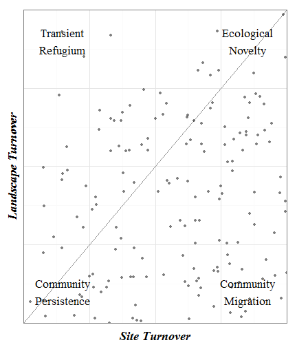

No-Analogues in North American Pollen Space
========================================================

Abstract
------------------------

Most studies of novelty look for novelty relative to present day ecosystems, whether looking for novelty in the past or potential novelty in the future.  But we are concerned about novelty during 21st century, where modern communities dis-aggregate, and we are challenged to understand which of these novel communities will be stable (equilibrial novelty) in the future, and which will remain in a state of transition (disequilibrial).

The general (Gleasonian) paradigm is that species respond individualistically to climate change,  but in practice, those individualistic responses often result in the movement of entire communities across the landscape.  At some time scales whole communities appear to move, while in others clear individualistic responses are visible.  Under what conditions do we see new communities arise?  When do communities persist?

Introduction
------------------------
Our investigation of non-analogue vegetation, both in the past and in the future is tied to differences from modern conditions (Williams and Jackson, 2007).  A major concern with no-analogue climate in the future (ref) is the development of forest communities for which we have no modern analogues as tree species respond individualistically to changing climatic conditions. Non-analogue conditions provide a challenge for ecologists, land managers and conservationists, tied to our lack of understanding, both in how the process of change will unfold, and in how ecosystem services are provided by these vegetation communities for which we have no analogue.

Estimates of dissimilarity and turnover in paleoecological records have been used to give us an indication of the novelty of ecosystems with respect to modern vegetation, or to provide information about how much change occurs through time within a record (Williams et al., 2001), often relating these changes to climate.  The challenge in this case is that, as with modern ecosystems, changes in pollen composition at one location may represent points along a successional trajectory, where each time point represents significant compositional turnover, but, relative to the surrounding, heterogeneous landscape, very little change in forest composition occurs.  Thus turnover as a single metric can provide results that are not uniquely tied to overall, landscape scale, changes in vegetation.

In paleoecological analysis the use of squared chord dissimilarity (Overpeck, 1984) is a common measure of dissimilarity between two pollen assemblages, and is simply an extension of Euclidean distance between two points in space.  Here the 'space' is the multivariate pollen assemblage, which is square root transformed to reduce the influence of taxa, such as *Pinus* that tend to be over-represented in assemblages.  Each pollen assemblage represents regional and local vegetation surrounding the sample site, filtered through taphonomic processes (Jackson 2012?).  We can describe this dissimilarity from modern as the distance to the closest modern sample, $d_{mt}$.  Using $d_{m}$ we may then define 'non-analogue' communities as those which pass a certain threshold of minimum dissimilarity, here we use the 95 percentile of minimum distances.  A significant challenge to the use of modern dissimilarity measures is the fact that in many cases modern pollen reflects an anthropogenic alteration of the landscape relative to fossil assemblages.  The presence of taxa such as Ambrosia point to significant opening of woodland canopies in North America for example [REF].  This effect can impact our interpretations of the relationships between pollen and various other factors such as climate (St. Jacques, the new chinese one).

A limitation of the use of dissimilarity from modern is that the dissimilarity of past pollen assemblages with respect to modern pollen cannot indicate changes from one community type to another through time, only dissimilarity from modern ecosystems.  While broad scale spatial changes may be visible, a site that transitions from prairie to forest can retain a similarly low $d_{mt}$ value, provided near analogues exist in the modern pollen data.  To correct for this, we can examine measures of turnover with a single pollen record through time $d_{st}$, or site dissimilarity at time $t$.  This measures dissimilarity from one sample in a pollen record to the next, more modern sample, with high values for $d_{t}$ indicating much higher rates of vegetation turnover within cores.  Schuman et al. (ref) showed patterns of high within-core turnover, but there is a further element of turnover or change that has not been explored.  Ladnscape turnover $d_{lt}$ represents the novelty of a community on the observable landscape at some timepoint $t$.  This landscape turnover estimate allows us to capture the movement of communities or broadly based vegetation types across the landscape.  We can imagine times in the past where site turnover may be high, but landscape turnover may be low, for example, the movement of boreal type ecosystems across North America following deglaciation may result in high site turnover, but low landscape turnover.

We can then imagine a set of scenarios, illustrated by plotting the various combinations of landscape and site level similarities.

 

**Figure 1.**  *Models for understanding turnover and dissimilarity in the pollen record.  Community stability is represented by sites with low turnover relative to past assemblages at the site, and across the landscape.  Community migration occurs when a site is highly siddimilar to past assemblages at the site, but has close analogues in the past landscape.  Transient refugia occur when a site has low turnover, but becomes highly dissimilar from the past landscape.  Ecological novelty occurs when a site is dissimilar from both the landscape and its own past assemblages.*

In the same way we can examine vegetation dissimilarity we can make use of transient climate models to use the same measures of dissimilarity for climate, here $c_{m}$ (dissimilarity from modern), $c_{s}$ (change at a site) and $c_{l}$ (change relative to landscape).

**Table**. *Definitions for dissimilarity measures tested in this paper.*

Dissimilarity Type | Definition
------------------ | -----------
Transient novelty  | The dissimilarity measure between a pollen assemblage and all pollen assemblages between 250 and 500 years older, excepting samples from the site.
Site turnover      | The dissimilarity measure between a pollen assemblage and all pollen assemblages from the same site between 250 and 750 years older.
Persistence        | The dissimilarity measure between a pollen assemblage and future assemblages, between 250 and 750 years younger.

Turnover within a core just tells you how different vegetation at a single site is from one time period is to the next, however it may be deceptively high, in regions where there is high spatial heterogeneity, or large shifts between pioneer and climax vegetation associations it might be possible to see large shifts in turnover, but little regional change.

Landscape turnover has not been previously used as a metric of dissimilarity.  It is a measure of how different an assemblage at one time period is to all pollen assemblages within a previous time period.  In this sense, it is an estimate of how novel an ecosystem is with respect to all ecosystems that previously occupied the landscape.  In a sense it is $d_m$ turned on its head.

To assist in this endevour, we examine pollen records from the Neotoma Database, searching through the past, from the late-glacial to the modern to examine in which cases pollen assemblages appear to be non-analogue from the previous time period.  The conceptual framework suggests that we were looking at landscape level turnover, not site turnover.  While site-level turnover is a commonly used metric in paleoecological analysis, it is hampered by its sensitivity to stochastic effects.  Large scale changes in vegetation at a single site might not reflect the kinds of broad scale community change we expect to see under conditions of future climate change.  As such, comparing dissimilarity at a site to changes at a number of sites across the continent provides a better metric of landscape-scale dissimilarity.


**Figure 2**. *Turnover estimates for time t_i are measured as the minimum within site dissimilarity from the prior timestep (d_si) or the minimum dissimilarity from the landscape of pollen assemblages at the earlier timestep (d_li).  In all cases the earlier timestep is defined as a time preiod between 250 and 750 years prior to the sample of interest.  These two values then form a continuum of possibilities.  High ds and low dl indicate disturbance events within a stable, heterogeneous landscape, high dl & high ds indicate broad-scale, rapid landscape turnover, high dl, low ds is relatively infrequent, but may indicate local refugia within a shifting landscape*

We expect that ecosystems will show patterns of change that can be explained through the multivariate use of these dissimilarity measures.  For example, rapid species migration during the late-Pleistocene/eraly-Holocene transition should be apparent as high local turnover partnered with relatively low landscape change if entire communities are migrating northward.  Strongly individualistic species responses would be visible as paired high site and landscape turnovers.  Modern successional changes should be visible as sets of high self, low landscape changes.  Low landscape and low self changes should be static ecosystems.

Methods
------------------------
We compile records of pollen from depositional records in the Neotoma Database.  To assess whether pollen assemblages are 'non-analogue' we estimate squared-chord distance from pollen samples to a reference set that includes (1) all samples in the Neotoma Database that are between 250 and 750 calibrated years older than the sample, and (2) includes samples from the reference site.


Pollen data from Neotoma was accessed on May 20, 2014 using the `neotoma` pacakge for R (Goring, 2013; `http://www.github.com/ropensci/neotoma`).  The dataset includes 557 sites from across eastern North America (east of 100^o W; Figure 1a), with 17189 samples younger than 21kyr cal. BP (Figure 1b).

 

**Figure 2**. *Sample plot locations and bin sizes for each age class*.

Because sample size may affect our ability to calculate the 95% CI we also use the squared-chord dissimilarity estimate reported in Gill et al. (2009) of XXX as a secondary check.  This allows us to detect no-analogues using multiple methods.

To determine dissimilarity ofver time we estimate dissimilarity from the data using a bootstrap approach for which a sample is compared against a 'landscape' of sites that are between 250 and 750 years older than the sample in question.  For any sample we first test whether a sample fom the site exists between 250 - 750 prior to the sample of interest.  This will prevent anomalously high analogue distances for sites that have never previously been sampled, particularly when they represent new ecoregions.  For each acceptable site we sample one assemblage from each site with samples in the previous 250 - 750 years.  This produces a single sample from each site in the previous time window from which we estimate the minimum suqared chord dissimilarity.  Since some sites have multiple samples in each 500 year time window we re-sample (with replacement) 100 times for each focal site, producing a sample of 100 minimum (squared-chord) dissimilarity values for each pollen assemblage at each site, for which there is a prior sample.


Results
-------------------------

### Pollen samples:
Of the 557 pollen sites obtained from Neotoma for this analysis, 435 sites had assemblages that met our criteria.  For these sites there were 18850 unique assemblages spanning the last 21kyr, approximately 90% of the total assemblages for the sites that met our criteria.  Samples excluded from analysis occur throughout the record.

### Self and Landscape Dissimilarity:

 

**Figure X**. *Turnover and dissimilarity for individual sites from the Neotoma database for both climate and vegetation, showing a relationship between the two variables, but also considerable noise.*

Turnover within the core (change within the core from one time period to another) is correlated to landscape dissimilarity ($r_{s}$ = 0.213, p < 0.001), but shows a great deal of variability around the 1:1 line (Figure X).  The same plot, for climate in this case, shows a similar pattern ($r_{s}$ = 0.2, p < 0.001), although the scale of dissimilarity values is much higher for the climate data due to the difference in base units for the two measures (percentages vs. scaled climate values).  The central region of dissimilarity is generally shifted toward the regions we identify as 'Persistence', indicating that throughout the late-Glacial and Holocene (in particular) low turnover at both the site and landscape level was the rule.

 
**Figure X**. *Proportion of sites within each time window showing turnover rates representing novelty, mighration, persistence or refugium.*


```
## Error: object 'age.class' not found
```

```
## Error: object 'nf' not found
```

**Figure 3**. *Turnover through time in the Neotoma database.*

 

**Figure X.** *Relationship between landscape and self turnover appears to show little relationship between climate and vegetation turnover.*


Discussion
---------------------------
Turnover or analogues?  When we are looking at non-analogues it turns out that it's really the modern.

